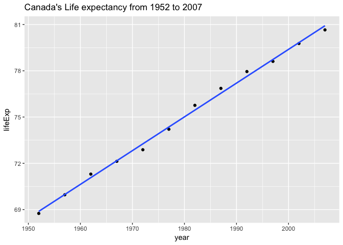

# Writing Functions
Fariha Khan  
2017-11-10  


```r
suppressPackageStartupMessages(library(tidyverse))
suppressPackageStartupMessages(library(stringr))
suppressPackageStartupMessages(library(gapminder))
```

I'm going to create a function that returns a visual graph of life expectancy by year for a given country

```r
data("gapminder")
get_lifeExp <- function(x){
      X <- str_replace(x, str_sub(x,1,1), toupper(str_sub(x,1,1)))
      X <- str_replace(X, str_sub(x,2,-1), tolower(str_sub(X,2,-1)))
      plotName <- str_c(X, "'s Life expectancy from 1952 to 2007")

      gapminder %>% 
      filter(country == X) %>% 
      ggplot(aes(x = year)) +
            geom_point(aes(y = lifeExp)) +
            geom_smooth(aes(y = lifeExp), method = lm, se = FALSE) +
            ggtitle(plotName)
}

get_lifeExp("Canada")
```

<!-- -->

```r
get_lifeExp("canAda")
```

<!-- -->

