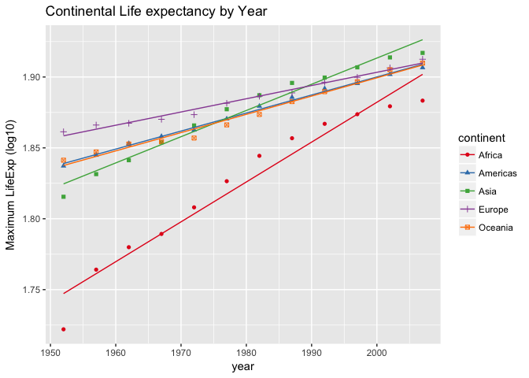
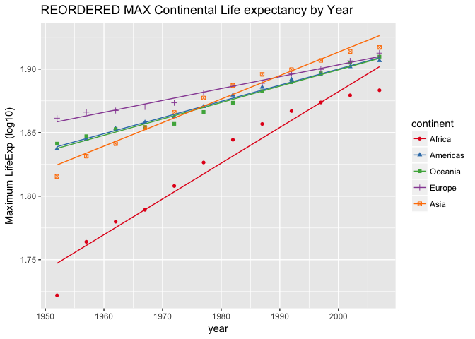
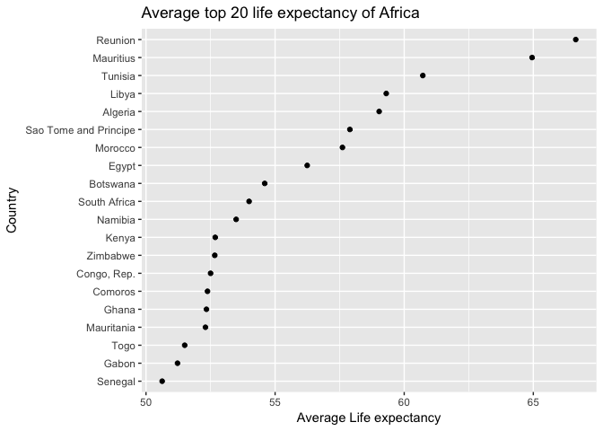
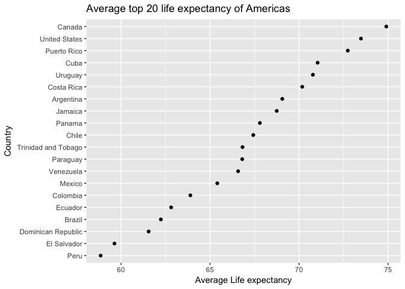
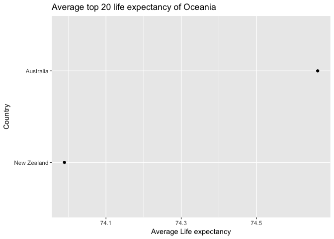
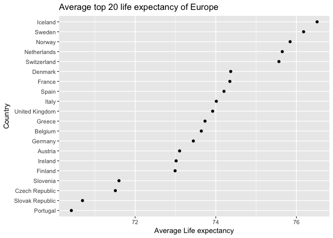
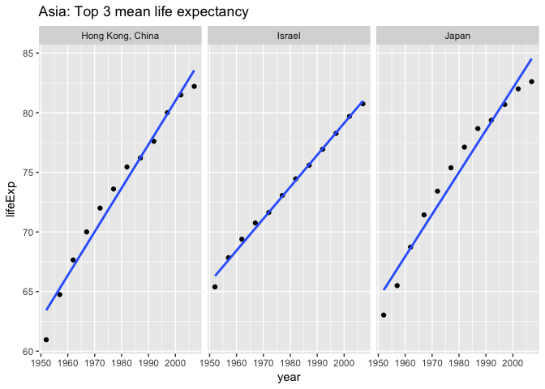
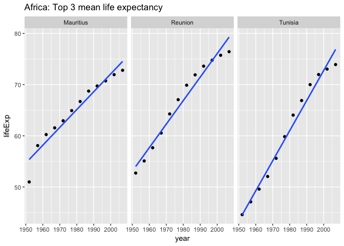
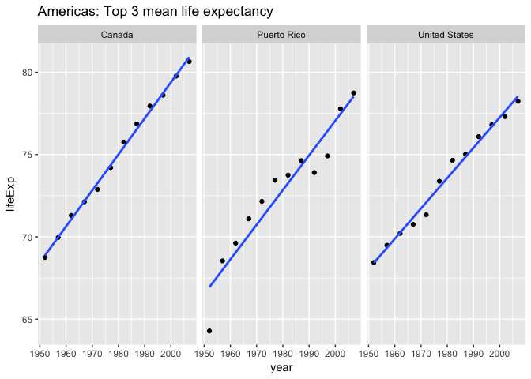
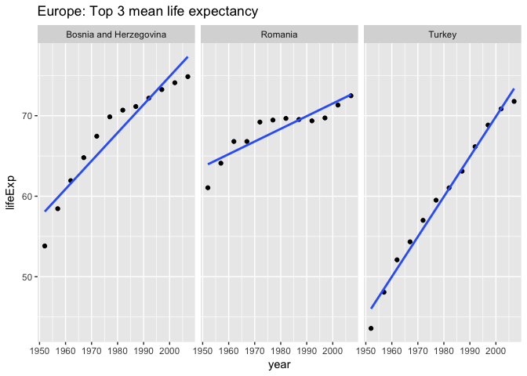

# Homework 7: Automating Data-analysis Pipelines
Fariha Khan  
2017-11-14  


# Fariha Khan
## Homework 7: Automating Data-analysis Pipelines


```r
suppressPackageStartupMessages(library(forcats))
suppressPackageStartupMessages(library(tidyverse))
suppressPackageStartupMessages(library(knitr))
suppressPackageStartupMessages(library(readr))
```

## Download Data
I initially downloaded the gapminder data using the download.file() function

```r
source('00_downloadData.R')
```

## Initial Analysis
I compared the life expectancy of each country by the year of the raw data.
I then reordered the data based on maximum life expectancy.

```r
source('01_cleanData.R')
```

```
## Saving 7 x 5 in image
## Saving 7 x 5 in image
```

```r
old_levels
```

```
## [1] "Africa"   "Americas" "Asia"     "Europe"   "Oceania"
```

```r
new_levels
```

```
## [1] "Africa"   "Americas" "Oceania"  "Europe"   "Asia"
```

```r
print(plot1)
```

<!-- -->

```r
print(plot2)
```

<!-- -->


### Top countries overview
I created a function to find the top 20 countries with the highest average life expectancy within each continent

```r
getTop20("Asia")
```

<!-- -->

```r
getTop20("Africa")
```

<!-- -->

```r
getTop20("Americas")
```

<!-- -->

```r
getTop20("Oceania")
```

<!-- -->

```r
getTop20("Europe")
```

<!-- -->


## Top 3 countries Asia
I looked at the spread of the life expectancy for the top 3 countries for each continent (excluding Oceania).

```r
source('02_analyzeData.R')
```

```
## Saving 7 x 5 in image
## Saving 7 x 5 in image
## Saving 7 x 5 in image
## Saving 7 x 5 in image
```

```r
kable(topAsia)
```


country             mean_lifeExp
-----------------  -------------
Hong Kong, China        73.49283
Israel                  73.64583
Japan                   74.82692

```r
print(plot_tAsia)
```

<!-- -->


## Top 3 countries Africa


```r
kable(topAfrica)
```


country      mean_lifeExp
----------  -------------
Mauritius        64.95325
Reunion          66.64425
Tunisia          60.72100

```r
print(plot_tAfrica)
```

<!-- -->

## Top 3 countries Americas


```r
kable(topAmericas)
```


country          mean_lifeExp
--------------  -------------
Canada               74.90275
Puerto Rico          72.73933
United States        73.47850

```r
print(plot_tAmericas)
```

<!-- -->

## Top 3 countries Europe


```r
kable(topEurope)
```


country                   mean_lifeExp
-----------------------  -------------
Bosnia and Herzegovina        67.70783
Romania                       68.29067
Turkey                        59.69642

```r
print(plot_tEurope)
```

<!-- -->
