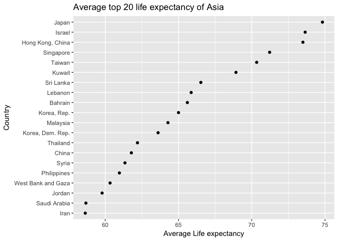

# Homework 7: Automating Data-analysis Pipelines
Fariha Khan  
2017-11-14  


# Fariha Khan
## Homework 7: Automating Data-analysis Pipelines


```r
suppressPackageStartupMessages(library(forcats))
suppressPackageStartupMessages(library(tidyverse))
suppressPackageStartupMessages(library(knitr))
suppressPackageStartupMessages(library(readr))
```

## Download Data
I initially downloaded the gapminder data using the download.file() function

```r
source('00_downloadData.R')
```

## Initial Analysis
I compared the life expectancy of each country by the year of the raw data.
I then reordered the data based on maximum life expectancy.

```r
source('01_cleanData.R')
```

```
## Saving 7 x 5 in image
## Saving 7 x 5 in image
```


### Top countries overview
I created a function to find the top 20 countries with the highest average life expectancy within each continent

```r
getTop20("Asia")
```

<!-- -->

```r
getTop20("Africa")
```

<!-- -->

```r
getTop20("Americas")
```

<!-- -->

```r
getTop20("Oceania")
```

<!-- -->

```r
getTop20("Europe")
```

<!-- -->


## Top 3 countries
I looked at the spread of the life expectancy for the top 3 countries for each continent (excluding Oceania).

```r
source('02_analyzeData.R')
```

```
## Saving 7 x 5 in image
## Saving 7 x 5 in image
## Saving 7 x 5 in image
## Saving 7 x 5 in image
```


