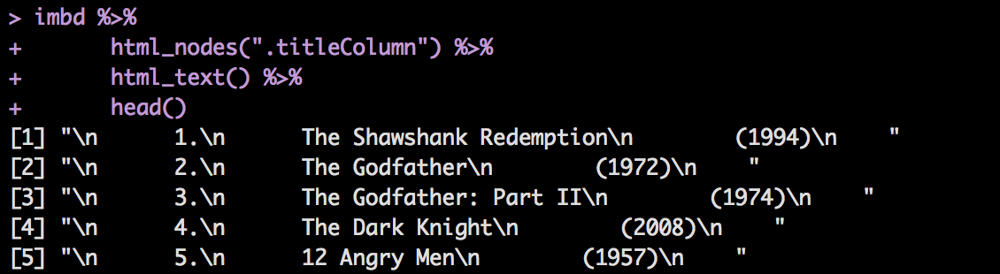

## Homework 10: Data from the Web
#### December 8, 2017
#### Fariha Khan
#### 
#### 
## Assignment Overview
## 
## Data - IMBD Top Rated Movies
## 
## Resources
## 
## Progress Report
## 
I had a lot of problems right of the bat with the data I had chosen on the IMBD website. The html format of this data was not as clean as the examples we had covered in class, but I still wanted to use it just for sheer interest of the data itself. 

I wasn't able to extract the components I wanted in a clean way - instead I was getting jumbled data, or I wasn't able to extract specific attributes and nodes. When I first tried to pull the movie titles I was getting the them back in a format similar to:



I did a lot of data wrangling to get this data formatted properly in a dataframe. Use strsplit to parse the titleColumn node by ["\n"]:

```
rankInfo <- imbd %>% 
      html_nodes(".titleColumn") %>% 
      html_text() %>% 
      strsplit("[\n]") %>% 
      data.frame() %>% 
      t() 
      
rank_df <- as.data.frame(rankInfo, row.names = FALSE) %>% 
      select(V2:V4)
```
But I eventually figured out a way of specifying the nodes I wanted.

