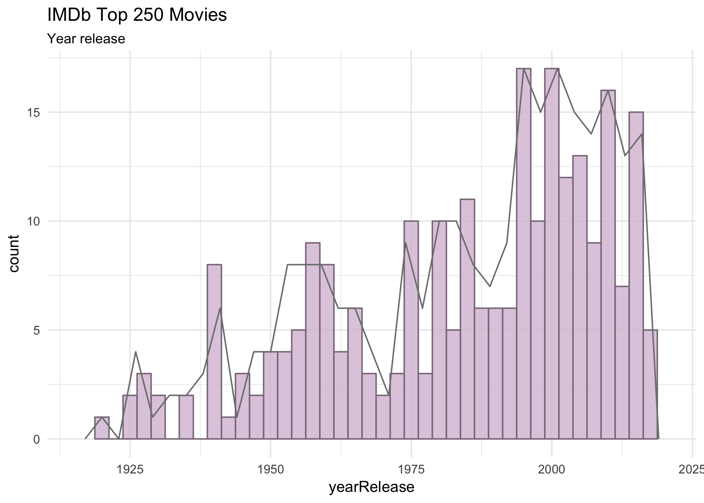
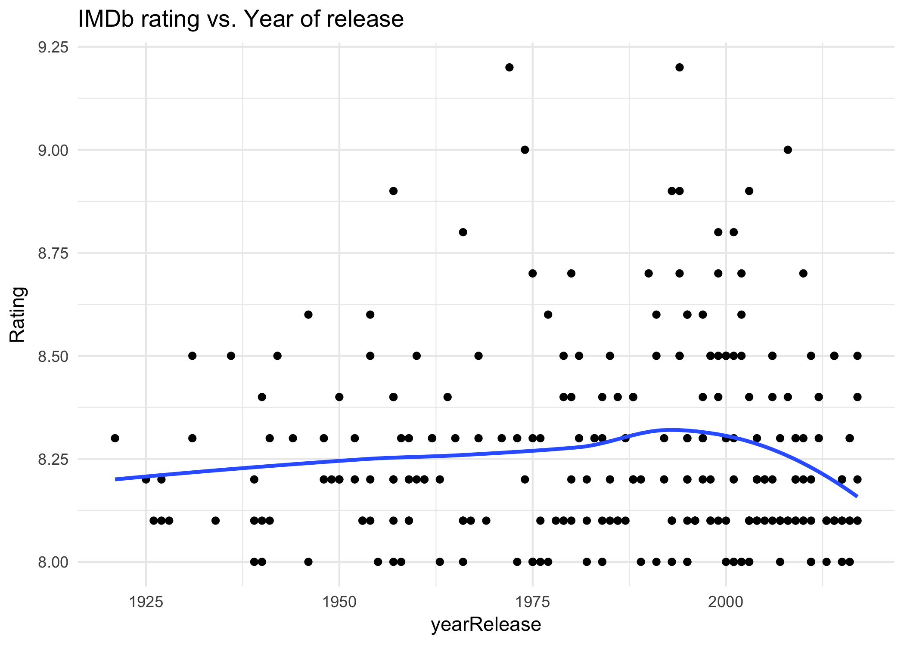
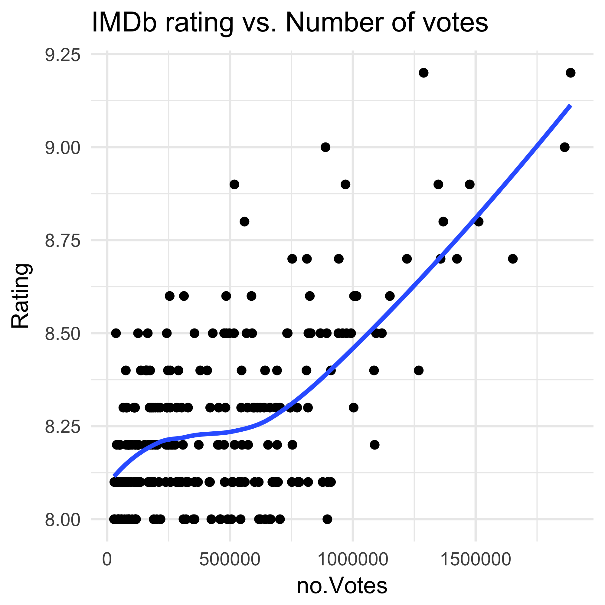

# HW10 Scraping data - IMDb Top 250 Rate Movies
Fariha Khan  
2017-12-07  


```r
## Load packages
suppressPackageStartupMessages(library(tidyverse)) 
suppressPackageStartupMessages(library(knitr))
suppressPackageStartupMessages(library(kableExtra))
suppressPackageStartupMessages(library(stringr))
suppressPackageStartupMessages(library(rvest))
```


### Get data from web
I wrote my code in an R script to make the markdown cleaner to view.
The rScript for the first part is found [here]()

```r
suppressMessages(source('rScripts/01_scrapeData.r'))
```


### View data structure

##### View [html_structure](https://github.com/farihakhan/STAT547-hw-khan-fariha/blob/master/hw_10/html_structure.md)


```r
imdb
```

```
## {xml_document}
## <html xmlns:og="http://ogp.me/ns#" xmlns:fb="http://www.facebook.com/2008/fbml">
## [1] <head>\n<meta http-equiv="Content-Type" content="text/html; charset= ...
## [2] <body id="styleguide-v2" class="fixed">\n<script>\n    if (typeof ue ...
```

```r
imdb %>%
      html_nodes(".titleColumn") %>% 
      html_text() %>%
      head()
```

```
## [1] "\n      1.\n      The Shawshank Redemption\n        (1994)\n    "
## [2] "\n      2.\n      The Godfather\n        (1972)\n    "           
## [3] "\n      3.\n      The Godfather: Part II\n        (1974)\n    "  
## [4] "\n      4.\n      The Dark Knight\n        (2008)\n    "         
## [5] "\n      5.\n      12 Angry Men\n        (1957)\n    "            
## [6] "\n      6.\n      Schindler's List\n        (1993)\n    "
```


### Extract and structure data:

I stored each column variable into character lists. I changed some of the data types of the variables to allow analysis.

The extracted variables are:

 - Title
 
 - Year released
 
 - Rating 
 
 - Number of IMDb user votes
 
 - Brief cast info
 
 - Link associated with each movie
 
<style>
pre code, pre, code {
  white-space: pre !important;
  overflow-x: scroll !important;
  word-break: keep-all !important;
  word-wrap: initial !important;
}
</style>

```r
Title <- imdb %>% 
      html_nodes(".titleColumn") %>% 
      html_nodes("a, #text") %>% 
      html_text()

yearRelease <- imdb %>% 
      html_nodes(".secondaryInfo") %>% 
      html_text() %>% 
      str_replace_all(c("[(|)]" = "")) %>% 
      as.numeric()

Rating <- imdb %>% 
      html_nodes(".ratingColumn.imdbRating") %>% 
      html_nodes("strong") %>% 
      html_text() %>% 
      as.numeric()

Votes <- imdb %>% 
      html_nodes(".ratingColumn.imdbRating") %>% 
      html_nodes("strong") %>% 
      html_attrs() %>% 
      map("title") %>% 
      unlist()

Cast <- imdb %>% 
      html_nodes(".titleColumn") %>% 
      html_nodes("a, #text") %>% 
      html_attrs() %>% 
      map("title") %>% 
      unlist()

Link <- imdb %>% 
      html_nodes(".titleColumn") %>% 
      html_nodes("a, #text") %>% 
      html_attrs() %>% 
      map("href") %>% 
      unlist()
```


### Create summary dataframe


```r
imdb_df <- extractFields(imdb)
imdb_df %>% glimpse()
```

```
## Observations: 250
## Variables: 6
## $ Title       <fctr> The Shawshank Redemption, The Godfather, The Godf...
## $ yearRelease <dbl> 1994, 1972, 1974, 2008, 1957, 1993, 1994, 2003, 19...
## $ Rating      <dbl> 9.2, 9.2, 9.0, 9.0, 8.9, 8.9, 8.9, 8.9, 8.8, 8.8, ...
## $ Cast        <fctr> Frank Darabont (dir.), Tim Robbins, Morgan Freema...
## $ Votes       <fctr> 9.2 based on 1,884,579 user ratings, 9.2 based on...
## $ Link        <chr> "http://www.imdb.com/title/tt0111161/?pf_rd_m=A2FG...
```

### Clean dataset

Parse out names of the cast memebers for analysis

```r
imdb_kable1
```


<div style="border: 1px solid #ddd; padding: 5px; overflow-y: scroll; height:500px; ">|                                Title                                 | yearRelease | Rating | no.Votes |             Director             |         Cast1         |           Cast2           |                                                                                       movieURL                                                                                        |</div>
<div style="border: 1px solid #ddd; padding: 5px; overflow-y: scroll; height:500px; ">|:--------------------------------------------------------------------:|:-----------:|:------:|:--------:|:--------------------------------:|:---------------------:|:-------------------------:|:-------------------------------------------------------------------------------------------------------------------------------------------------------------------------------------:|</div>
<div style="border: 1px solid #ddd; padding: 5px; overflow-y: scroll; height:500px; ">|                       The Shawshank Redemption                       |    1994     |  9.2   | 1884579  |          Frank Darabont          |      Tim Robbins      |      Morgan Freeman       |  [Movie URL](http://www.imdb.com/title/tt0111161/?pf_rd_m=A2FGELUUNOQJNL&pf_rd_p=3376940102&pf_rd_r=029N2R8ESH89R2VRXJ4J&pf_rd_s=center-1&pf_rd_t=15506&pf_rd_i=top&ref_=chttp_tt_1)  |</div>
<div style="border: 1px solid #ddd; padding: 5px; overflow-y: scroll; height:500px; ">|                            The Godfather                             |    1972     |  9.2   | 1286677  |       Francis Ford Coppola       |     Marlon Brando     |         Al Pacino         |  [Movie URL](http://www.imdb.com/title/tt0068646/?pf_rd_m=A2FGELUUNOQJNL&pf_rd_p=3376940102&pf_rd_r=029N2R8ESH89R2VRXJ4J&pf_rd_s=center-1&pf_rd_t=15506&pf_rd_i=top&ref_=chttp_tt_2)  |</div>
<div style="border: 1px solid #ddd; padding: 5px; overflow-y: scroll; height:500px; ">|                        The Godfather: Part II                        |    1974     |  9.0   |  887575  |       Francis Ford Coppola       |       Al Pacino       |      Robert De Niro       |  [Movie URL](http://www.imdb.com/title/tt0071562/?pf_rd_m=A2FGELUUNOQJNL&pf_rd_p=3376940102&pf_rd_r=029N2R8ESH89R2VRXJ4J&pf_rd_s=center-1&pf_rd_t=15506&pf_rd_i=top&ref_=chttp_tt_3)  |</div>
<div style="border: 1px solid #ddd; padding: 5px; overflow-y: scroll; height:500px; ">|                           The Dark Knight                            |    2008     |  9.0   | 1860509  |        Christopher Nolan         |    Christian Bale     |       Heath Ledger        |  [Movie URL](http://www.imdb.com/title/tt0468569/?pf_rd_m=A2FGELUUNOQJNL&pf_rd_p=3376940102&pf_rd_r=029N2R8ESH89R2VRXJ4J&pf_rd_s=center-1&pf_rd_t=15506&pf_rd_i=top&ref_=chttp_tt_4)  |</div>
<div style="border: 1px solid #ddd; padding: 5px; overflow-y: scroll; height:500px; ">|                             12 Angry Men                             |    1957     |  8.9   |  517017  |           Sidney Lumet           |      Henry Fonda      |        Lee J. Cobb        |  [Movie URL](http://www.imdb.com/title/tt0050083/?pf_rd_m=A2FGELUUNOQJNL&pf_rd_p=3376940102&pf_rd_r=029N2R8ESH89R2VRXJ4J&pf_rd_s=center-1&pf_rd_t=15506&pf_rd_i=top&ref_=chttp_tt_5)  |</div>
<div style="border: 1px solid #ddd; padding: 5px; overflow-y: scroll; height:500px; ">|                           Schindler's List                           |    1993     |  8.9   |  968914  |         Steven Spielberg         |      Liam Neeson      |       Ralph Fiennes       |  [Movie URL](http://www.imdb.com/title/tt0108052/?pf_rd_m=A2FGELUUNOQJNL&pf_rd_p=3376940102&pf_rd_r=029N2R8ESH89R2VRXJ4J&pf_rd_s=center-1&pf_rd_t=15506&pf_rd_i=top&ref_=chttp_tt_6)  |</div>
<div style="border: 1px solid #ddd; padding: 5px; overflow-y: scroll; height:500px; ">|                             Pulp Fiction                             |    1994     |  8.9   | 1474181  |        Quentin Tarantino         |     John Travolta     |        Uma Thurman        |  [Movie URL](http://www.imdb.com/title/tt0110912/?pf_rd_m=A2FGELUUNOQJNL&pf_rd_p=3376940102&pf_rd_r=029N2R8ESH89R2VRXJ4J&pf_rd_s=center-1&pf_rd_t=15506&pf_rd_i=top&ref_=chttp_tt_7)  |</div>
<div style="border: 1px solid #ddd; padding: 5px; overflow-y: scroll; height:500px; ">|            The Lord of the Rings: The Return of the King             |    2003     |  8.9   | 1346700  |          Peter Jackson           |      Elijah Wood      |      Viggo Mortensen      |  [Movie URL](http://www.imdb.com/title/tt0167260/?pf_rd_m=A2FGELUUNOQJNL&pf_rd_p=3376940102&pf_rd_r=029N2R8ESH89R2VRXJ4J&pf_rd_s=center-1&pf_rd_t=15506&pf_rd_i=top&ref_=chttp_tt_8)  |</div>
<div style="border: 1px solid #ddd; padding: 5px; overflow-y: scroll; height:500px; ">|                   Il buono, il brutto, il cattivo                    |    1966     |  8.8   |  558307  |           Sergio Leone           |    Clint Eastwood     |        Eli Wallach        |  [Movie URL](http://www.imdb.com/title/tt0060196/?pf_rd_m=A2FGELUUNOQJNL&pf_rd_p=3376940102&pf_rd_r=029N2R8ESH89R2VRXJ4J&pf_rd_s=center-1&pf_rd_t=15506&pf_rd_i=top&ref_=chttp_tt_9)  |</div>
<div style="border: 1px solid #ddd; padding: 5px; overflow-y: scroll; height:500px; ">|                              Fight Club                              |    1999     |  8.8   | 1510493  |          David Fincher           |       Brad Pitt       |       Edward Norton       | [Movie URL](http://www.imdb.com/title/tt0137523/?pf_rd_m=A2FGELUUNOQJNL&pf_rd_p=3376940102&pf_rd_r=029N2R8ESH89R2VRXJ4J&pf_rd_s=center-1&pf_rd_t=15506&pf_rd_i=top&ref_=chttp_tt_10)  |</div>
<div style="border: 1px solid #ddd; padding: 5px; overflow-y: scroll; height:500px; ">|          The Lord of the Rings: The Fellowship of the Ring           |    2001     |  8.8   | 1366940  |          Peter Jackson           |      Elijah Wood      |       Ian McKellen        | [Movie URL](http://www.imdb.com/title/tt0120737/?pf_rd_m=A2FGELUUNOQJNL&pf_rd_p=3376940102&pf_rd_r=029N2R8ESH89R2VRXJ4J&pf_rd_s=center-1&pf_rd_t=15506&pf_rd_i=top&ref_=chttp_tt_11)  |</div>
<div style="border: 1px solid #ddd; padding: 5px; overflow-y: scroll; height:500px; ">|                             Forrest Gump                             |    1994     |  8.7   | 1422069  |         Robert Zemeckis          |       Tom Hanks       |       Robin Wright        | [Movie URL](http://www.imdb.com/title/tt0109830/?pf_rd_m=A2FGELUUNOQJNL&pf_rd_p=3376940102&pf_rd_r=029N2R8ESH89R2VRXJ4J&pf_rd_s=center-1&pf_rd_t=15506&pf_rd_i=top&ref_=chttp_tt_12)  |</div>
<div style="border: 1px solid #ddd; padding: 5px; overflow-y: scroll; height:500px; ">|            Star Wars: Episode V - The Empire Strikes Back            |    1980     |  8.7   |  940527  |          Irvin Kershner          |      Mark Hamill      |       Harrison Ford       | [Movie URL](http://www.imdb.com/title/tt0080684/?pf_rd_m=A2FGELUUNOQJNL&pf_rd_p=3376940102&pf_rd_r=029N2R8ESH89R2VRXJ4J&pf_rd_s=center-1&pf_rd_t=15506&pf_rd_i=top&ref_=chttp_tt_13)  |</div>
<div style="border: 1px solid #ddd; padding: 5px; overflow-y: scroll; height:500px; ">|                              Inception                               |    2010     |  8.7   | 1649521  |        Christopher Nolan         |   Leonardo DiCaprio   |   Joseph Gordon-Levitt    | [Movie URL](http://www.imdb.com/title/tt1375666/?pf_rd_m=A2FGELUUNOQJNL&pf_rd_p=3376940102&pf_rd_r=029N2R8ESH89R2VRXJ4J&pf_rd_s=center-1&pf_rd_t=15506&pf_rd_i=top&ref_=chttp_tt_14)  |</div>
<div style="border: 1px solid #ddd; padding: 5px; overflow-y: scroll; height:500px; ">|                The Lord of the Rings: The Two Towers                 |    2002     |  8.7   | 1218943  |          Peter Jackson           |      Elijah Wood      |       Ian McKellen        | [Movie URL](http://www.imdb.com/title/tt0167261/?pf_rd_m=A2FGELUUNOQJNL&pf_rd_p=3376940102&pf_rd_r=029N2R8ESH89R2VRXJ4J&pf_rd_s=center-1&pf_rd_t=15506&pf_rd_i=top&ref_=chttp_tt_15)  |</div>
<div style="border: 1px solid #ddd; padding: 5px; overflow-y: scroll; height:500px; ">|                   One Flew Over the Cuckoo's Nest                    |    1975     |  8.7   |  752391  |           Milos Forman           |    Jack Nicholson     |      Louise Fletcher      | [Movie URL](http://www.imdb.com/title/tt0073486/?pf_rd_m=A2FGELUUNOQJNL&pf_rd_p=3376940102&pf_rd_r=029N2R8ESH89R2VRXJ4J&pf_rd_s=center-1&pf_rd_t=15506&pf_rd_i=top&ref_=chttp_tt_16)  |</div>
<div style="border: 1px solid #ddd; padding: 5px; overflow-y: scroll; height:500px; ">|                              Goodfellas                              |    1990     |  8.7   |  812075  |         Martin Scorsese          |    Robert De Niro     |        Ray Liotta         | [Movie URL](http://www.imdb.com/title/tt0099685/?pf_rd_m=A2FGELUUNOQJNL&pf_rd_p=3376940102&pf_rd_r=029N2R8ESH89R2VRXJ4J&pf_rd_s=center-1&pf_rd_t=15506&pf_rd_i=top&ref_=chttp_tt_17)  |</div>
<div style="border: 1px solid #ddd; padding: 5px; overflow-y: scroll; height:500px; ">|                              The Matrix                              |    1999     |  8.7   | 1355703  |          Lana Wachowski          |     Keanu Reeves      |    Laurence Fishburne     | [Movie URL](http://www.imdb.com/title/tt0133093/?pf_rd_m=A2FGELUUNOQJNL&pf_rd_p=3376940102&pf_rd_r=029N2R8ESH89R2VRXJ4J&pf_rd_s=center-1&pf_rd_t=15506&pf_rd_i=top&ref_=chttp_tt_18)  |</div>
<div style="border: 1px solid #ddd; padding: 5px; overflow-y: scroll; height:500px; ">|                         Shichinin no samurai                         |    1954     |  8.6   |  253946  |          Akira Kurosawa          |    Toshirô Mifune     |      Takashi Shimura      | [Movie URL](http://www.imdb.com/title/tt0047478/?pf_rd_m=A2FGELUUNOQJNL&pf_rd_p=3376940102&pf_rd_r=029N2R8ESH89R2VRXJ4J&pf_rd_s=center-1&pf_rd_t=15506&pf_rd_i=top&ref_=chttp_tt_19)  |</div>
<div style="border: 1px solid #ddd; padding: 5px; overflow-y: scroll; height:500px; ">|                              Star Wars                               |    1977     |  8.6   | 1012779  |           George Lucas           |      Mark Hamill      |       Harrison Ford       | [Movie URL](http://www.imdb.com/title/tt0076759/?pf_rd_m=A2FGELUUNOQJNL&pf_rd_p=3376940102&pf_rd_r=029N2R8ESH89R2VRXJ4J&pf_rd_s=center-1&pf_rd_t=15506&pf_rd_i=top&ref_=chttp_tt_20)  |</div>
<div style="border: 1px solid #ddd; padding: 5px; overflow-y: scroll; height:500px; ">|                            Cidade de Deus                            |    2002     |  8.6   |  586626  |        Fernando Meirelles        |  Alexandre Rodrigues  |      Leandro Firmino      | [Movie URL](http://www.imdb.com/title/tt0317248/?pf_rd_m=A2FGELUUNOQJNL&pf_rd_p=3376940102&pf_rd_r=029N2R8ESH89R2VRXJ4J&pf_rd_s=center-1&pf_rd_t=15506&pf_rd_i=top&ref_=chttp_tt_21)  |</div>
<div style="border: 1px solid #ddd; padding: 5px; overflow-y: scroll; height:500px; ">|                                Se7en                                 |    1995     |  8.6   | 1149334  |          David Fincher           |    Morgan Freeman     |         Brad Pitt         | [Movie URL](http://www.imdb.com/title/tt0114369/?pf_rd_m=A2FGELUUNOQJNL&pf_rd_p=3376940102&pf_rd_r=029N2R8ESH89R2VRXJ4J&pf_rd_s=center-1&pf_rd_t=15506&pf_rd_i=top&ref_=chttp_tt_22)  |</div>
<div style="border: 1px solid #ddd; padding: 5px; overflow-y: scroll; height:500px; ">|                       The Silence of the Lambs                       |    1991     |  8.6   | 1003525  |          Jonathan Demme          |     Jodie Foster      |      Anthony Hopkins      | [Movie URL](http://www.imdb.com/title/tt0102926/?pf_rd_m=A2FGELUUNOQJNL&pf_rd_p=3376940102&pf_rd_r=029N2R8ESH89R2VRXJ4J&pf_rd_s=center-1&pf_rd_t=15506&pf_rd_i=top&ref_=chttp_tt_23)  |</div>
<div style="border: 1px solid #ddd; padding: 5px; overflow-y: scroll; height:500px; ">|                        It's a Wonderful Life                         |    1946     |  8.6   |  311571  |           Frank Capra            |     James Stewart     |        Donna Reed         | [Movie URL](http://www.imdb.com/title/tt0038650/?pf_rd_m=A2FGELUUNOQJNL&pf_rd_p=3376940102&pf_rd_r=029N2R8ESH89R2VRXJ4J&pf_rd_s=center-1&pf_rd_t=15506&pf_rd_i=top&ref_=chttp_tt_24)  |</div>
<div style="border: 1px solid #ddd; padding: 5px; overflow-y: scroll; height:500px; ">|                           La vita è bella                            |    1997     |  8.6   |  483551  |         Roberto Benigni          |    Roberto Benigni    |     Nicoletta Braschi     | [Movie URL](http://www.imdb.com/title/tt0118799/?pf_rd_m=A2FGELUUNOQJNL&pf_rd_p=3376940102&pf_rd_r=029N2R8ESH89R2VRXJ4J&pf_rd_s=center-1&pf_rd_t=15506&pf_rd_i=top&ref_=chttp_tt_25)  |</div>
<div style="border: 1px solid #ddd; padding: 5px; overflow-y: scroll; height:500px; ">|                          The Usual Suspects                          |    1995     |  8.6   |  823900  |           Bryan Singer           |     Kevin Spacey      |       Gabriel Byrne       | [Movie URL](http://www.imdb.com/title/tt0114814/?pf_rd_m=A2FGELUUNOQJNL&pf_rd_p=3376940102&pf_rd_r=029N2R8ESH89R2VRXJ4J&pf_rd_s=center-1&pf_rd_t=15506&pf_rd_i=top&ref_=chttp_tt_26)  |</div>
<div style="border: 1px solid #ddd; padding: 5px; overflow-y: scroll; height:500px; ">|                                 Léon                                 |    1994     |  8.5   |  817806  |            Luc Besson            |       Jean Reno       |        Gary Oldman        | [Movie URL](http://www.imdb.com/title/tt0110413/?pf_rd_m=A2FGELUUNOQJNL&pf_rd_p=3376940102&pf_rd_r=029N2R8ESH89R2VRXJ4J&pf_rd_s=center-1&pf_rd_t=15506&pf_rd_i=top&ref_=chttp_tt_27)  |</div>
<div style="border: 1px solid #ddd; padding: 5px; overflow-y: scroll; height:500px; ">|                         Saving Private Ryan                          |    1998     |  8.5   |  991624  |         Steven Spielberg         |       Tom Hanks       |        Matt Damon         | [Movie URL](http://www.imdb.com/title/tt0120815/?pf_rd_m=A2FGELUUNOQJNL&pf_rd_p=3376940102&pf_rd_r=029N2R8ESH89R2VRXJ4J&pf_rd_s=center-1&pf_rd_t=15506&pf_rd_i=top&ref_=chttp_tt_28)  |</div>
<div style="border: 1px solid #ddd; padding: 5px; overflow-y: scroll; height:500px; ">|                    Sen to Chihiro no kamikakushi                     |    2001     |  8.5   |  484260  |          Hayao Miyazaki          |     Daveigh Chase     |     Suzanne Pleshette     | [Movie URL](http://www.imdb.com/title/tt0245429/?pf_rd_m=A2FGELUUNOQJNL&pf_rd_p=3376940102&pf_rd_r=029N2R8ESH89R2VRXJ4J&pf_rd_s=center-1&pf_rd_t=15506&pf_rd_i=top&ref_=chttp_tt_29)  |</div>
<div style="border: 1px solid #ddd; padding: 5px; overflow-y: scroll; height:500px; ">|                          American History X                          |    1998     |  8.5   |  867293  |            Tony Kaye             |     Edward Norton     |      Edward Furlong       | [Movie URL](http://www.imdb.com/title/tt0120586/?pf_rd_m=A2FGELUUNOQJNL&pf_rd_p=3376940102&pf_rd_r=029N2R8ESH89R2VRXJ4J&pf_rd_s=center-1&pf_rd_t=15506&pf_rd_i=top&ref_=chttp_tt_30)  |</div>
<div style="border: 1px solid #ddd; padding: 5px; overflow-y: scroll; height:500px; ">|                     Once Upon a Time in the West                     |    1968     |  8.5   |  242251  |           Sergio Leone           |      Henry Fonda      |      Charles Bronson      | [Movie URL](http://www.imdb.com/title/tt0064116/?pf_rd_m=A2FGELUUNOQJNL&pf_rd_p=3376940102&pf_rd_r=029N2R8ESH89R2VRXJ4J&pf_rd_s=center-1&pf_rd_t=15506&pf_rd_i=top&ref_=chttp_tt_31)  |</div>
<div style="border: 1px solid #ddd; padding: 5px; overflow-y: scroll; height:500px; ">|                             Interstellar                             |    2014     |  8.5   | 1116154  |        Christopher Nolan         |  Matthew McConaughey  |       Anne Hathaway       | [Movie URL](http://www.imdb.com/title/tt0816692/?pf_rd_m=A2FGELUUNOQJNL&pf_rd_p=3376940102&pf_rd_r=029N2R8ESH89R2VRXJ4J&pf_rd_s=center-1&pf_rd_t=15506&pf_rd_i=top&ref_=chttp_tt_32)  |</div>
<div style="border: 1px solid #ddd; padding: 5px; overflow-y: scroll; height:500px; ">|                            The Green Mile                            |    1999     |  8.5   |  892526  |          Frank Darabont          |       Tom Hanks       |   Michael Clarke Duncan   | [Movie URL](http://www.imdb.com/title/tt0120689/?pf_rd_m=A2FGELUUNOQJNL&pf_rd_p=3376940102&pf_rd_r=029N2R8ESH89R2VRXJ4J&pf_rd_s=center-1&pf_rd_t=15506&pf_rd_i=top&ref_=chttp_tt_33)  |</div>
<div style="border: 1px solid #ddd; padding: 5px; overflow-y: scroll; height:500px; ">|                                Psycho                                |    1960     |  8.5   |  475599  |         Alfred Hitchcock         |    Anthony Perkins    |        Janet Leigh        | [Movie URL](http://www.imdb.com/title/tt0054215/?pf_rd_m=A2FGELUUNOQJNL&pf_rd_p=3376940102&pf_rd_r=029N2R8ESH89R2VRXJ4J&pf_rd_s=center-1&pf_rd_t=15506&pf_rd_i=top&ref_=chttp_tt_34)  |</div>
<div style="border: 1px solid #ddd; padding: 5px; overflow-y: scroll; height:500px; ">|                              Casablanca                              |    1942     |  8.5   |  429127  |          Michael Curtiz          |    Humphrey Bogart    |      Ingrid Bergman       | [Movie URL](http://www.imdb.com/title/tt0034583/?pf_rd_m=A2FGELUUNOQJNL&pf_rd_p=3376940102&pf_rd_r=029N2R8ESH89R2VRXJ4J&pf_rd_s=center-1&pf_rd_t=15506&pf_rd_i=top&ref_=chttp_tt_35)  |</div>
<div style="border: 1px solid #ddd; padding: 5px; overflow-y: scroll; height:500px; ">|                             City Lights                              |    1931     |  8.5   |  125370  |         Charles Chaplin          |    Charles Chaplin    |     Virginia Cherrill     | [Movie URL](http://www.imdb.com/title/tt0021749/?pf_rd_m=A2FGELUUNOQJNL&pf_rd_p=3376940102&pf_rd_r=029N2R8ESH89R2VRXJ4J&pf_rd_s=center-1&pf_rd_t=15506&pf_rd_i=top&ref_=chttp_tt_36)  |</div>
<div style="border: 1px solid #ddd; padding: 5px; overflow-y: scroll; height:500px; ">|                                 Coco                                 |    2017     |  8.5   |  28902   |           Lee Unkrich            |   Anthony Gonzalez    |    Gael García Bernal     | [Movie URL](http://www.imdb.com/title/tt2380307/?pf_rd_m=A2FGELUUNOQJNL&pf_rd_p=3376940102&pf_rd_r=029N2R8ESH89R2VRXJ4J&pf_rd_s=center-1&pf_rd_t=15506&pf_rd_i=top&ref_=chttp_tt_37)  |</div>
<div style="border: 1px solid #ddd; padding: 5px; overflow-y: scroll; height:500px; ">|                           The Intouchables                           |    2011     |  8.5   |  589157  |         Olivier Nakache          |    François Cluzet    |          Omar Sy          | [Movie URL](http://www.imdb.com/title/tt1675434/?pf_rd_m=A2FGELUUNOQJNL&pf_rd_p=3376940102&pf_rd_r=029N2R8ESH89R2VRXJ4J&pf_rd_s=center-1&pf_rd_t=15506&pf_rd_i=top&ref_=chttp_tt_38)  |</div>
<div style="border: 1px solid #ddd; padding: 5px; overflow-y: scroll; height:500px; ">|                             Modern Times                             |    1936     |  8.5   |  164724  |         Charles Chaplin          |    Charles Chaplin    |     Paulette Goddard      | [Movie URL](http://www.imdb.com/title/tt0027977/?pf_rd_m=A2FGELUUNOQJNL&pf_rd_p=3376940102&pf_rd_r=029N2R8ESH89R2VRXJ4J&pf_rd_s=center-1&pf_rd_t=15506&pf_rd_i=top&ref_=chttp_tt_39)  |</div>
<div style="border: 1px solid #ddd; padding: 5px; overflow-y: scroll; height:500px; ">|                             The Pianist                              |    2002     |  8.5   |  566366  |          Roman Polanski          |     Adrien Brody      |    Thomas Kretschmann     | [Movie URL](http://www.imdb.com/title/tt0253474/?pf_rd_m=A2FGELUUNOQJNL&pf_rd_p=3376940102&pf_rd_r=029N2R8ESH89R2VRXJ4J&pf_rd_s=center-1&pf_rd_t=15506&pf_rd_i=top&ref_=chttp_tt_40)  |</div>
<div style="border: 1px solid #ddd; padding: 5px; overflow-y: scroll; height:500px; ">|                       Raiders of the Lost Ark                        |    1981     |  8.5   |  731545  |         Steven Spielberg         |     Harrison Ford     |        Karen Allen        | [Movie URL](http://www.imdb.com/title/tt0082971/?pf_rd_m=A2FGELUUNOQJNL&pf_rd_p=3376940102&pf_rd_r=029N2R8ESH89R2VRXJ4J&pf_rd_s=center-1&pf_rd_t=15506&pf_rd_i=top&ref_=chttp_tt_41)  |</div>
<div style="border: 1px solid #ddd; padding: 5px; overflow-y: scroll; height:500px; ">|                             The Departed                             |    2006     |  8.5   |  973446  |         Martin Scorsese          |   Leonardo DiCaprio   |        Matt Damon         | [Movie URL](http://www.imdb.com/title/tt0407887/?pf_rd_m=A2FGELUUNOQJNL&pf_rd_p=3376940102&pf_rd_r=029N2R8ESH89R2VRXJ4J&pf_rd_s=center-1&pf_rd_t=15506&pf_rd_i=top&ref_=chttp_tt_42)  |</div>
<div style="border: 1px solid #ddd; padding: 5px; overflow-y: scroll; height:500px; ">|                             Rear Window                              |    1954     |  8.5   |  354712  |         Alfred Hitchcock         |     James Stewart     |        Grace Kelly        | [Movie URL](http://www.imdb.com/title/tt0047396/?pf_rd_m=A2FGELUUNOQJNL&pf_rd_p=3376940102&pf_rd_r=029N2R8ESH89R2VRXJ4J&pf_rd_s=center-1&pf_rd_t=15506&pf_rd_i=top&ref_=chttp_tt_43)  |</div>
<div style="border: 1px solid #ddd; padding: 5px; overflow-y: scroll; height:500px; ">|                      Terminator 2: Judgment Day                      |    1991     |  8.5   |  822728  |          James Cameron           | Arnold Schwarzenegger |      Linda Hamilton       | [Movie URL](http://www.imdb.com/title/tt0103064/?pf_rd_m=A2FGELUUNOQJNL&pf_rd_p=3376940102&pf_rd_r=029N2R8ESH89R2VRXJ4J&pf_rd_s=center-1&pf_rd_t=15506&pf_rd_i=top&ref_=chttp_tt_44)  |</div>
<div style="border: 1px solid #ddd; padding: 5px; overflow-y: scroll; height:500px; ">|                          Back to the Future                          |    1985     |  8.5   |  827647  |         Robert Zemeckis          |    Michael J. Fox     |     Christopher Lloyd     | [Movie URL](http://www.imdb.com/title/tt0088763/?pf_rd_m=A2FGELUUNOQJNL&pf_rd_p=3376940102&pf_rd_r=029N2R8ESH89R2VRXJ4J&pf_rd_s=center-1&pf_rd_t=15506&pf_rd_i=top&ref_=chttp_tt_45)  |</div>
<div style="border: 1px solid #ddd; padding: 5px; overflow-y: scroll; height:500px; ">|                               Whiplash                               |    2014     |  8.5   |  515053  |         Damien Chazelle          |     Miles Teller      |       J.K. Simmons        | [Movie URL](http://www.imdb.com/title/tt2582802/?pf_rd_m=A2FGELUUNOQJNL&pf_rd_p=3376940102&pf_rd_r=029N2R8ESH89R2VRXJ4J&pf_rd_s=center-1&pf_rd_t=15506&pf_rd_i=top&ref_=chttp_tt_46)  |</div>
<div style="border: 1px solid #ddd; padding: 5px; overflow-y: scroll; height:500px; ">|                              Gladiator                               |    2000     |  8.5   | 1093374  |           Ridley Scott           |     Russell Crowe     |      Joaquin Phoenix      | [Movie URL](http://www.imdb.com/title/tt0172495/?pf_rd_m=A2FGELUUNOQJNL&pf_rd_p=3376940102&pf_rd_r=029N2R8ESH89R2VRXJ4J&pf_rd_s=center-1&pf_rd_t=15506&pf_rd_i=top&ref_=chttp_tt_47)  |</div>
<div style="border: 1px solid #ddd; padding: 5px; overflow-y: scroll; height:500px; ">|                            The Lion King                             |    1994     |  8.5   |  733709  |           Roger Allers           |   Matthew Broderick   |       Jeremy Irons        | [Movie URL](http://www.imdb.com/title/tt0110357/?pf_rd_m=A2FGELUUNOQJNL&pf_rd_p=3376940102&pf_rd_r=029N2R8ESH89R2VRXJ4J&pf_rd_s=center-1&pf_rd_t=15506&pf_rd_i=top&ref_=chttp_tt_48)  |</div>
<div style="border: 1px solid #ddd; padding: 5px; overflow-y: scroll; height:500px; ">|                             The Prestige                             |    2006     |  8.5   |  956746  |        Christopher Nolan         |    Christian Bale     |       Hugh Jackman        | [Movie URL](http://www.imdb.com/title/tt0482571/?pf_rd_m=A2FGELUUNOQJNL&pf_rd_p=3376940102&pf_rd_r=029N2R8ESH89R2VRXJ4J&pf_rd_s=center-1&pf_rd_t=15506&pf_rd_i=top&ref_=chttp_tt_49)  |</div>
<div style="border: 1px solid #ddd; padding: 5px; overflow-y: scroll; height:500px; ">|                               Memento                                |    2000     |  8.5   |  940387  |        Christopher Nolan         |      Guy Pearce       |     Carrie-Anne Moss      | [Movie URL](http://www.imdb.com/title/tt0209144/?pf_rd_m=A2FGELUUNOQJNL&pf_rd_p=3376940102&pf_rd_r=029N2R8ESH89R2VRXJ4J&pf_rd_s=center-1&pf_rd_t=15506&pf_rd_i=top&ref_=chttp_tt_50)  |</div>
<div style="border: 1px solid #ddd; padding: 5px; overflow-y: scroll; height:500px; ">|                            Apocalypse Now                            |    1979     |  8.5   |  496694  |       Francis Ford Coppola       |     Martin Sheen      |       Marlon Brando       | [Movie URL](http://www.imdb.com/title/tt0078788/?pf_rd_m=A2FGELUUNOQJNL&pf_rd_p=3376940102&pf_rd_r=029N2R8ESH89R2VRXJ4J&pf_rd_s=center-1&pf_rd_t=15506&pf_rd_i=top&ref_=chttp_tt_51)  |</div>
<div style="border: 1px solid #ddd; padding: 5px; overflow-y: scroll; height:500px; ">|                                Alien                                 |    1979     |  8.4   |  641792  |           Ridley Scott           |   Sigourney Weaver    |       Tom Skerritt        | [Movie URL](http://www.imdb.com/title/tt0078748/?pf_rd_m=A2FGELUUNOQJNL&pf_rd_p=3376940102&pf_rd_r=029N2R8ESH89R2VRXJ4J&pf_rd_s=center-1&pf_rd_t=15506&pf_rd_i=top&ref_=chttp_tt_52)  |</div>
<div style="border: 1px solid #ddd; padding: 5px; overflow-y: scroll; height:500px; ">|                          The Great Dictator                          |    1940     |  8.4   |  157419  |         Charles Chaplin          |    Charles Chaplin    |     Paulette Goddard      | [Movie URL](http://www.imdb.com/title/tt0032553/?pf_rd_m=A2FGELUUNOQJNL&pf_rd_p=3376940102&pf_rd_r=029N2R8ESH89R2VRXJ4J&pf_rd_s=center-1&pf_rd_t=15506&pf_rd_i=top&ref_=chttp_tt_53)  |</div>
<div style="border: 1px solid #ddd; padding: 5px; overflow-y: scroll; height:500px; ">|                             Sunset Blvd.                             |    1950     |  8.4   |  157134  |           Billy Wilder           |    William Holden     |      Gloria Swanson       | [Movie URL](http://www.imdb.com/title/tt0043014/?pf_rd_m=A2FGELUUNOQJNL&pf_rd_p=3376940102&pf_rd_r=029N2R8ESH89R2VRXJ4J&pf_rd_s=center-1&pf_rd_t=15506&pf_rd_i=top&ref_=chttp_tt_54)  |</div>
<div style="border: 1px solid #ddd; padding: 5px; overflow-y: scroll; height:500px; ">|                        Nuovo Cinema Paradiso                         |    1988     |  8.4   |  174296  |        Giuseppe Tornatore        |    Philippe Noiret    |      Enzo Cannavale       | [Movie URL](http://www.imdb.com/title/tt0095765/?pf_rd_m=A2FGELUUNOQJNL&pf_rd_p=3376940102&pf_rd_r=029N2R8ESH89R2VRXJ4J&pf_rd_s=center-1&pf_rd_t=15506&pf_rd_i=top&ref_=chttp_tt_55)  |</div>
<div style="border: 1px solid #ddd; padding: 5px; overflow-y: scroll; height:500px; ">| Dr. Strangelove or: How I Learned to Stop Worrying and Love the Bomb |    1964     |  8.4   |  378377  |         Stanley Kubrick          |     Peter Sellers     |      George C. Scott      | [Movie URL](http://www.imdb.com/title/tt0057012/?pf_rd_m=A2FGELUUNOQJNL&pf_rd_p=3376940102&pf_rd_r=029N2R8ESH89R2VRXJ4J&pf_rd_s=center-1&pf_rd_t=15506&pf_rd_i=top&ref_=chttp_tt_56)  |</div>
<div style="border: 1px solid #ddd; padding: 5px; overflow-y: scroll; height:500px; ">|                         The Lives of Others                          |    2006     |  8.4   |  289532  | Florian Henckel von Donnersmarck |      Ulrich Mühe      |      Martina Gedeck       | [Movie URL](http://www.imdb.com/title/tt0405094/?pf_rd_m=A2FGELUUNOQJNL&pf_rd_p=3376940102&pf_rd_r=029N2R8ESH89R2VRXJ4J&pf_rd_s=center-1&pf_rd_t=15506&pf_rd_i=top&ref_=chttp_tt_57)  |</div>
<div style="border: 1px solid #ddd; padding: 5px; overflow-y: scroll; height:500px; ">|                            Hotaru no haka                            |    1988     |  8.4   |  163919  |          Isao Takahata           |    Tsutomu Tatsumi    |      Ayano Shiraishi      | [Movie URL](http://www.imdb.com/title/tt0095327/?pf_rd_m=A2FGELUUNOQJNL&pf_rd_p=3376940102&pf_rd_r=029N2R8ESH89R2VRXJ4J&pf_rd_s=center-1&pf_rd_t=15506&pf_rd_i=top&ref_=chttp_tt_58)  |</div>
<div style="border: 1px solid #ddd; padding: 5px; overflow-y: scroll; height:500px; ">|                            Paths of Glory                            |    1957     |  8.4   |  136701  |         Stanley Kubrick          |     Kirk Douglas      |       Ralph Meeker        | [Movie URL](http://www.imdb.com/title/tt0050825/?pf_rd_m=A2FGELUUNOQJNL&pf_rd_p=3376940102&pf_rd_r=029N2R8ESH89R2VRXJ4J&pf_rd_s=center-1&pf_rd_t=15506&pf_rd_i=top&ref_=chttp_tt_59)  |</div>
<div style="border: 1px solid #ddd; padding: 5px; overflow-y: scroll; height:500px; ">|                           Django Unchained                           |    2012     |  8.4   | 1084843  |        Quentin Tarantino         |      Jamie Foxx       |      Christoph Waltz      | [Movie URL](http://www.imdb.com/title/tt1853728/?pf_rd_m=A2FGELUUNOQJNL&pf_rd_p=3376940102&pf_rd_r=029N2R8ESH89R2VRXJ4J&pf_rd_s=center-1&pf_rd_t=15506&pf_rd_i=top&ref_=chttp_tt_60)  |</div>
<div style="border: 1px solid #ddd; padding: 5px; overflow-y: scroll; height:500px; ">|                             The Shining                              |    1980     |  8.4   |  690516  |         Stanley Kubrick          |    Jack Nicholson     |      Shelley Duvall       | [Movie URL](http://www.imdb.com/title/tt0081505/?pf_rd_m=A2FGELUUNOQJNL&pf_rd_p=3376940102&pf_rd_r=029N2R8ESH89R2VRXJ4J&pf_rd_s=center-1&pf_rd_t=15506&pf_rd_i=top&ref_=chttp_tt_61)  |</div>
<div style="border: 1px solid #ddd; padding: 5px; overflow-y: scroll; height:500px; ">|                                WALL·E                                |    2008     |  8.4   |  810239  |          Andrew Stanton          |       Ben Burtt       |       Elissa Knight       | [Movie URL](http://www.imdb.com/title/tt0910970/?pf_rd_m=A2FGELUUNOQJNL&pf_rd_p=3376940102&pf_rd_r=029N2R8ESH89R2VRXJ4J&pf_rd_s=center-1&pf_rd_t=15506&pf_rd_i=top&ref_=chttp_tt_62)  |</div>
<div style="border: 1px solid #ddd; padding: 5px; overflow-y: scroll; height:500px; ">|                           American Beauty                            |    1999     |  8.4   |  909779  |            Sam Mendes            |     Kevin Spacey      |      Annette Bening       | [Movie URL](http://www.imdb.com/title/tt0169547/?pf_rd_m=A2FGELUUNOQJNL&pf_rd_p=3376940102&pf_rd_r=029N2R8ESH89R2VRXJ4J&pf_rd_s=center-1&pf_rd_t=15506&pf_rd_i=top&ref_=chttp_tt_63)  |</div>
<div style="border: 1px solid #ddd; padding: 5px; overflow-y: scroll; height:500px; ">|                            Mononoke-hime                             |    1997     |  8.4   |  256436  |          Hayao Miyazaki          |     Yôji Matsuda      |       Yuriko Ishida       | [Movie URL](http://www.imdb.com/title/tt0119698/?pf_rd_m=A2FGELUUNOQJNL&pf_rd_p=3376940102&pf_rd_r=029N2R8ESH89R2VRXJ4J&pf_rd_s=center-1&pf_rd_t=15506&pf_rd_i=top&ref_=chttp_tt_64)  |</div>
<div style="border: 1px solid #ddd; padding: 5px; overflow-y: scroll; height:500px; ">|                        The Dark Knight Rises                         |    2012     |  8.4   | 1267010  |        Christopher Nolan         |    Christian Bale     |         Tom Hardy         | [Movie URL](http://www.imdb.com/title/tt1345836/?pf_rd_m=A2FGELUUNOQJNL&pf_rd_p=3376940102&pf_rd_r=029N2R8ESH89R2VRXJ4J&pf_rd_s=center-1&pf_rd_t=15506&pf_rd_i=top&ref_=chttp_tt_65)  |</div>
<div style="border: 1px solid #ddd; padding: 5px; overflow-y: scroll; height:500px; ">|                          Blade Runner 2049                           |    2017     |  8.4   |  156246  |         Denis Villeneuve         |     Harrison Ford     |       Ryan Gosling        | [Movie URL](http://www.imdb.com/title/tt1856101/?pf_rd_m=A2FGELUUNOQJNL&pf_rd_p=3376940102&pf_rd_r=029N2R8ESH89R2VRXJ4J&pf_rd_s=center-1&pf_rd_t=15506&pf_rd_i=top&ref_=chttp_tt_66)  |</div>
<div style="border: 1px solid #ddd; padding: 5px; overflow-y: scroll; height:500px; ">|                               Oldeuboi                               |    2003     |  8.4   |  406363  |          Chan-wook Park          |     Min-sik Choi      |         Ji-tae Yu         | [Movie URL](http://www.imdb.com/title/tt0364569/?pf_rd_m=A2FGELUUNOQJNL&pf_rd_p=3376940102&pf_rd_r=029N2R8ESH89R2VRXJ4J&pf_rd_s=center-1&pf_rd_t=15506&pf_rd_i=top&ref_=chttp_tt_67)  |</div>
<div style="border: 1px solid #ddd; padding: 5px; overflow-y: scroll; height:500px; ">|                                Aliens                                |    1986     |  8.4   |  546468  |          James Cameron           |   Sigourney Weaver    |       Michael Biehn       | [Movie URL](http://www.imdb.com/title/tt0090605/?pf_rd_m=A2FGELUUNOQJNL&pf_rd_p=3376940102&pf_rd_r=029N2R8ESH89R2VRXJ4J&pf_rd_s=center-1&pf_rd_t=15506&pf_rd_i=top&ref_=chttp_tt_68)  |</div>
<div style="border: 1px solid #ddd; padding: 5px; overflow-y: scroll; height:500px; ">|                     Witness for the Prosecution                      |    1957     |  8.4   |  75463   |           Billy Wilder           |     Tyrone Power      |     Marlene Dietrich      | [Movie URL](http://www.imdb.com/title/tt0051201/?pf_rd_m=A2FGELUUNOQJNL&pf_rd_p=3376940102&pf_rd_r=029N2R8ESH89R2VRXJ4J&pf_rd_s=center-1&pf_rd_t=15506&pf_rd_i=top&ref_=chttp_tt_69)  |</div>
<div style="border: 1px solid #ddd; padding: 5px; overflow-y: scroll; height:500px; ">|                     Once Upon a Time in America                      |    1984     |  8.4   |  246915  |           Sergio Leone           |    Robert De Niro     |        James Woods        | [Movie URL](http://www.imdb.com/title/tt0087843/?pf_rd_m=A2FGELUUNOQJNL&pf_rd_p=3376940102&pf_rd_r=029N2R8ESH89R2VRXJ4J&pf_rd_s=center-1&pf_rd_t=15506&pf_rd_i=top&ref_=chttp_tt_70)  |</div>
<div style="border: 1px solid #ddd; padding: 5px; overflow-y: scroll; height:500px; ">|                               Das Boot                               |    1981     |  8.3   |  186770  |        Wolfgang Petersen         |    Jürgen Prochnow    |    Herbert Grönemeyer     | [Movie URL](http://www.imdb.com/title/tt0082096/?pf_rd_m=A2FGELUUNOQJNL&pf_rd_p=3376940102&pf_rd_r=029N2R8ESH89R2VRXJ4J&pf_rd_s=center-1&pf_rd_t=15506&pf_rd_i=top&ref_=chttp_tt_71)  |</div>
<div style="border: 1px solid #ddd; padding: 5px; overflow-y: scroll; height:500px; ">|                                Dangal                                |    2016     |  8.3   |  76868   |          Nitesh Tiwari           |      Aamir Khan       |       Sakshi Tanwar       | [Movie URL](http://www.imdb.com/title/tt5074352/?pf_rd_m=A2FGELUUNOQJNL&pf_rd_p=3376940102&pf_rd_r=029N2R8ESH89R2VRXJ4J&pf_rd_s=center-1&pf_rd_t=15506&pf_rd_i=top&ref_=chttp_tt_72)  |</div>
<div style="border: 1px solid #ddd; padding: 5px; overflow-y: scroll; height:500px; ">|                             Citizen Kane                             |    1941     |  8.3   |  328634  |           Orson Welles           |     Orson Welles      |       Joseph Cotten       | [Movie URL](http://www.imdb.com/title/tt0033467/?pf_rd_m=A2FGELUUNOQJNL&pf_rd_p=3376940102&pf_rd_r=029N2R8ESH89R2VRXJ4J&pf_rd_s=center-1&pf_rd_t=15506&pf_rd_i=top&ref_=chttp_tt_73)  |</div>
<div style="border: 1px solid #ddd; padding: 5px; overflow-y: scroll; height:500px; ">|                               Vertigo                                |    1958     |  8.3   |  282189  |         Alfred Hitchcock         |     James Stewart     |         Kim Novak         | [Movie URL](http://www.imdb.com/title/tt0052357/?pf_rd_m=A2FGELUUNOQJNL&pf_rd_p=3376940102&pf_rd_r=029N2R8ESH89R2VRXJ4J&pf_rd_s=center-1&pf_rd_t=15506&pf_rd_i=top&ref_=chttp_tt_74)  |</div>
<div style="border: 1px solid #ddd; padding: 5px; overflow-y: scroll; height:500px; ">|                          North by Northwest                          |    1959     |  8.3   |  243185  |         Alfred Hitchcock         |      Cary Grant       |      Eva Marie Saint      | [Movie URL](http://www.imdb.com/title/tt0053125/?pf_rd_m=A2FGELUUNOQJNL&pf_rd_p=3376940102&pf_rd_r=029N2R8ESH89R2VRXJ4J&pf_rd_s=center-1&pf_rd_t=15506&pf_rd_i=top&ref_=chttp_tt_75)  |</div>
<div style="border: 1px solid #ddd; padding: 5px; overflow-y: scroll; height:500px; ">|              Star Wars: Episode VI - Return of the Jedi              |    1983     |  8.3   |  771304  |         Richard Marquand         |      Mark Hamill      |       Harrison Ford       | [Movie URL](http://www.imdb.com/title/tt0086190/?pf_rd_m=A2FGELUUNOQJNL&pf_rd_p=3376940102&pf_rd_r=029N2R8ESH89R2VRXJ4J&pf_rd_s=center-1&pf_rd_t=15506&pf_rd_i=top&ref_=chttp_tt_76)  |</div>
<div style="border: 1px solid #ddd; padding: 5px; overflow-y: scroll; height:500px; ">|                              Braveheart                              |    1995     |  8.3   |  816291  |            Mel Gibson            |      Mel Gibson       |      Sophie Marceau       | [Movie URL](http://www.imdb.com/title/tt0112573/?pf_rd_m=A2FGELUUNOQJNL&pf_rd_p=3376940102&pf_rd_r=029N2R8ESH89R2VRXJ4J&pf_rd_s=center-1&pf_rd_t=15506&pf_rd_i=top&ref_=chttp_tt_77)  |</div>
<div style="border: 1px solid #ddd; padding: 5px; overflow-y: scroll; height:500px; ">|                            Reservoir Dogs                            |    1992     |  8.3   |  744303  |        Quentin Tarantino         |     Harvey Keitel     |         Tim Roth          | [Movie URL](http://www.imdb.com/title/tt0105236/?pf_rd_m=A2FGELUUNOQJNL&pf_rd_p=3376940102&pf_rd_r=029N2R8ESH89R2VRXJ4J&pf_rd_s=center-1&pf_rd_t=15506&pf_rd_i=top&ref_=chttp_tt_78)  |</div>
<div style="border: 1px solid #ddd; padding: 5px; overflow-y: scroll; height:500px; ">|                                  M                                   |    1931     |  8.3   |  111516  |            Fritz Lang            |      Peter Lorre      |       Ellen Widmann       | [Movie URL](http://www.imdb.com/title/tt0022100/?pf_rd_m=A2FGELUUNOQJNL&pf_rd_p=3376940102&pf_rd_r=029N2R8ESH89R2VRXJ4J&pf_rd_s=center-1&pf_rd_t=15506&pf_rd_i=top&ref_=chttp_tt_79)  |</div>
<div style="border: 1px solid #ddd; padding: 5px; overflow-y: scroll; height:500px; ">|                         Requiem for a Dream                          |    2000     |  8.3   |  638086  |         Darren Aronofsky         |     Ellen Burstyn     |        Jared Leto         | [Movie URL](http://www.imdb.com/title/tt0180093/?pf_rd_m=A2FGELUUNOQJNL&pf_rd_p=3376940102&pf_rd_r=029N2R8ESH89R2VRXJ4J&pf_rd_s=center-1&pf_rd_t=15506&pf_rd_i=top&ref_=chttp_tt_80)  |</div>
<div style="border: 1px solid #ddd; padding: 5px; overflow-y: scroll; height:500px; ">|                           Taare Zameen Par                           |    2007     |  8.3   |  112795  |            Aamir Khan            |    Darsheel Safary    |        Aamir Khan         | [Movie URL](http://www.imdb.com/title/tt0986264/?pf_rd_m=A2FGELUUNOQJNL&pf_rd_p=3376940102&pf_rd_r=029N2R8ESH89R2VRXJ4J&pf_rd_s=center-1&pf_rd_t=15506&pf_rd_i=top&ref_=chttp_tt_81)  |</div>
<div style="border: 1px solid #ddd; padding: 5px; overflow-y: scroll; height:500px; ">|                                Amélie                                |    2001     |  8.3   |  593779  |        Jean-Pierre Jeunet        |     Audrey Tautou     |     Mathieu Kassovitz     | [Movie URL](http://www.imdb.com/title/tt0211915/?pf_rd_m=A2FGELUUNOQJNL&pf_rd_p=3376940102&pf_rd_r=029N2R8ESH89R2VRXJ4J&pf_rd_s=center-1&pf_rd_t=15506&pf_rd_i=top&ref_=chttp_tt_82)  |</div>
<div style="border: 1px solid #ddd; padding: 5px; overflow-y: scroll; height:500px; ">|                            Kimi no na wa.                            |    2016     |  8.3   |  64335   |          Makoto Shinkai          |   Ryûnosuke Kamiki    |    Mone Kamishiraishi     | [Movie URL](http://www.imdb.com/title/tt5311514/?pf_rd_m=A2FGELUUNOQJNL&pf_rd_p=3376940102&pf_rd_r=029N2R8ESH89R2VRXJ4J&pf_rd_s=center-1&pf_rd_t=15506&pf_rd_i=top&ref_=chttp_tt_83)  |</div>
<div style="border: 1px solid #ddd; padding: 5px; overflow-y: scroll; height:500px; ">|                          A Clockwork Orange                          |    1971     |  8.3   |  622401  |         Stanley Kubrick          |   Malcolm McDowell    |       Patrick Magee       | [Movie URL](http://www.imdb.com/title/tt0066921/?pf_rd_m=A2FGELUUNOQJNL&pf_rd_p=3376940102&pf_rd_r=029N2R8ESH89R2VRXJ4J&pf_rd_s=center-1&pf_rd_t=15506&pf_rd_i=top&ref_=chttp_tt_84)  |</div>
<div style="border: 1px solid #ddd; padding: 5px; overflow-y: scroll; height:500px; ">|                          Lawrence of Arabia                          |    1962     |  8.3   |  215235  |            David Lean            |     Peter O'Toole     |       Alec Guinness       | [Movie URL](http://www.imdb.com/title/tt0056172/?pf_rd_m=A2FGELUUNOQJNL&pf_rd_p=3376940102&pf_rd_r=029N2R8ESH89R2VRXJ4J&pf_rd_s=center-1&pf_rd_t=15506&pf_rd_i=top&ref_=chttp_tt_85)  |</div>
<div style="border: 1px solid #ddd; padding: 5px; overflow-y: scroll; height:500px; ">|                               Amadeus                                |    1984     |  8.3   |  302575  |           Milos Forman           |   F. Murray Abraham   |         Tom Hulce         | [Movie URL](http://www.imdb.com/title/tt0086879/?pf_rd_m=A2FGELUUNOQJNL&pf_rd_p=3376940102&pf_rd_r=029N2R8ESH89R2VRXJ4J&pf_rd_s=center-1&pf_rd_t=15506&pf_rd_i=top&ref_=chttp_tt_86)  |</div>
<div style="border: 1px solid #ddd; padding: 5px; overflow-y: scroll; height:500px; ">|                           Double Indemnity                           |    1944     |  8.3   |  110579  |           Billy Wilder           |    Fred MacMurray     |     Barbara Stanwyck      | [Movie URL](http://www.imdb.com/title/tt0036775/?pf_rd_m=A2FGELUUNOQJNL&pf_rd_p=3376940102&pf_rd_r=029N2R8ESH89R2VRXJ4J&pf_rd_s=center-1&pf_rd_t=15506&pf_rd_i=top&ref_=chttp_tt_87)  |</div>
<div style="border: 1px solid #ddd; padding: 5px; overflow-y: scroll; height:500px; ">|                Eternal Sunshine of the Spotless Mind                 |    2004     |  8.3   |  744913  |          Michel Gondry           |      Jim Carrey       |       Kate Winslet        | [Movie URL](http://www.imdb.com/title/tt0338013/?pf_rd_m=A2FGELUUNOQJNL&pf_rd_p=3376940102&pf_rd_r=029N2R8ESH89R2VRXJ4J&pf_rd_s=center-1&pf_rd_t=15506&pf_rd_i=top&ref_=chttp_tt_88)  |</div>
<div style="border: 1px solid #ddd; padding: 5px; overflow-y: scroll; height:500px; ">|                             Taxi Driver                              |    1976     |  8.3   |  570178  |         Martin Scorsese          |    Robert De Niro     |       Jodie Foster        | [Movie URL](http://www.imdb.com/title/tt0075314/?pf_rd_m=A2FGELUUNOQJNL&pf_rd_p=3376940102&pf_rd_r=029N2R8ESH89R2VRXJ4J&pf_rd_s=center-1&pf_rd_t=15506&pf_rd_i=top&ref_=chttp_tt_89)  |</div>
<div style="border: 1px solid #ddd; padding: 5px; overflow-y: scroll; height:500px; ">|                        To Kill a Mockingbird                         |    1962     |  8.3   |  242474  |         Robert Mulligan          |     Gregory Peck      |        John Megna         | [Movie URL](http://www.imdb.com/title/tt0056592/?pf_rd_m=A2FGELUUNOQJNL&pf_rd_p=3376940102&pf_rd_r=029N2R8ESH89R2VRXJ4J&pf_rd_s=center-1&pf_rd_t=15506&pf_rd_i=top&ref_=chttp_tt_90)  |</div>
<div style="border: 1px solid #ddd; padding: 5px; overflow-y: scroll; height:500px; ">|                          Full Metal Jacket                           |    1987     |  8.3   |  544670  |         Stanley Kubrick          |    Matthew Modine     |       R. Lee Ermey        | [Movie URL](http://www.imdb.com/title/tt0093058/?pf_rd_m=A2FGELUUNOQJNL&pf_rd_p=3376940102&pf_rd_r=029N2R8ESH89R2VRXJ4J&pf_rd_s=center-1&pf_rd_t=15506&pf_rd_i=top&ref_=chttp_tt_91)  |</div>
<div style="border: 1px solid #ddd; padding: 5px; overflow-y: scroll; height:500px; ">|                        2001: A Space Odyssey                         |    1968     |  8.3   |  480681  |         Stanley Kubrick          |      Keir Dullea      |       Gary Lockwood       | [Movie URL](http://www.imdb.com/title/tt0062622/?pf_rd_m=A2FGELUUNOQJNL&pf_rd_p=3376940102&pf_rd_r=029N2R8ESH89R2VRXJ4J&pf_rd_s=center-1&pf_rd_t=15506&pf_rd_i=top&ref_=chttp_tt_92)  |</div>
<div style="border: 1px solid #ddd; padding: 5px; overflow-y: scroll; height:500px; ">|                         Singin' in the Rain                          |    1952     |  8.3   |  172379  |          Stanley Donen           |      Gene Kelly       |      Donald O'Connor      | [Movie URL](http://www.imdb.com/title/tt0045152/?pf_rd_m=A2FGELUUNOQJNL&pf_rd_p=3376940102&pf_rd_r=029N2R8ESH89R2VRXJ4J&pf_rd_s=center-1&pf_rd_t=15506&pf_rd_i=top&ref_=chttp_tt_93)  |</div>
<div style="border: 1px solid #ddd; padding: 5px; overflow-y: scroll; height:500px; ">|                              Toy Story                               |    1995     |  8.3   |  703214  |          John Lasseter           |       Tom Hanks       |         Tim Allen         | [Movie URL](http://www.imdb.com/title/tt0114709/?pf_rd_m=A2FGELUUNOQJNL&pf_rd_p=3376940102&pf_rd_r=029N2R8ESH89R2VRXJ4J&pf_rd_s=center-1&pf_rd_t=15506&pf_rd_i=top&ref_=chttp_tt_94)  |</div>
<div style="border: 1px solid #ddd; padding: 5px; overflow-y: scroll; height:500px; ">|                               3 Idiots                               |    2009     |  8.3   |  255782  |         Rajkumar Hirani          |      Aamir Khan       |         Madhavan          | [Movie URL](http://www.imdb.com/title/tt1187043/?pf_rd_m=A2FGELUUNOQJNL&pf_rd_p=3376940102&pf_rd_r=029N2R8ESH89R2VRXJ4J&pf_rd_s=center-1&pf_rd_t=15506&pf_rd_i=top&ref_=chttp_tt_95)  |</div>
<div style="border: 1px solid #ddd; padding: 5px; overflow-y: scroll; height:500px; ">|                              The Sting                               |    1973     |  8.3   |  195830  |         George Roy Hill          |      Paul Newman      |      Robert Redford       | [Movie URL](http://www.imdb.com/title/tt0070735/?pf_rd_m=A2FGELUUNOQJNL&pf_rd_p=3376940102&pf_rd_r=029N2R8ESH89R2VRXJ4J&pf_rd_s=center-1&pf_rd_t=15506&pf_rd_i=top&ref_=chttp_tt_96)  |</div>
<div style="border: 1px solid #ddd; padding: 5px; overflow-y: scroll; height:500px; ">|                             Toy Story 3                              |    2010     |  8.3   |  610740  |           Lee Unkrich            |       Tom Hanks       |         Tim Allen         | [Movie URL](http://www.imdb.com/title/tt0435761/?pf_rd_m=A2FGELUUNOQJNL&pf_rd_p=3376940102&pf_rd_r=029N2R8ESH89R2VRXJ4J&pf_rd_s=center-1&pf_rd_t=15506&pf_rd_i=top&ref_=chttp_tt_97)  |</div>
<div style="border: 1px solid #ddd; padding: 5px; overflow-y: scroll; height:500px; ">|                         Inglourious Basterds                         |    2009     |  8.3   | 1001806  |        Quentin Tarantino         |       Brad Pitt       |       Diane Kruger        | [Movie URL](http://www.imdb.com/title/tt0361748/?pf_rd_m=A2FGELUUNOQJNL&pf_rd_p=3376940102&pf_rd_r=029N2R8ESH89R2VRXJ4J&pf_rd_s=center-1&pf_rd_t=15506&pf_rd_i=top&ref_=chttp_tt_98)  |</div>
<div style="border: 1px solid #ddd; padding: 5px; overflow-y: scroll; height:500px; ">|                         Ladri di biciclette                          |    1948     |  8.3   |  108561  |         Vittorio De Sica         |  Lamberto Maggiorani  |       Enzo Staiola        | [Movie URL](http://www.imdb.com/title/tt0040522/?pf_rd_m=A2FGELUUNOQJNL&pf_rd_p=3376940102&pf_rd_r=029N2R8ESH89R2VRXJ4J&pf_rd_s=center-1&pf_rd_t=15506&pf_rd_i=top&ref_=chttp_tt_99)  |</div>
<div style="border: 1px solid #ddd; padding: 5px; overflow-y: scroll; height:500px; ">|                               The Kid                                |    1921     |  8.3   |  80461   |         Charles Chaplin          |    Charles Chaplin    |      Edna Purviance       | [Movie URL](http://www.imdb.com/title/tt0012349/?pf_rd_m=A2FGELUUNOQJNL&pf_rd_p=3376940102&pf_rd_r=029N2R8ESH89R2VRXJ4J&pf_rd_s=center-1&pf_rd_t=15506&pf_rd_i=top&ref_=chttp_tt_100) |</div>
<div style="border: 1px solid #ddd; padding: 5px; overflow-y: scroll; height:500px; ">|                                Snatch                                |    2000     |  8.3   |  661623  |           Guy Ritchie            |     Jason Statham     |         Brad Pitt         | [Movie URL](http://www.imdb.com/title/tt0208092/?pf_rd_m=A2FGELUUNOQJNL&pf_rd_p=3376940102&pf_rd_r=029N2R8ESH89R2VRXJ4J&pf_rd_s=center-1&pf_rd_t=15506&pf_rd_i=top&ref_=chttp_tt_101) |</div>
<div style="border: 1px solid #ddd; padding: 5px; overflow-y: scroll; height:500px; ">|                   Monty Python and the Holy Grail                    |    1975     |  8.3   |  418875  |          Terry Gilliam           |    Graham Chapman     |        John Cleese        | [Movie URL](http://www.imdb.com/title/tt0071853/?pf_rd_m=A2FGELUUNOQJNL&pf_rd_p=3376940102&pf_rd_r=029N2R8ESH89R2VRXJ4J&pf_rd_s=center-1&pf_rd_t=15506&pf_rd_i=top&ref_=chttp_tt_102) |</div>
<div style="border: 1px solid #ddd; padding: 5px; overflow-y: scroll; height:500px; ">|                          Good Will Hunting                           |    1997     |  8.3   |  685298  |           Gus Van Sant           |    Robin Williams     |        Matt Damon         | [Movie URL](http://www.imdb.com/title/tt0119217/?pf_rd_m=A2FGELUUNOQJNL&pf_rd_p=3376940102&pf_rd_r=029N2R8ESH89R2VRXJ4J&pf_rd_s=center-1&pf_rd_t=15506&pf_rd_i=top&ref_=chttp_tt_103) |</div>
<div style="border: 1px solid #ddd; padding: 5px; overflow-y: scroll; height:500px; ">|                                Jagten                                |    2012     |  8.3   |  205435  |        Thomas Vinterberg         |    Mads Mikkelsen     |     Thomas Bo Larsen      | [Movie URL](http://www.imdb.com/title/tt2106476/?pf_rd_m=A2FGELUUNOQJNL&pf_rd_p=3376940102&pf_rd_r=029N2R8ESH89R2VRXJ4J&pf_rd_s=center-1&pf_rd_t=15506&pf_rd_i=top&ref_=chttp_tt_104) |</div>
<div style="border: 1px solid #ddd; padding: 5px; overflow-y: scroll; height:500px; ">|                      Per qualche dollaro in più                      |    1965     |  8.3   |  179387  |           Sergio Leone           |    Clint Eastwood     |       Lee Van Cleef       | [Movie URL](http://www.imdb.com/title/tt0059578/?pf_rd_m=A2FGELUUNOQJNL&pf_rd_p=3376940102&pf_rd_r=029N2R8ESH89R2VRXJ4J&pf_rd_s=center-1&pf_rd_t=15506&pf_rd_i=top&ref_=chttp_tt_105) |</div>
<div style="border: 1px solid #ddd; padding: 5px; overflow-y: scroll; height:500px; ">|                          L.A. Confidential                           |    1997     |  8.3   |  453246  |          Curtis Hanson           |     Kevin Spacey      |       Russell Crowe       | [Movie URL](http://www.imdb.com/title/tt0119488/?pf_rd_m=A2FGELUUNOQJNL&pf_rd_p=3376940102&pf_rd_r=029N2R8ESH89R2VRXJ4J&pf_rd_s=center-1&pf_rd_t=15506&pf_rd_i=top&ref_=chttp_tt_106) |</div>
<div style="border: 1px solid #ddd; padding: 5px; overflow-y: scroll; height:500px; ">|                               Scarface                               |    1983     |  8.3   |  598469  |          Brian De Palma          |       Al Pacino       |     Michelle Pfeiffer     | [Movie URL](http://www.imdb.com/title/tt0086250/?pf_rd_m=A2FGELUUNOQJNL&pf_rd_p=3376940102&pf_rd_r=029N2R8ESH89R2VRXJ4J&pf_rd_s=center-1&pf_rd_t=15506&pf_rd_i=top&ref_=chttp_tt_107) |</div>
<div style="border: 1px solid #ddd; padding: 5px; overflow-y: scroll; height:500px; ">|                            The Apartment                             |    1960     |  8.2   |  124231  |           Billy Wilder           |      Jack Lemmon      |     Shirley MacLaine      | [Movie URL](http://www.imdb.com/title/tt0053604/?pf_rd_m=A2FGELUUNOQJNL&pf_rd_p=3376940102&pf_rd_r=029N2R8ESH89R2VRXJ4J&pf_rd_s=center-1&pf_rd_t=15506&pf_rd_i=top&ref_=chttp_tt_108) |</div>
<div style="border: 1px solid #ddd; padding: 5px; overflow-y: scroll; height:500px; ">|                              Metropolis                              |    1927     |  8.2   |  125983  |            Fritz Lang            |     Brigitte Helm     |        Alfred Abel        | [Movie URL](http://www.imdb.com/title/tt0017136/?pf_rd_m=A2FGELUUNOQJNL&pf_rd_p=3376940102&pf_rd_r=029N2R8ESH89R2VRXJ4J&pf_rd_s=center-1&pf_rd_t=15506&pf_rd_i=top&ref_=chttp_tt_109) |</div>
<div style="border: 1px solid #ddd; padding: 5px; overflow-y: scroll; height:500px; ">|                       Jodaeiye Nader az Simin                        |    2011     |  8.2   |  172716  |          Asghar Farhadi          |     Payman Maadi      |       Leila Hatami        | [Movie URL](http://www.imdb.com/title/tt1832382/?pf_rd_m=A2FGELUUNOQJNL&pf_rd_p=3376940102&pf_rd_r=029N2R8ESH89R2VRXJ4J&pf_rd_s=center-1&pf_rd_t=15506&pf_rd_i=top&ref_=chttp_tt_110) |</div>
<div style="border: 1px solid #ddd; padding: 5px; overflow-y: scroll; height:500px; ">|                               Rashômon                               |    1950     |  8.2   |  116303  |          Akira Kurosawa          |    Toshirô Mifune     |        Machiko Kyô        | [Movie URL](http://www.imdb.com/title/tt0042876/?pf_rd_m=A2FGELUUNOQJNL&pf_rd_p=3376940102&pf_rd_r=029N2R8ESH89R2VRXJ4J&pf_rd_s=center-1&pf_rd_t=15506&pf_rd_i=top&ref_=chttp_tt_111) |</div>
<div style="border: 1px solid #ddd; padding: 5px; overflow-y: scroll; height:500px; ">|                  Indiana Jones and the Last Crusade                  |    1989     |  8.2   |  572962  |         Steven Spielberg         |     Harrison Ford     |       Sean Connery        | [Movie URL](http://www.imdb.com/title/tt0097576/?pf_rd_m=A2FGELUUNOQJNL&pf_rd_p=3376940102&pf_rd_r=029N2R8ESH89R2VRXJ4J&pf_rd_s=center-1&pf_rd_t=15506&pf_rd_i=top&ref_=chttp_tt_112) |</div>
<div style="border: 1px solid #ddd; padding: 5px; overflow-y: scroll; height:500px; ">|                            All About Eve                             |    1950     |  8.2   |  93502   |       Joseph L. Mankiewicz       |      Bette Davis      |        Anne Baxter        | [Movie URL](http://www.imdb.com/title/tt0042192/?pf_rd_m=A2FGELUUNOQJNL&pf_rd_p=3376940102&pf_rd_r=029N2R8ESH89R2VRXJ4J&pf_rd_s=center-1&pf_rd_t=15506&pf_rd_i=top&ref_=chttp_tt_113) |</div>
<div style="border: 1px solid #ddd; padding: 5px; overflow-y: scroll; height:500px; ">|                               Yôjinbô                                |    1961     |  8.2   |  83397   |          Akira Kurosawa          |    Toshirô Mifune     |        Eijirô Tôno        | [Movie URL](http://www.imdb.com/title/tt0055630/?pf_rd_m=A2FGELUUNOQJNL&pf_rd_p=3376940102&pf_rd_r=029N2R8ESH89R2VRXJ4J&pf_rd_s=center-1&pf_rd_t=15506&pf_rd_i=top&ref_=chttp_tt_114) |</div>
<div style="border: 1px solid #ddd; padding: 5px; overflow-y: scroll; height:500px; ">|                            Babam ve Oglum                            |    2005     |  8.2   |  51502   |           Çagan Irmak            |      Resit Kurt       |       Fikret Kuskan       | [Movie URL](http://www.imdb.com/title/tt0476735/?pf_rd_m=A2FGELUUNOQJNL&pf_rd_p=3376940102&pf_rd_r=029N2R8ESH89R2VRXJ4J&pf_rd_s=center-1&pf_rd_t=15506&pf_rd_i=top&ref_=chttp_tt_115) |</div>
<div style="border: 1px solid #ddd; padding: 5px; overflow-y: scroll; height:500px; ">|                               Dunkirk                                |    2017     |  8.2   |  250083  |        Christopher Nolan         |    Fionn Whitehead    |       Barry Keoghan       | [Movie URL](http://www.imdb.com/title/tt5013056/?pf_rd_m=A2FGELUUNOQJNL&pf_rd_p=3376940102&pf_rd_r=029N2R8ESH89R2VRXJ4J&pf_rd_s=center-1&pf_rd_t=15506&pf_rd_i=top&ref_=chttp_tt_116) |</div>
<div style="border: 1px solid #ddd; padding: 5px; overflow-y: scroll; height:500px; ">|                                  Up                                  |    2009     |  8.2   |  753071  |           Pete Docter            |     Edward Asner      |       Jordan Nagai        | [Movie URL](http://www.imdb.com/title/tt1049413/?pf_rd_m=A2FGELUUNOQJNL&pf_rd_p=3376940102&pf_rd_r=029N2R8ESH89R2VRXJ4J&pf_rd_s=center-1&pf_rd_t=15506&pf_rd_i=top&ref_=chttp_tt_117) |</div>
<div style="border: 1px solid #ddd; padding: 5px; overflow-y: scroll; height:500px; ">|                            Batman Begins                             |    2005     |  8.2   | 1087757  |        Christopher Nolan         |    Christian Bale     |       Michael Caine       | [Movie URL](http://www.imdb.com/title/tt0372784/?pf_rd_m=A2FGELUUNOQJNL&pf_rd_p=3376940102&pf_rd_r=029N2R8ESH89R2VRXJ4J&pf_rd_s=center-1&pf_rd_t=15506&pf_rd_i=top&ref_=chttp_tt_118) |</div>
<div style="border: 1px solid #ddd; padding: 5px; overflow-y: scroll; height:500px; ">|                           Some Like It Hot                           |    1959     |  8.2   |  195660  |           Billy Wilder           |    Marilyn Monroe     |        Tony Curtis        | [Movie URL](http://www.imdb.com/title/tt0053291/?pf_rd_m=A2FGELUUNOQJNL&pf_rd_p=3376940102&pf_rd_r=029N2R8ESH89R2VRXJ4J&pf_rd_s=center-1&pf_rd_t=15506&pf_rd_i=top&ref_=chttp_tt_119) |</div>
<div style="border: 1px solid #ddd; padding: 5px; overflow-y: scroll; height:500px; ">|                   The Treasure of the Sierra Madre                   |    1948     |  8.2   |  88617   |           John Huston            |    Humphrey Bogart    |       Walter Huston       | [Movie URL](http://www.imdb.com/title/tt0040897/?pf_rd_m=A2FGELUUNOQJNL&pf_rd_p=3376940102&pf_rd_r=029N2R8ESH89R2VRXJ4J&pf_rd_s=center-1&pf_rd_t=15506&pf_rd_i=top&ref_=chttp_tt_120) |</div>
<div style="border: 1px solid #ddd; padding: 5px; overflow-y: scroll; height:500px; ">|                              Unforgiven                              |    1992     |  8.2   |  307863  |          Clint Eastwood          |    Clint Eastwood     |       Gene Hackman        | [Movie URL](http://www.imdb.com/title/tt0105695/?pf_rd_m=A2FGELUUNOQJNL&pf_rd_p=3376940102&pf_rd_r=029N2R8ESH89R2VRXJ4J&pf_rd_s=center-1&pf_rd_t=15506&pf_rd_i=top&ref_=chttp_tt_121) |</div>
<div style="border: 1px solid #ddd; padding: 5px; overflow-y: scroll; height:500px; ">|                            Der Untergang                             |    2004     |  8.2   |  275551  |       Oliver Hirschbiegel        |      Bruno Ganz       |   Alexandra Maria Lara    | [Movie URL](http://www.imdb.com/title/tt0363163/?pf_rd_m=A2FGELUUNOQJNL&pf_rd_p=3376940102&pf_rd_r=029N2R8ESH89R2VRXJ4J&pf_rd_s=center-1&pf_rd_t=15506&pf_rd_i=top&ref_=chttp_tt_122) |</div>
<div style="border: 1px solid #ddd; padding: 5px; overflow-y: scroll; height:500px; ">|                               Die Hard                               |    1988     |  8.2   |  653971  |          John McTiernan          |     Bruce Willis      |       Alan Rickman        | [Movie URL](http://www.imdb.com/title/tt0095016/?pf_rd_m=A2FGELUUNOQJNL&pf_rd_p=3376940102&pf_rd_r=029N2R8ESH89R2VRXJ4J&pf_rd_s=center-1&pf_rd_t=15506&pf_rd_i=top&ref_=chttp_tt_123) |</div>
<div style="border: 1px solid #ddd; padding: 5px; overflow-y: scroll; height:500px; ">|                             Raging Bull                              |    1980     |  8.2   |  259617  |         Martin Scorsese          |    Robert De Niro     |      Cathy Moriarty       | [Movie URL](http://www.imdb.com/title/tt0081398/?pf_rd_m=A2FGELUUNOQJNL&pf_rd_p=3376940102&pf_rd_r=029N2R8ESH89R2VRXJ4J&pf_rd_s=center-1&pf_rd_t=15506&pf_rd_i=top&ref_=chttp_tt_124) |</div>
<div style="border: 1px solid #ddd; padding: 5px; overflow-y: scroll; height:500px; ">|                                 Heat                                 |    1995     |  8.2   |  475439  |           Michael Mann           |       Al Pacino       |      Robert De Niro       | [Movie URL](http://www.imdb.com/title/tt0113277/?pf_rd_m=A2FGELUUNOQJNL&pf_rd_p=3376940102&pf_rd_r=029N2R8ESH89R2VRXJ4J&pf_rd_s=center-1&pf_rd_t=15506&pf_rd_i=top&ref_=chttp_tt_125) |</div>
<div style="border: 1px solid #ddd; padding: 5px; overflow-y: scroll; height:500px; ">|                          Bacheha-Ye aseman                           |    1997     |  8.2   |  38783   |           Majid Majidi           |  Mohammad Amir Naji   |  Amir Farrokh Hashemian   | [Movie URL](http://www.imdb.com/title/tt0118849/?pf_rd_m=A2FGELUUNOQJNL&pf_rd_p=3376940102&pf_rd_r=029N2R8ESH89R2VRXJ4J&pf_rd_s=center-1&pf_rd_t=15506&pf_rd_i=top&ref_=chttp_tt_126) |</div>
<div style="border: 1px solid #ddd; padding: 5px; overflow-y: scroll; height:500px; ">|                            The Third Man                             |    1949     |  8.2   |  127204  |            Carol Reed            |     Orson Welles      |       Joseph Cotten       | [Movie URL](http://www.imdb.com/title/tt0041959/?pf_rd_m=A2FGELUUNOQJNL&pf_rd_p=3376940102&pf_rd_r=029N2R8ESH89R2VRXJ4J&pf_rd_s=center-1&pf_rd_t=15506&pf_rd_i=top&ref_=chttp_tt_127) |</div>
<div style="border: 1px solid #ddd; padding: 5px; overflow-y: scroll; height:500px; ">|                           The Great Escape                           |    1963     |  8.2   |  183800  |           John Sturges           |     Steve McQueen     |       James Garner        | [Movie URL](http://www.imdb.com/title/tt0057115/?pf_rd_m=A2FGELUUNOQJNL&pf_rd_p=3376940102&pf_rd_r=029N2R8ESH89R2VRXJ4J&pf_rd_s=center-1&pf_rd_t=15506&pf_rd_i=top&ref_=chttp_tt_128) |</div>
<div style="border: 1px solid #ddd; padding: 5px; overflow-y: scroll; height:500px; ">|                                Ikiru                                 |    1952     |  8.2   |  48424   |          Akira Kurosawa          |    Takashi Shimura    |       Nobuo Kaneko        | [Movie URL](http://www.imdb.com/title/tt0044741/?pf_rd_m=A2FGELUUNOQJNL&pf_rd_p=3376940102&pf_rd_r=029N2R8ESH89R2VRXJ4J&pf_rd_s=center-1&pf_rd_t=15506&pf_rd_i=top&ref_=chttp_tt_129) |</div>
<div style="border: 1px solid #ddd; padding: 5px; overflow-y: scroll; height:500px; ">|                              Chinatown                               |    1974     |  8.2   |  240072  |          Roman Polanski          |    Jack Nicholson     |       Faye Dunaway        | [Movie URL](http://www.imdb.com/title/tt0071315/?pf_rd_m=A2FGELUUNOQJNL&pf_rd_p=3376940102&pf_rd_r=029N2R8ESH89R2VRXJ4J&pf_rd_s=center-1&pf_rd_t=15506&pf_rd_i=top&ref_=chttp_tt_130) |</div>
<div style="border: 1px solid #ddd; padding: 5px; overflow-y: scroll; height:500px; ">|                           Pan's Labyrinth                            |    2006     |  8.2   |  518015  |        Guillermo del Toro        |     Ivana Baquero     |        Ariadna Gil        | [Movie URL](http://www.imdb.com/title/tt0457430/?pf_rd_m=A2FGELUUNOQJNL&pf_rd_p=3376940102&pf_rd_r=029N2R8ESH89R2VRXJ4J&pf_rd_s=center-1&pf_rd_t=15506&pf_rd_i=top&ref_=chttp_tt_131) |</div>
<div style="border: 1px solid #ddd; padding: 5px; overflow-y: scroll; height:500px; ">|                           Tonari no Totoro                           |    1988     |  8.2   |  203604  |          Hayao Miyazaki          |    Hitoshi Takagi     |       Noriko Hidaka       | [Movie URL](http://www.imdb.com/title/tt0096283/?pf_rd_m=A2FGELUUNOQJNL&pf_rd_p=3376940102&pf_rd_r=029N2R8ESH89R2VRXJ4J&pf_rd_s=center-1&pf_rd_t=15506&pf_rd_i=top&ref_=chttp_tt_132) |</div>
<div style="border: 1px solid #ddd; padding: 5px; overflow-y: scroll; height:500px; ">|                              Incendies                               |    2010     |  8.2   |  100940  |         Denis Villeneuve         |     Lubna Azabal      | Mélissa Désormeaux-Poulin | [Movie URL](http://www.imdb.com/title/tt1255953/?pf_rd_m=A2FGELUUNOQJNL&pf_rd_p=3376940102&pf_rd_r=029N2R8ESH89R2VRXJ4J&pf_rd_s=center-1&pf_rd_t=15506&pf_rd_i=top&ref_=chttp_tt_133) |</div>
<div style="border: 1px solid #ddd; padding: 5px; overflow-y: scroll; height:500px; ">|                                 Ran                                  |    1985     |  8.2   |  86751   |          Akira Kurosawa          |    Tatsuya Nakadai    |        Akira Terao        | [Movie URL](http://www.imdb.com/title/tt0089881/?pf_rd_m=A2FGELUUNOQJNL&pf_rd_p=3376940102&pf_rd_r=029N2R8ESH89R2VRXJ4J&pf_rd_s=center-1&pf_rd_t=15506&pf_rd_i=top&ref_=chttp_tt_134) |</div>
<div style="border: 1px solid #ddd; padding: 5px; overflow-y: scroll; height:500px; ">|                        Judgment at Nuremberg                         |    1961     |  8.2   |  51586   |          Stanley Kramer          |     Spencer Tracy     |      Burt Lancaster       | [Movie URL](http://www.imdb.com/title/tt0055031/?pf_rd_m=A2FGELUUNOQJNL&pf_rd_p=3376940102&pf_rd_r=029N2R8ESH89R2VRXJ4J&pf_rd_s=center-1&pf_rd_t=15506&pf_rd_i=top&ref_=chttp_tt_135) |</div>
<div style="border: 1px solid #ddd; padding: 5px; overflow-y: scroll; height:500px; ">|                            The Gold Rush                             |    1925     |  8.2   |  77129   |         Charles Chaplin          |    Charles Chaplin    |        Mack Swain         | [Movie URL](http://www.imdb.com/title/tt0015864/?pf_rd_m=A2FGELUUNOQJNL&pf_rd_p=3376940102&pf_rd_r=029N2R8ESH89R2VRXJ4J&pf_rd_s=center-1&pf_rd_t=15506&pf_rd_i=top&ref_=chttp_tt_136) |</div>
<div style="border: 1px solid #ddd; padding: 5px; overflow-y: scroll; height:500px; ">|                        El secreto de sus ojos                        |    2009     |  8.2   |  152005  |       Juan José Campanella       |     Ricardo Darín     |     Soledad Villamil      | [Movie URL](http://www.imdb.com/title/tt1305806/?pf_rd_m=A2FGELUUNOQJNL&pf_rd_p=3376940102&pf_rd_r=029N2R8ESH89R2VRXJ4J&pf_rd_s=center-1&pf_rd_t=15506&pf_rd_i=top&ref_=chttp_tt_137) |</div>
<div style="border: 1px solid #ddd; padding: 5px; overflow-y: scroll; height:500px; ">|                         Hauru no ugoku shiro                         |    2004     |  8.2   |  246485  |          Hayao Miyazaki          |     Chieko Baishô     |       Takuya Kimura       | [Movie URL](http://www.imdb.com/title/tt0347149/?pf_rd_m=A2FGELUUNOQJNL&pf_rd_p=3376940102&pf_rd_r=029N2R8ESH89R2VRXJ4J&pf_rd_s=center-1&pf_rd_t=15506&pf_rd_i=top&ref_=chttp_tt_138) |</div>
<div style="border: 1px solid #ddd; padding: 5px; overflow-y: scroll; height:500px; ">|                              Inside Out                              |    2015     |  8.2   |  449528  |           Pete Docter            |      Amy Poehler      |        Bill Hader         | [Movie URL](http://www.imdb.com/title/tt2096673/?pf_rd_m=A2FGELUUNOQJNL&pf_rd_p=3376940102&pf_rd_r=029N2R8ESH89R2VRXJ4J&pf_rd_s=center-1&pf_rd_t=15506&pf_rd_i=top&ref_=chttp_tt_139) |</div>
<div style="border: 1px solid #ddd; padding: 5px; overflow-y: scroll; height:500px; ">|                          On the Waterfront                           |    1954     |  8.2   |  113124  |            Elia Kazan            |     Marlon Brando     |        Karl Malden        | [Movie URL](http://www.imdb.com/title/tt0047296/?pf_rd_m=A2FGELUUNOQJNL&pf_rd_p=3376940102&pf_rd_r=029N2R8ESH89R2VRXJ4J&pf_rd_s=center-1&pf_rd_t=15506&pf_rd_i=top&ref_=chttp_tt_140) |</div>
<div style="border: 1px solid #ddd; padding: 5px; overflow-y: scroll; height:500px; ">|                     The Bridge on the River Kwai                     |    1957     |  8.2   |  166261  |            David Lean            |    William Holden     |       Alec Guinness       | [Movie URL](http://www.imdb.com/title/tt0050212/?pf_rd_m=A2FGELUUNOQJNL&pf_rd_p=3376940102&pf_rd_r=029N2R8ESH89R2VRXJ4J&pf_rd_s=center-1&pf_rd_t=15506&pf_rd_i=top&ref_=chttp_tt_141) |</div>
<div style="border: 1px solid #ddd; padding: 5px; overflow-y: scroll; height:500px; ">|                         Det sjunde inseglet                          |    1957     |  8.2   |  125530  |          Ingmar Bergman          |     Max von Sydow     |    Gunnar Björnstrand     | [Movie URL](http://www.imdb.com/title/tt0050976/?pf_rd_m=A2FGELUUNOQJNL&pf_rd_p=3376940102&pf_rd_r=029N2R8ESH89R2VRXJ4J&pf_rd_s=center-1&pf_rd_t=15506&pf_rd_i=top&ref_=chttp_tt_142) |</div>
<div style="border: 1px solid #ddd; padding: 5px; overflow-y: scroll; height:500px; ">|                                 Room                                 |    2015     |  8.2   |  249516  |         Lenny Abrahamson         |      Brie Larson      |      Jacob Tremblay       | [Movie URL](http://www.imdb.com/title/tt3170832/?pf_rd_m=A2FGELUUNOQJNL&pf_rd_p=3376940102&pf_rd_r=029N2R8ESH89R2VRXJ4J&pf_rd_s=center-1&pf_rd_t=15506&pf_rd_i=top&ref_=chttp_tt_143) |</div>
<div style="border: 1px solid #ddd; padding: 5px; overflow-y: scroll; height:500px; ">|                 Lock, Stock and Two Smoking Barrels                  |    1998     |  8.2   |  454792  |           Guy Ritchie            |     Jason Flemyng     |      Dexter Fletcher      | [Movie URL](http://www.imdb.com/title/tt0120735/?pf_rd_m=A2FGELUUNOQJNL&pf_rd_p=3376940102&pf_rd_r=029N2R8ESH89R2VRXJ4J&pf_rd_s=center-1&pf_rd_t=15506&pf_rd_i=top&ref_=chttp_tt_144) |</div>
<div style="border: 1px solid #ddd; padding: 5px; overflow-y: scroll; height:500px; ">|                     Mr. Smith Goes to Washington                     |    1939     |  8.2   |  85718   |           Frank Capra            |     James Stewart     |        Jean Arthur        | [Movie URL](http://www.imdb.com/title/tt0031679/?pf_rd_m=A2FGELUUNOQJNL&pf_rd_p=3376940102&pf_rd_r=029N2R8ESH89R2VRXJ4J&pf_rd_s=center-1&pf_rd_t=15506&pf_rd_i=top&ref_=chttp_tt_145) |</div>
<div style="border: 1px solid #ddd; padding: 5px; overflow-y: scroll; height:500px; ">|                           A Beautiful Mind                           |    2001     |  8.2   |  690837  |            Ron Howard            |     Russell Crowe     |         Ed Harris         | [Movie URL](http://www.imdb.com/title/tt0268978/?pf_rd_m=A2FGELUUNOQJNL&pf_rd_p=3376940102&pf_rd_r=029N2R8ESH89R2VRXJ4J&pf_rd_s=center-1&pf_rd_t=15506&pf_rd_i=top&ref_=chttp_tt_146) |</div>
<div style="border: 1px solid #ddd; padding: 5px; overflow-y: scroll; height:500px; ">|                                Casino                                |    1995     |  8.2   |  372146  |         Martin Scorsese          |    Robert De Niro     |       Sharon Stone        | [Movie URL](http://www.imdb.com/title/tt0112641/?pf_rd_m=A2FGELUUNOQJNL&pf_rd_p=3376940102&pf_rd_r=029N2R8ESH89R2VRXJ4J&pf_rd_s=center-1&pf_rd_t=15506&pf_rd_i=top&ref_=chttp_tt_147) |</div>
<div style="border: 1px solid #ddd; padding: 5px; overflow-y: scroll; height:500px; ">|                             Blade Runner                             |    1982     |  8.2   |  547396  |           Ridley Scott           |     Harrison Ford     |       Rutger Hauer        | [Movie URL](http://www.imdb.com/title/tt0083658/?pf_rd_m=A2FGELUUNOQJNL&pf_rd_p=3376940102&pf_rd_r=029N2R8ESH89R2VRXJ4J&pf_rd_s=center-1&pf_rd_t=15506&pf_rd_i=top&ref_=chttp_tt_148) |</div>
<div style="border: 1px solid #ddd; padding: 5px; overflow-y: scroll; height:500px; ">|                           The Elephant Man                           |    1980     |  8.1   |  180421  |           David Lynch            |    Anthony Hopkins    |         John Hurt         | [Movie URL](http://www.imdb.com/title/tt0080678/?pf_rd_m=A2FGELUUNOQJNL&pf_rd_p=3376940102&pf_rd_r=029N2R8ESH89R2VRXJ4J&pf_rd_s=center-1&pf_rd_t=15506&pf_rd_i=top&ref_=chttp_tt_149) |</div>
<div style="border: 1px solid #ddd; padding: 5px; overflow-y: scroll; height:500px; ">|                            V for Vendetta                            |    2005     |  8.1   |  876396  |          James McTeigue          |     Hugo Weaving      |      Natalie Portman      | [Movie URL](http://www.imdb.com/title/tt0434409/?pf_rd_m=A2FGELUUNOQJNL&pf_rd_p=3376940102&pf_rd_r=029N2R8ESH89R2VRXJ4J&pf_rd_s=center-1&pf_rd_t=15506&pf_rd_i=top&ref_=chttp_tt_150) |</div>
<div style="border: 1px solid #ddd; padding: 5px; overflow-y: scroll; height:500px; ">|                           Smultronstället                            |    1957     |  8.1   |  71294   |          Ingmar Bergman          |    Victor Sjöström    |      Bibi Andersson       | [Movie URL](http://www.imdb.com/title/tt0050986/?pf_rd_m=A2FGELUUNOQJNL&pf_rd_p=3376940102&pf_rd_r=029N2R8ESH89R2VRXJ4J&pf_rd_s=center-1&pf_rd_t=15506&pf_rd_i=top&ref_=chttp_tt_151) |</div>
<div style="border: 1px solid #ddd; padding: 5px; overflow-y: scroll; height:500px; ">|                       The Wolf of Wall Street                        |    2013     |  8.1   |  909516  |         Martin Scorsese          |   Leonardo DiCaprio   |        Jonah Hill         | [Movie URL](http://www.imdb.com/title/tt0993846/?pf_rd_m=A2FGELUUNOQJNL&pf_rd_p=3376940102&pf_rd_r=029N2R8ESH89R2VRXJ4J&pf_rd_s=center-1&pf_rd_t=15506&pf_rd_i=top&ref_=chttp_tt_152) |</div>
<div style="border: 1px solid #ddd; padding: 5px; overflow-y: scroll; height:500px; ">|                             The General                              |    1926     |  8.1   |  60660   |          Clyde Bruckman          |     Buster Keaton     |        Marion Mack        | [Movie URL](http://www.imdb.com/title/tt0017925/?pf_rd_m=A2FGELUUNOQJNL&pf_rd_p=3376940102&pf_rd_r=029N2R8ESH89R2VRXJ4J&pf_rd_s=center-1&pf_rd_t=15506&pf_rd_i=top&ref_=chttp_tt_153) |</div>
<div style="border: 1px solid #ddd; padding: 5px; overflow-y: scroll; height:500px; ">|                               Warrior                                |    2011     |  8.1   |  369137  |          Gavin O'Connor          |       Tom Hardy       |        Nick Nolte         | [Movie URL](http://www.imdb.com/title/tt1291584/?pf_rd_m=A2FGELUUNOQJNL&pf_rd_p=3376940102&pf_rd_r=029N2R8ESH89R2VRXJ4J&pf_rd_s=center-1&pf_rd_t=15506&pf_rd_i=top&ref_=chttp_tt_154) |</div>
<div style="border: 1px solid #ddd; padding: 5px; overflow-y: scroll; height:500px; ">|                          Dial M for Murder                           |    1954     |  8.1   |  121929  |         Alfred Hitchcock         |      Ray Milland      |        Grace Kelly        | [Movie URL](http://www.imdb.com/title/tt0046912/?pf_rd_m=A2FGELUUNOQJNL&pf_rd_p=3376940102&pf_rd_r=029N2R8ESH89R2VRXJ4J&pf_rd_s=center-1&pf_rd_t=15506&pf_rd_i=top&ref_=chttp_tt_155) |</div>
<div style="border: 1px solid #ddd; padding: 5px; overflow-y: scroll; height:500px; ">|                            Trainspotting                             |    1996     |  8.1   |  537214  |           Danny Boyle            |     Ewan McGregor     |       Ewen Bremner        | [Movie URL](http://www.imdb.com/title/tt0117951/?pf_rd_m=A2FGELUUNOQJNL&pf_rd_p=3376940102&pf_rd_r=029N2R8ESH89R2VRXJ4J&pf_rd_s=center-1&pf_rd_t=15506&pf_rd_i=top&ref_=chttp_tt_156) |</div>
<div style="border: 1px solid #ddd; padding: 5px; overflow-y: scroll; height:500px; ">|                             Gran Torino                              |    2008     |  8.1   |  616227  |          Clint Eastwood          |    Clint Eastwood     |         Bee Vang          | [Movie URL](http://www.imdb.com/title/tt1205489/?pf_rd_m=A2FGELUUNOQJNL&pf_rd_p=3376940102&pf_rd_r=029N2R8ESH89R2VRXJ4J&pf_rd_s=center-1&pf_rd_t=15506&pf_rd_i=top&ref_=chttp_tt_157) |</div>
<div style="border: 1px solid #ddd; padding: 5px; overflow-y: scroll; height:500px; ">|                          Gone with the Wind                          |    1939     |  8.1   |  238118  |          Victor Fleming          |      Clark Gable      |       Vivien Leigh        | [Movie URL](http://www.imdb.com/title/tt0031381/?pf_rd_m=A2FGELUUNOQJNL&pf_rd_p=3376940102&pf_rd_r=029N2R8ESH89R2VRXJ4J&pf_rd_s=center-1&pf_rd_t=15506&pf_rd_i=top&ref_=chttp_tt_158) |</div>
<div style="border: 1px solid #ddd; padding: 5px; overflow-y: scroll; height:500px; ">|                           The Deer Hunter                            |    1978     |  8.1   |  257352  |          Michael Cimino          |    Robert De Niro     |    Christopher Walken     | [Movie URL](http://www.imdb.com/title/tt0077416/?pf_rd_m=A2FGELUUNOQJNL&pf_rd_p=3376940102&pf_rd_r=029N2R8ESH89R2VRXJ4J&pf_rd_s=center-1&pf_rd_t=15506&pf_rd_i=top&ref_=chttp_tt_159) |</div>
<div style="border: 1px solid #ddd; padding: 5px; overflow-y: scroll; height:500px; ">|                    Sunrise: A Song of Two Humans                     |    1927     |  8.1   |  34454   |           F.W. Murnau            |    George O'Brien     |       Janet Gaynor        | [Movie URL](http://www.imdb.com/title/tt0018455/?pf_rd_m=A2FGELUUNOQJNL&pf_rd_p=3376940102&pf_rd_r=029N2R8ESH89R2VRXJ4J&pf_rd_s=center-1&pf_rd_t=15506&pf_rd_i=top&ref_=chttp_tt_160) |</div>
<div style="border: 1px solid #ddd; padding: 5px; overflow-y: scroll; height:500px; ">|                           The Sixth Sense                            |    1999     |  8.1   |  774771  |        M. Night Shyamalan        |     Bruce Willis      |     Haley Joel Osment     | [Movie URL](http://www.imdb.com/title/tt0167404/?pf_rd_m=A2FGELUUNOQJNL&pf_rd_p=3376940102&pf_rd_r=029N2R8ESH89R2VRXJ4J&pf_rd_s=center-1&pf_rd_t=15506&pf_rd_i=top&ref_=chttp_tt_161) |</div>
<div style="border: 1px solid #ddd; padding: 5px; overflow-y: scroll; height:500px; ">|                                Fargo                                 |    1996     |  8.1   |  506778  |            Joel Coen             |    William H. Macy    |     Frances McDormand     | [Movie URL](http://www.imdb.com/title/tt0116282/?pf_rd_m=A2FGELUUNOQJNL&pf_rd_p=3376940102&pf_rd_r=029N2R8ESH89R2VRXJ4J&pf_rd_s=center-1&pf_rd_t=15506&pf_rd_i=top&ref_=chttp_tt_162) |</div>
<div style="border: 1px solid #ddd; padding: 5px; overflow-y: scroll; height:500px; ">|                              The Thing                               |    1982     |  8.1   |  292633  |          John Carpenter          |     Kurt Russell      |      Wilford Brimley      | [Movie URL](http://www.imdb.com/title/tt0084787/?pf_rd_m=A2FGELUUNOQJNL&pf_rd_p=3376940102&pf_rd_r=029N2R8ESH89R2VRXJ4J&pf_rd_s=center-1&pf_rd_t=15506&pf_rd_i=top&ref_=chttp_tt_163) |</div>
<div style="border: 1px solid #ddd; padding: 5px; overflow-y: scroll; height:500px; ">|                        No Country for Old Men                        |    2007     |  8.1   |  688043  |            Ethan Coen            |    Tommy Lee Jones    |       Javier Bardem       | [Movie URL](http://www.imdb.com/title/tt0477348/?pf_rd_m=A2FGELUUNOQJNL&pf_rd_p=3376940102&pf_rd_r=029N2R8ESH89R2VRXJ4J&pf_rd_s=center-1&pf_rd_t=15506&pf_rd_i=top&ref_=chttp_tt_164) |</div>
<div style="border: 1px solid #ddd; padding: 5px; overflow-y: scroll; height:500px; ">|                            Andrei Rublev                             |    1966     |  8.1   |  28907   |         Andrei Tarkovsky         |  Anatoliy Solonitsyn  |       Ivan Lapikov        | [Movie URL](http://www.imdb.com/title/tt0060107/?pf_rd_m=A2FGELUUNOQJNL&pf_rd_p=3376940102&pf_rd_r=029N2R8ESH89R2VRXJ4J&pf_rd_s=center-1&pf_rd_t=15506&pf_rd_i=top&ref_=chttp_tt_165) |</div>
<div style="border: 1px solid #ddd; padding: 5px; overflow-y: scroll; height:500px; ">|                           The Big Lebowski                           |    1998     |  8.1   |  599849  |            Joel Coen             |     Jeff Bridges      |       John Goodman        | [Movie URL](http://www.imdb.com/title/tt0118715/?pf_rd_m=A2FGELUUNOQJNL&pf_rd_p=3376940102&pf_rd_r=029N2R8ESH89R2VRXJ4J&pf_rd_s=center-1&pf_rd_t=15506&pf_rd_i=top&ref_=chttp_tt_166) |</div>
<div style="border: 1px solid #ddd; padding: 5px; overflow-y: scroll; height:500px; ">|                             Finding Nemo                             |    2003     |  8.1   |  781227  |          Andrew Stanton          |     Albert Brooks     |      Ellen DeGeneres      | [Movie URL](http://www.imdb.com/title/tt0266543/?pf_rd_m=A2FGELUUNOQJNL&pf_rd_p=3376940102&pf_rd_r=029N2R8ESH89R2VRXJ4J&pf_rd_s=center-1&pf_rd_t=15506&pf_rd_i=top&ref_=chttp_tt_167) |</div>
<div style="border: 1px solid #ddd; padding: 5px; overflow-y: scroll; height:500px; ">|                                Eskiya                                |    1996     |  8.1   |  44571   |           Yavuz Turgul           |       Sener Sen       |        Ugur Yücel         | [Movie URL](http://www.imdb.com/title/tt0116231/?pf_rd_m=A2FGELUUNOQJNL&pf_rd_p=3376940102&pf_rd_r=029N2R8ESH89R2VRXJ4J&pf_rd_s=center-1&pf_rd_t=15506&pf_rd_i=top&ref_=chttp_tt_168) |</div>
<div style="border: 1px solid #ddd; padding: 5px; overflow-y: scroll; height:500px; ">|                           Tôkyô monogatari                           |    1953     |  8.1   |  33372   |           Yasujirô Ozu           |      Chishû Ryû       |    Chieko Higashiyama     | [Movie URL](http://www.imdb.com/title/tt0046438/?pf_rd_m=A2FGELUUNOQJNL&pf_rd_p=3376940102&pf_rd_r=029N2R8ESH89R2VRXJ4J&pf_rd_s=center-1&pf_rd_t=15506&pf_rd_i=top&ref_=chttp_tt_169) |</div>
<div style="border: 1px solid #ddd; padding: 5px; overflow-y: scroll; height:500px; ">|                         There Will Be Blood                          |    2007     |  8.1   |  417750  |       Paul Thomas Anderson       |   Daniel Day-Lewis    |         Paul Dano         | [Movie URL](http://www.imdb.com/title/tt0469494/?pf_rd_m=A2FGELUUNOQJNL&pf_rd_p=3376940102&pf_rd_r=029N2R8ESH89R2VRXJ4J&pf_rd_s=center-1&pf_rd_t=15506&pf_rd_i=top&ref_=chttp_tt_170) |</div>
<div style="border: 1px solid #ddd; padding: 5px; overflow-y: scroll; height:500px; ">|                            Cool Hand Luke                            |    1967     |  8.1   |  132061  |         Stuart Rosenberg         |      Paul Newman      |      George Kennedy       | [Movie URL](http://www.imdb.com/title/tt0061512/?pf_rd_m=A2FGELUUNOQJNL&pf_rd_p=3376940102&pf_rd_r=029N2R8ESH89R2VRXJ4J&pf_rd_s=center-1&pf_rd_t=15506&pf_rd_i=top&ref_=chttp_tt_171) |</div>
<div style="border: 1px solid #ddd; padding: 5px; overflow-y: scroll; height:500px; ">|                             Idi i smotri                             |    1985     |  8.1   |  32926   |           Elem Klimov            |  Aleksey Kravchenko   |       Olga Mironova       | [Movie URL](http://www.imdb.com/title/tt0091251/?pf_rd_m=A2FGELUUNOQJNL&pf_rd_p=3376940102&pf_rd_r=029N2R8ESH89R2VRXJ4J&pf_rd_s=center-1&pf_rd_t=15506&pf_rd_i=top&ref_=chttp_tt_172) |</div>
<div style="border: 1px solid #ddd; padding: 5px; overflow-y: scroll; height:500px; ">|                               Rebecca                                |    1940     |  8.1   |  97698   |         Alfred Hitchcock         |   Laurence Olivier    |       Joan Fontaine       | [Movie URL](http://www.imdb.com/title/tt0032976/?pf_rd_m=A2FGELUUNOQJNL&pf_rd_p=3376940102&pf_rd_r=029N2R8ESH89R2VRXJ4J&pf_rd_s=center-1&pf_rd_t=15506&pf_rd_i=top&ref_=chttp_tt_173) |</div>
<div style="border: 1px solid #ddd; padding: 5px; overflow-y: scroll; height:500px; ">|                            Hacksaw Ridge                             |    2016     |  8.1   |  279990  |            Mel Gibson            |    Andrew Garfield    |      Sam Worthington      | [Movie URL](http://www.imdb.com/title/tt2119532/?pf_rd_m=A2FGELUUNOQJNL&pf_rd_p=3376940102&pf_rd_r=029N2R8ESH89R2VRXJ4J&pf_rd_s=center-1&pf_rd_t=15506&pf_rd_i=top&ref_=chttp_tt_174) |</div>
<div style="border: 1px solid #ddd; padding: 5px; overflow-y: scroll; height:500px; ">|                          Kill Bill: Vol. 1                           |    2003     |  8.1   |  817037  |        Quentin Tarantino         |      Uma Thurman      |      David Carradine      | [Movie URL](http://www.imdb.com/title/tt0266697/?pf_rd_m=A2FGELUUNOQJNL&pf_rd_p=3376940102&pf_rd_r=029N2R8ESH89R2VRXJ4J&pf_rd_s=center-1&pf_rd_t=15506&pf_rd_i=top&ref_=chttp_tt_175) |</div>
<div style="border: 1px solid #ddd; padding: 5px; overflow-y: scroll; height:500px; ">|                       How to Train Your Dragon                       |    2010     |  8.1   |  544952  |           Dean DeBlois           |     Jay Baruchel      |       Gerard Butler       | [Movie URL](http://www.imdb.com/title/tt0892769/?pf_rd_m=A2FGELUUNOQJNL&pf_rd_p=3376940102&pf_rd_r=029N2R8ESH89R2VRXJ4J&pf_rd_s=center-1&pf_rd_t=15506&pf_rd_i=top&ref_=chttp_tt_176) |</div>
<div style="border: 1px solid #ddd; padding: 5px; overflow-y: scroll; height:500px; ">|                           Rang De Basanti                            |    2006     |  8.1   |  85739   |     Rakeysh Omprakash Mehra      |      Aamir Khan       |       Soha Ali Khan       | [Movie URL](http://www.imdb.com/title/tt0405508/?pf_rd_m=A2FGELUUNOQJNL&pf_rd_p=3376940102&pf_rd_r=029N2R8ESH89R2VRXJ4J&pf_rd_s=center-1&pf_rd_t=15506&pf_rd_i=top&ref_=chttp_tt_177) |</div>
<div style="border: 1px solid #ddd; padding: 5px; overflow-y: scroll; height:500px; ">|                      La passion de Jeanne d'Arc                      |    1928     |  8.1   |  31196   |       Carl Theodor Dreyer        |   Maria Falconetti    |      Eugene Silvain       | [Movie URL](http://www.imdb.com/title/tt0019254/?pf_rd_m=A2FGELUUNOQJNL&pf_rd_p=3376940102&pf_rd_r=029N2R8ESH89R2VRXJ4J&pf_rd_s=center-1&pf_rd_t=15506&pf_rd_i=top&ref_=chttp_tt_178) |</div>
<div style="border: 1px solid #ddd; padding: 5px; overflow-y: scroll; height:500px; ">|                             Mary and Max                             |    2009     |  8.1   |  134629  |           Adam Elliot            |     Toni Collette     |  Philip Seymour Hoffman   | [Movie URL](http://www.imdb.com/title/tt0978762/?pf_rd_m=A2FGELUUNOQJNL&pf_rd_p=3376940102&pf_rd_r=029N2R8ESH89R2VRXJ4J&pf_rd_s=center-1&pf_rd_t=15506&pf_rd_i=top&ref_=chttp_tt_179) |</div>
<div style="border: 1px solid #ddd; padding: 5px; overflow-y: scroll; height:500px; ">|                              Gone Girl                               |    2014     |  8.1   |  671307  |          David Fincher           |      Ben Affleck      |       Rosamund Pike       | [Movie URL](http://www.imdb.com/title/tt2267998/?pf_rd_m=A2FGELUUNOQJNL&pf_rd_p=3376940102&pf_rd_r=029N2R8ESH89R2VRXJ4J&pf_rd_s=center-1&pf_rd_t=15506&pf_rd_i=top&ref_=chttp_tt_180) |</div>
<div style="border: 1px solid #ddd; padding: 5px; overflow-y: scroll; height:500px; ">|                            Shutter Island                            |    2010     |  8.1   |  896410  |         Martin Scorsese          |   Leonardo DiCaprio   |      Emily Mortimer       | [Movie URL](http://www.imdb.com/title/tt1130884/?pf_rd_m=A2FGELUUNOQJNL&pf_rd_p=3376940102&pf_rd_r=029N2R8ESH89R2VRXJ4J&pf_rd_s=center-1&pf_rd_t=15506&pf_rd_i=top&ref_=chttp_tt_181) |</div>
<div style="border: 1px solid #ddd; padding: 5px; overflow-y: scroll; height:500px; ">|                            Into the Wild                             |    2007     |  8.1   |  477859  |            Sean Penn             |     Emile Hirsch      |       Vince Vaughn        | [Movie URL](http://www.imdb.com/title/tt0758758/?pf_rd_m=A2FGELUUNOQJNL&pf_rd_p=3376940102&pf_rd_r=029N2R8ESH89R2VRXJ4J&pf_rd_s=center-1&pf_rd_t=15506&pf_rd_i=top&ref_=chttp_tt_182) |</div>
<div style="border: 1px solid #ddd; padding: 5px; overflow-y: scroll; height:500px; ">|                              La La Land                              |    2016     |  8.1   |  327163  |         Damien Chazelle          |     Ryan Gosling      |        Emma Stone         | [Movie URL](http://www.imdb.com/title/tt3783958/?pf_rd_m=A2FGELUUNOQJNL&pf_rd_p=3376940102&pf_rd_r=029N2R8ESH89R2VRXJ4J&pf_rd_s=center-1&pf_rd_t=15506&pf_rd_i=top&ref_=chttp_tt_183) |</div>
<div style="border: 1px solid #ddd; padding: 5px; overflow-y: scroll; height:500px; ">|                            Life of Brian                             |    1979     |  8.1   |  299764  |           Terry Jones            |    Graham Chapman     |        John Cleese        | [Movie URL](http://www.imdb.com/title/tt0079470/?pf_rd_m=A2FGELUUNOQJNL&pf_rd_p=3376940102&pf_rd_r=029N2R8ESH89R2VRXJ4J&pf_rd_s=center-1&pf_rd_t=15506&pf_rd_i=top&ref_=chttp_tt_184) |</div>
<div style="border: 1px solid #ddd; padding: 5px; overflow-y: scroll; height:500px; ">|                        It Happened One Night                         |    1934     |  8.1   |  73331   |           Frank Capra            |      Clark Gable      |     Claudette Colbert     | [Movie URL](http://www.imdb.com/title/tt0025316/?pf_rd_m=A2FGELUUNOQJNL&pf_rd_p=3376940102&pf_rd_r=029N2R8ESH89R2VRXJ4J&pf_rd_s=center-1&pf_rd_t=15506&pf_rd_i=top&ref_=chttp_tt_185) |</div>
<div style="border: 1px solid #ddd; padding: 5px; overflow-y: scroll; height:500px; ">|                           Relatos salvajes                           |    2014     |  8.1   |  121995  |          Damián Szifron          |   Darío Grandinetti   |       María Marull        | [Movie URL](http://www.imdb.com/title/tt3011894/?pf_rd_m=A2FGELUUNOQJNL&pf_rd_p=3376940102&pf_rd_r=029N2R8ESH89R2VRXJ4J&pf_rd_s=center-1&pf_rd_t=15506&pf_rd_i=top&ref_=chttp_tt_186) |</div>
<div style="border: 1px solid #ddd; padding: 5px; overflow-y: scroll; height:500px; ">|                                Logan                                 |    2017     |  8.1   |  413045  |          James Mangold           |     Hugh Jackman      |      Patrick Stewart      | [Movie URL](http://www.imdb.com/title/tt3315342/?pf_rd_m=A2FGELUUNOQJNL&pf_rd_p=3376940102&pf_rd_r=029N2R8ESH89R2VRXJ4J&pf_rd_s=center-1&pf_rd_t=15506&pf_rd_i=top&ref_=chttp_tt_187) |</div>
<div style="border: 1px solid #ddd; padding: 5px; overflow-y: scroll; height:500px; ">|                               Platoon                                |    1986     |  8.1   |  320832  |           Oliver Stone           |     Charlie Sheen     |       Tom Berenger        | [Movie URL](http://www.imdb.com/title/tt0091763/?pf_rd_m=A2FGELUUNOQJNL&pf_rd_p=3376940102&pf_rd_r=029N2R8ESH89R2VRXJ4J&pf_rd_s=center-1&pf_rd_t=15506&pf_rd_i=top&ref_=chttp_tt_188) |</div>
<div style="border: 1px solid #ddd; padding: 5px; overflow-y: scroll; height:500px; ">|                        Le salaire de la peur                         |    1953     |  8.1   |  40237   |      Henri-Georges Clouzot       |     Yves Montand      |       Charles Vanel       | [Movie URL](http://www.imdb.com/title/tt0046268/?pf_rd_m=A2FGELUUNOQJNL&pf_rd_p=3376940102&pf_rd_r=029N2R8ESH89R2VRXJ4J&pf_rd_s=center-1&pf_rd_t=15506&pf_rd_i=top&ref_=chttp_tt_189) |</div>
<div style="border: 1px solid #ddd; padding: 5px; overflow-y: scroll; height:500px; ">|                             Hotel Rwanda                             |    2004     |  8.1   |  289257  |           Terry George           |      Don Cheadle      |      Sophie Okonedo       | [Movie URL](http://www.imdb.com/title/tt0395169/?pf_rd_m=A2FGELUUNOQJNL&pf_rd_p=3376940102&pf_rd_r=029N2R8ESH89R2VRXJ4J&pf_rd_s=center-1&pf_rd_t=15506&pf_rd_i=top&ref_=chttp_tt_190) |</div>
<div style="border: 1px solid #ddd; padding: 5px; overflow-y: scroll; height:500px; ">|                               Network                                |    1976     |  8.1   |  116019  |           Sidney Lumet           |     Faye Dunaway      |      William Holden       | [Movie URL](http://www.imdb.com/title/tt0074958/?pf_rd_m=A2FGELUUNOQJNL&pf_rd_p=3376940102&pf_rd_r=029N2R8ESH89R2VRXJ4J&pf_rd_s=center-1&pf_rd_t=15506&pf_rd_i=top&ref_=chttp_tt_191) |</div>
<div style="border: 1px solid #ddd; padding: 5px; overflow-y: scroll; height:500px; ">|                      In the Name of the Father                       |    1993     |  8.1   |  124772  |           Jim Sheridan           |   Daniel Day-Lewis    |    Pete Postlethwaite     | [Movie URL](http://www.imdb.com/title/tt0107207/?pf_rd_m=A2FGELUUNOQJNL&pf_rd_p=3376940102&pf_rd_r=029N2R8ESH89R2VRXJ4J&pf_rd_s=center-1&pf_rd_t=15506&pf_rd_i=top&ref_=chttp_tt_192) |</div>
<div style="border: 1px solid #ddd; padding: 5px; overflow-y: scroll; height:500px; ">|                             Stand by Me                              |    1986     |  8.1   |  302911  |            Rob Reiner            |      Wil Wheaton      |       River Phoenix       | [Movie URL](http://www.imdb.com/title/tt0092005/?pf_rd_m=A2FGELUUNOQJNL&pf_rd_p=3376940102&pf_rd_r=029N2R8ESH89R2VRXJ4J&pf_rd_s=center-1&pf_rd_t=15506&pf_rd_i=top&ref_=chttp_tt_193) |</div>
<div style="border: 1px solid #ddd; padding: 5px; overflow-y: scroll; height:500px; ">|                                 Rush                                 |    2013     |  8.1   |  354749  |            Ron Howard            |     Daniel Brühl      |      Chris Hemsworth      | [Movie URL](http://www.imdb.com/title/tt1979320/?pf_rd_m=A2FGELUUNOQJNL&pf_rd_p=3376940102&pf_rd_r=029N2R8ESH89R2VRXJ4J&pf_rd_s=center-1&pf_rd_t=15506&pf_rd_i=top&ref_=chttp_tt_194) |</div>
<div style="border: 1px solid #ddd; padding: 5px; overflow-y: scroll; height:500px; ">|                             A Wednesday                              |    2008     |  8.1   |  55979   |          Neeraj Pandey           |      Anupam Kher      |     Naseeruddin Shah      | [Movie URL](http://www.imdb.com/title/tt1280558/?pf_rd_m=A2FGELUUNOQJNL&pf_rd_p=3376940102&pf_rd_r=029N2R8ESH89R2VRXJ4J&pf_rd_s=center-1&pf_rd_t=15506&pf_rd_i=top&ref_=chttp_tt_195) |</div>
<div style="border: 1px solid #ddd; padding: 5px; overflow-y: scroll; height:500px; ">|                       The Grand Budapest Hotel                       |    2014     |  8.1   |  559544  |           Wes Anderson           |     Ralph Fiennes     |     F. Murray Abraham     | [Movie URL](http://www.imdb.com/title/tt2278388/?pf_rd_m=A2FGELUUNOQJNL&pf_rd_p=3376940102&pf_rd_r=029N2R8ESH89R2VRXJ4J&pf_rd_s=center-1&pf_rd_t=15506&pf_rd_i=top&ref_=chttp_tt_196) |</div>
<div style="border: 1px solid #ddd; padding: 5px; overflow-y: scroll; height:500px; ">|                               Ben-Hur                                |    1959     |  8.1   |  180395  |          William Wyler           |    Charlton Heston    |       Jack Hawkins        | [Movie URL](http://www.imdb.com/title/tt0052618/?pf_rd_m=A2FGELUUNOQJNL&pf_rd_p=3376940102&pf_rd_r=029N2R8ESH89R2VRXJ4J&pf_rd_s=center-1&pf_rd_t=15506&pf_rd_i=top&ref_=chttp_tt_197) |</div>
<div style="border: 1px solid #ddd; padding: 5px; overflow-y: scroll; height:500px; ">|                               Persona                                |    1966     |  8.1   |  72114   |          Ingmar Bergman          |    Bibi Andersson     |        Liv Ullmann        | [Movie URL](http://www.imdb.com/title/tt0060827/?pf_rd_m=A2FGELUUNOQJNL&pf_rd_p=3376940102&pf_rd_r=029N2R8ESH89R2VRXJ4J&pf_rd_s=center-1&pf_rd_t=15506&pf_rd_i=top&ref_=chttp_tt_198) |</div>
<div style="border: 1px solid #ddd; padding: 5px; overflow-y: scroll; height:500px; ">|                            Thor: Ragnarok                            |    2017     |  8.1   |  161371  |          Taika Waititi           |    Chris Hemsworth    |      Tom Hiddleston       | [Movie URL](http://www.imdb.com/title/tt3501632/?pf_rd_m=A2FGELUUNOQJNL&pf_rd_p=3376940102&pf_rd_r=029N2R8ESH89R2VRXJ4J&pf_rd_s=center-1&pf_rd_t=15506&pf_rd_i=top&ref_=chttp_tt_199) |</div>
<div style="border: 1px solid #ddd; padding: 5px; overflow-y: scroll; height:500px; ">|                        Les quatre cents coups                        |    1959     |  8.1   |  79561   |        François Truffaut         |   Jean-Pierre Léaud   |        Albert Rémy        | [Movie URL](http://www.imdb.com/title/tt0053198/?pf_rd_m=A2FGELUUNOQJNL&pf_rd_p=3376940102&pf_rd_r=029N2R8ESH89R2VRXJ4J&pf_rd_s=center-1&pf_rd_t=15506&pf_rd_i=top&ref_=chttp_tt_200) |</div>
<div style="border: 1px solid #ddd; padding: 5px; overflow-y: scroll; height:500px; ">|                            Jurassic Park                             |    1993     |  8.1   |  694340  |         Steven Spielberg         |       Sam Neill       |        Laura Dern         | [Movie URL](http://www.imdb.com/title/tt0107290/?pf_rd_m=A2FGELUUNOQJNL&pf_rd_p=3376940102&pf_rd_r=029N2R8ESH89R2VRXJ4J&pf_rd_s=center-1&pf_rd_t=15506&pf_rd_i=top&ref_=chttp_tt_201) |</div>
<div style="border: 1px solid #ddd; padding: 5px; overflow-y: scroll; height:500px; ">|                            Salinui chueok                            |    2003     |  8.1   |  82135   |           Joon-ho Bong           |     Kang-ho Song      |      Sang-kyung Kim       | [Movie URL](http://www.imdb.com/title/tt0353969/?pf_rd_m=A2FGELUUNOQJNL&pf_rd_p=3376940102&pf_rd_r=029N2R8ESH89R2VRXJ4J&pf_rd_s=center-1&pf_rd_t=15506&pf_rd_i=top&ref_=chttp_tt_202) |</div>
<div style="border: 1px solid #ddd; padding: 5px; overflow-y: scroll; height:500px; ">|                           12 Years a Slave                           |    2013     |  8.1   |  511727  |          Steve McQueen           |   Chiwetel Ejiofor    | Michael Kenneth Williams  | [Movie URL](http://www.imdb.com/title/tt2024544/?pf_rd_m=A2FGELUUNOQJNL&pf_rd_p=3376940102&pf_rd_r=029N2R8ESH89R2VRXJ4J&pf_rd_s=center-1&pf_rd_t=15506&pf_rd_i=top&ref_=chttp_tt_203) |</div>
<div style="border: 1px solid #ddd; padding: 5px; overflow-y: scroll; height:500px; ">|                          Mad Max: Fury Road                          |    2015     |  8.1   |  674670  |          George Miller           |       Tom Hardy       |      Charlize Theron      | [Movie URL](http://www.imdb.com/title/tt1392190/?pf_rd_m=A2FGELUUNOQJNL&pf_rd_p=3376940102&pf_rd_r=029N2R8ESH89R2VRXJ4J&pf_rd_s=center-1&pf_rd_t=15506&pf_rd_i=top&ref_=chttp_tt_204) |</div>
<div style="border: 1px solid #ddd; padding: 5px; overflow-y: scroll; height:500px; ">|                         Million Dollar Baby                          |    2004     |  8.1   |  534738  |          Clint Eastwood          |     Hilary Swank      |      Clint Eastwood       | [Movie URL](http://www.imdb.com/title/tt0405159/?pf_rd_m=A2FGELUUNOQJNL&pf_rd_p=3376940102&pf_rd_r=029N2R8ESH89R2VRXJ4J&pf_rd_s=center-1&pf_rd_t=15506&pf_rd_i=top&ref_=chttp_tt_205) |</div>
<div style="border: 1px solid #ddd; padding: 5px; overflow-y: scroll; height:500px; ">|                              Spotlight                               |    2015     |  8.1   |  295912  |           Tom McCarthy           |     Mark Ruffalo      |      Michael Keaton       | [Movie URL](http://www.imdb.com/title/tt1895587/?pf_rd_m=A2FGELUUNOQJNL&pf_rd_p=3376940102&pf_rd_r=029N2R8ESH89R2VRXJ4J&pf_rd_s=center-1&pf_rd_t=15506&pf_rd_i=top&ref_=chttp_tt_206) |</div>
<div style="border: 1px solid #ddd; padding: 5px; overflow-y: scroll; height:500px; ">|                               Stalker                                |    1979     |  8.1   |  80744   |         Andrei Tarkovsky         |   Alisa Freyndlikh    |  Aleksandr Kaydanovskiy   | [Movie URL](http://www.imdb.com/title/tt0079944/?pf_rd_m=A2FGELUUNOQJNL&pf_rd_p=3376940102&pf_rd_r=029N2R8ESH89R2VRXJ4J&pf_rd_s=center-1&pf_rd_t=15506&pf_rd_i=top&ref_=chttp_tt_207) |</div>
<div style="border: 1px solid #ddd; padding: 5px; overflow-y: scroll; height:500px; ">|                           The Truman Show                            |    1998     |  8.1   |  750764  |            Peter Weir            |      Jim Carrey       |         Ed Harris         | [Movie URL](http://www.imdb.com/title/tt0120382/?pf_rd_m=A2FGELUUNOQJNL&pf_rd_p=3376940102&pf_rd_r=029N2R8ESH89R2VRXJ4J&pf_rd_s=center-1&pf_rd_t=15506&pf_rd_i=top&ref_=chttp_tt_208) |</div>
<div style="border: 1px solid #ddd; padding: 5px; overflow-y: scroll; height:500px; ">|                            Amores perros                             |    2000     |  8.1   |  189755  |   Alejandro González Iñárritu    |   Emilio Echevarría   |    Gael García Bernal     | [Movie URL](http://www.imdb.com/title/tt0245712/?pf_rd_m=A2FGELUUNOQJNL&pf_rd_p=3376940102&pf_rd_r=029N2R8ESH89R2VRXJ4J&pf_rd_s=center-1&pf_rd_t=15506&pf_rd_i=top&ref_=chttp_tt_209) |</div>
<div style="border: 1px solid #ddd; padding: 5px; overflow-y: scroll; height:500px; ">|                  Butch Cassidy and the Sundance Kid                  |    1969     |  8.1   |  168488  |         George Roy Hill          |      Paul Newman      |      Robert Redford       | [Movie URL](http://www.imdb.com/title/tt0064115/?pf_rd_m=A2FGELUUNOQJNL&pf_rd_p=3376940102&pf_rd_r=029N2R8ESH89R2VRXJ4J&pf_rd_s=center-1&pf_rd_t=15506&pf_rd_i=top&ref_=chttp_tt_210) |</div>
<div style="border: 1px solid #ddd; padding: 5px; overflow-y: scroll; height:500px; ">|                         Hachi: A Dog's Tale                          |    2009     |  8.1   |  190159  |         Lasse Hallström          |     Richard Gere      |        Joan Allen         | [Movie URL](http://www.imdb.com/title/tt1028532/?pf_rd_m=A2FGELUUNOQJNL&pf_rd_p=3376940102&pf_rd_r=029N2R8ESH89R2VRXJ4J&pf_rd_s=center-1&pf_rd_t=15506&pf_rd_i=top&ref_=chttp_tt_211) |</div>
<div style="border: 1px solid #ddd; padding: 5px; overflow-y: scroll; height:500px; ">|                       Kaze no tani no Naushika                       |    1984     |  8.1   |  110814  |          Hayao Miyazaki          |    Sumi Shimamoto     |     Mahito Tsujimura      | [Movie URL](http://www.imdb.com/title/tt0087544/?pf_rd_m=A2FGELUUNOQJNL&pf_rd_p=3376940102&pf_rd_r=029N2R8ESH89R2VRXJ4J&pf_rd_s=center-1&pf_rd_t=15506&pf_rd_i=top&ref_=chttp_tt_212) |</div>
<div style="border: 1px solid #ddd; padding: 5px; overflow-y: scroll; height:500px; ">|                            Before Sunrise                            |    1995     |  8.1   |  210246  |        Richard Linklater         |      Ethan Hawke      |        Julie Delpy        | [Movie URL](http://www.imdb.com/title/tt0112471/?pf_rd_m=A2FGELUUNOQJNL&pf_rd_p=3376940102&pf_rd_r=029N2R8ESH89R2VRXJ4J&pf_rd_s=center-1&pf_rd_t=15506&pf_rd_i=top&ref_=chttp_tt_213) |</div>
<div style="border: 1px solid #ddd; padding: 5px; overflow-y: scroll; height:500px; ">|                          The Princess Bride                          |    1987     |  8.1   |  324850  |            Rob Reiner            |      Cary Elwes       |      Mandy Patinkin       | [Movie URL](http://www.imdb.com/title/tt0093779/?pf_rd_m=A2FGELUUNOQJNL&pf_rd_p=3376940102&pf_rd_r=029N2R8ESH89R2VRXJ4J&pf_rd_s=center-1&pf_rd_t=15506&pf_rd_i=top&ref_=chttp_tt_214) |</div>
<div style="border: 1px solid #ddd; padding: 5px; overflow-y: scroll; height:500px; ">|                          The Maltese Falcon                          |    1941     |  8.1   |  125499  |           John Huston            |    Humphrey Bogart    |        Mary Astor         | [Movie URL](http://www.imdb.com/title/tt0033870/?pf_rd_m=A2FGELUUNOQJNL&pf_rd_p=3376940102&pf_rd_r=029N2R8ESH89R2VRXJ4J&pf_rd_s=center-1&pf_rd_t=15506&pf_rd_i=top&ref_=chttp_tt_215) |</div>
<div style="border: 1px solid #ddd; padding: 5px; overflow-y: scroll; height:500px; ">|                              Paper Moon                              |    1973     |  8.0   |  27608   |        Peter Bogdanovich         |      Ryan O'Neal      |       Tatum O'Neal        | [Movie URL](http://www.imdb.com/title/tt0070510/?pf_rd_m=A2FGELUUNOQJNL&pf_rd_p=3376940102&pf_rd_r=029N2R8ESH89R2VRXJ4J&pf_rd_s=center-1&pf_rd_t=15506&pf_rd_i=top&ref_=chttp_tt_216) |</div>
<div style="border: 1px solid #ddd; padding: 5px; overflow-y: scroll; height:500px; ">|                              Prisoners                               |    2013     |  8.0   |  459178  |         Denis Villeneuve         |     Hugh Jackman      |      Jake Gyllenhaal      | [Movie URL](http://www.imdb.com/title/tt1392214/?pf_rd_m=A2FGELUUNOQJNL&pf_rd_p=3376940102&pf_rd_r=029N2R8ESH89R2VRXJ4J&pf_rd_s=center-1&pf_rd_t=15506&pf_rd_i=top&ref_=chttp_tt_217) |</div>
<div style="border: 1px solid #ddd; padding: 5px; overflow-y: scroll; height:500px; ">|                         Le notti di Cabiria                          |    1957     |  8.0   |  30795   |         Federico Fellini         |   Giulietta Masina    |      François Périer      | [Movie URL](http://www.imdb.com/title/tt0050783/?pf_rd_m=A2FGELUUNOQJNL&pf_rd_p=3376940102&pf_rd_r=029N2R8ESH89R2VRXJ4J&pf_rd_s=center-1&pf_rd_t=15506&pf_rd_i=top&ref_=chttp_tt_218) |</div>
<div style="border: 1px solid #ddd; padding: 5px; overflow-y: scroll; height:500px; ">|             Harry Potter and the Deathly Hallows: Part 2             |    2011     |  8.0   |  617139  |           David Yates            |   Daniel Radcliffe    |        Emma Watson        | [Movie URL](http://www.imdb.com/title/tt1201607/?pf_rd_m=A2FGELUUNOQJNL&pf_rd_p=3376940102&pf_rd_r=029N2R8ESH89R2VRXJ4J&pf_rd_s=center-1&pf_rd_t=15506&pf_rd_i=top&ref_=chttp_tt_219) |</div>
<div style="border: 1px solid #ddd; padding: 5px; overflow-y: scroll; height:500px; ">|                         The Grapes of Wrath                          |    1940     |  8.0   |  70497   |            John Ford             |      Henry Fonda      |       Jane Darwell        | [Movie URL](http://www.imdb.com/title/tt0032551/?pf_rd_m=A2FGELUUNOQJNL&pf_rd_p=3376940102&pf_rd_r=029N2R8ESH89R2VRXJ4J&pf_rd_s=center-1&pf_rd_t=15506&pf_rd_i=top&ref_=chttp_tt_220) |</div>
<div style="border: 1px solid #ddd; padding: 5px; overflow-y: scroll; height:500px; ">|                         Catch Me If You Can                          |    2002     |  8.0   |  622618  |         Steven Spielberg         |   Leonardo DiCaprio   |         Tom Hanks         | [Movie URL](http://www.imdb.com/title/tt0264464/?pf_rd_m=A2FGELUUNOQJNL&pf_rd_p=3376940102&pf_rd_r=029N2R8ESH89R2VRXJ4J&pf_rd_s=center-1&pf_rd_t=15506&pf_rd_i=top&ref_=chttp_tt_221) |</div>
<div style="border: 1px solid #ddd; padding: 5px; overflow-y: scroll; height:500px; ">|                                Rocky                                 |    1976     |  8.0   |  423369  |         John G. Avildsen         |  Sylvester Stallone   |        Talia Shire        | [Movie URL](http://www.imdb.com/title/tt0075148/?pf_rd_m=A2FGELUUNOQJNL&pf_rd_p=3376940102&pf_rd_r=029N2R8ESH89R2VRXJ4J&pf_rd_s=center-1&pf_rd_t=15506&pf_rd_i=top&ref_=chttp_tt_222) |</div>
<div style="border: 1px solid #ddd; padding: 5px; overflow-y: scroll; height:500px; ">|                           Les diaboliques                            |    1955     |  8.0   |  47797   |      Henri-Georges Clouzot       |    Simone Signoret    |       Véra Clouzot        | [Movie URL](http://www.imdb.com/title/tt0046911/?pf_rd_m=A2FGELUUNOQJNL&pf_rd_p=3376940102&pf_rd_r=029N2R8ESH89R2VRXJ4J&pf_rd_s=center-1&pf_rd_t=15506&pf_rd_i=top&ref_=chttp_tt_223) |</div>
<div style="border: 1px solid #ddd; padding: 5px; overflow-y: scroll; height:500px; ">|                            Touch of Evil                             |    1958     |  8.0   |  80653   |           Orson Welles           |    Charlton Heston    |       Orson Welles        | [Movie URL](http://www.imdb.com/title/tt0052311/?pf_rd_m=A2FGELUUNOQJNL&pf_rd_p=3376940102&pf_rd_r=029N2R8ESH89R2VRXJ4J&pf_rd_s=center-1&pf_rd_t=15506&pf_rd_i=top&ref_=chttp_tt_224) |</div>
<div style="border: 1px solid #ddd; padding: 5px; overflow-y: scroll; height:500px; ">|                            Monsters, Inc.                            |    2001     |  8.0   |  660446  |           Pete Docter            |     Billy Crystal     |       John Goodman        | [Movie URL](http://www.imdb.com/title/tt0198781/?pf_rd_m=A2FGELUUNOQJNL&pf_rd_p=3376940102&pf_rd_r=029N2R8ESH89R2VRXJ4J&pf_rd_s=center-1&pf_rd_t=15506&pf_rd_i=top&ref_=chttp_tt_225) |</div>
<div style="border: 1px solid #ddd; padding: 5px; overflow-y: scroll; height:500px; ">|                                Gandhi                                |    1982     |  8.0   |  189292  |       Richard Attenborough       |     Ben Kingsley      |       John Gielgud        | [Movie URL](http://www.imdb.com/title/tt0083987/?pf_rd_m=A2FGELUUNOQJNL&pf_rd_p=3376940102&pf_rd_r=029N2R8ESH89R2VRXJ4J&pf_rd_s=center-1&pf_rd_t=15506&pf_rd_i=top&ref_=chttp_tt_226) |</div>
<div style="border: 1px solid #ddd; padding: 5px; overflow-y: scroll; height:500px; ">|                             Donnie Darko                             |    2001     |  8.0   |  642856  |          Richard Kelly           |    Jake Gyllenhaal    |        Jena Malone        | [Movie URL](http://www.imdb.com/title/tt0246578/?pf_rd_m=A2FGELUUNOQJNL&pf_rd_p=3376940102&pf_rd_r=029N2R8ESH89R2VRXJ4J&pf_rd_s=center-1&pf_rd_t=15506&pf_rd_i=top&ref_=chttp_tt_227) |</div>
<div style="border: 1px solid #ddd; padding: 5px; overflow-y: scroll; height:500px; ">|                             Barry Lyndon                             |    1975     |  8.0   |  114451  |         Stanley Kubrick          |      Ryan O'Neal      |      Marisa Berenson      | [Movie URL](http://www.imdb.com/title/tt0072684/?pf_rd_m=A2FGELUUNOQJNL&pf_rd_p=3376940102&pf_rd_r=029N2R8ESH89R2VRXJ4J&pf_rd_s=center-1&pf_rd_t=15506&pf_rd_i=top&ref_=chttp_tt_228) |</div>
<div style="border: 1px solid #ddd; padding: 5px; overflow-y: scroll; height:500px; ">|                              Annie Hall                              |    1977     |  8.0   |  216749  |           Woody Allen            |      Woody Allen      |       Diane Keaton        | [Movie URL](http://www.imdb.com/title/tt0075686/?pf_rd_m=A2FGELUUNOQJNL&pf_rd_p=3376940102&pf_rd_r=029N2R8ESH89R2VRXJ4J&pf_rd_s=center-1&pf_rd_t=15506&pf_rd_i=top&ref_=chttp_tt_229) |</div>
<div style="border: 1px solid #ddd; padding: 5px; overflow-y: scroll; height:500px; ">|                            The Terminator                            |    1984     |  8.0   |  664489  |          James Cameron           | Arnold Schwarzenegger |      Linda Hamilton       | [Movie URL](http://www.imdb.com/title/tt0088247/?pf_rd_m=A2FGELUUNOQJNL&pf_rd_p=3376940102&pf_rd_r=029N2R8ESH89R2VRXJ4J&pf_rd_s=center-1&pf_rd_t=15506&pf_rd_i=top&ref_=chttp_tt_230) |</div>
<div style="border: 1px solid #ddd; padding: 5px; overflow-y: scroll; height:500px; ">|                         The Bourne Ultimatum                         |    2007     |  8.0   |  542478  |         Paul Greengrass          |      Matt Damon       |       Edgar Ramírez       | [Movie URL](http://www.imdb.com/title/tt0440963/?pf_rd_m=A2FGELUUNOQJNL&pf_rd_p=3376940102&pf_rd_r=029N2R8ESH89R2VRXJ4J&pf_rd_s=center-1&pf_rd_t=15506&pf_rd_i=top&ref_=chttp_tt_231) |</div>
<div style="border: 1px solid #ddd; padding: 5px; overflow-y: scroll; height:500px; ">|              Star Wars: Episode VII - The Force Awakens              |    2015     |  8.0   |  699766  |           J.J. Abrams            |     Daisy Ridley      |        John Boyega        | [Movie URL](http://www.imdb.com/title/tt2488496/?pf_rd_m=A2FGELUUNOQJNL&pf_rd_p=3376940102&pf_rd_r=029N2R8ESH89R2VRXJ4J&pf_rd_s=center-1&pf_rd_t=15506&pf_rd_i=top&ref_=chttp_tt_232) |</div>
<div style="border: 1px solid #ddd; padding: 5px; overflow-y: scroll; height:500px; ">|                           The Wizard of Oz                           |    1939     |  8.0   |  320502  |          Victor Fleming          |     Judy Garland      |       Frank Morgan        | [Movie URL](http://www.imdb.com/title/tt0032138/?pf_rd_m=A2FGELUUNOQJNL&pf_rd_p=3376940102&pf_rd_r=029N2R8ESH89R2VRXJ4J&pf_rd_s=center-1&pf_rd_t=15506&pf_rd_i=top&ref_=chttp_tt_233) |</div>
<div style="border: 1px solid #ddd; padding: 5px; overflow-y: scroll; height:500px; ">|                            Groundhog Day                             |    1993     |  8.0   |  489669  |           Harold Ramis           |      Bill Murray      |      Andie MacDowell      | [Movie URL](http://www.imdb.com/title/tt0107048/?pf_rd_m=A2FGELUUNOQJNL&pf_rd_p=3376940102&pf_rd_r=029N2R8ESH89R2VRXJ4J&pf_rd_s=center-1&pf_rd_t=15506&pf_rd_i=top&ref_=chttp_tt_234) |</div>
<div style="border: 1px solid #ddd; padding: 5px; overflow-y: scroll; height:500px; ">|                               La haine                               |    1995     |  8.0   |  117063  |        Mathieu Kassovitz         |    Vincent Cassel     |       Hubert Koundé       | [Movie URL](http://www.imdb.com/title/tt0113247/?pf_rd_m=A2FGELUUNOQJNL&pf_rd_p=3376940102&pf_rd_r=029N2R8ESH89R2VRXJ4J&pf_rd_s=center-1&pf_rd_t=15506&pf_rd_i=top&ref_=chttp_tt_235) |</div>
<div style="border: 1px solid #ddd; padding: 5px; overflow-y: scroll; height:500px; ">|                                  8½                                  |    1963     |  8.0   |  87867   |         Federico Fellini         | Marcello Mastroianni  |        Anouk Aimée        | [Movie URL](http://www.imdb.com/title/tt0056801/?pf_rd_m=A2FGELUUNOQJNL&pf_rd_p=3376940102&pf_rd_r=029N2R8ESH89R2VRXJ4J&pf_rd_s=center-1&pf_rd_t=15506&pf_rd_i=top&ref_=chttp_tt_236) |</div>
<div style="border: 1px solid #ddd; padding: 5px; overflow-y: scroll; height:500px; ">|                         Munna Bhai M.B.B.S.                          |    2003     |  8.0   |  56083   |         Rajkumar Hirani          |      Sunil Dutt       |        Sanjay Dutt        | [Movie URL](http://www.imdb.com/title/tt0374887/?pf_rd_m=A2FGELUUNOQJNL&pf_rd_p=3376940102&pf_rd_r=029N2R8ESH89R2VRXJ4J&pf_rd_s=center-1&pf_rd_t=15506&pf_rd_i=top&ref_=chttp_tt_237) |</div>
<div style="border: 1px solid #ddd; padding: 5px; overflow-y: scroll; height:500px; ">|                                 Jaws                                 |    1975     |  8.0   |  460601  |         Steven Spielberg         |     Roy Scheider      |        Robert Shaw        | [Movie URL](http://www.imdb.com/title/tt0073195/?pf_rd_m=A2FGELUUNOQJNL&pf_rd_p=3376940102&pf_rd_r=029N2R8ESH89R2VRXJ4J&pf_rd_s=center-1&pf_rd_t=15506&pf_rd_i=top&ref_=chttp_tt_238) |</div>
<div style="border: 1px solid #ddd; padding: 5px; overflow-y: scroll; height:500px; ">|                     The Best Years of Our Lives                      |    1946     |  8.0   |  45103   |          William Wyler           |       Myrna Loy       |       Dana Andrews        | [Movie URL](http://www.imdb.com/title/tt0036868/?pf_rd_m=A2FGELUUNOQJNL&pf_rd_p=3376940102&pf_rd_r=029N2R8ESH89R2VRXJ4J&pf_rd_s=center-1&pf_rd_t=15506&pf_rd_i=top&ref_=chttp_tt_239) |</div>
<div style="border: 1px solid #ddd; padding: 5px; overflow-y: scroll; height:500px; ">|                            Twelve Monkeys                            |    1995     |  8.0   |  505252  |          Terry Gilliam           |     Bruce Willis      |      Madeleine Stowe      | [Movie URL](http://www.imdb.com/title/tt0114746/?pf_rd_m=A2FGELUUNOQJNL&pf_rd_p=3376940102&pf_rd_r=029N2R8ESH89R2VRXJ4J&pf_rd_s=center-1&pf_rd_t=15506&pf_rd_i=top&ref_=chttp_tt_240) |</div>
<div style="border: 1px solid #ddd; padding: 5px; overflow-y: scroll; height:500px; ">|                             Mou gaan dou                             |    2002     |  8.0   |  101489  |          Wai-Keung Lau           |       Andy Lau        |    Tony Chiu-Wai Leung    | [Movie URL](http://www.imdb.com/title/tt0338564/?pf_rd_m=A2FGELUUNOQJNL&pf_rd_p=3376940102&pf_rd_r=029N2R8ESH89R2VRXJ4J&pf_rd_s=center-1&pf_rd_t=15506&pf_rd_i=top&ref_=chttp_tt_241) |</div>
<div style="border: 1px solid #ddd; padding: 5px; overflow-y: scroll; height:500px; ">|                           Faa yeung nin wa                           |    2000     |  8.0   |  88649   |           Kar-Wai Wong           |  Tony Chiu-Wai Leung  |       Maggie Cheung       | [Movie URL](http://www.imdb.com/title/tt0118694/?pf_rd_m=A2FGELUUNOQJNL&pf_rd_p=3376940102&pf_rd_r=029N2R8ESH89R2VRXJ4J&pf_rd_s=center-1&pf_rd_t=15506&pf_rd_i=top&ref_=chttp_tt_242) |</div>
<div style="border: 1px solid #ddd; padding: 5px; overflow-y: scroll; height:500px; ">|                             Paris, Texas                             |    1984     |  8.0   |  59315   |           Wim Wenders            |  Harry Dean Stanton   |     Nastassja Kinski      | [Movie URL](http://www.imdb.com/title/tt0087884/?pf_rd_m=A2FGELUUNOQJNL&pf_rd_p=3376940102&pf_rd_r=029N2R8ESH89R2VRXJ4J&pf_rd_s=center-1&pf_rd_t=15506&pf_rd_i=top&ref_=chttp_tt_243) |</div>
<div style="border: 1px solid #ddd; padding: 5px; overflow-y: scroll; height:500px; ">|                               The Help                               |    2011     |  8.0   |  355110  |           Tate Taylor            |      Emma Stone       |        Viola Davis        | [Movie URL](http://www.imdb.com/title/tt1454029/?pf_rd_m=A2FGELUUNOQJNL&pf_rd_p=3376940102&pf_rd_r=029N2R8ESH89R2VRXJ4J&pf_rd_s=center-1&pf_rd_t=15506&pf_rd_i=top&ref_=chttp_tt_244) |</div>
<div style="border: 1px solid #ddd; padding: 5px; overflow-y: scroll; height:500px; ">|                          Dead Poets Society                          |    1989     |  8.0   |  309589  |            Peter Weir            |    Robin Williams     |    Robert Sean Leonard    | [Movie URL](http://www.imdb.com/title/tt0097165/?pf_rd_m=A2FGELUUNOQJNL&pf_rd_p=3376940102&pf_rd_r=029N2R8ESH89R2VRXJ4J&pf_rd_s=center-1&pf_rd_t=15506&pf_rd_i=top&ref_=chttp_tt_245) |</div>
<div style="border: 1px solid #ddd; padding: 5px; overflow-y: scroll; height:500px; ">|                         Beauty and the Beast                         |    1991     |  8.0   |  349959  |          Gary Trousdale          |     Paige O'Hara      |       Robby Benson        | [Movie URL](http://www.imdb.com/title/tt0101414/?pf_rd_m=A2FGELUUNOQJNL&pf_rd_p=3376940102&pf_rd_r=029N2R8ESH89R2VRXJ4J&pf_rd_s=center-1&pf_rd_t=15506&pf_rd_i=top&ref_=chttp_tt_246) |</div>
<div style="border: 1px solid #ddd; padding: 5px; overflow-y: scroll; height:500px; ">|                              Ah-ga-ssi                               |    2016     |  8.0   |  48572   |          Chan-wook Park          |      Min-hee Kim      |        Jung-woo Ha        | [Movie URL](http://www.imdb.com/title/tt4016934/?pf_rd_m=A2FGELUUNOQJNL&pf_rd_p=3376940102&pf_rd_r=029N2R8ESH89R2VRXJ4J&pf_rd_s=center-1&pf_rd_t=15506&pf_rd_i=top&ref_=chttp_tt_247) |</div>
<div style="border: 1px solid #ddd; padding: 5px; overflow-y: scroll; height:500px; ">|                        La battaglia di Algeri                        |    1966     |  8.0   |  42866   |         Gillo Pontecorvo         |    Brahim Hadjadj     |        Jean Martin        | [Movie URL](http://www.imdb.com/title/tt0058946/?pf_rd_m=A2FGELUUNOQJNL&pf_rd_p=3376940102&pf_rd_r=029N2R8ESH89R2VRXJ4J&pf_rd_s=center-1&pf_rd_t=15506&pf_rd_i=top&ref_=chttp_tt_248) |</div>
<div style="border: 1px solid #ddd; padding: 5px; overflow-y: scroll; height:500px; ">|        Pirates of the Caribbean: The Curse of the Black Pearl        |    2003     |  8.0   |  895466  |          Gore Verbinski          |      Johnny Depp      |       Geoffrey Rush       | [Movie URL](http://www.imdb.com/title/tt0325980/?pf_rd_m=A2FGELUUNOQJNL&pf_rd_p=3376940102&pf_rd_r=029N2R8ESH89R2VRXJ4J&pf_rd_s=center-1&pf_rd_t=15506&pf_rd_i=top&ref_=chttp_tt_249) |</div>
<div style="border: 1px solid #ddd; padding: 5px; overflow-y: scroll; height:500px; ">|                          Dog Day Afternoon                           |    1975     |  8.0   |  201501  |           Sidney Lumet           |       Al Pacino       |        John Cazale        | [Movie URL](http://www.imdb.com/title/tt0072890/?pf_rd_m=A2FGELUUNOQJNL&pf_rd_p=3376940102&pf_rd_r=029N2R8ESH89R2VRXJ4J&pf_rd_s=center-1&pf_rd_t=15506&pf_rd_i=top&ref_=chttp_tt_250) |</div>
<div style="border: 1px solid #ddd; padding: 5px; overflow-y: scroll; height:500px; "></div>
<div style="border: 1px solid #ddd; padding: 5px; overflow-y: scroll; height:500px; ">__Note:__</div>
<div style="border: 1px solid #ddd; padding: 5px; overflow-y: scroll; height:500px; ">^a^ no.Votes = Number of imdb user ratings ^b^ movieURL = Hyperlink to imdb movie homepage</div>

```r
## Save data
# write.table(imdb_df2, "./data/imdb_top250movies_summary.tsv",
#             quote = FALSE, sep = "\t", row.names = FALSE)
```

### Analyze datase

*Quick look at the correlation between release year and rating.*



<p>


</p>


### Get data from links
Creating dataframe 2 to look at:

 - Duration
 
 - Genre
 
 - Plot summary
 
 - Credit summary??


```r
suppressMessages(source('rScripts/02_scrapeData.r'))
```

