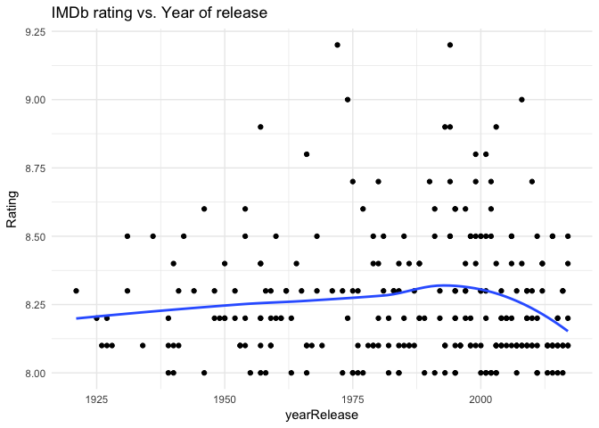
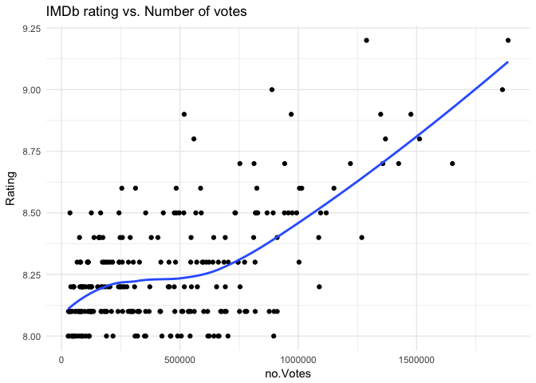

HW10 Scraping data - IMDb Top 250 Rate Movies
================
Fariha Khan
2017-12-07

``` r
## Load packages
suppressPackageStartupMessages(library(tidyverse)) 
suppressPackageStartupMessages(library(knitr))
suppressPackageStartupMessages(library(kableExtra))
suppressPackageStartupMessages(library(stringr))
suppressPackageStartupMessages(library(rvest))
```

#### Get data from web

I wrote my code in an R script to make the markdown cleaner to view. The rScript for the first part is found [here]()

``` r
suppressMessages(source('rScripts/01_scrapeData.r'))
```

#### View data structure

###### View [html\_structure](https://github.com/farihakhan/STAT547-hw-khan-fariha/blob/master/hw_10/html_structure.md)

``` r
imdb
```

    ## {xml_document}
    ## <html xmlns:og="http://ogp.me/ns#" xmlns:fb="http://www.facebook.com/2008/fbml">
    ## [1] <head>\n<meta http-equiv="Content-Type" content="text/html; charset= ...
    ## [2] <body id="styleguide-v2" class="fixed">\n<script>\n    if (typeof ue ...

``` r
imdb %>%
      html_nodes(".titleColumn") %>% 
      html_text() %>%
      head()
```

    ## [1] "\n      1.\n      The Shawshank Redemption\n        (1994)\n    "
    ## [2] "\n      2.\n      The Godfather\n        (1972)\n    "           
    ## [3] "\n      3.\n      The Godfather: Part II\n        (1974)\n    "  
    ## [4] "\n      4.\n      The Dark Knight\n        (2008)\n    "         
    ## [5] "\n      5.\n      12 Angry Men\n        (1957)\n    "            
    ## [6] "\n      6.\n      Schindler's List\n        (1993)\n    "

#### Extract and structure data:

I stored each column variable into character lists. I changed some of the data types of the variables to allow analysis.

The extracted variables are:

-   Title

-   Year released

-   Rating

-   Number of IMDb user votes

-   Brief cast info

-   Link associated with each movie

#### Create summary dataframe

``` r
imdb_df <- extractFields(imdb)
imdb_df %>% glimpse()
```

    ## Observations: 250
    ## Variables: 6
    ## $ Title       <fctr> The Shawshank Redemption, The Godfather, The Godf...
    ## $ yearRelease <dbl> 1994, 1972, 1974, 2008, 1957, 1993, 1994, 2003, 19...
    ## $ Rating      <dbl> 9.2, 9.2, 9.0, 9.0, 8.9, 8.9, 8.9, 8.9, 8.8, 8.8, ...
    ## $ Cast        <fctr> Frank Darabont (dir.), Tim Robbins, Morgan Freema...
    ## $ Votes       <fctr> 9.2 based on 1,886,772 user ratings, 9.2 based on...
    ## $ Link        <chr> "http://www.imdb.com/title/tt0111161/?pf_rd_m=A2FG...

#### Clean dataset

> See rScript for more

``` r
imdb_df2 %>% 
      select(Title, yearRelease, Rating,
             no.Votes, Director, Cast1,
             Cast2, Link) %>% 
      kable("html", align = "c", padding = 1,
            caption = "imdb Top 250 Rated movies") %>% 
      kable_styling("striped") %>% 
      scroll_box(height = "400px")
```

<table class="table table-striped" style="margin-left: auto; margin-right: auto;">
<caption>
imdb Top 250 Rated movies
</caption>
<thead>
<tr>
<th style="text-align:center;">
Title
</th>
<th style="text-align:center;">
yearRelease
</th>
<th style="text-align:center;">
Rating
</th>
<th style="text-align:center;">
no.Votes
</th>
<th style="text-align:center;">
Director
</th>
<th style="text-align:center;">
Cast1
</th>
<th style="text-align:center;">
Cast2
</th>
<th style="text-align:center;">
Link
</th>
</tr>
</thead>
<tbody>
<tr>
<td style="text-align:center;">
The Shawshank Redemption
</td>
<td style="text-align:center;">
1994
</td>
<td style="text-align:center;">
9.2
</td>
<td style="text-align:center;">
1886772
</td>
<td style="text-align:center;">
Frank Darabont
</td>
<td style="text-align:center;">
Tim Robbins
</td>
<td style="text-align:center;">
Morgan Freeman
</td>
<td style="text-align:center;">
<http://www.imdb.com/title/tt0111161/?pf_rd_m=A2FGELUUNOQJNL&pf_rd_p=3376940102&pf_rd_r=1TGCM8NQXMS40P0BR6X0&pf_rd_s=center-1&pf_rd_t=15506&pf_rd_i=top&ref_=chttp_tt_1>
</td>
</tr>
<tr>
<td style="text-align:center;">
The Godfather
</td>
<td style="text-align:center;">
1972
</td>
<td style="text-align:center;">
9.2
</td>
<td style="text-align:center;">
1288216
</td>
<td style="text-align:center;">
Francis Ford Coppola
</td>
<td style="text-align:center;">
Marlon Brando
</td>
<td style="text-align:center;">
Al Pacino
</td>
<td style="text-align:center;">
<http://www.imdb.com/title/tt0068646/?pf_rd_m=A2FGELUUNOQJNL&pf_rd_p=3376940102&pf_rd_r=1TGCM8NQXMS40P0BR6X0&pf_rd_s=center-1&pf_rd_t=15506&pf_rd_i=top&ref_=chttp_tt_2>
</td>
</tr>
<tr>
<td style="text-align:center;">
The Godfather: Part II
</td>
<td style="text-align:center;">
1974
</td>
<td style="text-align:center;">
9.0
</td>
<td style="text-align:center;">
888694
</td>
<td style="text-align:center;">
Francis Ford Coppola
</td>
<td style="text-align:center;">
Al Pacino
</td>
<td style="text-align:center;">
Robert De Niro
</td>
<td style="text-align:center;">
<http://www.imdb.com/title/tt0071562/?pf_rd_m=A2FGELUUNOQJNL&pf_rd_p=3376940102&pf_rd_r=1TGCM8NQXMS40P0BR6X0&pf_rd_s=center-1&pf_rd_t=15506&pf_rd_i=top&ref_=chttp_tt_3>
</td>
</tr>
<tr>
<td style="text-align:center;">
The Dark Knight
</td>
<td style="text-align:center;">
2008
</td>
<td style="text-align:center;">
9.0
</td>
<td style="text-align:center;">
1862557
</td>
<td style="text-align:center;">
Christopher Nolan
</td>
<td style="text-align:center;">
Christian Bale
</td>
<td style="text-align:center;">
Heath Ledger
</td>
<td style="text-align:center;">
<http://www.imdb.com/title/tt0468569/?pf_rd_m=A2FGELUUNOQJNL&pf_rd_p=3376940102&pf_rd_r=1TGCM8NQXMS40P0BR6X0&pf_rd_s=center-1&pf_rd_t=15506&pf_rd_i=top&ref_=chttp_tt_4>
</td>
</tr>
<tr>
<td style="text-align:center;">
12 Angry Men
</td>
<td style="text-align:center;">
1957
</td>
<td style="text-align:center;">
8.9
</td>
<td style="text-align:center;">
517864
</td>
<td style="text-align:center;">
Sidney Lumet
</td>
<td style="text-align:center;">
Henry Fonda
</td>
<td style="text-align:center;">
Lee J. Cobb
</td>
<td style="text-align:center;">
<http://www.imdb.com/title/tt0050083/?pf_rd_m=A2FGELUUNOQJNL&pf_rd_p=3376940102&pf_rd_r=1TGCM8NQXMS40P0BR6X0&pf_rd_s=center-1&pf_rd_t=15506&pf_rd_i=top&ref_=chttp_tt_5>
</td>
</tr>
<tr>
<td style="text-align:center;">
Schindler's List
</td>
<td style="text-align:center;">
1993
</td>
<td style="text-align:center;">
8.9
</td>
<td style="text-align:center;">
970147
</td>
<td style="text-align:center;">
Steven Spielberg
</td>
<td style="text-align:center;">
Liam Neeson
</td>
<td style="text-align:center;">
Ralph Fiennes
</td>
<td style="text-align:center;">
<http://www.imdb.com/title/tt0108052/?pf_rd_m=A2FGELUUNOQJNL&pf_rd_p=3376940102&pf_rd_r=1TGCM8NQXMS40P0BR6X0&pf_rd_s=center-1&pf_rd_t=15506&pf_rd_i=top&ref_=chttp_tt_6>
</td>
</tr>
<tr>
<td style="text-align:center;">
Pulp Fiction
</td>
<td style="text-align:center;">
1994
</td>
<td style="text-align:center;">
8.9
</td>
<td style="text-align:center;">
1475822
</td>
<td style="text-align:center;">
Quentin Tarantino
</td>
<td style="text-align:center;">
John Travolta
</td>
<td style="text-align:center;">
Uma Thurman
</td>
<td style="text-align:center;">
<http://www.imdb.com/title/tt0110912/?pf_rd_m=A2FGELUUNOQJNL&pf_rd_p=3376940102&pf_rd_r=1TGCM8NQXMS40P0BR6X0&pf_rd_s=center-1&pf_rd_t=15506&pf_rd_i=top&ref_=chttp_tt_7>
</td>
</tr>
<tr>
<td style="text-align:center;">
The Lord of the Rings: The Return of the King
</td>
<td style="text-align:center;">
2003
</td>
<td style="text-align:center;">
8.9
</td>
<td style="text-align:center;">
1348173
</td>
<td style="text-align:center;">
Peter Jackson
</td>
<td style="text-align:center;">
Elijah Wood
</td>
<td style="text-align:center;">
Viggo Mortensen
</td>
<td style="text-align:center;">
<http://www.imdb.com/title/tt0167260/?pf_rd_m=A2FGELUUNOQJNL&pf_rd_p=3376940102&pf_rd_r=1TGCM8NQXMS40P0BR6X0&pf_rd_s=center-1&pf_rd_t=15506&pf_rd_i=top&ref_=chttp_tt_8>
</td>
</tr>
<tr>
<td style="text-align:center;">
Il buono, il brutto, il cattivo
</td>
<td style="text-align:center;">
1966
</td>
<td style="text-align:center;">
8.8
</td>
<td style="text-align:center;">
558932
</td>
<td style="text-align:center;">
Sergio Leone
</td>
<td style="text-align:center;">
Clint Eastwood
</td>
<td style="text-align:center;">
Eli Wallach
</td>
<td style="text-align:center;">
<http://www.imdb.com/title/tt0060196/?pf_rd_m=A2FGELUUNOQJNL&pf_rd_p=3376940102&pf_rd_r=1TGCM8NQXMS40P0BR6X0&pf_rd_s=center-1&pf_rd_t=15506&pf_rd_i=top&ref_=chttp_tt_9>
</td>
</tr>
<tr>
<td style="text-align:center;">
Fight Club
</td>
<td style="text-align:center;">
1999
</td>
<td style="text-align:center;">
8.8
</td>
<td style="text-align:center;">
1512187
</td>
<td style="text-align:center;">
David Fincher
</td>
<td style="text-align:center;">
Brad Pitt
</td>
<td style="text-align:center;">
Edward Norton
</td>
<td style="text-align:center;">
<http://www.imdb.com/title/tt0137523/?pf_rd_m=A2FGELUUNOQJNL&pf_rd_p=3376940102&pf_rd_r=1TGCM8NQXMS40P0BR6X0&pf_rd_s=center-1&pf_rd_t=15506&pf_rd_i=top&ref_=chttp_tt_10>
</td>
</tr>
<tr>
<td style="text-align:center;">
The Lord of the Rings: The Fellowship of the Ring
</td>
<td style="text-align:center;">
2001
</td>
<td style="text-align:center;">
8.8
</td>
<td style="text-align:center;">
1368339
</td>
<td style="text-align:center;">
Peter Jackson
</td>
<td style="text-align:center;">
Elijah Wood
</td>
<td style="text-align:center;">
Ian McKellen
</td>
<td style="text-align:center;">
<http://www.imdb.com/title/tt0120737/?pf_rd_m=A2FGELUUNOQJNL&pf_rd_p=3376940102&pf_rd_r=1TGCM8NQXMS40P0BR6X0&pf_rd_s=center-1&pf_rd_t=15506&pf_rd_i=top&ref_=chttp_tt_11>
</td>
</tr>
<tr>
<td style="text-align:center;">
Forrest Gump
</td>
<td style="text-align:center;">
1994
</td>
<td style="text-align:center;">
8.7
</td>
<td style="text-align:center;">
1423957
</td>
<td style="text-align:center;">
Robert Zemeckis
</td>
<td style="text-align:center;">
Tom Hanks
</td>
<td style="text-align:center;">
Robin Wright
</td>
<td style="text-align:center;">
<http://www.imdb.com/title/tt0109830/?pf_rd_m=A2FGELUUNOQJNL&pf_rd_p=3376940102&pf_rd_r=1TGCM8NQXMS40P0BR6X0&pf_rd_s=center-1&pf_rd_t=15506&pf_rd_i=top&ref_=chttp_tt_12>
</td>
</tr>
<tr>
<td style="text-align:center;">
Star Wars: Episode V - The Empire Strikes Back
</td>
<td style="text-align:center;">
1980
</td>
<td style="text-align:center;">
8.7
</td>
<td style="text-align:center;">
942464
</td>
<td style="text-align:center;">
Irvin Kershner
</td>
<td style="text-align:center;">
Mark Hamill
</td>
<td style="text-align:center;">
Harrison Ford
</td>
<td style="text-align:center;">
<http://www.imdb.com/title/tt0080684/?pf_rd_m=A2FGELUUNOQJNL&pf_rd_p=3376940102&pf_rd_r=1TGCM8NQXMS40P0BR6X0&pf_rd_s=center-1&pf_rd_t=15506&pf_rd_i=top&ref_=chttp_tt_13>
</td>
</tr>
<tr>
<td style="text-align:center;">
Inception
</td>
<td style="text-align:center;">
2010
</td>
<td style="text-align:center;">
8.7
</td>
<td style="text-align:center;">
1651410
</td>
<td style="text-align:center;">
Christopher Nolan
</td>
<td style="text-align:center;">
Leonardo DiCaprio
</td>
<td style="text-align:center;">
Joseph Gordon-Levitt
</td>
<td style="text-align:center;">
<http://www.imdb.com/title/tt1375666/?pf_rd_m=A2FGELUUNOQJNL&pf_rd_p=3376940102&pf_rd_r=1TGCM8NQXMS40P0BR6X0&pf_rd_s=center-1&pf_rd_t=15506&pf_rd_i=top&ref_=chttp_tt_14>
</td>
</tr>
<tr>
<td style="text-align:center;">
The Lord of the Rings: The Two Towers
</td>
<td style="text-align:center;">
2002
</td>
<td style="text-align:center;">
8.7
</td>
<td style="text-align:center;">
1220263
</td>
<td style="text-align:center;">
Peter Jackson
</td>
<td style="text-align:center;">
Elijah Wood
</td>
<td style="text-align:center;">
Ian McKellen
</td>
<td style="text-align:center;">
<http://www.imdb.com/title/tt0167261/?pf_rd_m=A2FGELUUNOQJNL&pf_rd_p=3376940102&pf_rd_r=1TGCM8NQXMS40P0BR6X0&pf_rd_s=center-1&pf_rd_t=15506&pf_rd_i=top&ref_=chttp_tt_15>
</td>
</tr>
<tr>
<td style="text-align:center;">
One Flew Over the Cuckoo's Nest
</td>
<td style="text-align:center;">
1975
</td>
<td style="text-align:center;">
8.7
</td>
<td style="text-align:center;">
753207
</td>
<td style="text-align:center;">
Milos Forman
</td>
<td style="text-align:center;">
Jack Nicholson
</td>
<td style="text-align:center;">
Louise Fletcher
</td>
<td style="text-align:center;">
<http://www.imdb.com/title/tt0073486/?pf_rd_m=A2FGELUUNOQJNL&pf_rd_p=3376940102&pf_rd_r=1TGCM8NQXMS40P0BR6X0&pf_rd_s=center-1&pf_rd_t=15506&pf_rd_i=top&ref_=chttp_tt_16>
</td>
</tr>
<tr>
<td style="text-align:center;">
Goodfellas
</td>
<td style="text-align:center;">
1990
</td>
<td style="text-align:center;">
8.7
</td>
<td style="text-align:center;">
812985
</td>
<td style="text-align:center;">
Martin Scorsese
</td>
<td style="text-align:center;">
Robert De Niro
</td>
<td style="text-align:center;">
Ray Liotta
</td>
<td style="text-align:center;">
<http://www.imdb.com/title/tt0099685/?pf_rd_m=A2FGELUUNOQJNL&pf_rd_p=3376940102&pf_rd_r=1TGCM8NQXMS40P0BR6X0&pf_rd_s=center-1&pf_rd_t=15506&pf_rd_i=top&ref_=chttp_tt_17>
</td>
</tr>
<tr>
<td style="text-align:center;">
The Matrix
</td>
<td style="text-align:center;">
1999
</td>
<td style="text-align:center;">
8.7
</td>
<td style="text-align:center;">
1357252
</td>
<td style="text-align:center;">
Lana Wachowski
</td>
<td style="text-align:center;">
Keanu Reeves
</td>
<td style="text-align:center;">
Laurence Fishburne
</td>
<td style="text-align:center;">
<http://www.imdb.com/title/tt0133093/?pf_rd_m=A2FGELUUNOQJNL&pf_rd_p=3376940102&pf_rd_r=1TGCM8NQXMS40P0BR6X0&pf_rd_s=center-1&pf_rd_t=15506&pf_rd_i=top&ref_=chttp_tt_18>
</td>
</tr>
<tr>
<td style="text-align:center;">
Shichinin no samurai
</td>
<td style="text-align:center;">
1954
</td>
<td style="text-align:center;">
8.6
</td>
<td style="text-align:center;">
254227
</td>
<td style="text-align:center;">
Akira Kurosawa
</td>
<td style="text-align:center;">
Toshirô Mifune
</td>
<td style="text-align:center;">
Takashi Shimura
</td>
<td style="text-align:center;">
<http://www.imdb.com/title/tt0047478/?pf_rd_m=A2FGELUUNOQJNL&pf_rd_p=3376940102&pf_rd_r=1TGCM8NQXMS40P0BR6X0&pf_rd_s=center-1&pf_rd_t=15506&pf_rd_i=top&ref_=chttp_tt_19>
</td>
</tr>
<tr>
<td style="text-align:center;">
Star Wars
</td>
<td style="text-align:center;">
1977
</td>
<td style="text-align:center;">
8.6
</td>
<td style="text-align:center;">
1014722
</td>
<td style="text-align:center;">
George Lucas
</td>
<td style="text-align:center;">
Mark Hamill
</td>
<td style="text-align:center;">
Harrison Ford
</td>
<td style="text-align:center;">
<http://www.imdb.com/title/tt0076759/?pf_rd_m=A2FGELUUNOQJNL&pf_rd_p=3376940102&pf_rd_r=1TGCM8NQXMS40P0BR6X0&pf_rd_s=center-1&pf_rd_t=15506&pf_rd_i=top&ref_=chttp_tt_20>
</td>
</tr>
<tr>
<td style="text-align:center;">
Cidade de Deus
</td>
<td style="text-align:center;">
2002
</td>
<td style="text-align:center;">
8.6
</td>
<td style="text-align:center;">
587241
</td>
<td style="text-align:center;">
Fernando Meirelles
</td>
<td style="text-align:center;">
Alexandre Rodrigues
</td>
<td style="text-align:center;">
Leandro Firmino
</td>
<td style="text-align:center;">
<http://www.imdb.com/title/tt0317248/?pf_rd_m=A2FGELUUNOQJNL&pf_rd_p=3376940102&pf_rd_r=1TGCM8NQXMS40P0BR6X0&pf_rd_s=center-1&pf_rd_t=15506&pf_rd_i=top&ref_=chttp_tt_21>
</td>
</tr>
<tr>
<td style="text-align:center;">
Se7en
</td>
<td style="text-align:center;">
1995
</td>
<td style="text-align:center;">
8.6
</td>
<td style="text-align:center;">
1150613
</td>
<td style="text-align:center;">
David Fincher
</td>
<td style="text-align:center;">
Morgan Freeman
</td>
<td style="text-align:center;">
Brad Pitt
</td>
<td style="text-align:center;">
<http://www.imdb.com/title/tt0114369/?pf_rd_m=A2FGELUUNOQJNL&pf_rd_p=3376940102&pf_rd_r=1TGCM8NQXMS40P0BR6X0&pf_rd_s=center-1&pf_rd_t=15506&pf_rd_i=top&ref_=chttp_tt_22>
</td>
</tr>
<tr>
<td style="text-align:center;">
The Silence of the Lambs
</td>
<td style="text-align:center;">
1991
</td>
<td style="text-align:center;">
8.6
</td>
<td style="text-align:center;">
1004772
</td>
<td style="text-align:center;">
Jonathan Demme
</td>
<td style="text-align:center;">
Jodie Foster
</td>
<td style="text-align:center;">
Anthony Hopkins
</td>
<td style="text-align:center;">
<http://www.imdb.com/title/tt0102926/?pf_rd_m=A2FGELUUNOQJNL&pf_rd_p=3376940102&pf_rd_r=1TGCM8NQXMS40P0BR6X0&pf_rd_s=center-1&pf_rd_t=15506&pf_rd_i=top&ref_=chttp_tt_23>
</td>
</tr>
<tr>
<td style="text-align:center;">
It's a Wonderful Life
</td>
<td style="text-align:center;">
1946
</td>
<td style="text-align:center;">
8.6
</td>
<td style="text-align:center;">
312281
</td>
<td style="text-align:center;">
Frank Capra
</td>
<td style="text-align:center;">
James Stewart
</td>
<td style="text-align:center;">
Donna Reed
</td>
<td style="text-align:center;">
<http://www.imdb.com/title/tt0038650/?pf_rd_m=A2FGELUUNOQJNL&pf_rd_p=3376940102&pf_rd_r=1TGCM8NQXMS40P0BR6X0&pf_rd_s=center-1&pf_rd_t=15506&pf_rd_i=top&ref_=chttp_tt_24>
</td>
</tr>
<tr>
<td style="text-align:center;">
La vita è bella
</td>
<td style="text-align:center;">
1997
</td>
<td style="text-align:center;">
8.6
</td>
<td style="text-align:center;">
484274
</td>
<td style="text-align:center;">
Roberto Benigni
</td>
<td style="text-align:center;">
Roberto Benigni
</td>
<td style="text-align:center;">
Nicoletta Braschi
</td>
<td style="text-align:center;">
<http://www.imdb.com/title/tt0118799/?pf_rd_m=A2FGELUUNOQJNL&pf_rd_p=3376940102&pf_rd_r=1TGCM8NQXMS40P0BR6X0&pf_rd_s=center-1&pf_rd_t=15506&pf_rd_i=top&ref_=chttp_tt_25>
</td>
</tr>
<tr>
<td style="text-align:center;">
The Usual Suspects
</td>
<td style="text-align:center;">
1995
</td>
<td style="text-align:center;">
8.6
</td>
<td style="text-align:center;">
824733
</td>
<td style="text-align:center;">
Bryan Singer
</td>
<td style="text-align:center;">
Kevin Spacey
</td>
<td style="text-align:center;">
Gabriel Byrne
</td>
<td style="text-align:center;">
<http://www.imdb.com/title/tt0114814/?pf_rd_m=A2FGELUUNOQJNL&pf_rd_p=3376940102&pf_rd_r=1TGCM8NQXMS40P0BR6X0&pf_rd_s=center-1&pf_rd_t=15506&pf_rd_i=top&ref_=chttp_tt_26>
</td>
</tr>
<tr>
<td style="text-align:center;">
Léon
</td>
<td style="text-align:center;">
1994
</td>
<td style="text-align:center;">
8.5
</td>
<td style="text-align:center;">
818956
</td>
<td style="text-align:center;">
Luc Besson
</td>
<td style="text-align:center;">
Jean Reno
</td>
<td style="text-align:center;">
Gary Oldman
</td>
<td style="text-align:center;">
<http://www.imdb.com/title/tt0110413/?pf_rd_m=A2FGELUUNOQJNL&pf_rd_p=3376940102&pf_rd_r=1TGCM8NQXMS40P0BR6X0&pf_rd_s=center-1&pf_rd_t=15506&pf_rd_i=top&ref_=chttp_tt_27>
</td>
</tr>
<tr>
<td style="text-align:center;">
Saving Private Ryan
</td>
<td style="text-align:center;">
1998
</td>
<td style="text-align:center;">
8.5
</td>
<td style="text-align:center;">
992822
</td>
<td style="text-align:center;">
Steven Spielberg
</td>
<td style="text-align:center;">
Tom Hanks
</td>
<td style="text-align:center;">
Matt Damon
</td>
<td style="text-align:center;">
<http://www.imdb.com/title/tt0120815/?pf_rd_m=A2FGELUUNOQJNL&pf_rd_p=3376940102&pf_rd_r=1TGCM8NQXMS40P0BR6X0&pf_rd_s=center-1&pf_rd_t=15506&pf_rd_i=top&ref_=chttp_tt_28>
</td>
</tr>
<tr>
<td style="text-align:center;">
Sen to Chihiro no kamikakushi
</td>
<td style="text-align:center;">
2001
</td>
<td style="text-align:center;">
8.5
</td>
<td style="text-align:center;">
484940
</td>
<td style="text-align:center;">
Hayao Miyazaki
</td>
<td style="text-align:center;">
Daveigh Chase
</td>
<td style="text-align:center;">
Suzanne Pleshette
</td>
<td style="text-align:center;">
<http://www.imdb.com/title/tt0245429/?pf_rd_m=A2FGELUUNOQJNL&pf_rd_p=3376940102&pf_rd_r=1TGCM8NQXMS40P0BR6X0&pf_rd_s=center-1&pf_rd_t=15506&pf_rd_i=top&ref_=chttp_tt_29>
</td>
</tr>
<tr>
<td style="text-align:center;">
Coco
</td>
<td style="text-align:center;">
2017
</td>
<td style="text-align:center;">
8.5
</td>
<td style="text-align:center;">
35367
</td>
<td style="text-align:center;">
Lee Unkrich
</td>
<td style="text-align:center;">
Anthony Gonzalez
</td>
<td style="text-align:center;">
Gael García Bernal
</td>
<td style="text-align:center;">
<http://www.imdb.com/title/tt2380307/?pf_rd_m=A2FGELUUNOQJNL&pf_rd_p=3376940102&pf_rd_r=1TGCM8NQXMS40P0BR6X0&pf_rd_s=center-1&pf_rd_t=15506&pf_rd_i=top&ref_=chttp_tt_30>
</td>
</tr>
<tr>
<td style="text-align:center;">
American History X
</td>
<td style="text-align:center;">
1998
</td>
<td style="text-align:center;">
8.5
</td>
<td style="text-align:center;">
868200
</td>
<td style="text-align:center;">
Tony Kaye
</td>
<td style="text-align:center;">
Edward Norton
</td>
<td style="text-align:center;">
Edward Furlong
</td>
<td style="text-align:center;">
<http://www.imdb.com/title/tt0120586/?pf_rd_m=A2FGELUUNOQJNL&pf_rd_p=3376940102&pf_rd_r=1TGCM8NQXMS40P0BR6X0&pf_rd_s=center-1&pf_rd_t=15506&pf_rd_i=top&ref_=chttp_tt_31>
</td>
</tr>
<tr>
<td style="text-align:center;">
Once Upon a Time in the West
</td>
<td style="text-align:center;">
1968
</td>
<td style="text-align:center;">
8.5
</td>
<td style="text-align:center;">
242557
</td>
<td style="text-align:center;">
Sergio Leone
</td>
<td style="text-align:center;">
Henry Fonda
</td>
<td style="text-align:center;">
Charles Bronson
</td>
<td style="text-align:center;">
<http://www.imdb.com/title/tt0064116/?pf_rd_m=A2FGELUUNOQJNL&pf_rd_p=3376940102&pf_rd_r=1TGCM8NQXMS40P0BR6X0&pf_rd_s=center-1&pf_rd_t=15506&pf_rd_i=top&ref_=chttp_tt_32>
</td>
</tr>
<tr>
<td style="text-align:center;">
Interstellar
</td>
<td style="text-align:center;">
2014
</td>
<td style="text-align:center;">
8.5
</td>
<td style="text-align:center;">
1118110
</td>
<td style="text-align:center;">
Christopher Nolan
</td>
<td style="text-align:center;">
Matthew McConaughey
</td>
<td style="text-align:center;">
Anne Hathaway
</td>
<td style="text-align:center;">
<http://www.imdb.com/title/tt0816692/?pf_rd_m=A2FGELUUNOQJNL&pf_rd_p=3376940102&pf_rd_r=1TGCM8NQXMS40P0BR6X0&pf_rd_s=center-1&pf_rd_t=15506&pf_rd_i=top&ref_=chttp_tt_33>
</td>
</tr>
<tr>
<td style="text-align:center;">
The Green Mile
</td>
<td style="text-align:center;">
1999
</td>
<td style="text-align:center;">
8.5
</td>
<td style="text-align:center;">
893699
</td>
<td style="text-align:center;">
Frank Darabont
</td>
<td style="text-align:center;">
Tom Hanks
</td>
<td style="text-align:center;">
Michael Clarke Duncan
</td>
<td style="text-align:center;">
<http://www.imdb.com/title/tt0120689/?pf_rd_m=A2FGELUUNOQJNL&pf_rd_p=3376940102&pf_rd_r=1TGCM8NQXMS40P0BR6X0&pf_rd_s=center-1&pf_rd_t=15506&pf_rd_i=top&ref_=chttp_tt_34>
</td>
</tr>
<tr>
<td style="text-align:center;">
Psycho
</td>
<td style="text-align:center;">
1960
</td>
<td style="text-align:center;">
8.5
</td>
<td style="text-align:center;">
476197
</td>
<td style="text-align:center;">
Alfred Hitchcock
</td>
<td style="text-align:center;">
Anthony Perkins
</td>
<td style="text-align:center;">
Janet Leigh
</td>
<td style="text-align:center;">
<http://www.imdb.com/title/tt0054215/?pf_rd_m=A2FGELUUNOQJNL&pf_rd_p=3376940102&pf_rd_r=1TGCM8NQXMS40P0BR6X0&pf_rd_s=center-1&pf_rd_t=15506&pf_rd_i=top&ref_=chttp_tt_35>
</td>
</tr>
<tr>
<td style="text-align:center;">
City Lights
</td>
<td style="text-align:center;">
1931
</td>
<td style="text-align:center;">
8.5
</td>
<td style="text-align:center;">
125565
</td>
<td style="text-align:center;">
Charles Chaplin
</td>
<td style="text-align:center;">
Charles Chaplin
</td>
<td style="text-align:center;">
Virginia Cherrill
</td>
<td style="text-align:center;">
<http://www.imdb.com/title/tt0021749/?pf_rd_m=A2FGELUUNOQJNL&pf_rd_p=3376940102&pf_rd_r=1TGCM8NQXMS40P0BR6X0&pf_rd_s=center-1&pf_rd_t=15506&pf_rd_i=top&ref_=chttp_tt_36>
</td>
</tr>
<tr>
<td style="text-align:center;">
Casablanca
</td>
<td style="text-align:center;">
1942
</td>
<td style="text-align:center;">
8.5
</td>
<td style="text-align:center;">
429626
</td>
<td style="text-align:center;">
Michael Curtiz
</td>
<td style="text-align:center;">
Humphrey Bogart
</td>
<td style="text-align:center;">
Ingrid Bergman
</td>
<td style="text-align:center;">
<http://www.imdb.com/title/tt0034583/?pf_rd_m=A2FGELUUNOQJNL&pf_rd_p=3376940102&pf_rd_r=1TGCM8NQXMS40P0BR6X0&pf_rd_s=center-1&pf_rd_t=15506&pf_rd_i=top&ref_=chttp_tt_37>
</td>
</tr>
<tr>
<td style="text-align:center;">
The Intouchables
</td>
<td style="text-align:center;">
2011
</td>
<td style="text-align:center;">
8.5
</td>
<td style="text-align:center;">
590043
</td>
<td style="text-align:center;">
Olivier Nakache
</td>
<td style="text-align:center;">
François Cluzet
</td>
<td style="text-align:center;">
Omar Sy
</td>
<td style="text-align:center;">
<http://www.imdb.com/title/tt1675434/?pf_rd_m=A2FGELUUNOQJNL&pf_rd_p=3376940102&pf_rd_r=1TGCM8NQXMS40P0BR6X0&pf_rd_s=center-1&pf_rd_t=15506&pf_rd_i=top&ref_=chttp_tt_38>
</td>
</tr>
<tr>
<td style="text-align:center;">
Modern Times
</td>
<td style="text-align:center;">
1936
</td>
<td style="text-align:center;">
8.5
</td>
<td style="text-align:center;">
164947
</td>
<td style="text-align:center;">
Charles Chaplin
</td>
<td style="text-align:center;">
Charles Chaplin
</td>
<td style="text-align:center;">
Paulette Goddard
</td>
<td style="text-align:center;">
<http://www.imdb.com/title/tt0027977/?pf_rd_m=A2FGELUUNOQJNL&pf_rd_p=3376940102&pf_rd_r=1TGCM8NQXMS40P0BR6X0&pf_rd_s=center-1&pf_rd_t=15506&pf_rd_i=top&ref_=chttp_tt_39>
</td>
</tr>
<tr>
<td style="text-align:center;">
The Pianist
</td>
<td style="text-align:center;">
2002
</td>
<td style="text-align:center;">
8.5
</td>
<td style="text-align:center;">
567086
</td>
<td style="text-align:center;">
Roman Polanski
</td>
<td style="text-align:center;">
Adrien Brody
</td>
<td style="text-align:center;">
Thomas Kretschmann
</td>
<td style="text-align:center;">
<http://www.imdb.com/title/tt0253474/?pf_rd_m=A2FGELUUNOQJNL&pf_rd_p=3376940102&pf_rd_r=1TGCM8NQXMS40P0BR6X0&pf_rd_s=center-1&pf_rd_t=15506&pf_rd_i=top&ref_=chttp_tt_40>
</td>
</tr>
<tr>
<td style="text-align:center;">
Raiders of the Lost Ark
</td>
<td style="text-align:center;">
1981
</td>
<td style="text-align:center;">
8.5
</td>
<td style="text-align:center;">
732280
</td>
<td style="text-align:center;">
Steven Spielberg
</td>
<td style="text-align:center;">
Harrison Ford
</td>
<td style="text-align:center;">
Karen Allen
</td>
<td style="text-align:center;">
<http://www.imdb.com/title/tt0082971/?pf_rd_m=A2FGELUUNOQJNL&pf_rd_p=3376940102&pf_rd_r=1TGCM8NQXMS40P0BR6X0&pf_rd_s=center-1&pf_rd_t=15506&pf_rd_i=top&ref_=chttp_tt_41>
</td>
</tr>
<tr>
<td style="text-align:center;">
The Departed
</td>
<td style="text-align:center;">
2006
</td>
<td style="text-align:center;">
8.5
</td>
<td style="text-align:center;">
974437
</td>
<td style="text-align:center;">
Martin Scorsese
</td>
<td style="text-align:center;">
Leonardo DiCaprio
</td>
<td style="text-align:center;">
Matt Damon
</td>
<td style="text-align:center;">
<http://www.imdb.com/title/tt0407887/?pf_rd_m=A2FGELUUNOQJNL&pf_rd_p=3376940102&pf_rd_r=1TGCM8NQXMS40P0BR6X0&pf_rd_s=center-1&pf_rd_t=15506&pf_rd_i=top&ref_=chttp_tt_42>
</td>
</tr>
<tr>
<td style="text-align:center;">
Rear Window
</td>
<td style="text-align:center;">
1954
</td>
<td style="text-align:center;">
8.5
</td>
<td style="text-align:center;">
355115
</td>
<td style="text-align:center;">
Alfred Hitchcock
</td>
<td style="text-align:center;">
James Stewart
</td>
<td style="text-align:center;">
Grace Kelly
</td>
<td style="text-align:center;">
<http://www.imdb.com/title/tt0047396/?pf_rd_m=A2FGELUUNOQJNL&pf_rd_p=3376940102&pf_rd_r=1TGCM8NQXMS40P0BR6X0&pf_rd_s=center-1&pf_rd_t=15506&pf_rd_i=top&ref_=chttp_tt_43>
</td>
</tr>
<tr>
<td style="text-align:center;">
Terminator 2: Judgment Day
</td>
<td style="text-align:center;">
1991
</td>
<td style="text-align:center;">
8.5
</td>
<td style="text-align:center;">
823596
</td>
<td style="text-align:center;">
James Cameron
</td>
<td style="text-align:center;">
Arnold Schwarzenegger
</td>
<td style="text-align:center;">
Linda Hamilton
</td>
<td style="text-align:center;">
<http://www.imdb.com/title/tt0103064/?pf_rd_m=A2FGELUUNOQJNL&pf_rd_p=3376940102&pf_rd_r=1TGCM8NQXMS40P0BR6X0&pf_rd_s=center-1&pf_rd_t=15506&pf_rd_i=top&ref_=chttp_tt_44>
</td>
</tr>
<tr>
<td style="text-align:center;">
Back to the Future
</td>
<td style="text-align:center;">
1985
</td>
<td style="text-align:center;">
8.5
</td>
<td style="text-align:center;">
828693
</td>
<td style="text-align:center;">
Robert Zemeckis
</td>
<td style="text-align:center;">
Michael J. Fox
</td>
<td style="text-align:center;">
Christopher Lloyd
</td>
<td style="text-align:center;">
<http://www.imdb.com/title/tt0088763/?pf_rd_m=A2FGELUUNOQJNL&pf_rd_p=3376940102&pf_rd_r=1TGCM8NQXMS40P0BR6X0&pf_rd_s=center-1&pf_rd_t=15506&pf_rd_i=top&ref_=chttp_tt_45>
</td>
</tr>
<tr>
<td style="text-align:center;">
Whiplash
</td>
<td style="text-align:center;">
2014
</td>
<td style="text-align:center;">
8.5
</td>
<td style="text-align:center;">
516186
</td>
<td style="text-align:center;">
Damien Chazelle
</td>
<td style="text-align:center;">
Miles Teller
</td>
<td style="text-align:center;">
J.K. Simmons
</td>
<td style="text-align:center;">
<http://www.imdb.com/title/tt2582802/?pf_rd_m=A2FGELUUNOQJNL&pf_rd_p=3376940102&pf_rd_r=1TGCM8NQXMS40P0BR6X0&pf_rd_s=center-1&pf_rd_t=15506&pf_rd_i=top&ref_=chttp_tt_46>
</td>
</tr>
<tr>
<td style="text-align:center;">
Gladiator
</td>
<td style="text-align:center;">
2000
</td>
<td style="text-align:center;">
8.5
</td>
<td style="text-align:center;">
1094543
</td>
<td style="text-align:center;">
Ridley Scott
</td>
<td style="text-align:center;">
Russell Crowe
</td>
<td style="text-align:center;">
Joaquin Phoenix
</td>
<td style="text-align:center;">
<http://www.imdb.com/title/tt0172495/?pf_rd_m=A2FGELUUNOQJNL&pf_rd_p=3376940102&pf_rd_r=1TGCM8NQXMS40P0BR6X0&pf_rd_s=center-1&pf_rd_t=15506&pf_rd_i=top&ref_=chttp_tt_47>
</td>
</tr>
<tr>
<td style="text-align:center;">
The Lion King
</td>
<td style="text-align:center;">
1994
</td>
<td style="text-align:center;">
8.5
</td>
<td style="text-align:center;">
734665
</td>
<td style="text-align:center;">
Roger Allers
</td>
<td style="text-align:center;">
Matthew Broderick
</td>
<td style="text-align:center;">
Jeremy Irons
</td>
<td style="text-align:center;">
<http://www.imdb.com/title/tt0110357/?pf_rd_m=A2FGELUUNOQJNL&pf_rd_p=3376940102&pf_rd_r=1TGCM8NQXMS40P0BR6X0&pf_rd_s=center-1&pf_rd_t=15506&pf_rd_i=top&ref_=chttp_tt_48>
</td>
</tr>
<tr>
<td style="text-align:center;">
The Prestige
</td>
<td style="text-align:center;">
2006
</td>
<td style="text-align:center;">
8.5
</td>
<td style="text-align:center;">
957975
</td>
<td style="text-align:center;">
Christopher Nolan
</td>
<td style="text-align:center;">
Christian Bale
</td>
<td style="text-align:center;">
Hugh Jackman
</td>
<td style="text-align:center;">
<http://www.imdb.com/title/tt0482571/?pf_rd_m=A2FGELUUNOQJNL&pf_rd_p=3376940102&pf_rd_r=1TGCM8NQXMS40P0BR6X0&pf_rd_s=center-1&pf_rd_t=15506&pf_rd_i=top&ref_=chttp_tt_49>
</td>
</tr>
<tr>
<td style="text-align:center;">
Memento
</td>
<td style="text-align:center;">
2000
</td>
<td style="text-align:center;">
8.5
</td>
<td style="text-align:center;">
941385
</td>
<td style="text-align:center;">
Christopher Nolan
</td>
<td style="text-align:center;">
Guy Pearce
</td>
<td style="text-align:center;">
Carrie-Anne Moss
</td>
<td style="text-align:center;">
<http://www.imdb.com/title/tt0209144/?pf_rd_m=A2FGELUUNOQJNL&pf_rd_p=3376940102&pf_rd_r=1TGCM8NQXMS40P0BR6X0&pf_rd_s=center-1&pf_rd_t=15506&pf_rd_i=top&ref_=chttp_tt_50>
</td>
</tr>
<tr>
<td style="text-align:center;">
Apocalypse Now
</td>
<td style="text-align:center;">
1979
</td>
<td style="text-align:center;">
8.5
</td>
<td style="text-align:center;">
497217
</td>
<td style="text-align:center;">
Francis Ford Coppola
</td>
<td style="text-align:center;">
Martin Sheen
</td>
<td style="text-align:center;">
Marlon Brando
</td>
<td style="text-align:center;">
<http://www.imdb.com/title/tt0078788/?pf_rd_m=A2FGELUUNOQJNL&pf_rd_p=3376940102&pf_rd_r=1TGCM8NQXMS40P0BR6X0&pf_rd_s=center-1&pf_rd_t=15506&pf_rd_i=top&ref_=chttp_tt_51>
</td>
</tr>
<tr>
<td style="text-align:center;">
Alien
</td>
<td style="text-align:center;">
1979
</td>
<td style="text-align:center;">
8.4
</td>
<td style="text-align:center;">
642531
</td>
<td style="text-align:center;">
Ridley Scott
</td>
<td style="text-align:center;">
Sigourney Weaver
</td>
<td style="text-align:center;">
Tom Skerritt
</td>
<td style="text-align:center;">
<http://www.imdb.com/title/tt0078748/?pf_rd_m=A2FGELUUNOQJNL&pf_rd_p=3376940102&pf_rd_r=1TGCM8NQXMS40P0BR6X0&pf_rd_s=center-1&pf_rd_t=15506&pf_rd_i=top&ref_=chttp_tt_52>
</td>
</tr>
<tr>
<td style="text-align:center;">
The Great Dictator
</td>
<td style="text-align:center;">
1940
</td>
<td style="text-align:center;">
8.4
</td>
<td style="text-align:center;">
157633
</td>
<td style="text-align:center;">
Charles Chaplin
</td>
<td style="text-align:center;">
Charles Chaplin
</td>
<td style="text-align:center;">
Paulette Goddard
</td>
<td style="text-align:center;">
<http://www.imdb.com/title/tt0032553/?pf_rd_m=A2FGELUUNOQJNL&pf_rd_p=3376940102&pf_rd_r=1TGCM8NQXMS40P0BR6X0&pf_rd_s=center-1&pf_rd_t=15506&pf_rd_i=top&ref_=chttp_tt_53>
</td>
</tr>
<tr>
<td style="text-align:center;">
Sunset Blvd.
</td>
<td style="text-align:center;">
1950
</td>
<td style="text-align:center;">
8.4
</td>
<td style="text-align:center;">
157317
</td>
<td style="text-align:center;">
Billy Wilder
</td>
<td style="text-align:center;">
William Holden
</td>
<td style="text-align:center;">
Gloria Swanson
</td>
<td style="text-align:center;">
<http://www.imdb.com/title/tt0043014/?pf_rd_m=A2FGELUUNOQJNL&pf_rd_p=3376940102&pf_rd_r=1TGCM8NQXMS40P0BR6X0&pf_rd_s=center-1&pf_rd_t=15506&pf_rd_i=top&ref_=chttp_tt_54>
</td>
</tr>
<tr>
<td style="text-align:center;">
Nuovo Cinema Paradiso
</td>
<td style="text-align:center;">
1988
</td>
<td style="text-align:center;">
8.4
</td>
<td style="text-align:center;">
174558
</td>
<td style="text-align:center;">
Giuseppe Tornatore
</td>
<td style="text-align:center;">
Philippe Noiret
</td>
<td style="text-align:center;">
Enzo Cannavale
</td>
<td style="text-align:center;">
<http://www.imdb.com/title/tt0095765/?pf_rd_m=A2FGELUUNOQJNL&pf_rd_p=3376940102&pf_rd_r=1TGCM8NQXMS40P0BR6X0&pf_rd_s=center-1&pf_rd_t=15506&pf_rd_i=top&ref_=chttp_tt_55>
</td>
</tr>
<tr>
<td style="text-align:center;">
Dr. Strangelove or: How I Learned to Stop Worrying and Love the Bomb
</td>
<td style="text-align:center;">
1964
</td>
<td style="text-align:center;">
8.4
</td>
<td style="text-align:center;">
378779
</td>
<td style="text-align:center;">
Stanley Kubrick
</td>
<td style="text-align:center;">
Peter Sellers
</td>
<td style="text-align:center;">
George C. Scott
</td>
<td style="text-align:center;">
<http://www.imdb.com/title/tt0057012/?pf_rd_m=A2FGELUUNOQJNL&pf_rd_p=3376940102&pf_rd_r=1TGCM8NQXMS40P0BR6X0&pf_rd_s=center-1&pf_rd_t=15506&pf_rd_i=top&ref_=chttp_tt_56>
</td>
</tr>
<tr>
<td style="text-align:center;">
The Lives of Others
</td>
<td style="text-align:center;">
2006
</td>
<td style="text-align:center;">
8.4
</td>
<td style="text-align:center;">
289879
</td>
<td style="text-align:center;">
Florian Henckel von Donnersmarck
</td>
<td style="text-align:center;">
Ulrich Mühe
</td>
<td style="text-align:center;">
Martina Gedeck
</td>
<td style="text-align:center;">
<http://www.imdb.com/title/tt0405094/?pf_rd_m=A2FGELUUNOQJNL&pf_rd_p=3376940102&pf_rd_r=1TGCM8NQXMS40P0BR6X0&pf_rd_s=center-1&pf_rd_t=15506&pf_rd_i=top&ref_=chttp_tt_57>
</td>
</tr>
<tr>
<td style="text-align:center;">
Hotaru no haka
</td>
<td style="text-align:center;">
1988
</td>
<td style="text-align:center;">
8.4
</td>
<td style="text-align:center;">
164221
</td>
<td style="text-align:center;">
Isao Takahata
</td>
<td style="text-align:center;">
Tsutomu Tatsumi
</td>
<td style="text-align:center;">
Ayano Shiraishi
</td>
<td style="text-align:center;">
<http://www.imdb.com/title/tt0095327/?pf_rd_m=A2FGELUUNOQJNL&pf_rd_p=3376940102&pf_rd_r=1TGCM8NQXMS40P0BR6X0&pf_rd_s=center-1&pf_rd_t=15506&pf_rd_i=top&ref_=chttp_tt_58>
</td>
</tr>
<tr>
<td style="text-align:center;">
Paths of Glory
</td>
<td style="text-align:center;">
1957
</td>
<td style="text-align:center;">
8.4
</td>
<td style="text-align:center;">
136850
</td>
<td style="text-align:center;">
Stanley Kubrick
</td>
<td style="text-align:center;">
Kirk Douglas
</td>
<td style="text-align:center;">
Ralph Meeker
</td>
<td style="text-align:center;">
<http://www.imdb.com/title/tt0050825/?pf_rd_m=A2FGELUUNOQJNL&pf_rd_p=3376940102&pf_rd_r=1TGCM8NQXMS40P0BR6X0&pf_rd_s=center-1&pf_rd_t=15506&pf_rd_i=top&ref_=chttp_tt_59>
</td>
</tr>
<tr>
<td style="text-align:center;">
Django Unchained
</td>
<td style="text-align:center;">
2012
</td>
<td style="text-align:center;">
8.4
</td>
<td style="text-align:center;">
1086262
</td>
<td style="text-align:center;">
Quentin Tarantino
</td>
<td style="text-align:center;">
Jamie Foxx
</td>
<td style="text-align:center;">
Christoph Waltz
</td>
<td style="text-align:center;">
<http://www.imdb.com/title/tt1853728/?pf_rd_m=A2FGELUUNOQJNL&pf_rd_p=3376940102&pf_rd_r=1TGCM8NQXMS40P0BR6X0&pf_rd_s=center-1&pf_rd_t=15506&pf_rd_i=top&ref_=chttp_tt_60>
</td>
</tr>
<tr>
<td style="text-align:center;">
The Shining
</td>
<td style="text-align:center;">
1980
</td>
<td style="text-align:center;">
8.4
</td>
<td style="text-align:center;">
691339
</td>
<td style="text-align:center;">
Stanley Kubrick
</td>
<td style="text-align:center;">
Jack Nicholson
</td>
<td style="text-align:center;">
Shelley Duvall
</td>
<td style="text-align:center;">
<http://www.imdb.com/title/tt0081505/?pf_rd_m=A2FGELUUNOQJNL&pf_rd_p=3376940102&pf_rd_r=1TGCM8NQXMS40P0BR6X0&pf_rd_s=center-1&pf_rd_t=15506&pf_rd_i=top&ref_=chttp_tt_61>
</td>
</tr>
<tr>
<td style="text-align:center;">
WALL·E
</td>
<td style="text-align:center;">
2008
</td>
<td style="text-align:center;">
8.4
</td>
<td style="text-align:center;">
811234
</td>
<td style="text-align:center;">
Andrew Stanton
</td>
<td style="text-align:center;">
Ben Burtt
</td>
<td style="text-align:center;">
Elissa Knight
</td>
<td style="text-align:center;">
<http://www.imdb.com/title/tt0910970/?pf_rd_m=A2FGELUUNOQJNL&pf_rd_p=3376940102&pf_rd_r=1TGCM8NQXMS40P0BR6X0&pf_rd_s=center-1&pf_rd_t=15506&pf_rd_i=top&ref_=chttp_tt_62>
</td>
</tr>
<tr>
<td style="text-align:center;">
American Beauty
</td>
<td style="text-align:center;">
1999
</td>
<td style="text-align:center;">
8.4
</td>
<td style="text-align:center;">
910699
</td>
<td style="text-align:center;">
Sam Mendes
</td>
<td style="text-align:center;">
Kevin Spacey
</td>
<td style="text-align:center;">
Annette Bening
</td>
<td style="text-align:center;">
<http://www.imdb.com/title/tt0169547/?pf_rd_m=A2FGELUUNOQJNL&pf_rd_p=3376940102&pf_rd_r=1TGCM8NQXMS40P0BR6X0&pf_rd_s=center-1&pf_rd_t=15506&pf_rd_i=top&ref_=chttp_tt_63>
</td>
</tr>
<tr>
<td style="text-align:center;">
Mononoke-hime
</td>
<td style="text-align:center;">
1997
</td>
<td style="text-align:center;">
8.4
</td>
<td style="text-align:center;">
256833
</td>
<td style="text-align:center;">
Hayao Miyazaki
</td>
<td style="text-align:center;">
Yôji Matsuda
</td>
<td style="text-align:center;">
Yuriko Ishida
</td>
<td style="text-align:center;">
<http://www.imdb.com/title/tt0119698/?pf_rd_m=A2FGELUUNOQJNL&pf_rd_p=3376940102&pf_rd_r=1TGCM8NQXMS40P0BR6X0&pf_rd_s=center-1&pf_rd_t=15506&pf_rd_i=top&ref_=chttp_tt_64>
</td>
</tr>
<tr>
<td style="text-align:center;">
The Dark Knight Rises
</td>
<td style="text-align:center;">
2012
</td>
<td style="text-align:center;">
8.4
</td>
<td style="text-align:center;">
1268237
</td>
<td style="text-align:center;">
Christopher Nolan
</td>
<td style="text-align:center;">
Christian Bale
</td>
<td style="text-align:center;">
Tom Hardy
</td>
<td style="text-align:center;">
<http://www.imdb.com/title/tt1345836/?pf_rd_m=A2FGELUUNOQJNL&pf_rd_p=3376940102&pf_rd_r=1TGCM8NQXMS40P0BR6X0&pf_rd_s=center-1&pf_rd_t=15506&pf_rd_i=top&ref_=chttp_tt_65>
</td>
</tr>
<tr>
<td style="text-align:center;">
Blade Runner 2049
</td>
<td style="text-align:center;">
2017
</td>
<td style="text-align:center;">
8.4
</td>
<td style="text-align:center;">
158183
</td>
<td style="text-align:center;">
Denis Villeneuve
</td>
<td style="text-align:center;">
Harrison Ford
</td>
<td style="text-align:center;">
Ryan Gosling
</td>
<td style="text-align:center;">
<http://www.imdb.com/title/tt1856101/?pf_rd_m=A2FGELUUNOQJNL&pf_rd_p=3376940102&pf_rd_r=1TGCM8NQXMS40P0BR6X0&pf_rd_s=center-1&pf_rd_t=15506&pf_rd_i=top&ref_=chttp_tt_66>
</td>
</tr>
<tr>
<td style="text-align:center;">
Oldeuboi
</td>
<td style="text-align:center;">
2003
</td>
<td style="text-align:center;">
8.4
</td>
<td style="text-align:center;">
406944
</td>
<td style="text-align:center;">
Chan-wook Park
</td>
<td style="text-align:center;">
Min-sik Choi
</td>
<td style="text-align:center;">
Ji-tae Yu
</td>
<td style="text-align:center;">
<http://www.imdb.com/title/tt0364569/?pf_rd_m=A2FGELUUNOQJNL&pf_rd_p=3376940102&pf_rd_r=1TGCM8NQXMS40P0BR6X0&pf_rd_s=center-1&pf_rd_t=15506&pf_rd_i=top&ref_=chttp_tt_67>
</td>
</tr>
<tr>
<td style="text-align:center;">
Witness for the Prosecution
</td>
<td style="text-align:center;">
1957
</td>
<td style="text-align:center;">
8.4
</td>
<td style="text-align:center;">
75596
</td>
<td style="text-align:center;">
Billy Wilder
</td>
<td style="text-align:center;">
Tyrone Power
</td>
<td style="text-align:center;">
Marlene Dietrich
</td>
<td style="text-align:center;">
<http://www.imdb.com/title/tt0051201/?pf_rd_m=A2FGELUUNOQJNL&pf_rd_p=3376940102&pf_rd_r=1TGCM8NQXMS40P0BR6X0&pf_rd_s=center-1&pf_rd_t=15506&pf_rd_i=top&ref_=chttp_tt_68>
</td>
</tr>
<tr>
<td style="text-align:center;">
Aliens
</td>
<td style="text-align:center;">
1986
</td>
<td style="text-align:center;">
8.4
</td>
<td style="text-align:center;">
546989
</td>
<td style="text-align:center;">
James Cameron
</td>
<td style="text-align:center;">
Sigourney Weaver
</td>
<td style="text-align:center;">
Michael Biehn
</td>
<td style="text-align:center;">
<http://www.imdb.com/title/tt0090605/?pf_rd_m=A2FGELUUNOQJNL&pf_rd_p=3376940102&pf_rd_r=1TGCM8NQXMS40P0BR6X0&pf_rd_s=center-1&pf_rd_t=15506&pf_rd_i=top&ref_=chttp_tt_69>
</td>
</tr>
<tr>
<td style="text-align:center;">
Once Upon a Time in America
</td>
<td style="text-align:center;">
1984
</td>
<td style="text-align:center;">
8.4
</td>
<td style="text-align:center;">
247177
</td>
<td style="text-align:center;">
Sergio Leone
</td>
<td style="text-align:center;">
Robert De Niro
</td>
<td style="text-align:center;">
James Woods
</td>
<td style="text-align:center;">
<http://www.imdb.com/title/tt0087843/?pf_rd_m=A2FGELUUNOQJNL&pf_rd_p=3376940102&pf_rd_r=1TGCM8NQXMS40P0BR6X0&pf_rd_s=center-1&pf_rd_t=15506&pf_rd_i=top&ref_=chttp_tt_70>
</td>
</tr>
<tr>
<td style="text-align:center;">
Das Boot
</td>
<td style="text-align:center;">
1981
</td>
<td style="text-align:center;">
8.3
</td>
<td style="text-align:center;">
186994
</td>
<td style="text-align:center;">
Wolfgang Petersen
</td>
<td style="text-align:center;">
Jürgen Prochnow
</td>
<td style="text-align:center;">
Herbert Grönemeyer
</td>
<td style="text-align:center;">
<http://www.imdb.com/title/tt0082096/?pf_rd_m=A2FGELUUNOQJNL&pf_rd_p=3376940102&pf_rd_r=1TGCM8NQXMS40P0BR6X0&pf_rd_s=center-1&pf_rd_t=15506&pf_rd_i=top&ref_=chttp_tt_71>
</td>
</tr>
<tr>
<td style="text-align:center;">
Dangal
</td>
<td style="text-align:center;">
2016
</td>
<td style="text-align:center;">
8.3
</td>
<td style="text-align:center;">
77496
</td>
<td style="text-align:center;">
Nitesh Tiwari
</td>
<td style="text-align:center;">
Aamir Khan
</td>
<td style="text-align:center;">
Sakshi Tanwar
</td>
<td style="text-align:center;">
<http://www.imdb.com/title/tt5074352/?pf_rd_m=A2FGELUUNOQJNL&pf_rd_p=3376940102&pf_rd_r=1TGCM8NQXMS40P0BR6X0&pf_rd_s=center-1&pf_rd_t=15506&pf_rd_i=top&ref_=chttp_tt_72>
</td>
</tr>
<tr>
<td style="text-align:center;">
Citizen Kane
</td>
<td style="text-align:center;">
1941
</td>
<td style="text-align:center;">
8.3
</td>
<td style="text-align:center;">
328960
</td>
<td style="text-align:center;">
Orson Welles
</td>
<td style="text-align:center;">
Orson Welles
</td>
<td style="text-align:center;">
Joseph Cotten
</td>
<td style="text-align:center;">
<http://www.imdb.com/title/tt0033467/?pf_rd_m=A2FGELUUNOQJNL&pf_rd_p=3376940102&pf_rd_r=1TGCM8NQXMS40P0BR6X0&pf_rd_s=center-1&pf_rd_t=15506&pf_rd_i=top&ref_=chttp_tt_73>
</td>
</tr>
<tr>
<td style="text-align:center;">
Vertigo
</td>
<td style="text-align:center;">
1958
</td>
<td style="text-align:center;">
8.3
</td>
<td style="text-align:center;">
282556
</td>
<td style="text-align:center;">
Alfred Hitchcock
</td>
<td style="text-align:center;">
James Stewart
</td>
<td style="text-align:center;">
Kim Novak
</td>
<td style="text-align:center;">
<http://www.imdb.com/title/tt0052357/?pf_rd_m=A2FGELUUNOQJNL&pf_rd_p=3376940102&pf_rd_r=1TGCM8NQXMS40P0BR6X0&pf_rd_s=center-1&pf_rd_t=15506&pf_rd_i=top&ref_=chttp_tt_74>
</td>
</tr>
<tr>
<td style="text-align:center;">
North by Northwest
</td>
<td style="text-align:center;">
1959
</td>
<td style="text-align:center;">
8.3
</td>
<td style="text-align:center;">
243443
</td>
<td style="text-align:center;">
Alfred Hitchcock
</td>
<td style="text-align:center;">
Cary Grant
</td>
<td style="text-align:center;">
Eva Marie Saint
</td>
<td style="text-align:center;">
<http://www.imdb.com/title/tt0053125/?pf_rd_m=A2FGELUUNOQJNL&pf_rd_p=3376940102&pf_rd_r=1TGCM8NQXMS40P0BR6X0&pf_rd_s=center-1&pf_rd_t=15506&pf_rd_i=top&ref_=chttp_tt_75>
</td>
</tr>
<tr>
<td style="text-align:center;">
Star Wars: Episode VI - Return of the Jedi
</td>
<td style="text-align:center;">
1983
</td>
<td style="text-align:center;">
8.3
</td>
<td style="text-align:center;">
773082
</td>
<td style="text-align:center;">
Richard Marquand
</td>
<td style="text-align:center;">
Mark Hamill
</td>
<td style="text-align:center;">
Harrison Ford
</td>
<td style="text-align:center;">
<http://www.imdb.com/title/tt0086190/?pf_rd_m=A2FGELUUNOQJNL&pf_rd_p=3376940102&pf_rd_r=1TGCM8NQXMS40P0BR6X0&pf_rd_s=center-1&pf_rd_t=15506&pf_rd_i=top&ref_=chttp_tt_76>
</td>
</tr>
<tr>
<td style="text-align:center;">
Braveheart
</td>
<td style="text-align:center;">
1995
</td>
<td style="text-align:center;">
8.3
</td>
<td style="text-align:center;">
817217
</td>
<td style="text-align:center;">
Mel Gibson
</td>
<td style="text-align:center;">
Mel Gibson
</td>
<td style="text-align:center;">
Sophie Marceau
</td>
<td style="text-align:center;">
<http://www.imdb.com/title/tt0112573/?pf_rd_m=A2FGELUUNOQJNL&pf_rd_p=3376940102&pf_rd_r=1TGCM8NQXMS40P0BR6X0&pf_rd_s=center-1&pf_rd_t=15506&pf_rd_i=top&ref_=chttp_tt_77>
</td>
</tr>
<tr>
<td style="text-align:center;">
Reservoir Dogs
</td>
<td style="text-align:center;">
1992
</td>
<td style="text-align:center;">
8.3
</td>
<td style="text-align:center;">
745159
</td>
<td style="text-align:center;">
Quentin Tarantino
</td>
<td style="text-align:center;">
Harvey Keitel
</td>
<td style="text-align:center;">
Tim Roth
</td>
<td style="text-align:center;">
<http://www.imdb.com/title/tt0105236/?pf_rd_m=A2FGELUUNOQJNL&pf_rd_p=3376940102&pf_rd_r=1TGCM8NQXMS40P0BR6X0&pf_rd_s=center-1&pf_rd_t=15506&pf_rd_i=top&ref_=chttp_tt_78>
</td>
</tr>
<tr>
<td style="text-align:center;">
M
</td>
<td style="text-align:center;">
1931
</td>
<td style="text-align:center;">
8.3
</td>
<td style="text-align:center;">
111647
</td>
<td style="text-align:center;">
Fritz Lang
</td>
<td style="text-align:center;">
Peter Lorre
</td>
<td style="text-align:center;">
Ellen Widmann
</td>
<td style="text-align:center;">
<http://www.imdb.com/title/tt0022100/?pf_rd_m=A2FGELUUNOQJNL&pf_rd_p=3376940102&pf_rd_r=1TGCM8NQXMS40P0BR6X0&pf_rd_s=center-1&pf_rd_t=15506&pf_rd_i=top&ref_=chttp_tt_79>
</td>
</tr>
<tr>
<td style="text-align:center;">
Requiem for a Dream
</td>
<td style="text-align:center;">
2000
</td>
<td style="text-align:center;">
8.3
</td>
<td style="text-align:center;">
638904
</td>
<td style="text-align:center;">
Darren Aronofsky
</td>
<td style="text-align:center;">
Ellen Burstyn
</td>
<td style="text-align:center;">
Jared Leto
</td>
<td style="text-align:center;">
<http://www.imdb.com/title/tt0180093/?pf_rd_m=A2FGELUUNOQJNL&pf_rd_p=3376940102&pf_rd_r=1TGCM8NQXMS40P0BR6X0&pf_rd_s=center-1&pf_rd_t=15506&pf_rd_i=top&ref_=chttp_tt_80>
</td>
</tr>
<tr>
<td style="text-align:center;">
Kimi no na wa.
</td>
<td style="text-align:center;">
2016
</td>
<td style="text-align:center;">
8.3
</td>
<td style="text-align:center;">
65545
</td>
<td style="text-align:center;">
Makoto Shinkai
</td>
<td style="text-align:center;">
Ryûnosuke Kamiki
</td>
<td style="text-align:center;">
Mone Kamishiraishi
</td>
<td style="text-align:center;">
<http://www.imdb.com/title/tt5311514/?pf_rd_m=A2FGELUUNOQJNL&pf_rd_p=3376940102&pf_rd_r=1TGCM8NQXMS40P0BR6X0&pf_rd_s=center-1&pf_rd_t=15506&pf_rd_i=top&ref_=chttp_tt_81>
</td>
</tr>
<tr>
<td style="text-align:center;">
Taare Zameen Par
</td>
<td style="text-align:center;">
2007
</td>
<td style="text-align:center;">
8.3
</td>
<td style="text-align:center;">
113090
</td>
<td style="text-align:center;">
Aamir Khan
</td>
<td style="text-align:center;">
Darsheel Safary
</td>
<td style="text-align:center;">
Aamir Khan
</td>
<td style="text-align:center;">
<http://www.imdb.com/title/tt0986264/?pf_rd_m=A2FGELUUNOQJNL&pf_rd_p=3376940102&pf_rd_r=1TGCM8NQXMS40P0BR6X0&pf_rd_s=center-1&pf_rd_t=15506&pf_rd_i=top&ref_=chttp_tt_82>
</td>
</tr>
<tr>
<td style="text-align:center;">
Amélie
</td>
<td style="text-align:center;">
2001
</td>
<td style="text-align:center;">
8.3
</td>
<td style="text-align:center;">
594444
</td>
<td style="text-align:center;">
Jean-Pierre Jeunet
</td>
<td style="text-align:center;">
Audrey Tautou
</td>
<td style="text-align:center;">
Mathieu Kassovitz
</td>
<td style="text-align:center;">
<http://www.imdb.com/title/tt0211915/?pf_rd_m=A2FGELUUNOQJNL&pf_rd_p=3376940102&pf_rd_r=1TGCM8NQXMS40P0BR6X0&pf_rd_s=center-1&pf_rd_t=15506&pf_rd_i=top&ref_=chttp_tt_83>
</td>
</tr>
<tr>
<td style="text-align:center;">
A Clockwork Orange
</td>
<td style="text-align:center;">
1971
</td>
<td style="text-align:center;">
8.3
</td>
<td style="text-align:center;">
623097
</td>
<td style="text-align:center;">
Stanley Kubrick
</td>
<td style="text-align:center;">
Malcolm McDowell
</td>
<td style="text-align:center;">
Patrick Magee
</td>
<td style="text-align:center;">
<http://www.imdb.com/title/tt0066921/?pf_rd_m=A2FGELUUNOQJNL&pf_rd_p=3376940102&pf_rd_r=1TGCM8NQXMS40P0BR6X0&pf_rd_s=center-1&pf_rd_t=15506&pf_rd_i=top&ref_=chttp_tt_84>
</td>
</tr>
<tr>
<td style="text-align:center;">
Lawrence of Arabia
</td>
<td style="text-align:center;">
1962
</td>
<td style="text-align:center;">
8.3
</td>
<td style="text-align:center;">
215491
</td>
<td style="text-align:center;">
David Lean
</td>
<td style="text-align:center;">
Peter O'Toole
</td>
<td style="text-align:center;">
Alec Guinness
</td>
<td style="text-align:center;">
<http://www.imdb.com/title/tt0056172/?pf_rd_m=A2FGELUUNOQJNL&pf_rd_p=3376940102&pf_rd_r=1TGCM8NQXMS40P0BR6X0&pf_rd_s=center-1&pf_rd_t=15506&pf_rd_i=top&ref_=chttp_tt_85>
</td>
</tr>
<tr>
<td style="text-align:center;">
Amadeus
</td>
<td style="text-align:center;">
1984
</td>
<td style="text-align:center;">
8.3
</td>
<td style="text-align:center;">
302920
</td>
<td style="text-align:center;">
Milos Forman
</td>
<td style="text-align:center;">
F. Murray Abraham
</td>
<td style="text-align:center;">
Tom Hulce
</td>
<td style="text-align:center;">
<http://www.imdb.com/title/tt0086879/?pf_rd_m=A2FGELUUNOQJNL&pf_rd_p=3376940102&pf_rd_r=1TGCM8NQXMS40P0BR6X0&pf_rd_s=center-1&pf_rd_t=15506&pf_rd_i=top&ref_=chttp_tt_86>
</td>
</tr>
<tr>
<td style="text-align:center;">
Double Indemnity
</td>
<td style="text-align:center;">
1944
</td>
<td style="text-align:center;">
8.3
</td>
<td style="text-align:center;">
110710
</td>
<td style="text-align:center;">
Billy Wilder
</td>
<td style="text-align:center;">
Fred MacMurray
</td>
<td style="text-align:center;">
Barbara Stanwyck
</td>
<td style="text-align:center;">
<http://www.imdb.com/title/tt0036775/?pf_rd_m=A2FGELUUNOQJNL&pf_rd_p=3376940102&pf_rd_r=1TGCM8NQXMS40P0BR6X0&pf_rd_s=center-1&pf_rd_t=15506&pf_rd_i=top&ref_=chttp_tt_87>
</td>
</tr>
<tr>
<td style="text-align:center;">
Eternal Sunshine of the Spotless Mind
</td>
<td style="text-align:center;">
2004
</td>
<td style="text-align:center;">
8.3
</td>
<td style="text-align:center;">
745692
</td>
<td style="text-align:center;">
Michel Gondry
</td>
<td style="text-align:center;">
Jim Carrey
</td>
<td style="text-align:center;">
Kate Winslet
</td>
<td style="text-align:center;">
<http://www.imdb.com/title/tt0338013/?pf_rd_m=A2FGELUUNOQJNL&pf_rd_p=3376940102&pf_rd_r=1TGCM8NQXMS40P0BR6X0&pf_rd_s=center-1&pf_rd_t=15506&pf_rd_i=top&ref_=chttp_tt_88>
</td>
</tr>
<tr>
<td style="text-align:center;">
Taxi Driver
</td>
<td style="text-align:center;">
1976
</td>
<td style="text-align:center;">
8.3
</td>
<td style="text-align:center;">
570855
</td>
<td style="text-align:center;">
Martin Scorsese
</td>
<td style="text-align:center;">
Robert De Niro
</td>
<td style="text-align:center;">
Jodie Foster
</td>
<td style="text-align:center;">
<http://www.imdb.com/title/tt0075314/?pf_rd_m=A2FGELUUNOQJNL&pf_rd_p=3376940102&pf_rd_r=1TGCM8NQXMS40P0BR6X0&pf_rd_s=center-1&pf_rd_t=15506&pf_rd_i=top&ref_=chttp_tt_89>
</td>
</tr>
<tr>
<td style="text-align:center;">
To Kill a Mockingbird
</td>
<td style="text-align:center;">
1962
</td>
<td style="text-align:center;">
8.3
</td>
<td style="text-align:center;">
242783
</td>
<td style="text-align:center;">
Robert Mulligan
</td>
<td style="text-align:center;">
Gregory Peck
</td>
<td style="text-align:center;">
John Megna
</td>
<td style="text-align:center;">
<http://www.imdb.com/title/tt0056592/?pf_rd_m=A2FGELUUNOQJNL&pf_rd_p=3376940102&pf_rd_r=1TGCM8NQXMS40P0BR6X0&pf_rd_s=center-1&pf_rd_t=15506&pf_rd_i=top&ref_=chttp_tt_90>
</td>
</tr>
<tr>
<td style="text-align:center;">
Full Metal Jacket
</td>
<td style="text-align:center;">
1987
</td>
<td style="text-align:center;">
8.3
</td>
<td style="text-align:center;">
545349
</td>
<td style="text-align:center;">
Stanley Kubrick
</td>
<td style="text-align:center;">
Matthew Modine
</td>
<td style="text-align:center;">
R. Lee Ermey
</td>
<td style="text-align:center;">
<http://www.imdb.com/title/tt0093058/?pf_rd_m=A2FGELUUNOQJNL&pf_rd_p=3376940102&pf_rd_r=1TGCM8NQXMS40P0BR6X0&pf_rd_s=center-1&pf_rd_t=15506&pf_rd_i=top&ref_=chttp_tt_91>
</td>
</tr>
<tr>
<td style="text-align:center;">
2001: A Space Odyssey
</td>
<td style="text-align:center;">
1968
</td>
<td style="text-align:center;">
8.3
</td>
<td style="text-align:center;">
481309
</td>
<td style="text-align:center;">
Stanley Kubrick
</td>
<td style="text-align:center;">
Keir Dullea
</td>
<td style="text-align:center;">
Gary Lockwood
</td>
<td style="text-align:center;">
<http://www.imdb.com/title/tt0062622/?pf_rd_m=A2FGELUUNOQJNL&pf_rd_p=3376940102&pf_rd_r=1TGCM8NQXMS40P0BR6X0&pf_rd_s=center-1&pf_rd_t=15506&pf_rd_i=top&ref_=chttp_tt_92>
</td>
</tr>
<tr>
<td style="text-align:center;">
Singin' in the Rain
</td>
<td style="text-align:center;">
1952
</td>
<td style="text-align:center;">
8.3
</td>
<td style="text-align:center;">
172640
</td>
<td style="text-align:center;">
Stanley Donen
</td>
<td style="text-align:center;">
Gene Kelly
</td>
<td style="text-align:center;">
Donald O'Connor
</td>
<td style="text-align:center;">
<http://www.imdb.com/title/tt0045152/?pf_rd_m=A2FGELUUNOQJNL&pf_rd_p=3376940102&pf_rd_r=1TGCM8NQXMS40P0BR6X0&pf_rd_s=center-1&pf_rd_t=15506&pf_rd_i=top&ref_=chttp_tt_93>
</td>
</tr>
<tr>
<td style="text-align:center;">
Toy Story
</td>
<td style="text-align:center;">
1995
</td>
<td style="text-align:center;">
8.3
</td>
<td style="text-align:center;">
704090
</td>
<td style="text-align:center;">
John Lasseter
</td>
<td style="text-align:center;">
Tom Hanks
</td>
<td style="text-align:center;">
Tim Allen
</td>
<td style="text-align:center;">
<http://www.imdb.com/title/tt0114709/?pf_rd_m=A2FGELUUNOQJNL&pf_rd_p=3376940102&pf_rd_r=1TGCM8NQXMS40P0BR6X0&pf_rd_s=center-1&pf_rd_t=15506&pf_rd_i=top&ref_=chttp_tt_94>
</td>
</tr>
<tr>
<td style="text-align:center;">
3 Idiots
</td>
<td style="text-align:center;">
2009
</td>
<td style="text-align:center;">
8.3
</td>
<td style="text-align:center;">
256287
</td>
<td style="text-align:center;">
Rajkumar Hirani
</td>
<td style="text-align:center;">
Aamir Khan
</td>
<td style="text-align:center;">
Madhavan
</td>
<td style="text-align:center;">
<http://www.imdb.com/title/tt1187043/?pf_rd_m=A2FGELUUNOQJNL&pf_rd_p=3376940102&pf_rd_r=1TGCM8NQXMS40P0BR6X0&pf_rd_s=center-1&pf_rd_t=15506&pf_rd_i=top&ref_=chttp_tt_95>
</td>
</tr>
<tr>
<td style="text-align:center;">
The Sting
</td>
<td style="text-align:center;">
1973
</td>
<td style="text-align:center;">
8.3
</td>
<td style="text-align:center;">
196044
</td>
<td style="text-align:center;">
George Roy Hill
</td>
<td style="text-align:center;">
Paul Newman
</td>
<td style="text-align:center;">
Robert Redford
</td>
<td style="text-align:center;">
<http://www.imdb.com/title/tt0070735/?pf_rd_m=A2FGELUUNOQJNL&pf_rd_p=3376940102&pf_rd_r=1TGCM8NQXMS40P0BR6X0&pf_rd_s=center-1&pf_rd_t=15506&pf_rd_i=top&ref_=chttp_tt_96>
</td>
</tr>
<tr>
<td style="text-align:center;">
Toy Story 3
</td>
<td style="text-align:center;">
2010
</td>
<td style="text-align:center;">
8.3
</td>
<td style="text-align:center;">
611443
</td>
<td style="text-align:center;">
Lee Unkrich
</td>
<td style="text-align:center;">
Tom Hanks
</td>
<td style="text-align:center;">
Tim Allen
</td>
<td style="text-align:center;">
<http://www.imdb.com/title/tt0435761/?pf_rd_m=A2FGELUUNOQJNL&pf_rd_p=3376940102&pf_rd_r=1TGCM8NQXMS40P0BR6X0&pf_rd_s=center-1&pf_rd_t=15506&pf_rd_i=top&ref_=chttp_tt_97>
</td>
</tr>
<tr>
<td style="text-align:center;">
Inglourious Basterds
</td>
<td style="text-align:center;">
2009
</td>
<td style="text-align:center;">
8.3
</td>
<td style="text-align:center;">
1003151
</td>
<td style="text-align:center;">
Quentin Tarantino
</td>
<td style="text-align:center;">
Brad Pitt
</td>
<td style="text-align:center;">
Diane Kruger
</td>
<td style="text-align:center;">
<http://www.imdb.com/title/tt0361748/?pf_rd_m=A2FGELUUNOQJNL&pf_rd_p=3376940102&pf_rd_r=1TGCM8NQXMS40P0BR6X0&pf_rd_s=center-1&pf_rd_t=15506&pf_rd_i=top&ref_=chttp_tt_98>
</td>
</tr>
<tr>
<td style="text-align:center;">
Ladri di biciclette
</td>
<td style="text-align:center;">
1948
</td>
<td style="text-align:center;">
8.3
</td>
<td style="text-align:center;">
108700
</td>
<td style="text-align:center;">
Vittorio De Sica
</td>
<td style="text-align:center;">
Lamberto Maggiorani
</td>
<td style="text-align:center;">
Enzo Staiola
</td>
<td style="text-align:center;">
<http://www.imdb.com/title/tt0040522/?pf_rd_m=A2FGELUUNOQJNL&pf_rd_p=3376940102&pf_rd_r=1TGCM8NQXMS40P0BR6X0&pf_rd_s=center-1&pf_rd_t=15506&pf_rd_i=top&ref_=chttp_tt_99>
</td>
</tr>
<tr>
<td style="text-align:center;">
The Kid
</td>
<td style="text-align:center;">
1921
</td>
<td style="text-align:center;">
8.3
</td>
<td style="text-align:center;">
80589
</td>
<td style="text-align:center;">
Charles Chaplin
</td>
<td style="text-align:center;">
Charles Chaplin
</td>
<td style="text-align:center;">
Edna Purviance
</td>
<td style="text-align:center;">
<http://www.imdb.com/title/tt0012349/?pf_rd_m=A2FGELUUNOQJNL&pf_rd_p=3376940102&pf_rd_r=1TGCM8NQXMS40P0BR6X0&pf_rd_s=center-1&pf_rd_t=15506&pf_rd_i=top&ref_=chttp_tt_100>
</td>
</tr>
<tr>
<td style="text-align:center;">
Snatch
</td>
<td style="text-align:center;">
2000
</td>
<td style="text-align:center;">
8.3
</td>
<td style="text-align:center;">
662235
</td>
<td style="text-align:center;">
Guy Ritchie
</td>
<td style="text-align:center;">
Jason Statham
</td>
<td style="text-align:center;">
Brad Pitt
</td>
<td style="text-align:center;">
<http://www.imdb.com/title/tt0208092/?pf_rd_m=A2FGELUUNOQJNL&pf_rd_p=3376940102&pf_rd_r=1TGCM8NQXMS40P0BR6X0&pf_rd_s=center-1&pf_rd_t=15506&pf_rd_i=top&ref_=chttp_tt_101>
</td>
</tr>
<tr>
<td style="text-align:center;">
Monty Python and the Holy Grail
</td>
<td style="text-align:center;">
1975
</td>
<td style="text-align:center;">
8.3
</td>
<td style="text-align:center;">
419266
</td>
<td style="text-align:center;">
Terry Gilliam
</td>
<td style="text-align:center;">
Graham Chapman
</td>
<td style="text-align:center;">
John Cleese
</td>
<td style="text-align:center;">
<http://www.imdb.com/title/tt0071853/?pf_rd_m=A2FGELUUNOQJNL&pf_rd_p=3376940102&pf_rd_r=1TGCM8NQXMS40P0BR6X0&pf_rd_s=center-1&pf_rd_t=15506&pf_rd_i=top&ref_=chttp_tt_102>
</td>
</tr>
<tr>
<td style="text-align:center;">
Good Will Hunting
</td>
<td style="text-align:center;">
1997
</td>
<td style="text-align:center;">
8.3
</td>
<td style="text-align:center;">
686189
</td>
<td style="text-align:center;">
Gus Van Sant
</td>
<td style="text-align:center;">
Robin Williams
</td>
<td style="text-align:center;">
Matt Damon
</td>
<td style="text-align:center;">
<http://www.imdb.com/title/tt0119217/?pf_rd_m=A2FGELUUNOQJNL&pf_rd_p=3376940102&pf_rd_r=1TGCM8NQXMS40P0BR6X0&pf_rd_s=center-1&pf_rd_t=15506&pf_rd_i=top&ref_=chttp_tt_103>
</td>
</tr>
<tr>
<td style="text-align:center;">
Jagten
</td>
<td style="text-align:center;">
2012
</td>
<td style="text-align:center;">
8.3
</td>
<td style="text-align:center;">
205766
</td>
<td style="text-align:center;">
Thomas Vinterberg
</td>
<td style="text-align:center;">
Mads Mikkelsen
</td>
<td style="text-align:center;">
Thomas Bo Larsen
</td>
<td style="text-align:center;">
<http://www.imdb.com/title/tt2106476/?pf_rd_m=A2FGELUUNOQJNL&pf_rd_p=3376940102&pf_rd_r=1TGCM8NQXMS40P0BR6X0&pf_rd_s=center-1&pf_rd_t=15506&pf_rd_i=top&ref_=chttp_tt_104>
</td>
</tr>
<tr>
<td style="text-align:center;">
Per qualche dollaro in più
</td>
<td style="text-align:center;">
1965
</td>
<td style="text-align:center;">
8.3
</td>
<td style="text-align:center;">
179638
</td>
<td style="text-align:center;">
Sergio Leone
</td>
<td style="text-align:center;">
Clint Eastwood
</td>
<td style="text-align:center;">
Lee Van Cleef
</td>
<td style="text-align:center;">
<http://www.imdb.com/title/tt0059578/?pf_rd_m=A2FGELUUNOQJNL&pf_rd_p=3376940102&pf_rd_r=1TGCM8NQXMS40P0BR6X0&pf_rd_s=center-1&pf_rd_t=15506&pf_rd_i=top&ref_=chttp_tt_105>
</td>
</tr>
<tr>
<td style="text-align:center;">
Scarface
</td>
<td style="text-align:center;">
1983
</td>
<td style="text-align:center;">
8.3
</td>
<td style="text-align:center;">
599079
</td>
<td style="text-align:center;">
Brian De Palma
</td>
<td style="text-align:center;">
Al Pacino
</td>
<td style="text-align:center;">
Michelle Pfeiffer
</td>
<td style="text-align:center;">
<http://www.imdb.com/title/tt0086250/?pf_rd_m=A2FGELUUNOQJNL&pf_rd_p=3376940102&pf_rd_r=1TGCM8NQXMS40P0BR6X0&pf_rd_s=center-1&pf_rd_t=15506&pf_rd_i=top&ref_=chttp_tt_106>
</td>
</tr>
<tr>
<td style="text-align:center;">
L.A. Confidential
</td>
<td style="text-align:center;">
1997
</td>
<td style="text-align:center;">
8.3
</td>
<td style="text-align:center;">
453678
</td>
<td style="text-align:center;">
Curtis Hanson
</td>
<td style="text-align:center;">
Kevin Spacey
</td>
<td style="text-align:center;">
Russell Crowe
</td>
<td style="text-align:center;">
<http://www.imdb.com/title/tt0119488/?pf_rd_m=A2FGELUUNOQJNL&pf_rd_p=3376940102&pf_rd_r=1TGCM8NQXMS40P0BR6X0&pf_rd_s=center-1&pf_rd_t=15506&pf_rd_i=top&ref_=chttp_tt_107>
</td>
</tr>
<tr>
<td style="text-align:center;">
The Apartment
</td>
<td style="text-align:center;">
1960
</td>
<td style="text-align:center;">
8.2
</td>
<td style="text-align:center;">
124421
</td>
<td style="text-align:center;">
Billy Wilder
</td>
<td style="text-align:center;">
Jack Lemmon
</td>
<td style="text-align:center;">
Shirley MacLaine
</td>
<td style="text-align:center;">
<http://www.imdb.com/title/tt0053604/?pf_rd_m=A2FGELUUNOQJNL&pf_rd_p=3376940102&pf_rd_r=1TGCM8NQXMS40P0BR6X0&pf_rd_s=center-1&pf_rd_t=15506&pf_rd_i=top&ref_=chttp_tt_108>
</td>
</tr>
<tr>
<td style="text-align:center;">
Metropolis
</td>
<td style="text-align:center;">
1927
</td>
<td style="text-align:center;">
8.2
</td>
<td style="text-align:center;">
126115
</td>
<td style="text-align:center;">
Fritz Lang
</td>
<td style="text-align:center;">
Brigitte Helm
</td>
<td style="text-align:center;">
Alfred Abel
</td>
<td style="text-align:center;">
<http://www.imdb.com/title/tt0017136/?pf_rd_m=A2FGELUUNOQJNL&pf_rd_p=3376940102&pf_rd_r=1TGCM8NQXMS40P0BR6X0&pf_rd_s=center-1&pf_rd_t=15506&pf_rd_i=top&ref_=chttp_tt_109>
</td>
</tr>
<tr>
<td style="text-align:center;">
Jodaeiye Nader az Simin
</td>
<td style="text-align:center;">
2011
</td>
<td style="text-align:center;">
8.2
</td>
<td style="text-align:center;">
172939
</td>
<td style="text-align:center;">
Asghar Farhadi
</td>
<td style="text-align:center;">
Payman Maadi
</td>
<td style="text-align:center;">
Leila Hatami
</td>
<td style="text-align:center;">
<http://www.imdb.com/title/tt1832382/?pf_rd_m=A2FGELUUNOQJNL&pf_rd_p=3376940102&pf_rd_r=1TGCM8NQXMS40P0BR6X0&pf_rd_s=center-1&pf_rd_t=15506&pf_rd_i=top&ref_=chttp_tt_110>
</td>
</tr>
<tr>
<td style="text-align:center;">
Rashômon
</td>
<td style="text-align:center;">
1950
</td>
<td style="text-align:center;">
8.2
</td>
<td style="text-align:center;">
116463
</td>
<td style="text-align:center;">
Akira Kurosawa
</td>
<td style="text-align:center;">
Toshirô Mifune
</td>
<td style="text-align:center;">
Machiko Kyô
</td>
<td style="text-align:center;">
<http://www.imdb.com/title/tt0042876/?pf_rd_m=A2FGELUUNOQJNL&pf_rd_p=3376940102&pf_rd_r=1TGCM8NQXMS40P0BR6X0&pf_rd_s=center-1&pf_rd_t=15506&pf_rd_i=top&ref_=chttp_tt_111>
</td>
</tr>
<tr>
<td style="text-align:center;">
Indiana Jones and the Last Crusade
</td>
<td style="text-align:center;">
1989
</td>
<td style="text-align:center;">
8.2
</td>
<td style="text-align:center;">
573573
</td>
<td style="text-align:center;">
Steven Spielberg
</td>
<td style="text-align:center;">
Harrison Ford
</td>
<td style="text-align:center;">
Sean Connery
</td>
<td style="text-align:center;">
<http://www.imdb.com/title/tt0097576/?pf_rd_m=A2FGELUUNOQJNL&pf_rd_p=3376940102&pf_rd_r=1TGCM8NQXMS40P0BR6X0&pf_rd_s=center-1&pf_rd_t=15506&pf_rd_i=top&ref_=chttp_tt_112>
</td>
</tr>
<tr>
<td style="text-align:center;">
All About Eve
</td>
<td style="text-align:center;">
1950
</td>
<td style="text-align:center;">
8.2
</td>
<td style="text-align:center;">
93611
</td>
<td style="text-align:center;">
Joseph L. Mankiewicz
</td>
<td style="text-align:center;">
Bette Davis
</td>
<td style="text-align:center;">
Anne Baxter
</td>
<td style="text-align:center;">
<http://www.imdb.com/title/tt0042192/?pf_rd_m=A2FGELUUNOQJNL&pf_rd_p=3376940102&pf_rd_r=1TGCM8NQXMS40P0BR6X0&pf_rd_s=center-1&pf_rd_t=15506&pf_rd_i=top&ref_=chttp_tt_113>
</td>
</tr>
<tr>
<td style="text-align:center;">
Yôjinbô
</td>
<td style="text-align:center;">
1961
</td>
<td style="text-align:center;">
8.2
</td>
<td style="text-align:center;">
83504
</td>
<td style="text-align:center;">
Akira Kurosawa
</td>
<td style="text-align:center;">
Toshirô Mifune
</td>
<td style="text-align:center;">
Eijirô Tôno
</td>
<td style="text-align:center;">
<http://www.imdb.com/title/tt0055630/?pf_rd_m=A2FGELUUNOQJNL&pf_rd_p=3376940102&pf_rd_r=1TGCM8NQXMS40P0BR6X0&pf_rd_s=center-1&pf_rd_t=15506&pf_rd_i=top&ref_=chttp_tt_114>
</td>
</tr>
<tr>
<td style="text-align:center;">
Babam ve Oglum
</td>
<td style="text-align:center;">
2005
</td>
<td style="text-align:center;">
8.2
</td>
<td style="text-align:center;">
51667
</td>
<td style="text-align:center;">
Çagan Irmak
</td>
<td style="text-align:center;">
Resit Kurt
</td>
<td style="text-align:center;">
Fikret Kuskan
</td>
<td style="text-align:center;">
<http://www.imdb.com/title/tt0476735/?pf_rd_m=A2FGELUUNOQJNL&pf_rd_p=3376940102&pf_rd_r=1TGCM8NQXMS40P0BR6X0&pf_rd_s=center-1&pf_rd_t=15506&pf_rd_i=top&ref_=chttp_tt_115>
</td>
</tr>
<tr>
<td style="text-align:center;">
Up
</td>
<td style="text-align:center;">
2009
</td>
<td style="text-align:center;">
8.2
</td>
<td style="text-align:center;">
753989
</td>
<td style="text-align:center;">
Pete Docter
</td>
<td style="text-align:center;">
Edward Asner
</td>
<td style="text-align:center;">
Jordan Nagai
</td>
<td style="text-align:center;">
<http://www.imdb.com/title/tt1049413/?pf_rd_m=A2FGELUUNOQJNL&pf_rd_p=3376940102&pf_rd_r=1TGCM8NQXMS40P0BR6X0&pf_rd_s=center-1&pf_rd_t=15506&pf_rd_i=top&ref_=chttp_tt_116>
</td>
</tr>
<tr>
<td style="text-align:center;">
Batman Begins
</td>
<td style="text-align:center;">
2005
</td>
<td style="text-align:center;">
8.2
</td>
<td style="text-align:center;">
1088852
</td>
<td style="text-align:center;">
Christopher Nolan
</td>
<td style="text-align:center;">
Christian Bale
</td>
<td style="text-align:center;">
Michael Caine
</td>
<td style="text-align:center;">
<http://www.imdb.com/title/tt0372784/?pf_rd_m=A2FGELUUNOQJNL&pf_rd_p=3376940102&pf_rd_r=1TGCM8NQXMS40P0BR6X0&pf_rd_s=center-1&pf_rd_t=15506&pf_rd_i=top&ref_=chttp_tt_117>
</td>
</tr>
<tr>
<td style="text-align:center;">
Some Like It Hot
</td>
<td style="text-align:center;">
1959
</td>
<td style="text-align:center;">
8.2
</td>
<td style="text-align:center;">
195889
</td>
<td style="text-align:center;">
Billy Wilder
</td>
<td style="text-align:center;">
Marilyn Monroe
</td>
<td style="text-align:center;">
Tony Curtis
</td>
<td style="text-align:center;">
<http://www.imdb.com/title/tt0053291/?pf_rd_m=A2FGELUUNOQJNL&pf_rd_p=3376940102&pf_rd_r=1TGCM8NQXMS40P0BR6X0&pf_rd_s=center-1&pf_rd_t=15506&pf_rd_i=top&ref_=chttp_tt_118>
</td>
</tr>
<tr>
<td style="text-align:center;">
The Treasure of the Sierra Madre
</td>
<td style="text-align:center;">
1948
</td>
<td style="text-align:center;">
8.2
</td>
<td style="text-align:center;">
88728
</td>
<td style="text-align:center;">
John Huston
</td>
<td style="text-align:center;">
Humphrey Bogart
</td>
<td style="text-align:center;">
Walter Huston
</td>
<td style="text-align:center;">
<http://www.imdb.com/title/tt0040897/?pf_rd_m=A2FGELUUNOQJNL&pf_rd_p=3376940102&pf_rd_r=1TGCM8NQXMS40P0BR6X0&pf_rd_s=center-1&pf_rd_t=15506&pf_rd_i=top&ref_=chttp_tt_119>
</td>
</tr>
<tr>
<td style="text-align:center;">
Unforgiven
</td>
<td style="text-align:center;">
1992
</td>
<td style="text-align:center;">
8.2
</td>
<td style="text-align:center;">
308215
</td>
<td style="text-align:center;">
Clint Eastwood
</td>
<td style="text-align:center;">
Clint Eastwood
</td>
<td style="text-align:center;">
Gene Hackman
</td>
<td style="text-align:center;">
<http://www.imdb.com/title/tt0105695/?pf_rd_m=A2FGELUUNOQJNL&pf_rd_p=3376940102&pf_rd_r=1TGCM8NQXMS40P0BR6X0&pf_rd_s=center-1&pf_rd_t=15506&pf_rd_i=top&ref_=chttp_tt_120>
</td>
</tr>
<tr>
<td style="text-align:center;">
Der Untergang
</td>
<td style="text-align:center;">
2004
</td>
<td style="text-align:center;">
8.2
</td>
<td style="text-align:center;">
275887
</td>
<td style="text-align:center;">
Oliver Hirschbiegel
</td>
<td style="text-align:center;">
Bruno Ganz
</td>
<td style="text-align:center;">
Alexandra Maria Lara
</td>
<td style="text-align:center;">
<http://www.imdb.com/title/tt0363163/?pf_rd_m=A2FGELUUNOQJNL&pf_rd_p=3376940102&pf_rd_r=1TGCM8NQXMS40P0BR6X0&pf_rd_s=center-1&pf_rd_t=15506&pf_rd_i=top&ref_=chttp_tt_121>
</td>
</tr>
<tr>
<td style="text-align:center;">
Die Hard
</td>
<td style="text-align:center;">
1988
</td>
<td style="text-align:center;">
8.2
</td>
<td style="text-align:center;">
654813
</td>
<td style="text-align:center;">
John McTiernan
</td>
<td style="text-align:center;">
Bruce Willis
</td>
<td style="text-align:center;">
Alan Rickman
</td>
<td style="text-align:center;">
<http://www.imdb.com/title/tt0095016/?pf_rd_m=A2FGELUUNOQJNL&pf_rd_p=3376940102&pf_rd_r=1TGCM8NQXMS40P0BR6X0&pf_rd_s=center-1&pf_rd_t=15506&pf_rd_i=top&ref_=chttp_tt_122>
</td>
</tr>
<tr>
<td style="text-align:center;">
Raging Bull
</td>
<td style="text-align:center;">
1980
</td>
<td style="text-align:center;">
8.2
</td>
<td style="text-align:center;">
259891
</td>
<td style="text-align:center;">
Martin Scorsese
</td>
<td style="text-align:center;">
Robert De Niro
</td>
<td style="text-align:center;">
Cathy Moriarty
</td>
<td style="text-align:center;">
<http://www.imdb.com/title/tt0081398/?pf_rd_m=A2FGELUUNOQJNL&pf_rd_p=3376940102&pf_rd_r=1TGCM8NQXMS40P0BR6X0&pf_rd_s=center-1&pf_rd_t=15506&pf_rd_i=top&ref_=chttp_tt_123>
</td>
</tr>
<tr>
<td style="text-align:center;">
Heat
</td>
<td style="text-align:center;">
1995
</td>
<td style="text-align:center;">
8.2
</td>
<td style="text-align:center;">
475919
</td>
<td style="text-align:center;">
Michael Mann
</td>
<td style="text-align:center;">
Al Pacino
</td>
<td style="text-align:center;">
Robert De Niro
</td>
<td style="text-align:center;">
<http://www.imdb.com/title/tt0113277/?pf_rd_m=A2FGELUUNOQJNL&pf_rd_p=3376940102&pf_rd_r=1TGCM8NQXMS40P0BR6X0&pf_rd_s=center-1&pf_rd_t=15506&pf_rd_i=top&ref_=chttp_tt_124>
</td>
</tr>
<tr>
<td style="text-align:center;">
The Third Man
</td>
<td style="text-align:center;">
1949
</td>
<td style="text-align:center;">
8.2
</td>
<td style="text-align:center;">
127342
</td>
<td style="text-align:center;">
Carol Reed
</td>
<td style="text-align:center;">
Orson Welles
</td>
<td style="text-align:center;">
Joseph Cotten
</td>
<td style="text-align:center;">
<http://www.imdb.com/title/tt0041959/?pf_rd_m=A2FGELUUNOQJNL&pf_rd_p=3376940102&pf_rd_r=1TGCM8NQXMS40P0BR6X0&pf_rd_s=center-1&pf_rd_t=15506&pf_rd_i=top&ref_=chttp_tt_125>
</td>
</tr>
<tr>
<td style="text-align:center;">
Bacheha-Ye aseman
</td>
<td style="text-align:center;">
1997
</td>
<td style="text-align:center;">
8.2
</td>
<td style="text-align:center;">
38897
</td>
<td style="text-align:center;">
Majid Majidi
</td>
<td style="text-align:center;">
Mohammad Amir Naji
</td>
<td style="text-align:center;">
Amir Farrokh Hashemian
</td>
<td style="text-align:center;">
<http://www.imdb.com/title/tt0118849/?pf_rd_m=A2FGELUUNOQJNL&pf_rd_p=3376940102&pf_rd_r=1TGCM8NQXMS40P0BR6X0&pf_rd_s=center-1&pf_rd_t=15506&pf_rd_i=top&ref_=chttp_tt_126>
</td>
</tr>
<tr>
<td style="text-align:center;">
The Great Escape
</td>
<td style="text-align:center;">
1963
</td>
<td style="text-align:center;">
8.2
</td>
<td style="text-align:center;">
184024
</td>
<td style="text-align:center;">
John Sturges
</td>
<td style="text-align:center;">
Steve McQueen
</td>
<td style="text-align:center;">
James Garner
</td>
<td style="text-align:center;">
<http://www.imdb.com/title/tt0057115/?pf_rd_m=A2FGELUUNOQJNL&pf_rd_p=3376940102&pf_rd_r=1TGCM8NQXMS40P0BR6X0&pf_rd_s=center-1&pf_rd_t=15506&pf_rd_i=top&ref_=chttp_tt_127>
</td>
</tr>
<tr>
<td style="text-align:center;">
Ikiru
</td>
<td style="text-align:center;">
1952
</td>
<td style="text-align:center;">
8.2
</td>
<td style="text-align:center;">
48491
</td>
<td style="text-align:center;">
Akira Kurosawa
</td>
<td style="text-align:center;">
Takashi Shimura
</td>
<td style="text-align:center;">
Nobuo Kaneko
</td>
<td style="text-align:center;">
<http://www.imdb.com/title/tt0044741/?pf_rd_m=A2FGELUUNOQJNL&pf_rd_p=3376940102&pf_rd_r=1TGCM8NQXMS40P0BR6X0&pf_rd_s=center-1&pf_rd_t=15506&pf_rd_i=top&ref_=chttp_tt_128>
</td>
</tr>
<tr>
<td style="text-align:center;">
Chinatown
</td>
<td style="text-align:center;">
1974
</td>
<td style="text-align:center;">
8.2
</td>
<td style="text-align:center;">
240336
</td>
<td style="text-align:center;">
Roman Polanski
</td>
<td style="text-align:center;">
Jack Nicholson
</td>
<td style="text-align:center;">
Faye Dunaway
</td>
<td style="text-align:center;">
<http://www.imdb.com/title/tt0071315/?pf_rd_m=A2FGELUUNOQJNL&pf_rd_p=3376940102&pf_rd_r=1TGCM8NQXMS40P0BR6X0&pf_rd_s=center-1&pf_rd_t=15506&pf_rd_i=top&ref_=chttp_tt_129>
</td>
</tr>
<tr>
<td style="text-align:center;">
Pan's Labyrinth
</td>
<td style="text-align:center;">
2006
</td>
<td style="text-align:center;">
8.2
</td>
<td style="text-align:center;">
518665
</td>
<td style="text-align:center;">
Guillermo del Toro
</td>
<td style="text-align:center;">
Ivana Baquero
</td>
<td style="text-align:center;">
Ariadna Gil
</td>
<td style="text-align:center;">
<http://www.imdb.com/title/tt0457430/?pf_rd_m=A2FGELUUNOQJNL&pf_rd_p=3376940102&pf_rd_r=1TGCM8NQXMS40P0BR6X0&pf_rd_s=center-1&pf_rd_t=15506&pf_rd_i=top&ref_=chttp_tt_130>
</td>
</tr>
<tr>
<td style="text-align:center;">
Tonari no Totoro
</td>
<td style="text-align:center;">
1988
</td>
<td style="text-align:center;">
8.2
</td>
<td style="text-align:center;">
203918
</td>
<td style="text-align:center;">
Hayao Miyazaki
</td>
<td style="text-align:center;">
Hitoshi Takagi
</td>
<td style="text-align:center;">
Noriko Hidaka
</td>
<td style="text-align:center;">
<http://www.imdb.com/title/tt0096283/?pf_rd_m=A2FGELUUNOQJNL&pf_rd_p=3376940102&pf_rd_r=1TGCM8NQXMS40P0BR6X0&pf_rd_s=center-1&pf_rd_t=15506&pf_rd_i=top&ref_=chttp_tt_131>
</td>
</tr>
<tr>
<td style="text-align:center;">
Incendies
</td>
<td style="text-align:center;">
2010
</td>
<td style="text-align:center;">
8.2
</td>
<td style="text-align:center;">
101160
</td>
<td style="text-align:center;">
Denis Villeneuve
</td>
<td style="text-align:center;">
Lubna Azabal
</td>
<td style="text-align:center;">
Mélissa Désormeaux-Poulin
</td>
<td style="text-align:center;">
<http://www.imdb.com/title/tt1255953/?pf_rd_m=A2FGELUUNOQJNL&pf_rd_p=3376940102&pf_rd_r=1TGCM8NQXMS40P0BR6X0&pf_rd_s=center-1&pf_rd_t=15506&pf_rd_i=top&ref_=chttp_tt_132>
</td>
</tr>
<tr>
<td style="text-align:center;">
Ran
</td>
<td style="text-align:center;">
1985
</td>
<td style="text-align:center;">
8.2
</td>
<td style="text-align:center;">
86844
</td>
<td style="text-align:center;">
Akira Kurosawa
</td>
<td style="text-align:center;">
Tatsuya Nakadai
</td>
<td style="text-align:center;">
Akira Terao
</td>
<td style="text-align:center;">
<http://www.imdb.com/title/tt0089881/?pf_rd_m=A2FGELUUNOQJNL&pf_rd_p=3376940102&pf_rd_r=1TGCM8NQXMS40P0BR6X0&pf_rd_s=center-1&pf_rd_t=15506&pf_rd_i=top&ref_=chttp_tt_133>
</td>
</tr>
<tr>
<td style="text-align:center;">
Dunkirk
</td>
<td style="text-align:center;">
2017
</td>
<td style="text-align:center;">
8.2
</td>
<td style="text-align:center;">
265687
</td>
<td style="text-align:center;">
Christopher Nolan
</td>
<td style="text-align:center;">
Fionn Whitehead
</td>
<td style="text-align:center;">
Barry Keoghan
</td>
<td style="text-align:center;">
<http://www.imdb.com/title/tt5013056/?pf_rd_m=A2FGELUUNOQJNL&pf_rd_p=3376940102&pf_rd_r=1TGCM8NQXMS40P0BR6X0&pf_rd_s=center-1&pf_rd_t=15506&pf_rd_i=top&ref_=chttp_tt_134>
</td>
</tr>
<tr>
<td style="text-align:center;">
Judgment at Nuremberg
</td>
<td style="text-align:center;">
1961
</td>
<td style="text-align:center;">
8.2
</td>
<td style="text-align:center;">
51665
</td>
<td style="text-align:center;">
Stanley Kramer
</td>
<td style="text-align:center;">
Spencer Tracy
</td>
<td style="text-align:center;">
Burt Lancaster
</td>
<td style="text-align:center;">
<http://www.imdb.com/title/tt0055031/?pf_rd_m=A2FGELUUNOQJNL&pf_rd_p=3376940102&pf_rd_r=1TGCM8NQXMS40P0BR6X0&pf_rd_s=center-1&pf_rd_t=15506&pf_rd_i=top&ref_=chttp_tt_135>
</td>
</tr>
<tr>
<td style="text-align:center;">
The Gold Rush
</td>
<td style="text-align:center;">
1925
</td>
<td style="text-align:center;">
8.2
</td>
<td style="text-align:center;">
77234
</td>
<td style="text-align:center;">
Charles Chaplin
</td>
<td style="text-align:center;">
Charles Chaplin
</td>
<td style="text-align:center;">
Mack Swain
</td>
<td style="text-align:center;">
<http://www.imdb.com/title/tt0015864/?pf_rd_m=A2FGELUUNOQJNL&pf_rd_p=3376940102&pf_rd_r=1TGCM8NQXMS40P0BR6X0&pf_rd_s=center-1&pf_rd_t=15506&pf_rd_i=top&ref_=chttp_tt_136>
</td>
</tr>
<tr>
<td style="text-align:center;">
El secreto de sus ojos
</td>
<td style="text-align:center;">
2009
</td>
<td style="text-align:center;">
8.2
</td>
<td style="text-align:center;">
152204
</td>
<td style="text-align:center;">
Juan José Campanella
</td>
<td style="text-align:center;">
Ricardo Darín
</td>
<td style="text-align:center;">
Soledad Villamil
</td>
<td style="text-align:center;">
<http://www.imdb.com/title/tt1305806/?pf_rd_m=A2FGELUUNOQJNL&pf_rd_p=3376940102&pf_rd_r=1TGCM8NQXMS40P0BR6X0&pf_rd_s=center-1&pf_rd_t=15506&pf_rd_i=top&ref_=chttp_tt_137>
</td>
</tr>
<tr>
<td style="text-align:center;">
Hauru no ugoku shiro
</td>
<td style="text-align:center;">
2004
</td>
<td style="text-align:center;">
8.2
</td>
<td style="text-align:center;">
246834
</td>
<td style="text-align:center;">
Hayao Miyazaki
</td>
<td style="text-align:center;">
Chieko Baishô
</td>
<td style="text-align:center;">
Takuya Kimura
</td>
<td style="text-align:center;">
<http://www.imdb.com/title/tt0347149/?pf_rd_m=A2FGELUUNOQJNL&pf_rd_p=3376940102&pf_rd_r=1TGCM8NQXMS40P0BR6X0&pf_rd_s=center-1&pf_rd_t=15506&pf_rd_i=top&ref_=chttp_tt_138>
</td>
</tr>
<tr>
<td style="text-align:center;">
Inside Out
</td>
<td style="text-align:center;">
2015
</td>
<td style="text-align:center;">
8.2
</td>
<td style="text-align:center;">
450473
</td>
<td style="text-align:center;">
Pete Docter
</td>
<td style="text-align:center;">
Amy Poehler
</td>
<td style="text-align:center;">
Bill Hader
</td>
<td style="text-align:center;">
<http://www.imdb.com/title/tt2096673/?pf_rd_m=A2FGELUUNOQJNL&pf_rd_p=3376940102&pf_rd_r=1TGCM8NQXMS40P0BR6X0&pf_rd_s=center-1&pf_rd_t=15506&pf_rd_i=top&ref_=chttp_tt_139>
</td>
</tr>
<tr>
<td style="text-align:center;">
On the Waterfront
</td>
<td style="text-align:center;">
1954
</td>
<td style="text-align:center;">
8.2
</td>
<td style="text-align:center;">
113282
</td>
<td style="text-align:center;">
Elia Kazan
</td>
<td style="text-align:center;">
Marlon Brando
</td>
<td style="text-align:center;">
Karl Malden
</td>
<td style="text-align:center;">
<http://www.imdb.com/title/tt0047296/?pf_rd_m=A2FGELUUNOQJNL&pf_rd_p=3376940102&pf_rd_r=1TGCM8NQXMS40P0BR6X0&pf_rd_s=center-1&pf_rd_t=15506&pf_rd_i=top&ref_=chttp_tt_140>
</td>
</tr>
<tr>
<td style="text-align:center;">
The Bridge on the River Kwai
</td>
<td style="text-align:center;">
1957
</td>
<td style="text-align:center;">
8.2
</td>
<td style="text-align:center;">
166440
</td>
<td style="text-align:center;">
David Lean
</td>
<td style="text-align:center;">
William Holden
</td>
<td style="text-align:center;">
Alec Guinness
</td>
<td style="text-align:center;">
<http://www.imdb.com/title/tt0050212/?pf_rd_m=A2FGELUUNOQJNL&pf_rd_p=3376940102&pf_rd_r=1TGCM8NQXMS40P0BR6X0&pf_rd_s=center-1&pf_rd_t=15506&pf_rd_i=top&ref_=chttp_tt_141>
</td>
</tr>
<tr>
<td style="text-align:center;">
Det sjunde inseglet
</td>
<td style="text-align:center;">
1957
</td>
<td style="text-align:center;">
8.2
</td>
<td style="text-align:center;">
125687
</td>
<td style="text-align:center;">
Ingmar Bergman
</td>
<td style="text-align:center;">
Max von Sydow
</td>
<td style="text-align:center;">
Gunnar Björnstrand
</td>
<td style="text-align:center;">
<http://www.imdb.com/title/tt0050976/?pf_rd_m=A2FGELUUNOQJNL&pf_rd_p=3376940102&pf_rd_r=1TGCM8NQXMS40P0BR6X0&pf_rd_s=center-1&pf_rd_t=15506&pf_rd_i=top&ref_=chttp_tt_142>
</td>
</tr>
<tr>
<td style="text-align:center;">
Room
</td>
<td style="text-align:center;">
2015
</td>
<td style="text-align:center;">
8.2
</td>
<td style="text-align:center;">
250437
</td>
<td style="text-align:center;">
Lenny Abrahamson
</td>
<td style="text-align:center;">
Brie Larson
</td>
<td style="text-align:center;">
Jacob Tremblay
</td>
<td style="text-align:center;">
<http://www.imdb.com/title/tt3170832/?pf_rd_m=A2FGELUUNOQJNL&pf_rd_p=3376940102&pf_rd_r=1TGCM8NQXMS40P0BR6X0&pf_rd_s=center-1&pf_rd_t=15506&pf_rd_i=top&ref_=chttp_tt_143>
</td>
</tr>
<tr>
<td style="text-align:center;">
Lock, Stock and Two Smoking Barrels
</td>
<td style="text-align:center;">
1998
</td>
<td style="text-align:center;">
8.2
</td>
<td style="text-align:center;">
455248
</td>
<td style="text-align:center;">
Guy Ritchie
</td>
<td style="text-align:center;">
Jason Flemyng
</td>
<td style="text-align:center;">
Dexter Fletcher
</td>
<td style="text-align:center;">
<http://www.imdb.com/title/tt0120735/?pf_rd_m=A2FGELUUNOQJNL&pf_rd_p=3376940102&pf_rd_r=1TGCM8NQXMS40P0BR6X0&pf_rd_s=center-1&pf_rd_t=15506&pf_rd_i=top&ref_=chttp_tt_144>
</td>
</tr>
<tr>
<td style="text-align:center;">
Mr. Smith Goes to Washington
</td>
<td style="text-align:center;">
1939
</td>
<td style="text-align:center;">
8.2
</td>
<td style="text-align:center;">
85826
</td>
<td style="text-align:center;">
Frank Capra
</td>
<td style="text-align:center;">
James Stewart
</td>
<td style="text-align:center;">
Jean Arthur
</td>
<td style="text-align:center;">
<http://www.imdb.com/title/tt0031679/?pf_rd_m=A2FGELUUNOQJNL&pf_rd_p=3376940102&pf_rd_r=1TGCM8NQXMS40P0BR6X0&pf_rd_s=center-1&pf_rd_t=15506&pf_rd_i=top&ref_=chttp_tt_145>
</td>
</tr>
<tr>
<td style="text-align:center;">
A Beautiful Mind
</td>
<td style="text-align:center;">
2001
</td>
<td style="text-align:center;">
8.2
</td>
<td style="text-align:center;">
691686
</td>
<td style="text-align:center;">
Ron Howard
</td>
<td style="text-align:center;">
Russell Crowe
</td>
<td style="text-align:center;">
Ed Harris
</td>
<td style="text-align:center;">
<http://www.imdb.com/title/tt0268978/?pf_rd_m=A2FGELUUNOQJNL&pf_rd_p=3376940102&pf_rd_r=1TGCM8NQXMS40P0BR6X0&pf_rd_s=center-1&pf_rd_t=15506&pf_rd_i=top&ref_=chttp_tt_146>
</td>
</tr>
<tr>
<td style="text-align:center;">
Casino
</td>
<td style="text-align:center;">
1995
</td>
<td style="text-align:center;">
8.2
</td>
<td style="text-align:center;">
372592
</td>
<td style="text-align:center;">
Martin Scorsese
</td>
<td style="text-align:center;">
Robert De Niro
</td>
<td style="text-align:center;">
Sharon Stone
</td>
<td style="text-align:center;">
<http://www.imdb.com/title/tt0112641/?pf_rd_m=A2FGELUUNOQJNL&pf_rd_p=3376940102&pf_rd_r=1TGCM8NQXMS40P0BR6X0&pf_rd_s=center-1&pf_rd_t=15506&pf_rd_i=top&ref_=chttp_tt_147>
</td>
</tr>
<tr>
<td style="text-align:center;">
Blade Runner
</td>
<td style="text-align:center;">
1982
</td>
<td style="text-align:center;">
8.2
</td>
<td style="text-align:center;">
548417
</td>
<td style="text-align:center;">
Ridley Scott
</td>
<td style="text-align:center;">
Harrison Ford
</td>
<td style="text-align:center;">
Rutger Hauer
</td>
<td style="text-align:center;">
<http://www.imdb.com/title/tt0083658/?pf_rd_m=A2FGELUUNOQJNL&pf_rd_p=3376940102&pf_rd_r=1TGCM8NQXMS40P0BR6X0&pf_rd_s=center-1&pf_rd_t=15506&pf_rd_i=top&ref_=chttp_tt_148>
</td>
</tr>
<tr>
<td style="text-align:center;">
The Elephant Man
</td>
<td style="text-align:center;">
1980
</td>
<td style="text-align:center;">
8.1
</td>
<td style="text-align:center;">
180613
</td>
<td style="text-align:center;">
David Lynch
</td>
<td style="text-align:center;">
Anthony Hopkins
</td>
<td style="text-align:center;">
John Hurt
</td>
<td style="text-align:center;">
<http://www.imdb.com/title/tt0080678/?pf_rd_m=A2FGELUUNOQJNL&pf_rd_p=3376940102&pf_rd_r=1TGCM8NQXMS40P0BR6X0&pf_rd_s=center-1&pf_rd_t=15506&pf_rd_i=top&ref_=chttp_tt_149>
</td>
</tr>
<tr>
<td style="text-align:center;">
V for Vendetta
</td>
<td style="text-align:center;">
2005
</td>
<td style="text-align:center;">
8.1
</td>
<td style="text-align:center;">
877319
</td>
<td style="text-align:center;">
James McTeigue
</td>
<td style="text-align:center;">
Hugo Weaving
</td>
<td style="text-align:center;">
Natalie Portman
</td>
<td style="text-align:center;">
<http://www.imdb.com/title/tt0434409/?pf_rd_m=A2FGELUUNOQJNL&pf_rd_p=3376940102&pf_rd_r=1TGCM8NQXMS40P0BR6X0&pf_rd_s=center-1&pf_rd_t=15506&pf_rd_i=top&ref_=chttp_tt_150>
</td>
</tr>
<tr>
<td style="text-align:center;">
The Wolf of Wall Street
</td>
<td style="text-align:center;">
2013
</td>
<td style="text-align:center;">
8.1
</td>
<td style="text-align:center;">
910815
</td>
<td style="text-align:center;">
Martin Scorsese
</td>
<td style="text-align:center;">
Leonardo DiCaprio
</td>
<td style="text-align:center;">
Jonah Hill
</td>
<td style="text-align:center;">
<http://www.imdb.com/title/tt0993846/?pf_rd_m=A2FGELUUNOQJNL&pf_rd_p=3376940102&pf_rd_r=1TGCM8NQXMS40P0BR6X0&pf_rd_s=center-1&pf_rd_t=15506&pf_rd_i=top&ref_=chttp_tt_151>
</td>
</tr>
<tr>
<td style="text-align:center;">
Smultronstället
</td>
<td style="text-align:center;">
1957
</td>
<td style="text-align:center;">
8.1
</td>
<td style="text-align:center;">
71387
</td>
<td style="text-align:center;">
Ingmar Bergman
</td>
<td style="text-align:center;">
Victor Sjöström
</td>
<td style="text-align:center;">
Bibi Andersson
</td>
<td style="text-align:center;">
<http://www.imdb.com/title/tt0050986/?pf_rd_m=A2FGELUUNOQJNL&pf_rd_p=3376940102&pf_rd_r=1TGCM8NQXMS40P0BR6X0&pf_rd_s=center-1&pf_rd_t=15506&pf_rd_i=top&ref_=chttp_tt_152>
</td>
</tr>
<tr>
<td style="text-align:center;">
The General
</td>
<td style="text-align:center;">
1926
</td>
<td style="text-align:center;">
8.1
</td>
<td style="text-align:center;">
60756
</td>
<td style="text-align:center;">
Clyde Bruckman
</td>
<td style="text-align:center;">
Buster Keaton
</td>
<td style="text-align:center;">
Marion Mack
</td>
<td style="text-align:center;">
<http://www.imdb.com/title/tt0017925/?pf_rd_m=A2FGELUUNOQJNL&pf_rd_p=3376940102&pf_rd_r=1TGCM8NQXMS40P0BR6X0&pf_rd_s=center-1&pf_rd_t=15506&pf_rd_i=top&ref_=chttp_tt_153>
</td>
</tr>
<tr>
<td style="text-align:center;">
Warrior
</td>
<td style="text-align:center;">
2011
</td>
<td style="text-align:center;">
8.1
</td>
<td style="text-align:center;">
369497
</td>
<td style="text-align:center;">
Gavin O'Connor
</td>
<td style="text-align:center;">
Tom Hardy
</td>
<td style="text-align:center;">
Nick Nolte
</td>
<td style="text-align:center;">
<http://www.imdb.com/title/tt1291584/?pf_rd_m=A2FGELUUNOQJNL&pf_rd_p=3376940102&pf_rd_r=1TGCM8NQXMS40P0BR6X0&pf_rd_s=center-1&pf_rd_t=15506&pf_rd_i=top&ref_=chttp_tt_154>
</td>
</tr>
<tr>
<td style="text-align:center;">
Dial M for Murder
</td>
<td style="text-align:center;">
1954
</td>
<td style="text-align:center;">
8.1
</td>
<td style="text-align:center;">
122089
</td>
<td style="text-align:center;">
Alfred Hitchcock
</td>
<td style="text-align:center;">
Ray Milland
</td>
<td style="text-align:center;">
Grace Kelly
</td>
<td style="text-align:center;">
<http://www.imdb.com/title/tt0046912/?pf_rd_m=A2FGELUUNOQJNL&pf_rd_p=3376940102&pf_rd_r=1TGCM8NQXMS40P0BR6X0&pf_rd_s=center-1&pf_rd_t=15506&pf_rd_i=top&ref_=chttp_tt_155>
</td>
</tr>
<tr>
<td style="text-align:center;">
Trainspotting
</td>
<td style="text-align:center;">
1996
</td>
<td style="text-align:center;">
8.1
</td>
<td style="text-align:center;">
537780
</td>
<td style="text-align:center;">
Danny Boyle
</td>
<td style="text-align:center;">
Ewan McGregor
</td>
<td style="text-align:center;">
Ewen Bremner
</td>
<td style="text-align:center;">
<http://www.imdb.com/title/tt0117951/?pf_rd_m=A2FGELUUNOQJNL&pf_rd_p=3376940102&pf_rd_r=1TGCM8NQXMS40P0BR6X0&pf_rd_s=center-1&pf_rd_t=15506&pf_rd_i=top&ref_=chttp_tt_156>
</td>
</tr>
<tr>
<td style="text-align:center;">
Gran Torino
</td>
<td style="text-align:center;">
2008
</td>
<td style="text-align:center;">
8.1
</td>
<td style="text-align:center;">
616862
</td>
<td style="text-align:center;">
Clint Eastwood
</td>
<td style="text-align:center;">
Clint Eastwood
</td>
<td style="text-align:center;">
Bee Vang
</td>
<td style="text-align:center;">
<http://www.imdb.com/title/tt1205489/?pf_rd_m=A2FGELUUNOQJNL&pf_rd_p=3376940102&pf_rd_r=1TGCM8NQXMS40P0BR6X0&pf_rd_s=center-1&pf_rd_t=15506&pf_rd_i=top&ref_=chttp_tt_157>
</td>
</tr>
<tr>
<td style="text-align:center;">
Gone with the Wind
</td>
<td style="text-align:center;">
1939
</td>
<td style="text-align:center;">
8.1
</td>
<td style="text-align:center;">
238383
</td>
<td style="text-align:center;">
Victor Fleming
</td>
<td style="text-align:center;">
Clark Gable
</td>
<td style="text-align:center;">
Vivien Leigh
</td>
<td style="text-align:center;">
<http://www.imdb.com/title/tt0031381/?pf_rd_m=A2FGELUUNOQJNL&pf_rd_p=3376940102&pf_rd_r=1TGCM8NQXMS40P0BR6X0&pf_rd_s=center-1&pf_rd_t=15506&pf_rd_i=top&ref_=chttp_tt_158>
</td>
</tr>
<tr>
<td style="text-align:center;">
The Deer Hunter
</td>
<td style="text-align:center;">
1978
</td>
<td style="text-align:center;">
8.1
</td>
<td style="text-align:center;">
257658
</td>
<td style="text-align:center;">
Michael Cimino
</td>
<td style="text-align:center;">
Robert De Niro
</td>
<td style="text-align:center;">
Christopher Walken
</td>
<td style="text-align:center;">
<http://www.imdb.com/title/tt0077416/?pf_rd_m=A2FGELUUNOQJNL&pf_rd_p=3376940102&pf_rd_r=1TGCM8NQXMS40P0BR6X0&pf_rd_s=center-1&pf_rd_t=15506&pf_rd_i=top&ref_=chttp_tt_159>
</td>
</tr>
<tr>
<td style="text-align:center;">
Sunrise: A Song of Two Humans
</td>
<td style="text-align:center;">
1927
</td>
<td style="text-align:center;">
8.1
</td>
<td style="text-align:center;">
34527
</td>
<td style="text-align:center;">
F.W. Murnau
</td>
<td style="text-align:center;">
George O'Brien
</td>
<td style="text-align:center;">
Janet Gaynor
</td>
<td style="text-align:center;">
<http://www.imdb.com/title/tt0018455/?pf_rd_m=A2FGELUUNOQJNL&pf_rd_p=3376940102&pf_rd_r=1TGCM8NQXMS40P0BR6X0&pf_rd_s=center-1&pf_rd_t=15506&pf_rd_i=top&ref_=chttp_tt_160>
</td>
</tr>
<tr>
<td style="text-align:center;">
The Sixth Sense
</td>
<td style="text-align:center;">
1999
</td>
<td style="text-align:center;">
8.1
</td>
<td style="text-align:center;">
775479
</td>
<td style="text-align:center;">
M. Night Shyamalan
</td>
<td style="text-align:center;">
Bruce Willis
</td>
<td style="text-align:center;">
Haley Joel Osment
</td>
<td style="text-align:center;">
<http://www.imdb.com/title/tt0167404/?pf_rd_m=A2FGELUUNOQJNL&pf_rd_p=3376940102&pf_rd_r=1TGCM8NQXMS40P0BR6X0&pf_rd_s=center-1&pf_rd_t=15506&pf_rd_i=top&ref_=chttp_tt_161>
</td>
</tr>
<tr>
<td style="text-align:center;">
Fargo
</td>
<td style="text-align:center;">
1996
</td>
<td style="text-align:center;">
8.1
</td>
<td style="text-align:center;">
507352
</td>
<td style="text-align:center;">
Joel Coen
</td>
<td style="text-align:center;">
William H. Macy
</td>
<td style="text-align:center;">
Frances McDormand
</td>
<td style="text-align:center;">
<http://www.imdb.com/title/tt0116282/?pf_rd_m=A2FGELUUNOQJNL&pf_rd_p=3376940102&pf_rd_r=1TGCM8NQXMS40P0BR6X0&pf_rd_s=center-1&pf_rd_t=15506&pf_rd_i=top&ref_=chttp_tt_162>
</td>
</tr>
<tr>
<td style="text-align:center;">
No Country for Old Men
</td>
<td style="text-align:center;">
2007
</td>
<td style="text-align:center;">
8.1
</td>
<td style="text-align:center;">
688916
</td>
<td style="text-align:center;">
Ethan Coen
</td>
<td style="text-align:center;">
Tommy Lee Jones
</td>
<td style="text-align:center;">
Javier Bardem
</td>
<td style="text-align:center;">
<http://www.imdb.com/title/tt0477348/?pf_rd_m=A2FGELUUNOQJNL&pf_rd_p=3376940102&pf_rd_r=1TGCM8NQXMS40P0BR6X0&pf_rd_s=center-1&pf_rd_t=15506&pf_rd_i=top&ref_=chttp_tt_163>
</td>
</tr>
<tr>
<td style="text-align:center;">
The Thing
</td>
<td style="text-align:center;">
1982
</td>
<td style="text-align:center;">
8.1
</td>
<td style="text-align:center;">
293119
</td>
<td style="text-align:center;">
John Carpenter
</td>
<td style="text-align:center;">
Kurt Russell
</td>
<td style="text-align:center;">
Wilford Brimley
</td>
<td style="text-align:center;">
<http://www.imdb.com/title/tt0084787/?pf_rd_m=A2FGELUUNOQJNL&pf_rd_p=3376940102&pf_rd_r=1TGCM8NQXMS40P0BR6X0&pf_rd_s=center-1&pf_rd_t=15506&pf_rd_i=top&ref_=chttp_tt_164>
</td>
</tr>
<tr>
<td style="text-align:center;">
Andrei Rublev
</td>
<td style="text-align:center;">
1966
</td>
<td style="text-align:center;">
8.1
</td>
<td style="text-align:center;">
28992
</td>
<td style="text-align:center;">
Andrei Tarkovsky
</td>
<td style="text-align:center;">
Anatoliy Solonitsyn
</td>
<td style="text-align:center;">
Ivan Lapikov
</td>
<td style="text-align:center;">
<http://www.imdb.com/title/tt0060107/?pf_rd_m=A2FGELUUNOQJNL&pf_rd_p=3376940102&pf_rd_r=1TGCM8NQXMS40P0BR6X0&pf_rd_s=center-1&pf_rd_t=15506&pf_rd_i=top&ref_=chttp_tt_165>
</td>
</tr>
<tr>
<td style="text-align:center;">
The Big Lebowski
</td>
<td style="text-align:center;">
1998
</td>
<td style="text-align:center;">
8.1
</td>
<td style="text-align:center;">
600512
</td>
<td style="text-align:center;">
Joel Coen
</td>
<td style="text-align:center;">
Jeff Bridges
</td>
<td style="text-align:center;">
John Goodman
</td>
<td style="text-align:center;">
<http://www.imdb.com/title/tt0118715/?pf_rd_m=A2FGELUUNOQJNL&pf_rd_p=3376940102&pf_rd_r=1TGCM8NQXMS40P0BR6X0&pf_rd_s=center-1&pf_rd_t=15506&pf_rd_i=top&ref_=chttp_tt_166>
</td>
</tr>
<tr>
<td style="text-align:center;">
Finding Nemo
</td>
<td style="text-align:center;">
2003
</td>
<td style="text-align:center;">
8.1
</td>
<td style="text-align:center;">
782099
</td>
<td style="text-align:center;">
Andrew Stanton
</td>
<td style="text-align:center;">
Albert Brooks
</td>
<td style="text-align:center;">
Ellen DeGeneres
</td>
<td style="text-align:center;">
<http://www.imdb.com/title/tt0266543/?pf_rd_m=A2FGELUUNOQJNL&pf_rd_p=3376940102&pf_rd_r=1TGCM8NQXMS40P0BR6X0&pf_rd_s=center-1&pf_rd_t=15506&pf_rd_i=top&ref_=chttp_tt_167>
</td>
</tr>
<tr>
<td style="text-align:center;">
Tôkyô monogatari
</td>
<td style="text-align:center;">
1953
</td>
<td style="text-align:center;">
8.1
</td>
<td style="text-align:center;">
33453
</td>
<td style="text-align:center;">
Yasujirô Ozu
</td>
<td style="text-align:center;">
Chishû Ryû
</td>
<td style="text-align:center;">
Chieko Higashiyama
</td>
<td style="text-align:center;">
<http://www.imdb.com/title/tt0046438/?pf_rd_m=A2FGELUUNOQJNL&pf_rd_p=3376940102&pf_rd_r=1TGCM8NQXMS40P0BR6X0&pf_rd_s=center-1&pf_rd_t=15506&pf_rd_i=top&ref_=chttp_tt_168>
</td>
</tr>
<tr>
<td style="text-align:center;">
Eskiya
</td>
<td style="text-align:center;">
1996
</td>
<td style="text-align:center;">
8.1
</td>
<td style="text-align:center;">
44678
</td>
<td style="text-align:center;">
Yavuz Turgul
</td>
<td style="text-align:center;">
Sener Sen
</td>
<td style="text-align:center;">
Ugur Yücel
</td>
<td style="text-align:center;">
<http://www.imdb.com/title/tt0116231/?pf_rd_m=A2FGELUUNOQJNL&pf_rd_p=3376940102&pf_rd_r=1TGCM8NQXMS40P0BR6X0&pf_rd_s=center-1&pf_rd_t=15506&pf_rd_i=top&ref_=chttp_tt_169>
</td>
</tr>
<tr>
<td style="text-align:center;">
There Will Be Blood
</td>
<td style="text-align:center;">
2007
</td>
<td style="text-align:center;">
8.1
</td>
<td style="text-align:center;">
418262
</td>
<td style="text-align:center;">
Paul Thomas Anderson
</td>
<td style="text-align:center;">
Daniel Day-Lewis
</td>
<td style="text-align:center;">
Paul Dano
</td>
<td style="text-align:center;">
<http://www.imdb.com/title/tt0469494/?pf_rd_m=A2FGELUUNOQJNL&pf_rd_p=3376940102&pf_rd_r=1TGCM8NQXMS40P0BR6X0&pf_rd_s=center-1&pf_rd_t=15506&pf_rd_i=top&ref_=chttp_tt_170>
</td>
</tr>
<tr>
<td style="text-align:center;">
Cool Hand Luke
</td>
<td style="text-align:center;">
1967
</td>
<td style="text-align:center;">
8.1
</td>
<td style="text-align:center;">
132235
</td>
<td style="text-align:center;">
Stuart Rosenberg
</td>
<td style="text-align:center;">
Paul Newman
</td>
<td style="text-align:center;">
George Kennedy
</td>
<td style="text-align:center;">
<http://www.imdb.com/title/tt0061512/?pf_rd_m=A2FGELUUNOQJNL&pf_rd_p=3376940102&pf_rd_r=1TGCM8NQXMS40P0BR6X0&pf_rd_s=center-1&pf_rd_t=15506&pf_rd_i=top&ref_=chttp_tt_171>
</td>
</tr>
<tr>
<td style="text-align:center;">
Idi i smotri
</td>
<td style="text-align:center;">
1985
</td>
<td style="text-align:center;">
8.1
</td>
<td style="text-align:center;">
33018
</td>
<td style="text-align:center;">
Elem Klimov
</td>
<td style="text-align:center;">
Aleksey Kravchenko
</td>
<td style="text-align:center;">
Olga Mironova
</td>
<td style="text-align:center;">
<http://www.imdb.com/title/tt0091251/?pf_rd_m=A2FGELUUNOQJNL&pf_rd_p=3376940102&pf_rd_r=1TGCM8NQXMS40P0BR6X0&pf_rd_s=center-1&pf_rd_t=15506&pf_rd_i=top&ref_=chttp_tt_172>
</td>
</tr>
<tr>
<td style="text-align:center;">
Rebecca
</td>
<td style="text-align:center;">
1940
</td>
<td style="text-align:center;">
8.1
</td>
<td style="text-align:center;">
97795
</td>
<td style="text-align:center;">
Alfred Hitchcock
</td>
<td style="text-align:center;">
Laurence Olivier
</td>
<td style="text-align:center;">
Joan Fontaine
</td>
<td style="text-align:center;">
<http://www.imdb.com/title/tt0032976/?pf_rd_m=A2FGELUUNOQJNL&pf_rd_p=3376940102&pf_rd_r=1TGCM8NQXMS40P0BR6X0&pf_rd_s=center-1&pf_rd_t=15506&pf_rd_i=top&ref_=chttp_tt_173>
</td>
</tr>
<tr>
<td style="text-align:center;">
Hacksaw Ridge
</td>
<td style="text-align:center;">
2016
</td>
<td style="text-align:center;">
8.1
</td>
<td style="text-align:center;">
281556
</td>
<td style="text-align:center;">
Mel Gibson
</td>
<td style="text-align:center;">
Andrew Garfield
</td>
<td style="text-align:center;">
Sam Worthington
</td>
<td style="text-align:center;">
<http://www.imdb.com/title/tt2119532/?pf_rd_m=A2FGELUUNOQJNL&pf_rd_p=3376940102&pf_rd_r=1TGCM8NQXMS40P0BR6X0&pf_rd_s=center-1&pf_rd_t=15506&pf_rd_i=top&ref_=chttp_tt_174>
</td>
</tr>
<tr>
<td style="text-align:center;">
Kill Bill: Vol. 1
</td>
<td style="text-align:center;">
2003
</td>
<td style="text-align:center;">
8.1
</td>
<td style="text-align:center;">
817920
</td>
<td style="text-align:center;">
Quentin Tarantino
</td>
<td style="text-align:center;">
Uma Thurman
</td>
<td style="text-align:center;">
David Carradine
</td>
<td style="text-align:center;">
<http://www.imdb.com/title/tt0266697/?pf_rd_m=A2FGELUUNOQJNL&pf_rd_p=3376940102&pf_rd_r=1TGCM8NQXMS40P0BR6X0&pf_rd_s=center-1&pf_rd_t=15506&pf_rd_i=top&ref_=chttp_tt_175>
</td>
</tr>
<tr>
<td style="text-align:center;">
How to Train Your Dragon
</td>
<td style="text-align:center;">
2010
</td>
<td style="text-align:center;">
8.1
</td>
<td style="text-align:center;">
545677
</td>
<td style="text-align:center;">
Dean DeBlois
</td>
<td style="text-align:center;">
Jay Baruchel
</td>
<td style="text-align:center;">
Gerard Butler
</td>
<td style="text-align:center;">
<http://www.imdb.com/title/tt0892769/?pf_rd_m=A2FGELUUNOQJNL&pf_rd_p=3376940102&pf_rd_r=1TGCM8NQXMS40P0BR6X0&pf_rd_s=center-1&pf_rd_t=15506&pf_rd_i=top&ref_=chttp_tt_176>
</td>
</tr>
<tr>
<td style="text-align:center;">
Rang De Basanti
</td>
<td style="text-align:center;">
2006
</td>
<td style="text-align:center;">
8.1
</td>
<td style="text-align:center;">
85885
</td>
<td style="text-align:center;">
Rakeysh Omprakash Mehra
</td>
<td style="text-align:center;">
Aamir Khan
</td>
<td style="text-align:center;">
Soha Ali Khan
</td>
<td style="text-align:center;">
<http://www.imdb.com/title/tt0405508/?pf_rd_m=A2FGELUUNOQJNL&pf_rd_p=3376940102&pf_rd_r=1TGCM8NQXMS40P0BR6X0&pf_rd_s=center-1&pf_rd_t=15506&pf_rd_i=top&ref_=chttp_tt_177>
</td>
</tr>
<tr>
<td style="text-align:center;">
Mary and Max
</td>
<td style="text-align:center;">
2009
</td>
<td style="text-align:center;">
8.1
</td>
<td style="text-align:center;">
134789
</td>
<td style="text-align:center;">
Adam Elliot
</td>
<td style="text-align:center;">
Toni Collette
</td>
<td style="text-align:center;">
Philip Seymour Hoffman
</td>
<td style="text-align:center;">
<http://www.imdb.com/title/tt0978762/?pf_rd_m=A2FGELUUNOQJNL&pf_rd_p=3376940102&pf_rd_r=1TGCM8NQXMS40P0BR6X0&pf_rd_s=center-1&pf_rd_t=15506&pf_rd_i=top&ref_=chttp_tt_178>
</td>
</tr>
<tr>
<td style="text-align:center;">
Gone Girl
</td>
<td style="text-align:center;">
2014
</td>
<td style="text-align:center;">
8.1
</td>
<td style="text-align:center;">
672288
</td>
<td style="text-align:center;">
David Fincher
</td>
<td style="text-align:center;">
Ben Affleck
</td>
<td style="text-align:center;">
Rosamund Pike
</td>
<td style="text-align:center;">
<http://www.imdb.com/title/tt2267998/?pf_rd_m=A2FGELUUNOQJNL&pf_rd_p=3376940102&pf_rd_r=1TGCM8NQXMS40P0BR6X0&pf_rd_s=center-1&pf_rd_t=15506&pf_rd_i=top&ref_=chttp_tt_179>
</td>
</tr>
<tr>
<td style="text-align:center;">
La passion de Jeanne d'Arc
</td>
<td style="text-align:center;">
1928
</td>
<td style="text-align:center;">
8.1
</td>
<td style="text-align:center;">
31254
</td>
<td style="text-align:center;">
Carl Theodor Dreyer
</td>
<td style="text-align:center;">
Maria Falconetti
</td>
<td style="text-align:center;">
Eugene Silvain
</td>
<td style="text-align:center;">
<http://www.imdb.com/title/tt0019254/?pf_rd_m=A2FGELUUNOQJNL&pf_rd_p=3376940102&pf_rd_r=1TGCM8NQXMS40P0BR6X0&pf_rd_s=center-1&pf_rd_t=15506&pf_rd_i=top&ref_=chttp_tt_180>
</td>
</tr>
<tr>
<td style="text-align:center;">
Shutter Island
</td>
<td style="text-align:center;">
2010
</td>
<td style="text-align:center;">
8.1
</td>
<td style="text-align:center;">
897510
</td>
<td style="text-align:center;">
Martin Scorsese
</td>
<td style="text-align:center;">
Leonardo DiCaprio
</td>
<td style="text-align:center;">
Emily Mortimer
</td>
<td style="text-align:center;">
<http://www.imdb.com/title/tt1130884/?pf_rd_m=A2FGELUUNOQJNL&pf_rd_p=3376940102&pf_rd_r=1TGCM8NQXMS40P0BR6X0&pf_rd_s=center-1&pf_rd_t=15506&pf_rd_i=top&ref_=chttp_tt_181>
</td>
</tr>
<tr>
<td style="text-align:center;">
Into the Wild
</td>
<td style="text-align:center;">
2007
</td>
<td style="text-align:center;">
8.1
</td>
<td style="text-align:center;">
478413
</td>
<td style="text-align:center;">
Sean Penn
</td>
<td style="text-align:center;">
Emile Hirsch
</td>
<td style="text-align:center;">
Vince Vaughn
</td>
<td style="text-align:center;">
<http://www.imdb.com/title/tt0758758/?pf_rd_m=A2FGELUUNOQJNL&pf_rd_p=3376940102&pf_rd_r=1TGCM8NQXMS40P0BR6X0&pf_rd_s=center-1&pf_rd_t=15506&pf_rd_i=top&ref_=chttp_tt_182>
</td>
</tr>
<tr>
<td style="text-align:center;">
La La Land
</td>
<td style="text-align:center;">
2016
</td>
<td style="text-align:center;">
8.1
</td>
<td style="text-align:center;">
328901
</td>
<td style="text-align:center;">
Damien Chazelle
</td>
<td style="text-align:center;">
Ryan Gosling
</td>
<td style="text-align:center;">
Emma Stone
</td>
<td style="text-align:center;">
<http://www.imdb.com/title/tt3783958/?pf_rd_m=A2FGELUUNOQJNL&pf_rd_p=3376940102&pf_rd_r=1TGCM8NQXMS40P0BR6X0&pf_rd_s=center-1&pf_rd_t=15506&pf_rd_i=top&ref_=chttp_tt_183>
</td>
</tr>
<tr>
<td style="text-align:center;">
Life of Brian
</td>
<td style="text-align:center;">
1979
</td>
<td style="text-align:center;">
8.1
</td>
<td style="text-align:center;">
300048
</td>
<td style="text-align:center;">
Terry Jones
</td>
<td style="text-align:center;">
Graham Chapman
</td>
<td style="text-align:center;">
John Cleese
</td>
<td style="text-align:center;">
<http://www.imdb.com/title/tt0079470/?pf_rd_m=A2FGELUUNOQJNL&pf_rd_p=3376940102&pf_rd_r=1TGCM8NQXMS40P0BR6X0&pf_rd_s=center-1&pf_rd_t=15506&pf_rd_i=top&ref_=chttp_tt_184>
</td>
</tr>
<tr>
<td style="text-align:center;">
It Happened One Night
</td>
<td style="text-align:center;">
1934
</td>
<td style="text-align:center;">
8.1
</td>
<td style="text-align:center;">
73417
</td>
<td style="text-align:center;">
Frank Capra
</td>
<td style="text-align:center;">
Clark Gable
</td>
<td style="text-align:center;">
Claudette Colbert
</td>
<td style="text-align:center;">
<http://www.imdb.com/title/tt0025316/?pf_rd_m=A2FGELUUNOQJNL&pf_rd_p=3376940102&pf_rd_r=1TGCM8NQXMS40P0BR6X0&pf_rd_s=center-1&pf_rd_t=15506&pf_rd_i=top&ref_=chttp_tt_185>
</td>
</tr>
<tr>
<td style="text-align:center;">
Relatos salvajes
</td>
<td style="text-align:center;">
2014
</td>
<td style="text-align:center;">
8.1
</td>
<td style="text-align:center;">
122297
</td>
<td style="text-align:center;">
Damián Szifron
</td>
<td style="text-align:center;">
Darío Grandinetti
</td>
<td style="text-align:center;">
María Marull
</td>
<td style="text-align:center;">
<http://www.imdb.com/title/tt3011894/?pf_rd_m=A2FGELUUNOQJNL&pf_rd_p=3376940102&pf_rd_r=1TGCM8NQXMS40P0BR6X0&pf_rd_s=center-1&pf_rd_t=15506&pf_rd_i=top&ref_=chttp_tt_186>
</td>
</tr>
<tr>
<td style="text-align:center;">
Logan
</td>
<td style="text-align:center;">
2017
</td>
<td style="text-align:center;">
8.1
</td>
<td style="text-align:center;">
415666
</td>
<td style="text-align:center;">
James Mangold
</td>
<td style="text-align:center;">
Hugh Jackman
</td>
<td style="text-align:center;">
Patrick Stewart
</td>
<td style="text-align:center;">
<http://www.imdb.com/title/tt3315342/?pf_rd_m=A2FGELUUNOQJNL&pf_rd_p=3376940102&pf_rd_r=1TGCM8NQXMS40P0BR6X0&pf_rd_s=center-1&pf_rd_t=15506&pf_rd_i=top&ref_=chttp_tt_187>
</td>
</tr>
<tr>
<td style="text-align:center;">
Platoon
</td>
<td style="text-align:center;">
1986
</td>
<td style="text-align:center;">
8.1
</td>
<td style="text-align:center;">
321141
</td>
<td style="text-align:center;">
Oliver Stone
</td>
<td style="text-align:center;">
Charlie Sheen
</td>
<td style="text-align:center;">
Tom Berenger
</td>
<td style="text-align:center;">
<http://www.imdb.com/title/tt0091763/?pf_rd_m=A2FGELUUNOQJNL&pf_rd_p=3376940102&pf_rd_r=1TGCM8NQXMS40P0BR6X0&pf_rd_s=center-1&pf_rd_t=15506&pf_rd_i=top&ref_=chttp_tt_188>
</td>
</tr>
<tr>
<td style="text-align:center;">
Hotel Rwanda
</td>
<td style="text-align:center;">
2004
</td>
<td style="text-align:center;">
8.1
</td>
<td style="text-align:center;">
289529
</td>
<td style="text-align:center;">
Terry George
</td>
<td style="text-align:center;">
Don Cheadle
</td>
<td style="text-align:center;">
Sophie Okonedo
</td>
<td style="text-align:center;">
<http://www.imdb.com/title/tt0395169/?pf_rd_m=A2FGELUUNOQJNL&pf_rd_p=3376940102&pf_rd_r=1TGCM8NQXMS40P0BR6X0&pf_rd_s=center-1&pf_rd_t=15506&pf_rd_i=top&ref_=chttp_tt_189>
</td>
</tr>
<tr>
<td style="text-align:center;">
Le salaire de la peur
</td>
<td style="text-align:center;">
1953
</td>
<td style="text-align:center;">
8.1
</td>
<td style="text-align:center;">
40299
</td>
<td style="text-align:center;">
Henri-Georges Clouzot
</td>
<td style="text-align:center;">
Yves Montand
</td>
<td style="text-align:center;">
Charles Vanel
</td>
<td style="text-align:center;">
<http://www.imdb.com/title/tt0046268/?pf_rd_m=A2FGELUUNOQJNL&pf_rd_p=3376940102&pf_rd_r=1TGCM8NQXMS40P0BR6X0&pf_rd_s=center-1&pf_rd_t=15506&pf_rd_i=top&ref_=chttp_tt_190>
</td>
</tr>
<tr>
<td style="text-align:center;">
Network
</td>
<td style="text-align:center;">
1976
</td>
<td style="text-align:center;">
8.1
</td>
<td style="text-align:center;">
116166
</td>
<td style="text-align:center;">
Sidney Lumet
</td>
<td style="text-align:center;">
Faye Dunaway
</td>
<td style="text-align:center;">
William Holden
</td>
<td style="text-align:center;">
<http://www.imdb.com/title/tt0074958/?pf_rd_m=A2FGELUUNOQJNL&pf_rd_p=3376940102&pf_rd_r=1TGCM8NQXMS40P0BR6X0&pf_rd_s=center-1&pf_rd_t=15506&pf_rd_i=top&ref_=chttp_tt_191>
</td>
</tr>
<tr>
<td style="text-align:center;">
In the Name of the Father
</td>
<td style="text-align:center;">
1993
</td>
<td style="text-align:center;">
8.1
</td>
<td style="text-align:center;">
124926
</td>
<td style="text-align:center;">
Jim Sheridan
</td>
<td style="text-align:center;">
Daniel Day-Lewis
</td>
<td style="text-align:center;">
Pete Postlethwaite
</td>
<td style="text-align:center;">
<http://www.imdb.com/title/tt0107207/?pf_rd_m=A2FGELUUNOQJNL&pf_rd_p=3376940102&pf_rd_r=1TGCM8NQXMS40P0BR6X0&pf_rd_s=center-1&pf_rd_t=15506&pf_rd_i=top&ref_=chttp_tt_192>
</td>
</tr>
<tr>
<td style="text-align:center;">
Stand by Me
</td>
<td style="text-align:center;">
1986
</td>
<td style="text-align:center;">
8.1
</td>
<td style="text-align:center;">
303256
</td>
<td style="text-align:center;">
Rob Reiner
</td>
<td style="text-align:center;">
Wil Wheaton
</td>
<td style="text-align:center;">
River Phoenix
</td>
<td style="text-align:center;">
<http://www.imdb.com/title/tt0092005/?pf_rd_m=A2FGELUUNOQJNL&pf_rd_p=3376940102&pf_rd_r=1TGCM8NQXMS40P0BR6X0&pf_rd_s=center-1&pf_rd_t=15506&pf_rd_i=top&ref_=chttp_tt_193>
</td>
</tr>
<tr>
<td style="text-align:center;">
Rush
</td>
<td style="text-align:center;">
2013
</td>
<td style="text-align:center;">
8.1
</td>
<td style="text-align:center;">
355158
</td>
<td style="text-align:center;">
Ron Howard
</td>
<td style="text-align:center;">
Daniel Brühl
</td>
<td style="text-align:center;">
Chris Hemsworth
</td>
<td style="text-align:center;">
<http://www.imdb.com/title/tt1979320/?pf_rd_m=A2FGELUUNOQJNL&pf_rd_p=3376940102&pf_rd_r=1TGCM8NQXMS40P0BR6X0&pf_rd_s=center-1&pf_rd_t=15506&pf_rd_i=top&ref_=chttp_tt_194>
</td>
</tr>
<tr>
<td style="text-align:center;">
A Wednesday
</td>
<td style="text-align:center;">
2008
</td>
<td style="text-align:center;">
8.1
</td>
<td style="text-align:center;">
56114
</td>
<td style="text-align:center;">
Neeraj Pandey
</td>
<td style="text-align:center;">
Anupam Kher
</td>
<td style="text-align:center;">
Naseeruddin Shah
</td>
<td style="text-align:center;">
<http://www.imdb.com/title/tt1280558/?pf_rd_m=A2FGELUUNOQJNL&pf_rd_p=3376940102&pf_rd_r=1TGCM8NQXMS40P0BR6X0&pf_rd_s=center-1&pf_rd_t=15506&pf_rd_i=top&ref_=chttp_tt_195>
</td>
</tr>
<tr>
<td style="text-align:center;">
Ben-Hur
</td>
<td style="text-align:center;">
1959
</td>
<td style="text-align:center;">
8.1
</td>
<td style="text-align:center;">
180616
</td>
<td style="text-align:center;">
William Wyler
</td>
<td style="text-align:center;">
Charlton Heston
</td>
<td style="text-align:center;">
Jack Hawkins
</td>
<td style="text-align:center;">
<http://www.imdb.com/title/tt0052618/?pf_rd_m=A2FGELUUNOQJNL&pf_rd_p=3376940102&pf_rd_r=1TGCM8NQXMS40P0BR6X0&pf_rd_s=center-1&pf_rd_t=15506&pf_rd_i=top&ref_=chttp_tt_196>
</td>
</tr>
<tr>
<td style="text-align:center;">
The Grand Budapest Hotel
</td>
<td style="text-align:center;">
2014
</td>
<td style="text-align:center;">
8.1
</td>
<td style="text-align:center;">
560430
</td>
<td style="text-align:center;">
Wes Anderson
</td>
<td style="text-align:center;">
Ralph Fiennes
</td>
<td style="text-align:center;">
F. Murray Abraham
</td>
<td style="text-align:center;">
<http://www.imdb.com/title/tt2278388/?pf_rd_m=A2FGELUUNOQJNL&pf_rd_p=3376940102&pf_rd_r=1TGCM8NQXMS40P0BR6X0&pf_rd_s=center-1&pf_rd_t=15506&pf_rd_i=top&ref_=chttp_tt_197>
</td>
</tr>
<tr>
<td style="text-align:center;">
Persona
</td>
<td style="text-align:center;">
1966
</td>
<td style="text-align:center;">
8.1
</td>
<td style="text-align:center;">
72224
</td>
<td style="text-align:center;">
Ingmar Bergman
</td>
<td style="text-align:center;">
Bibi Andersson
</td>
<td style="text-align:center;">
Liv Ullmann
</td>
<td style="text-align:center;">
<http://www.imdb.com/title/tt0060827/?pf_rd_m=A2FGELUUNOQJNL&pf_rd_p=3376940102&pf_rd_r=1TGCM8NQXMS40P0BR6X0&pf_rd_s=center-1&pf_rd_t=15506&pf_rd_i=top&ref_=chttp_tt_198>
</td>
</tr>
<tr>
<td style="text-align:center;">
Les quatre cents coups
</td>
<td style="text-align:center;">
1959
</td>
<td style="text-align:center;">
8.1
</td>
<td style="text-align:center;">
79663
</td>
<td style="text-align:center;">
François Truffaut
</td>
<td style="text-align:center;">
Jean-Pierre Léaud
</td>
<td style="text-align:center;">
Albert Rémy
</td>
<td style="text-align:center;">
<http://www.imdb.com/title/tt0053198/?pf_rd_m=A2FGELUUNOQJNL&pf_rd_p=3376940102&pf_rd_r=1TGCM8NQXMS40P0BR6X0&pf_rd_s=center-1&pf_rd_t=15506&pf_rd_i=top&ref_=chttp_tt_199>
</td>
</tr>
<tr>
<td style="text-align:center;">
Jurassic Park
</td>
<td style="text-align:center;">
1993
</td>
<td style="text-align:center;">
8.1
</td>
<td style="text-align:center;">
695247
</td>
<td style="text-align:center;">
Steven Spielberg
</td>
<td style="text-align:center;">
Sam Neill
</td>
<td style="text-align:center;">
Laura Dern
</td>
<td style="text-align:center;">
<http://www.imdb.com/title/tt0107290/?pf_rd_m=A2FGELUUNOQJNL&pf_rd_p=3376940102&pf_rd_r=1TGCM8NQXMS40P0BR6X0&pf_rd_s=center-1&pf_rd_t=15506&pf_rd_i=top&ref_=chttp_tt_200>
</td>
</tr>
<tr>
<td style="text-align:center;">
Salinui chueok
</td>
<td style="text-align:center;">
2003
</td>
<td style="text-align:center;">
8.1
</td>
<td style="text-align:center;">
82296
</td>
<td style="text-align:center;">
Joon-ho Bong
</td>
<td style="text-align:center;">
Kang-ho Song
</td>
<td style="text-align:center;">
Sang-kyung Kim
</td>
<td style="text-align:center;">
<http://www.imdb.com/title/tt0353969/?pf_rd_m=A2FGELUUNOQJNL&pf_rd_p=3376940102&pf_rd_r=1TGCM8NQXMS40P0BR6X0&pf_rd_s=center-1&pf_rd_t=15506&pf_rd_i=top&ref_=chttp_tt_201>
</td>
</tr>
<tr>
<td style="text-align:center;">
12 Years a Slave
</td>
<td style="text-align:center;">
2013
</td>
<td style="text-align:center;">
8.1
</td>
<td style="text-align:center;">
512426
</td>
<td style="text-align:center;">
Steve McQueen
</td>
<td style="text-align:center;">
Chiwetel Ejiofor
</td>
<td style="text-align:center;">
Michael Kenneth Williams
</td>
<td style="text-align:center;">
<http://www.imdb.com/title/tt2024544/?pf_rd_m=A2FGELUUNOQJNL&pf_rd_p=3376940102&pf_rd_r=1TGCM8NQXMS40P0BR6X0&pf_rd_s=center-1&pf_rd_t=15506&pf_rd_i=top&ref_=chttp_tt_202>
</td>
</tr>
<tr>
<td style="text-align:center;">
Mad Max: Fury Road
</td>
<td style="text-align:center;">
2015
</td>
<td style="text-align:center;">
8.1
</td>
<td style="text-align:center;">
675899
</td>
<td style="text-align:center;">
George Miller
</td>
<td style="text-align:center;">
Tom Hardy
</td>
<td style="text-align:center;">
Charlize Theron
</td>
<td style="text-align:center;">
<http://www.imdb.com/title/tt1392190/?pf_rd_m=A2FGELUUNOQJNL&pf_rd_p=3376940102&pf_rd_r=1TGCM8NQXMS40P0BR6X0&pf_rd_s=center-1&pf_rd_t=15506&pf_rd_i=top&ref_=chttp_tt_203>
</td>
</tr>
<tr>
<td style="text-align:center;">
Million Dollar Baby
</td>
<td style="text-align:center;">
2004
</td>
<td style="text-align:center;">
8.1
</td>
<td style="text-align:center;">
535296
</td>
<td style="text-align:center;">
Clint Eastwood
</td>
<td style="text-align:center;">
Hilary Swank
</td>
<td style="text-align:center;">
Clint Eastwood
</td>
<td style="text-align:center;">
<http://www.imdb.com/title/tt0405159/?pf_rd_m=A2FGELUUNOQJNL&pf_rd_p=3376940102&pf_rd_r=1TGCM8NQXMS40P0BR6X0&pf_rd_s=center-1&pf_rd_t=15506&pf_rd_i=top&ref_=chttp_tt_204>
</td>
</tr>
<tr>
<td style="text-align:center;">
Thor: Ragnarok
</td>
<td style="text-align:center;">
2017
</td>
<td style="text-align:center;">
8.1
</td>
<td style="text-align:center;">
166419
</td>
<td style="text-align:center;">
Taika Waititi
</td>
<td style="text-align:center;">
Chris Hemsworth
</td>
<td style="text-align:center;">
Tom Hiddleston
</td>
<td style="text-align:center;">
<http://www.imdb.com/title/tt3501632/?pf_rd_m=A2FGELUUNOQJNL&pf_rd_p=3376940102&pf_rd_r=1TGCM8NQXMS40P0BR6X0&pf_rd_s=center-1&pf_rd_t=15506&pf_rd_i=top&ref_=chttp_tt_205>
</td>
</tr>
<tr>
<td style="text-align:center;">
Spotlight
</td>
<td style="text-align:center;">
2015
</td>
<td style="text-align:center;">
8.1
</td>
<td style="text-align:center;">
296763
</td>
<td style="text-align:center;">
Tom McCarthy
</td>
<td style="text-align:center;">
Mark Ruffalo
</td>
<td style="text-align:center;">
Michael Keaton
</td>
<td style="text-align:center;">
<http://www.imdb.com/title/tt1895587/?pf_rd_m=A2FGELUUNOQJNL&pf_rd_p=3376940102&pf_rd_r=1TGCM8NQXMS40P0BR6X0&pf_rd_s=center-1&pf_rd_t=15506&pf_rd_i=top&ref_=chttp_tt_206>
</td>
</tr>
<tr>
<td style="text-align:center;">
Stalker
</td>
<td style="text-align:center;">
1979
</td>
<td style="text-align:center;">
8.1
</td>
<td style="text-align:center;">
80913
</td>
<td style="text-align:center;">
Andrei Tarkovsky
</td>
<td style="text-align:center;">
Alisa Freyndlikh
</td>
<td style="text-align:center;">
Aleksandr Kaydanovskiy
</td>
<td style="text-align:center;">
<http://www.imdb.com/title/tt0079944/?pf_rd_m=A2FGELUUNOQJNL&pf_rd_p=3376940102&pf_rd_r=1TGCM8NQXMS40P0BR6X0&pf_rd_s=center-1&pf_rd_t=15506&pf_rd_i=top&ref_=chttp_tt_207>
</td>
</tr>
<tr>
<td style="text-align:center;">
The Truman Show
</td>
<td style="text-align:center;">
1998
</td>
<td style="text-align:center;">
8.1
</td>
<td style="text-align:center;">
751722
</td>
<td style="text-align:center;">
Peter Weir
</td>
<td style="text-align:center;">
Jim Carrey
</td>
<td style="text-align:center;">
Ed Harris
</td>
<td style="text-align:center;">
<http://www.imdb.com/title/tt0120382/?pf_rd_m=A2FGELUUNOQJNL&pf_rd_p=3376940102&pf_rd_r=1TGCM8NQXMS40P0BR6X0&pf_rd_s=center-1&pf_rd_t=15506&pf_rd_i=top&ref_=chttp_tt_208>
</td>
</tr>
<tr>
<td style="text-align:center;">
Amores perros
</td>
<td style="text-align:center;">
2000
</td>
<td style="text-align:center;">
8.1
</td>
<td style="text-align:center;">
189944
</td>
<td style="text-align:center;">
Alejandro G. Iñárritu
</td>
<td style="text-align:center;">
Emilio Echevarría
</td>
<td style="text-align:center;">
Gael García Bernal
</td>
<td style="text-align:center;">
<http://www.imdb.com/title/tt0245712/?pf_rd_m=A2FGELUUNOQJNL&pf_rd_p=3376940102&pf_rd_r=1TGCM8NQXMS40P0BR6X0&pf_rd_s=center-1&pf_rd_t=15506&pf_rd_i=top&ref_=chttp_tt_209>
</td>
</tr>
<tr>
<td style="text-align:center;">
Butch Cassidy and the Sundance Kid
</td>
<td style="text-align:center;">
1969
</td>
<td style="text-align:center;">
8.1
</td>
<td style="text-align:center;">
168665
</td>
<td style="text-align:center;">
George Roy Hill
</td>
<td style="text-align:center;">
Paul Newman
</td>
<td style="text-align:center;">
Robert Redford
</td>
<td style="text-align:center;">
<http://www.imdb.com/title/tt0064115/?pf_rd_m=A2FGELUUNOQJNL&pf_rd_p=3376940102&pf_rd_r=1TGCM8NQXMS40P0BR6X0&pf_rd_s=center-1&pf_rd_t=15506&pf_rd_i=top&ref_=chttp_tt_210>
</td>
</tr>
<tr>
<td style="text-align:center;">
Hachi: A Dog's Tale
</td>
<td style="text-align:center;">
2009
</td>
<td style="text-align:center;">
8.1
</td>
<td style="text-align:center;">
190527
</td>
<td style="text-align:center;">
Lasse Hallström
</td>
<td style="text-align:center;">
Richard Gere
</td>
<td style="text-align:center;">
Joan Allen
</td>
<td style="text-align:center;">
<http://www.imdb.com/title/tt1028532/?pf_rd_m=A2FGELUUNOQJNL&pf_rd_p=3376940102&pf_rd_r=1TGCM8NQXMS40P0BR6X0&pf_rd_s=center-1&pf_rd_t=15506&pf_rd_i=top&ref_=chttp_tt_211>
</td>
</tr>
<tr>
<td style="text-align:center;">
Kaze no tani no Naushika
</td>
<td style="text-align:center;">
1984
</td>
<td style="text-align:center;">
8.1
</td>
<td style="text-align:center;">
110970
</td>
<td style="text-align:center;">
Hayao Miyazaki
</td>
<td style="text-align:center;">
Sumi Shimamoto
</td>
<td style="text-align:center;">
Mahito Tsujimura
</td>
<td style="text-align:center;">
<http://www.imdb.com/title/tt0087544/?pf_rd_m=A2FGELUUNOQJNL&pf_rd_p=3376940102&pf_rd_r=1TGCM8NQXMS40P0BR6X0&pf_rd_s=center-1&pf_rd_t=15506&pf_rd_i=top&ref_=chttp_tt_212>
</td>
</tr>
<tr>
<td style="text-align:center;">
Before Sunrise
</td>
<td style="text-align:center;">
1995
</td>
<td style="text-align:center;">
8.1
</td>
<td style="text-align:center;">
210520
</td>
<td style="text-align:center;">
Richard Linklater
</td>
<td style="text-align:center;">
Ethan Hawke
</td>
<td style="text-align:center;">
Julie Delpy
</td>
<td style="text-align:center;">
<http://www.imdb.com/title/tt0112471/?pf_rd_m=A2FGELUUNOQJNL&pf_rd_p=3376940102&pf_rd_r=1TGCM8NQXMS40P0BR6X0&pf_rd_s=center-1&pf_rd_t=15506&pf_rd_i=top&ref_=chttp_tt_213>
</td>
</tr>
<tr>
<td style="text-align:center;">
The Princess Bride
</td>
<td style="text-align:center;">
1987
</td>
<td style="text-align:center;">
8.1
</td>
<td style="text-align:center;">
325194
</td>
<td style="text-align:center;">
Rob Reiner
</td>
<td style="text-align:center;">
Cary Elwes
</td>
<td style="text-align:center;">
Mandy Patinkin
</td>
<td style="text-align:center;">
<http://www.imdb.com/title/tt0093779/?pf_rd_m=A2FGELUUNOQJNL&pf_rd_p=3376940102&pf_rd_r=1TGCM8NQXMS40P0BR6X0&pf_rd_s=center-1&pf_rd_t=15506&pf_rd_i=top&ref_=chttp_tt_214>
</td>
</tr>
<tr>
<td style="text-align:center;">
The Maltese Falcon
</td>
<td style="text-align:center;">
1941
</td>
<td style="text-align:center;">
8.1
</td>
<td style="text-align:center;">
125649
</td>
<td style="text-align:center;">
John Huston
</td>
<td style="text-align:center;">
Humphrey Bogart
</td>
<td style="text-align:center;">
Mary Astor
</td>
<td style="text-align:center;">
<http://www.imdb.com/title/tt0033870/?pf_rd_m=A2FGELUUNOQJNL&pf_rd_p=3376940102&pf_rd_r=1TGCM8NQXMS40P0BR6X0&pf_rd_s=center-1&pf_rd_t=15506&pf_rd_i=top&ref_=chttp_tt_215>
</td>
</tr>
<tr>
<td style="text-align:center;">
Prisoners
</td>
<td style="text-align:center;">
2013
</td>
<td style="text-align:center;">
8.0
</td>
<td style="text-align:center;">
459948
</td>
<td style="text-align:center;">
Denis Villeneuve
</td>
<td style="text-align:center;">
Hugh Jackman
</td>
<td style="text-align:center;">
Jake Gyllenhaal
</td>
<td style="text-align:center;">
<http://www.imdb.com/title/tt1392214/?pf_rd_m=A2FGELUUNOQJNL&pf_rd_p=3376940102&pf_rd_r=1TGCM8NQXMS40P0BR6X0&pf_rd_s=center-1&pf_rd_t=15506&pf_rd_i=top&ref_=chttp_tt_216>
</td>
</tr>
<tr>
<td style="text-align:center;">
Paper Moon
</td>
<td style="text-align:center;">
1973
</td>
<td style="text-align:center;">
8.0
</td>
<td style="text-align:center;">
27726
</td>
<td style="text-align:center;">
Peter Bogdanovich
</td>
<td style="text-align:center;">
Ryan O'Neal
</td>
<td style="text-align:center;">
Tatum O'Neal
</td>
<td style="text-align:center;">
<http://www.imdb.com/title/tt0070510/?pf_rd_m=A2FGELUUNOQJNL&pf_rd_p=3376940102&pf_rd_r=1TGCM8NQXMS40P0BR6X0&pf_rd_s=center-1&pf_rd_t=15506&pf_rd_i=top&ref_=chttp_tt_217>
</td>
</tr>
<tr>
<td style="text-align:center;">
Le notti di Cabiria
</td>
<td style="text-align:center;">
1957
</td>
<td style="text-align:center;">
8.0
</td>
<td style="text-align:center;">
30847
</td>
<td style="text-align:center;">
Federico Fellini
</td>
<td style="text-align:center;">
Giulietta Masina
</td>
<td style="text-align:center;">
François Périer
</td>
<td style="text-align:center;">
<http://www.imdb.com/title/tt0050783/?pf_rd_m=A2FGELUUNOQJNL&pf_rd_p=3376940102&pf_rd_r=1TGCM8NQXMS40P0BR6X0&pf_rd_s=center-1&pf_rd_t=15506&pf_rd_i=top&ref_=chttp_tt_218>
</td>
</tr>
<tr>
<td style="text-align:center;">
Harry Potter and the Deathly Hallows: Part 2
</td>
<td style="text-align:center;">
2011
</td>
<td style="text-align:center;">
8.0
</td>
<td style="text-align:center;">
617902
</td>
<td style="text-align:center;">
David Yates
</td>
<td style="text-align:center;">
Daniel Radcliffe
</td>
<td style="text-align:center;">
Emma Watson
</td>
<td style="text-align:center;">
<http://www.imdb.com/title/tt1201607/?pf_rd_m=A2FGELUUNOQJNL&pf_rd_p=3376940102&pf_rd_r=1TGCM8NQXMS40P0BR6X0&pf_rd_s=center-1&pf_rd_t=15506&pf_rd_i=top&ref_=chttp_tt_219>
</td>
</tr>
<tr>
<td style="text-align:center;">
Catch Me If You Can
</td>
<td style="text-align:center;">
2002
</td>
<td style="text-align:center;">
8.0
</td>
<td style="text-align:center;">
623610
</td>
<td style="text-align:center;">
Steven Spielberg
</td>
<td style="text-align:center;">
Leonardo DiCaprio
</td>
<td style="text-align:center;">
Tom Hanks
</td>
<td style="text-align:center;">
<http://www.imdb.com/title/tt0264464/?pf_rd_m=A2FGELUUNOQJNL&pf_rd_p=3376940102&pf_rd_r=1TGCM8NQXMS40P0BR6X0&pf_rd_s=center-1&pf_rd_t=15506&pf_rd_i=top&ref_=chttp_tt_220>
</td>
</tr>
<tr>
<td style="text-align:center;">
Rocky
</td>
<td style="text-align:center;">
1976
</td>
<td style="text-align:center;">
8.0
</td>
<td style="text-align:center;">
423902
</td>
<td style="text-align:center;">
John G. Avildsen
</td>
<td style="text-align:center;">
Sylvester Stallone
</td>
<td style="text-align:center;">
Talia Shire
</td>
<td style="text-align:center;">
<http://www.imdb.com/title/tt0075148/?pf_rd_m=A2FGELUUNOQJNL&pf_rd_p=3376940102&pf_rd_r=1TGCM8NQXMS40P0BR6X0&pf_rd_s=center-1&pf_rd_t=15506&pf_rd_i=top&ref_=chttp_tt_221>
</td>
</tr>
<tr>
<td style="text-align:center;">
The Grapes of Wrath
</td>
<td style="text-align:center;">
1940
</td>
<td style="text-align:center;">
8.0
</td>
<td style="text-align:center;">
70585
</td>
<td style="text-align:center;">
John Ford
</td>
<td style="text-align:center;">
Henry Fonda
</td>
<td style="text-align:center;">
Jane Darwell
</td>
<td style="text-align:center;">
<http://www.imdb.com/title/tt0032551/?pf_rd_m=A2FGELUUNOQJNL&pf_rd_p=3376940102&pf_rd_r=1TGCM8NQXMS40P0BR6X0&pf_rd_s=center-1&pf_rd_t=15506&pf_rd_i=top&ref_=chttp_tt_222>
</td>
</tr>
<tr>
<td style="text-align:center;">
Les diaboliques
</td>
<td style="text-align:center;">
1955
</td>
<td style="text-align:center;">
8.0
</td>
<td style="text-align:center;">
47862
</td>
<td style="text-align:center;">
Henri-Georges Clouzot
</td>
<td style="text-align:center;">
Simone Signoret
</td>
<td style="text-align:center;">
Véra Clouzot
</td>
<td style="text-align:center;">
<http://www.imdb.com/title/tt0046911/?pf_rd_m=A2FGELUUNOQJNL&pf_rd_p=3376940102&pf_rd_r=1TGCM8NQXMS40P0BR6X0&pf_rd_s=center-1&pf_rd_t=15506&pf_rd_i=top&ref_=chttp_tt_223>
</td>
</tr>
<tr>
<td style="text-align:center;">
Touch of Evil
</td>
<td style="text-align:center;">
1958
</td>
<td style="text-align:center;">
8.0
</td>
<td style="text-align:center;">
80742
</td>
<td style="text-align:center;">
Orson Welles
</td>
<td style="text-align:center;">
Charlton Heston
</td>
<td style="text-align:center;">
Orson Welles
</td>
<td style="text-align:center;">
<http://www.imdb.com/title/tt0052311/?pf_rd_m=A2FGELUUNOQJNL&pf_rd_p=3376940102&pf_rd_r=1TGCM8NQXMS40P0BR6X0&pf_rd_s=center-1&pf_rd_t=15506&pf_rd_i=top&ref_=chttp_tt_224>
</td>
</tr>
<tr>
<td style="text-align:center;">
Monsters, Inc.
</td>
<td style="text-align:center;">
2001
</td>
<td style="text-align:center;">
8.0
</td>
<td style="text-align:center;">
661162
</td>
<td style="text-align:center;">
Pete Docter
</td>
<td style="text-align:center;">
Billy Crystal
</td>
<td style="text-align:center;">
John Goodman
</td>
<td style="text-align:center;">
<http://www.imdb.com/title/tt0198781/?pf_rd_m=A2FGELUUNOQJNL&pf_rd_p=3376940102&pf_rd_r=1TGCM8NQXMS40P0BR6X0&pf_rd_s=center-1&pf_rd_t=15506&pf_rd_i=top&ref_=chttp_tt_225>
</td>
</tr>
<tr>
<td style="text-align:center;">
Gandhi
</td>
<td style="text-align:center;">
1982
</td>
<td style="text-align:center;">
8.0
</td>
<td style="text-align:center;">
189479
</td>
<td style="text-align:center;">
Richard Attenborough
</td>
<td style="text-align:center;">
Ben Kingsley
</td>
<td style="text-align:center;">
John Gielgud
</td>
<td style="text-align:center;">
<http://www.imdb.com/title/tt0083987/?pf_rd_m=A2FGELUUNOQJNL&pf_rd_p=3376940102&pf_rd_r=1TGCM8NQXMS40P0BR6X0&pf_rd_s=center-1&pf_rd_t=15506&pf_rd_i=top&ref_=chttp_tt_226>
</td>
</tr>
<tr>
<td style="text-align:center;">
Donnie Darko
</td>
<td style="text-align:center;">
2001
</td>
<td style="text-align:center;">
8.0
</td>
<td style="text-align:center;">
643559
</td>
<td style="text-align:center;">
Richard Kelly
</td>
<td style="text-align:center;">
Jake Gyllenhaal
</td>
<td style="text-align:center;">
Jena Malone
</td>
<td style="text-align:center;">
<http://www.imdb.com/title/tt0246578/?pf_rd_m=A2FGELUUNOQJNL&pf_rd_p=3376940102&pf_rd_r=1TGCM8NQXMS40P0BR6X0&pf_rd_s=center-1&pf_rd_t=15506&pf_rd_i=top&ref_=chttp_tt_227>
</td>
</tr>
<tr>
<td style="text-align:center;">
Barry Lyndon
</td>
<td style="text-align:center;">
1975
</td>
<td style="text-align:center;">
8.0
</td>
<td style="text-align:center;">
114577
</td>
<td style="text-align:center;">
Stanley Kubrick
</td>
<td style="text-align:center;">
Ryan O'Neal
</td>
<td style="text-align:center;">
Marisa Berenson
</td>
<td style="text-align:center;">
<http://www.imdb.com/title/tt0072684/?pf_rd_m=A2FGELUUNOQJNL&pf_rd_p=3376940102&pf_rd_r=1TGCM8NQXMS40P0BR6X0&pf_rd_s=center-1&pf_rd_t=15506&pf_rd_i=top&ref_=chttp_tt_228>
</td>
</tr>
<tr>
<td style="text-align:center;">
Annie Hall
</td>
<td style="text-align:center;">
1977
</td>
<td style="text-align:center;">
8.0
</td>
<td style="text-align:center;">
217016
</td>
<td style="text-align:center;">
Woody Allen
</td>
<td style="text-align:center;">
Woody Allen
</td>
<td style="text-align:center;">
Diane Keaton
</td>
<td style="text-align:center;">
<http://www.imdb.com/title/tt0075686/?pf_rd_m=A2FGELUUNOQJNL&pf_rd_p=3376940102&pf_rd_r=1TGCM8NQXMS40P0BR6X0&pf_rd_s=center-1&pf_rd_t=15506&pf_rd_i=top&ref_=chttp_tt_229>
</td>
</tr>
<tr>
<td style="text-align:center;">
The Terminator
</td>
<td style="text-align:center;">
1984
</td>
<td style="text-align:center;">
8.0
</td>
<td style="text-align:center;">
665151
</td>
<td style="text-align:center;">
James Cameron
</td>
<td style="text-align:center;">
Arnold Schwarzenegger
</td>
<td style="text-align:center;">
Linda Hamilton
</td>
<td style="text-align:center;">
<http://www.imdb.com/title/tt0088247/?pf_rd_m=A2FGELUUNOQJNL&pf_rd_p=3376940102&pf_rd_r=1TGCM8NQXMS40P0BR6X0&pf_rd_s=center-1&pf_rd_t=15506&pf_rd_i=top&ref_=chttp_tt_230>
</td>
</tr>
<tr>
<td style="text-align:center;">
The Bourne Ultimatum
</td>
<td style="text-align:center;">
2007
</td>
<td style="text-align:center;">
8.0
</td>
<td style="text-align:center;">
542956
</td>
<td style="text-align:center;">
Paul Greengrass
</td>
<td style="text-align:center;">
Matt Damon
</td>
<td style="text-align:center;">
Edgar Ramírez
</td>
<td style="text-align:center;">
<http://www.imdb.com/title/tt0440963/?pf_rd_m=A2FGELUUNOQJNL&pf_rd_p=3376940102&pf_rd_r=1TGCM8NQXMS40P0BR6X0&pf_rd_s=center-1&pf_rd_t=15506&pf_rd_i=top&ref_=chttp_tt_231>
</td>
</tr>
<tr>
<td style="text-align:center;">
Groundhog Day
</td>
<td style="text-align:center;">
1993
</td>
<td style="text-align:center;">
8.0
</td>
<td style="text-align:center;">
490262
</td>
<td style="text-align:center;">
Harold Ramis
</td>
<td style="text-align:center;">
Bill Murray
</td>
<td style="text-align:center;">
Andie MacDowell
</td>
<td style="text-align:center;">
<http://www.imdb.com/title/tt0107048/?pf_rd_m=A2FGELUUNOQJNL&pf_rd_p=3376940102&pf_rd_r=1TGCM8NQXMS40P0BR6X0&pf_rd_s=center-1&pf_rd_t=15506&pf_rd_i=top&ref_=chttp_tt_232>
</td>
</tr>
<tr>
<td style="text-align:center;">
The Wizard of Oz
</td>
<td style="text-align:center;">
1939
</td>
<td style="text-align:center;">
8.0
</td>
<td style="text-align:center;">
320829
</td>
<td style="text-align:center;">
Victor Fleming
</td>
<td style="text-align:center;">
Judy Garland
</td>
<td style="text-align:center;">
Frank Morgan
</td>
<td style="text-align:center;">
<http://www.imdb.com/title/tt0032138/?pf_rd_m=A2FGELUUNOQJNL&pf_rd_p=3376940102&pf_rd_r=1TGCM8NQXMS40P0BR6X0&pf_rd_s=center-1&pf_rd_t=15506&pf_rd_i=top&ref_=chttp_tt_233>
</td>
</tr>
<tr>
<td style="text-align:center;">
La haine
</td>
<td style="text-align:center;">
1995
</td>
<td style="text-align:center;">
8.0
</td>
<td style="text-align:center;">
117204
</td>
<td style="text-align:center;">
Mathieu Kassovitz
</td>
<td style="text-align:center;">
Vincent Cassel
</td>
<td style="text-align:center;">
Hubert Koundé
</td>
<td style="text-align:center;">
<http://www.imdb.com/title/tt0113247/?pf_rd_m=A2FGELUUNOQJNL&pf_rd_p=3376940102&pf_rd_r=1TGCM8NQXMS40P0BR6X0&pf_rd_s=center-1&pf_rd_t=15506&pf_rd_i=top&ref_=chttp_tt_234>
</td>
</tr>
<tr>
<td style="text-align:center;">
8½
</td>
<td style="text-align:center;">
1963
</td>
<td style="text-align:center;">
8.0
</td>
<td style="text-align:center;">
87990
</td>
<td style="text-align:center;">
Federico Fellini
</td>
<td style="text-align:center;">
Marcello Mastroianni
</td>
<td style="text-align:center;">
Anouk Aimée
</td>
<td style="text-align:center;">
<http://www.imdb.com/title/tt0056801/?pf_rd_m=A2FGELUUNOQJNL&pf_rd_p=3376940102&pf_rd_r=1TGCM8NQXMS40P0BR6X0&pf_rd_s=center-1&pf_rd_t=15506&pf_rd_i=top&ref_=chttp_tt_235>
</td>
</tr>
<tr>
<td style="text-align:center;">
Munna Bhai M.B.B.S.
</td>
<td style="text-align:center;">
2003
</td>
<td style="text-align:center;">
8.0
</td>
<td style="text-align:center;">
56211
</td>
<td style="text-align:center;">
Rajkumar Hirani
</td>
<td style="text-align:center;">
Sunil Dutt
</td>
<td style="text-align:center;">
Sanjay Dutt
</td>
<td style="text-align:center;">
<http://www.imdb.com/title/tt0374887/?pf_rd_m=A2FGELUUNOQJNL&pf_rd_p=3376940102&pf_rd_r=1TGCM8NQXMS40P0BR6X0&pf_rd_s=center-1&pf_rd_t=15506&pf_rd_i=top&ref_=chttp_tt_236>
</td>
</tr>
<tr>
<td style="text-align:center;">
Jaws
</td>
<td style="text-align:center;">
1975
</td>
<td style="text-align:center;">
8.0
</td>
<td style="text-align:center;">
461136
</td>
<td style="text-align:center;">
Steven Spielberg
</td>
<td style="text-align:center;">
Roy Scheider
</td>
<td style="text-align:center;">
Robert Shaw
</td>
<td style="text-align:center;">
<http://www.imdb.com/title/tt0073195/?pf_rd_m=A2FGELUUNOQJNL&pf_rd_p=3376940102&pf_rd_r=1TGCM8NQXMS40P0BR6X0&pf_rd_s=center-1&pf_rd_t=15506&pf_rd_i=top&ref_=chttp_tt_237>
</td>
</tr>
<tr>
<td style="text-align:center;">
Star Wars: Episode VII - The Force Awakens
</td>
<td style="text-align:center;">
2015
</td>
<td style="text-align:center;">
8.0
</td>
<td style="text-align:center;">
702892
</td>
<td style="text-align:center;">
J.J. Abrams
</td>
<td style="text-align:center;">
Daisy Ridley
</td>
<td style="text-align:center;">
John Boyega
</td>
<td style="text-align:center;">
<http://www.imdb.com/title/tt2488496/?pf_rd_m=A2FGELUUNOQJNL&pf_rd_p=3376940102&pf_rd_r=1TGCM8NQXMS40P0BR6X0&pf_rd_s=center-1&pf_rd_t=15506&pf_rd_i=top&ref_=chttp_tt_238>
</td>
</tr>
<tr>
<td style="text-align:center;">
The Best Years of Our Lives
</td>
<td style="text-align:center;">
1946
</td>
<td style="text-align:center;">
8.0
</td>
<td style="text-align:center;">
45160
</td>
<td style="text-align:center;">
William Wyler
</td>
<td style="text-align:center;">
Myrna Loy
</td>
<td style="text-align:center;">
Dana Andrews
</td>
<td style="text-align:center;">
<http://www.imdb.com/title/tt0036868/?pf_rd_m=A2FGELUUNOQJNL&pf_rd_p=3376940102&pf_rd_r=1TGCM8NQXMS40P0BR6X0&pf_rd_s=center-1&pf_rd_t=15506&pf_rd_i=top&ref_=chttp_tt_239>
</td>
</tr>
<tr>
<td style="text-align:center;">
Twelve Monkeys
</td>
<td style="text-align:center;">
1995
</td>
<td style="text-align:center;">
8.0
</td>
<td style="text-align:center;">
505690
</td>
<td style="text-align:center;">
Terry Gilliam
</td>
<td style="text-align:center;">
Bruce Willis
</td>
<td style="text-align:center;">
Madeleine Stowe
</td>
<td style="text-align:center;">
<http://www.imdb.com/title/tt0114746/?pf_rd_m=A2FGELUUNOQJNL&pf_rd_p=3376940102&pf_rd_r=1TGCM8NQXMS40P0BR6X0&pf_rd_s=center-1&pf_rd_t=15506&pf_rd_i=top&ref_=chttp_tt_240>
</td>
</tr>
<tr>
<td style="text-align:center;">
Mou gaan dou
</td>
<td style="text-align:center;">
2002
</td>
<td style="text-align:center;">
8.0
</td>
<td style="text-align:center;">
101601
</td>
<td style="text-align:center;">
Wai-Keung Lau
</td>
<td style="text-align:center;">
Andy Lau
</td>
<td style="text-align:center;">
Tony Chiu-Wai Leung
</td>
<td style="text-align:center;">
<http://www.imdb.com/title/tt0338564/?pf_rd_m=A2FGELUUNOQJNL&pf_rd_p=3376940102&pf_rd_r=1TGCM8NQXMS40P0BR6X0&pf_rd_s=center-1&pf_rd_t=15506&pf_rd_i=top&ref_=chttp_tt_241>
</td>
</tr>
<tr>
<td style="text-align:center;">
Faa yeung nin wa
</td>
<td style="text-align:center;">
2000
</td>
<td style="text-align:center;">
8.0
</td>
<td style="text-align:center;">
88843
</td>
<td style="text-align:center;">
Kar-Wai Wong
</td>
<td style="text-align:center;">
Tony Chiu-Wai Leung
</td>
<td style="text-align:center;">
Maggie Cheung
</td>
<td style="text-align:center;">
<http://www.imdb.com/title/tt0118694/?pf_rd_m=A2FGELUUNOQJNL&pf_rd_p=3376940102&pf_rd_r=1TGCM8NQXMS40P0BR6X0&pf_rd_s=center-1&pf_rd_t=15506&pf_rd_i=top&ref_=chttp_tt_242>
</td>
</tr>
<tr>
<td style="text-align:center;">
Paris, Texas
</td>
<td style="text-align:center;">
1984
</td>
<td style="text-align:center;">
8.0
</td>
<td style="text-align:center;">
59458
</td>
<td style="text-align:center;">
Wim Wenders
</td>
<td style="text-align:center;">
Harry Dean Stanton
</td>
<td style="text-align:center;">
Nastassja Kinski
</td>
<td style="text-align:center;">
<http://www.imdb.com/title/tt0087884/?pf_rd_m=A2FGELUUNOQJNL&pf_rd_p=3376940102&pf_rd_r=1TGCM8NQXMS40P0BR6X0&pf_rd_s=center-1&pf_rd_t=15506&pf_rd_i=top&ref_=chttp_tt_243>
</td>
</tr>
<tr>
<td style="text-align:center;">
The Help
</td>
<td style="text-align:center;">
2011
</td>
<td style="text-align:center;">
8.0
</td>
<td style="text-align:center;">
355548
</td>
<td style="text-align:center;">
Tate Taylor
</td>
<td style="text-align:center;">
Emma Stone
</td>
<td style="text-align:center;">
Viola Davis
</td>
<td style="text-align:center;">
<http://www.imdb.com/title/tt1454029/?pf_rd_m=A2FGELUUNOQJNL&pf_rd_p=3376940102&pf_rd_r=1TGCM8NQXMS40P0BR6X0&pf_rd_s=center-1&pf_rd_t=15506&pf_rd_i=top&ref_=chttp_tt_244>
</td>
</tr>
<tr>
<td style="text-align:center;">
Dead Poets Society
</td>
<td style="text-align:center;">
1989
</td>
<td style="text-align:center;">
8.0
</td>
<td style="text-align:center;">
310303
</td>
<td style="text-align:center;">
Peter Weir
</td>
<td style="text-align:center;">
Robin Williams
</td>
<td style="text-align:center;">
Robert Sean Leonard
</td>
<td style="text-align:center;">
<http://www.imdb.com/title/tt0097165/?pf_rd_m=A2FGELUUNOQJNL&pf_rd_p=3376940102&pf_rd_r=1TGCM8NQXMS40P0BR6X0&pf_rd_s=center-1&pf_rd_t=15506&pf_rd_i=top&ref_=chttp_tt_245>
</td>
</tr>
<tr>
<td style="text-align:center;">
Beauty and the Beast
</td>
<td style="text-align:center;">
1991
</td>
<td style="text-align:center;">
8.0
</td>
<td style="text-align:center;">
350456
</td>
<td style="text-align:center;">
Gary Trousdale
</td>
<td style="text-align:center;">
Paige O'Hara
</td>
<td style="text-align:center;">
Robby Benson
</td>
<td style="text-align:center;">
<http://www.imdb.com/title/tt0101414/?pf_rd_m=A2FGELUUNOQJNL&pf_rd_p=3376940102&pf_rd_r=1TGCM8NQXMS40P0BR6X0&pf_rd_s=center-1&pf_rd_t=15506&pf_rd_i=top&ref_=chttp_tt_246>
</td>
</tr>
<tr>
<td style="text-align:center;">
PK
</td>
<td style="text-align:center;">
2014
</td>
<td style="text-align:center;">
8.0
</td>
<td style="text-align:center;">
114505
</td>
<td style="text-align:center;">
Rajkumar Hirani
</td>
<td style="text-align:center;">
Aamir Khan
</td>
<td style="text-align:center;">
Anushka Sharma Kohli
</td>
<td style="text-align:center;">
<http://www.imdb.com/title/tt2338151/?pf_rd_m=A2FGELUUNOQJNL&pf_rd_p=3376940102&pf_rd_r=1TGCM8NQXMS40P0BR6X0&pf_rd_s=center-1&pf_rd_t=15506&pf_rd_i=top&ref_=chttp_tt_247>
</td>
</tr>
<tr>
<td style="text-align:center;">
La battaglia di Algeri
</td>
<td style="text-align:center;">
1966
</td>
<td style="text-align:center;">
8.0
</td>
<td style="text-align:center;">
42918
</td>
<td style="text-align:center;">
Gillo Pontecorvo
</td>
<td style="text-align:center;">
Brahim Hadjadj
</td>
<td style="text-align:center;">
Jean Martin
</td>
<td style="text-align:center;">
<http://www.imdb.com/title/tt0058946/?pf_rd_m=A2FGELUUNOQJNL&pf_rd_p=3376940102&pf_rd_r=1TGCM8NQXMS40P0BR6X0&pf_rd_s=center-1&pf_rd_t=15506&pf_rd_i=top&ref_=chttp_tt_248>
</td>
</tr>
<tr>
<td style="text-align:center;">
Pirates of the Caribbean: The Curse of the Black Pearl
</td>
<td style="text-align:center;">
2003
</td>
<td style="text-align:center;">
8.0
</td>
<td style="text-align:center;">
896342
</td>
<td style="text-align:center;">
Gore Verbinski
</td>
<td style="text-align:center;">
Johnny Depp
</td>
<td style="text-align:center;">
Geoffrey Rush
</td>
<td style="text-align:center;">
<http://www.imdb.com/title/tt0325980/?pf_rd_m=A2FGELUUNOQJNL&pf_rd_p=3376940102&pf_rd_r=1TGCM8NQXMS40P0BR6X0&pf_rd_s=center-1&pf_rd_t=15506&pf_rd_i=top&ref_=chttp_tt_249>
</td>
</tr>
<tr>
<td style="text-align:center;">
Ah-ga-ssi
</td>
<td style="text-align:center;">
2016
</td>
<td style="text-align:center;">
8.0
</td>
<td style="text-align:center;">
49017
</td>
<td style="text-align:center;">
Chan-wook Park
</td>
<td style="text-align:center;">
Min-hee Kim
</td>
<td style="text-align:center;">
Jung-woo Ha
</td>
<td style="text-align:center;">
<http://www.imdb.com/title/tt4016934/?pf_rd_m=A2FGELUUNOQJNL&pf_rd_p=3376940102&pf_rd_r=1TGCM8NQXMS40P0BR6X0&pf_rd_s=center-1&pf_rd_t=15506&pf_rd_i=top&ref_=chttp_tt_250>
</td>
</tr>
</tbody>
</table>

Parse out names of the cast memebers for analysis

``` r
imdb_df2 %>% 
      select(Title:Rating, no.Votes:Cast2) %>% 
      kable("html", align = "c", padding = 1,
            caption = "IMDb Top 250 Rated") %>% 
      kableExtra::scroll_box(height = "400px")
```

<table>
<caption>
IMDb Top 250 Rated
</caption>
<thead>
<tr>
<th style="text-align:center;">
Title
</th>
<th style="text-align:center;">
yearRelease
</th>
<th style="text-align:center;">
Rating
</th>
<th style="text-align:center;">
no.Votes
</th>
<th style="text-align:center;">
Director
</th>
<th style="text-align:center;">
Cast1
</th>
<th style="text-align:center;">
Cast2
</th>
</tr>
</thead>
<tbody>
<tr>
<td style="text-align:center;">
The Shawshank Redemption
</td>
<td style="text-align:center;">
1994
</td>
<td style="text-align:center;">
9.2
</td>
<td style="text-align:center;">
1886772
</td>
<td style="text-align:center;">
Frank Darabont
</td>
<td style="text-align:center;">
Tim Robbins
</td>
<td style="text-align:center;">
Morgan Freeman
</td>
</tr>
<tr>
<td style="text-align:center;">
The Godfather
</td>
<td style="text-align:center;">
1972
</td>
<td style="text-align:center;">
9.2
</td>
<td style="text-align:center;">
1288216
</td>
<td style="text-align:center;">
Francis Ford Coppola
</td>
<td style="text-align:center;">
Marlon Brando
</td>
<td style="text-align:center;">
Al Pacino
</td>
</tr>
<tr>
<td style="text-align:center;">
The Godfather: Part II
</td>
<td style="text-align:center;">
1974
</td>
<td style="text-align:center;">
9.0
</td>
<td style="text-align:center;">
888694
</td>
<td style="text-align:center;">
Francis Ford Coppola
</td>
<td style="text-align:center;">
Al Pacino
</td>
<td style="text-align:center;">
Robert De Niro
</td>
</tr>
<tr>
<td style="text-align:center;">
The Dark Knight
</td>
<td style="text-align:center;">
2008
</td>
<td style="text-align:center;">
9.0
</td>
<td style="text-align:center;">
1862557
</td>
<td style="text-align:center;">
Christopher Nolan
</td>
<td style="text-align:center;">
Christian Bale
</td>
<td style="text-align:center;">
Heath Ledger
</td>
</tr>
<tr>
<td style="text-align:center;">
12 Angry Men
</td>
<td style="text-align:center;">
1957
</td>
<td style="text-align:center;">
8.9
</td>
<td style="text-align:center;">
517864
</td>
<td style="text-align:center;">
Sidney Lumet
</td>
<td style="text-align:center;">
Henry Fonda
</td>
<td style="text-align:center;">
Lee J. Cobb
</td>
</tr>
<tr>
<td style="text-align:center;">
Schindler's List
</td>
<td style="text-align:center;">
1993
</td>
<td style="text-align:center;">
8.9
</td>
<td style="text-align:center;">
970147
</td>
<td style="text-align:center;">
Steven Spielberg
</td>
<td style="text-align:center;">
Liam Neeson
</td>
<td style="text-align:center;">
Ralph Fiennes
</td>
</tr>
<tr>
<td style="text-align:center;">
Pulp Fiction
</td>
<td style="text-align:center;">
1994
</td>
<td style="text-align:center;">
8.9
</td>
<td style="text-align:center;">
1475822
</td>
<td style="text-align:center;">
Quentin Tarantino
</td>
<td style="text-align:center;">
John Travolta
</td>
<td style="text-align:center;">
Uma Thurman
</td>
</tr>
<tr>
<td style="text-align:center;">
The Lord of the Rings: The Return of the King
</td>
<td style="text-align:center;">
2003
</td>
<td style="text-align:center;">
8.9
</td>
<td style="text-align:center;">
1348173
</td>
<td style="text-align:center;">
Peter Jackson
</td>
<td style="text-align:center;">
Elijah Wood
</td>
<td style="text-align:center;">
Viggo Mortensen
</td>
</tr>
<tr>
<td style="text-align:center;">
Il buono, il brutto, il cattivo
</td>
<td style="text-align:center;">
1966
</td>
<td style="text-align:center;">
8.8
</td>
<td style="text-align:center;">
558932
</td>
<td style="text-align:center;">
Sergio Leone
</td>
<td style="text-align:center;">
Clint Eastwood
</td>
<td style="text-align:center;">
Eli Wallach
</td>
</tr>
<tr>
<td style="text-align:center;">
Fight Club
</td>
<td style="text-align:center;">
1999
</td>
<td style="text-align:center;">
8.8
</td>
<td style="text-align:center;">
1512187
</td>
<td style="text-align:center;">
David Fincher
</td>
<td style="text-align:center;">
Brad Pitt
</td>
<td style="text-align:center;">
Edward Norton
</td>
</tr>
<tr>
<td style="text-align:center;">
The Lord of the Rings: The Fellowship of the Ring
</td>
<td style="text-align:center;">
2001
</td>
<td style="text-align:center;">
8.8
</td>
<td style="text-align:center;">
1368339
</td>
<td style="text-align:center;">
Peter Jackson
</td>
<td style="text-align:center;">
Elijah Wood
</td>
<td style="text-align:center;">
Ian McKellen
</td>
</tr>
<tr>
<td style="text-align:center;">
Forrest Gump
</td>
<td style="text-align:center;">
1994
</td>
<td style="text-align:center;">
8.7
</td>
<td style="text-align:center;">
1423957
</td>
<td style="text-align:center;">
Robert Zemeckis
</td>
<td style="text-align:center;">
Tom Hanks
</td>
<td style="text-align:center;">
Robin Wright
</td>
</tr>
<tr>
<td style="text-align:center;">
Star Wars: Episode V - The Empire Strikes Back
</td>
<td style="text-align:center;">
1980
</td>
<td style="text-align:center;">
8.7
</td>
<td style="text-align:center;">
942464
</td>
<td style="text-align:center;">
Irvin Kershner
</td>
<td style="text-align:center;">
Mark Hamill
</td>
<td style="text-align:center;">
Harrison Ford
</td>
</tr>
<tr>
<td style="text-align:center;">
Inception
</td>
<td style="text-align:center;">
2010
</td>
<td style="text-align:center;">
8.7
</td>
<td style="text-align:center;">
1651410
</td>
<td style="text-align:center;">
Christopher Nolan
</td>
<td style="text-align:center;">
Leonardo DiCaprio
</td>
<td style="text-align:center;">
Joseph Gordon-Levitt
</td>
</tr>
<tr>
<td style="text-align:center;">
The Lord of the Rings: The Two Towers
</td>
<td style="text-align:center;">
2002
</td>
<td style="text-align:center;">
8.7
</td>
<td style="text-align:center;">
1220263
</td>
<td style="text-align:center;">
Peter Jackson
</td>
<td style="text-align:center;">
Elijah Wood
</td>
<td style="text-align:center;">
Ian McKellen
</td>
</tr>
<tr>
<td style="text-align:center;">
One Flew Over the Cuckoo's Nest
</td>
<td style="text-align:center;">
1975
</td>
<td style="text-align:center;">
8.7
</td>
<td style="text-align:center;">
753207
</td>
<td style="text-align:center;">
Milos Forman
</td>
<td style="text-align:center;">
Jack Nicholson
</td>
<td style="text-align:center;">
Louise Fletcher
</td>
</tr>
<tr>
<td style="text-align:center;">
Goodfellas
</td>
<td style="text-align:center;">
1990
</td>
<td style="text-align:center;">
8.7
</td>
<td style="text-align:center;">
812985
</td>
<td style="text-align:center;">
Martin Scorsese
</td>
<td style="text-align:center;">
Robert De Niro
</td>
<td style="text-align:center;">
Ray Liotta
</td>
</tr>
<tr>
<td style="text-align:center;">
The Matrix
</td>
<td style="text-align:center;">
1999
</td>
<td style="text-align:center;">
8.7
</td>
<td style="text-align:center;">
1357252
</td>
<td style="text-align:center;">
Lana Wachowski
</td>
<td style="text-align:center;">
Keanu Reeves
</td>
<td style="text-align:center;">
Laurence Fishburne
</td>
</tr>
<tr>
<td style="text-align:center;">
Shichinin no samurai
</td>
<td style="text-align:center;">
1954
</td>
<td style="text-align:center;">
8.6
</td>
<td style="text-align:center;">
254227
</td>
<td style="text-align:center;">
Akira Kurosawa
</td>
<td style="text-align:center;">
Toshirô Mifune
</td>
<td style="text-align:center;">
Takashi Shimura
</td>
</tr>
<tr>
<td style="text-align:center;">
Star Wars
</td>
<td style="text-align:center;">
1977
</td>
<td style="text-align:center;">
8.6
</td>
<td style="text-align:center;">
1014722
</td>
<td style="text-align:center;">
George Lucas
</td>
<td style="text-align:center;">
Mark Hamill
</td>
<td style="text-align:center;">
Harrison Ford
</td>
</tr>
<tr>
<td style="text-align:center;">
Cidade de Deus
</td>
<td style="text-align:center;">
2002
</td>
<td style="text-align:center;">
8.6
</td>
<td style="text-align:center;">
587241
</td>
<td style="text-align:center;">
Fernando Meirelles
</td>
<td style="text-align:center;">
Alexandre Rodrigues
</td>
<td style="text-align:center;">
Leandro Firmino
</td>
</tr>
<tr>
<td style="text-align:center;">
Se7en
</td>
<td style="text-align:center;">
1995
</td>
<td style="text-align:center;">
8.6
</td>
<td style="text-align:center;">
1150613
</td>
<td style="text-align:center;">
David Fincher
</td>
<td style="text-align:center;">
Morgan Freeman
</td>
<td style="text-align:center;">
Brad Pitt
</td>
</tr>
<tr>
<td style="text-align:center;">
The Silence of the Lambs
</td>
<td style="text-align:center;">
1991
</td>
<td style="text-align:center;">
8.6
</td>
<td style="text-align:center;">
1004772
</td>
<td style="text-align:center;">
Jonathan Demme
</td>
<td style="text-align:center;">
Jodie Foster
</td>
<td style="text-align:center;">
Anthony Hopkins
</td>
</tr>
<tr>
<td style="text-align:center;">
It's a Wonderful Life
</td>
<td style="text-align:center;">
1946
</td>
<td style="text-align:center;">
8.6
</td>
<td style="text-align:center;">
312281
</td>
<td style="text-align:center;">
Frank Capra
</td>
<td style="text-align:center;">
James Stewart
</td>
<td style="text-align:center;">
Donna Reed
</td>
</tr>
<tr>
<td style="text-align:center;">
La vita è bella
</td>
<td style="text-align:center;">
1997
</td>
<td style="text-align:center;">
8.6
</td>
<td style="text-align:center;">
484274
</td>
<td style="text-align:center;">
Roberto Benigni
</td>
<td style="text-align:center;">
Roberto Benigni
</td>
<td style="text-align:center;">
Nicoletta Braschi
</td>
</tr>
<tr>
<td style="text-align:center;">
The Usual Suspects
</td>
<td style="text-align:center;">
1995
</td>
<td style="text-align:center;">
8.6
</td>
<td style="text-align:center;">
824733
</td>
<td style="text-align:center;">
Bryan Singer
</td>
<td style="text-align:center;">
Kevin Spacey
</td>
<td style="text-align:center;">
Gabriel Byrne
</td>
</tr>
<tr>
<td style="text-align:center;">
Léon
</td>
<td style="text-align:center;">
1994
</td>
<td style="text-align:center;">
8.5
</td>
<td style="text-align:center;">
818956
</td>
<td style="text-align:center;">
Luc Besson
</td>
<td style="text-align:center;">
Jean Reno
</td>
<td style="text-align:center;">
Gary Oldman
</td>
</tr>
<tr>
<td style="text-align:center;">
Saving Private Ryan
</td>
<td style="text-align:center;">
1998
</td>
<td style="text-align:center;">
8.5
</td>
<td style="text-align:center;">
992822
</td>
<td style="text-align:center;">
Steven Spielberg
</td>
<td style="text-align:center;">
Tom Hanks
</td>
<td style="text-align:center;">
Matt Damon
</td>
</tr>
<tr>
<td style="text-align:center;">
Sen to Chihiro no kamikakushi
</td>
<td style="text-align:center;">
2001
</td>
<td style="text-align:center;">
8.5
</td>
<td style="text-align:center;">
484940
</td>
<td style="text-align:center;">
Hayao Miyazaki
</td>
<td style="text-align:center;">
Daveigh Chase
</td>
<td style="text-align:center;">
Suzanne Pleshette
</td>
</tr>
<tr>
<td style="text-align:center;">
Coco
</td>
<td style="text-align:center;">
2017
</td>
<td style="text-align:center;">
8.5
</td>
<td style="text-align:center;">
35367
</td>
<td style="text-align:center;">
Lee Unkrich
</td>
<td style="text-align:center;">
Anthony Gonzalez
</td>
<td style="text-align:center;">
Gael García Bernal
</td>
</tr>
<tr>
<td style="text-align:center;">
American History X
</td>
<td style="text-align:center;">
1998
</td>
<td style="text-align:center;">
8.5
</td>
<td style="text-align:center;">
868200
</td>
<td style="text-align:center;">
Tony Kaye
</td>
<td style="text-align:center;">
Edward Norton
</td>
<td style="text-align:center;">
Edward Furlong
</td>
</tr>
<tr>
<td style="text-align:center;">
Once Upon a Time in the West
</td>
<td style="text-align:center;">
1968
</td>
<td style="text-align:center;">
8.5
</td>
<td style="text-align:center;">
242557
</td>
<td style="text-align:center;">
Sergio Leone
</td>
<td style="text-align:center;">
Henry Fonda
</td>
<td style="text-align:center;">
Charles Bronson
</td>
</tr>
<tr>
<td style="text-align:center;">
Interstellar
</td>
<td style="text-align:center;">
2014
</td>
<td style="text-align:center;">
8.5
</td>
<td style="text-align:center;">
1118110
</td>
<td style="text-align:center;">
Christopher Nolan
</td>
<td style="text-align:center;">
Matthew McConaughey
</td>
<td style="text-align:center;">
Anne Hathaway
</td>
</tr>
<tr>
<td style="text-align:center;">
The Green Mile
</td>
<td style="text-align:center;">
1999
</td>
<td style="text-align:center;">
8.5
</td>
<td style="text-align:center;">
893699
</td>
<td style="text-align:center;">
Frank Darabont
</td>
<td style="text-align:center;">
Tom Hanks
</td>
<td style="text-align:center;">
Michael Clarke Duncan
</td>
</tr>
<tr>
<td style="text-align:center;">
Psycho
</td>
<td style="text-align:center;">
1960
</td>
<td style="text-align:center;">
8.5
</td>
<td style="text-align:center;">
476197
</td>
<td style="text-align:center;">
Alfred Hitchcock
</td>
<td style="text-align:center;">
Anthony Perkins
</td>
<td style="text-align:center;">
Janet Leigh
</td>
</tr>
<tr>
<td style="text-align:center;">
City Lights
</td>
<td style="text-align:center;">
1931
</td>
<td style="text-align:center;">
8.5
</td>
<td style="text-align:center;">
125565
</td>
<td style="text-align:center;">
Charles Chaplin
</td>
<td style="text-align:center;">
Charles Chaplin
</td>
<td style="text-align:center;">
Virginia Cherrill
</td>
</tr>
<tr>
<td style="text-align:center;">
Casablanca
</td>
<td style="text-align:center;">
1942
</td>
<td style="text-align:center;">
8.5
</td>
<td style="text-align:center;">
429626
</td>
<td style="text-align:center;">
Michael Curtiz
</td>
<td style="text-align:center;">
Humphrey Bogart
</td>
<td style="text-align:center;">
Ingrid Bergman
</td>
</tr>
<tr>
<td style="text-align:center;">
The Intouchables
</td>
<td style="text-align:center;">
2011
</td>
<td style="text-align:center;">
8.5
</td>
<td style="text-align:center;">
590043
</td>
<td style="text-align:center;">
Olivier Nakache
</td>
<td style="text-align:center;">
François Cluzet
</td>
<td style="text-align:center;">
Omar Sy
</td>
</tr>
<tr>
<td style="text-align:center;">
Modern Times
</td>
<td style="text-align:center;">
1936
</td>
<td style="text-align:center;">
8.5
</td>
<td style="text-align:center;">
164947
</td>
<td style="text-align:center;">
Charles Chaplin
</td>
<td style="text-align:center;">
Charles Chaplin
</td>
<td style="text-align:center;">
Paulette Goddard
</td>
</tr>
<tr>
<td style="text-align:center;">
The Pianist
</td>
<td style="text-align:center;">
2002
</td>
<td style="text-align:center;">
8.5
</td>
<td style="text-align:center;">
567086
</td>
<td style="text-align:center;">
Roman Polanski
</td>
<td style="text-align:center;">
Adrien Brody
</td>
<td style="text-align:center;">
Thomas Kretschmann
</td>
</tr>
<tr>
<td style="text-align:center;">
Raiders of the Lost Ark
</td>
<td style="text-align:center;">
1981
</td>
<td style="text-align:center;">
8.5
</td>
<td style="text-align:center;">
732280
</td>
<td style="text-align:center;">
Steven Spielberg
</td>
<td style="text-align:center;">
Harrison Ford
</td>
<td style="text-align:center;">
Karen Allen
</td>
</tr>
<tr>
<td style="text-align:center;">
The Departed
</td>
<td style="text-align:center;">
2006
</td>
<td style="text-align:center;">
8.5
</td>
<td style="text-align:center;">
974437
</td>
<td style="text-align:center;">
Martin Scorsese
</td>
<td style="text-align:center;">
Leonardo DiCaprio
</td>
<td style="text-align:center;">
Matt Damon
</td>
</tr>
<tr>
<td style="text-align:center;">
Rear Window
</td>
<td style="text-align:center;">
1954
</td>
<td style="text-align:center;">
8.5
</td>
<td style="text-align:center;">
355115
</td>
<td style="text-align:center;">
Alfred Hitchcock
</td>
<td style="text-align:center;">
James Stewart
</td>
<td style="text-align:center;">
Grace Kelly
</td>
</tr>
<tr>
<td style="text-align:center;">
Terminator 2: Judgment Day
</td>
<td style="text-align:center;">
1991
</td>
<td style="text-align:center;">
8.5
</td>
<td style="text-align:center;">
823596
</td>
<td style="text-align:center;">
James Cameron
</td>
<td style="text-align:center;">
Arnold Schwarzenegger
</td>
<td style="text-align:center;">
Linda Hamilton
</td>
</tr>
<tr>
<td style="text-align:center;">
Back to the Future
</td>
<td style="text-align:center;">
1985
</td>
<td style="text-align:center;">
8.5
</td>
<td style="text-align:center;">
828693
</td>
<td style="text-align:center;">
Robert Zemeckis
</td>
<td style="text-align:center;">
Michael J. Fox
</td>
<td style="text-align:center;">
Christopher Lloyd
</td>
</tr>
<tr>
<td style="text-align:center;">
Whiplash
</td>
<td style="text-align:center;">
2014
</td>
<td style="text-align:center;">
8.5
</td>
<td style="text-align:center;">
516186
</td>
<td style="text-align:center;">
Damien Chazelle
</td>
<td style="text-align:center;">
Miles Teller
</td>
<td style="text-align:center;">
J.K. Simmons
</td>
</tr>
<tr>
<td style="text-align:center;">
Gladiator
</td>
<td style="text-align:center;">
2000
</td>
<td style="text-align:center;">
8.5
</td>
<td style="text-align:center;">
1094543
</td>
<td style="text-align:center;">
Ridley Scott
</td>
<td style="text-align:center;">
Russell Crowe
</td>
<td style="text-align:center;">
Joaquin Phoenix
</td>
</tr>
<tr>
<td style="text-align:center;">
The Lion King
</td>
<td style="text-align:center;">
1994
</td>
<td style="text-align:center;">
8.5
</td>
<td style="text-align:center;">
734665
</td>
<td style="text-align:center;">
Roger Allers
</td>
<td style="text-align:center;">
Matthew Broderick
</td>
<td style="text-align:center;">
Jeremy Irons
</td>
</tr>
<tr>
<td style="text-align:center;">
The Prestige
</td>
<td style="text-align:center;">
2006
</td>
<td style="text-align:center;">
8.5
</td>
<td style="text-align:center;">
957975
</td>
<td style="text-align:center;">
Christopher Nolan
</td>
<td style="text-align:center;">
Christian Bale
</td>
<td style="text-align:center;">
Hugh Jackman
</td>
</tr>
<tr>
<td style="text-align:center;">
Memento
</td>
<td style="text-align:center;">
2000
</td>
<td style="text-align:center;">
8.5
</td>
<td style="text-align:center;">
941385
</td>
<td style="text-align:center;">
Christopher Nolan
</td>
<td style="text-align:center;">
Guy Pearce
</td>
<td style="text-align:center;">
Carrie-Anne Moss
</td>
</tr>
<tr>
<td style="text-align:center;">
Apocalypse Now
</td>
<td style="text-align:center;">
1979
</td>
<td style="text-align:center;">
8.5
</td>
<td style="text-align:center;">
497217
</td>
<td style="text-align:center;">
Francis Ford Coppola
</td>
<td style="text-align:center;">
Martin Sheen
</td>
<td style="text-align:center;">
Marlon Brando
</td>
</tr>
<tr>
<td style="text-align:center;">
Alien
</td>
<td style="text-align:center;">
1979
</td>
<td style="text-align:center;">
8.4
</td>
<td style="text-align:center;">
642531
</td>
<td style="text-align:center;">
Ridley Scott
</td>
<td style="text-align:center;">
Sigourney Weaver
</td>
<td style="text-align:center;">
Tom Skerritt
</td>
</tr>
<tr>
<td style="text-align:center;">
The Great Dictator
</td>
<td style="text-align:center;">
1940
</td>
<td style="text-align:center;">
8.4
</td>
<td style="text-align:center;">
157633
</td>
<td style="text-align:center;">
Charles Chaplin
</td>
<td style="text-align:center;">
Charles Chaplin
</td>
<td style="text-align:center;">
Paulette Goddard
</td>
</tr>
<tr>
<td style="text-align:center;">
Sunset Blvd.
</td>
<td style="text-align:center;">
1950
</td>
<td style="text-align:center;">
8.4
</td>
<td style="text-align:center;">
157317
</td>
<td style="text-align:center;">
Billy Wilder
</td>
<td style="text-align:center;">
William Holden
</td>
<td style="text-align:center;">
Gloria Swanson
</td>
</tr>
<tr>
<td style="text-align:center;">
Nuovo Cinema Paradiso
</td>
<td style="text-align:center;">
1988
</td>
<td style="text-align:center;">
8.4
</td>
<td style="text-align:center;">
174558
</td>
<td style="text-align:center;">
Giuseppe Tornatore
</td>
<td style="text-align:center;">
Philippe Noiret
</td>
<td style="text-align:center;">
Enzo Cannavale
</td>
</tr>
<tr>
<td style="text-align:center;">
Dr. Strangelove or: How I Learned to Stop Worrying and Love the Bomb
</td>
<td style="text-align:center;">
1964
</td>
<td style="text-align:center;">
8.4
</td>
<td style="text-align:center;">
378779
</td>
<td style="text-align:center;">
Stanley Kubrick
</td>
<td style="text-align:center;">
Peter Sellers
</td>
<td style="text-align:center;">
George C. Scott
</td>
</tr>
<tr>
<td style="text-align:center;">
The Lives of Others
</td>
<td style="text-align:center;">
2006
</td>
<td style="text-align:center;">
8.4
</td>
<td style="text-align:center;">
289879
</td>
<td style="text-align:center;">
Florian Henckel von Donnersmarck
</td>
<td style="text-align:center;">
Ulrich Mühe
</td>
<td style="text-align:center;">
Martina Gedeck
</td>
</tr>
<tr>
<td style="text-align:center;">
Hotaru no haka
</td>
<td style="text-align:center;">
1988
</td>
<td style="text-align:center;">
8.4
</td>
<td style="text-align:center;">
164221
</td>
<td style="text-align:center;">
Isao Takahata
</td>
<td style="text-align:center;">
Tsutomu Tatsumi
</td>
<td style="text-align:center;">
Ayano Shiraishi
</td>
</tr>
<tr>
<td style="text-align:center;">
Paths of Glory
</td>
<td style="text-align:center;">
1957
</td>
<td style="text-align:center;">
8.4
</td>
<td style="text-align:center;">
136850
</td>
<td style="text-align:center;">
Stanley Kubrick
</td>
<td style="text-align:center;">
Kirk Douglas
</td>
<td style="text-align:center;">
Ralph Meeker
</td>
</tr>
<tr>
<td style="text-align:center;">
Django Unchained
</td>
<td style="text-align:center;">
2012
</td>
<td style="text-align:center;">
8.4
</td>
<td style="text-align:center;">
1086262
</td>
<td style="text-align:center;">
Quentin Tarantino
</td>
<td style="text-align:center;">
Jamie Foxx
</td>
<td style="text-align:center;">
Christoph Waltz
</td>
</tr>
<tr>
<td style="text-align:center;">
The Shining
</td>
<td style="text-align:center;">
1980
</td>
<td style="text-align:center;">
8.4
</td>
<td style="text-align:center;">
691339
</td>
<td style="text-align:center;">
Stanley Kubrick
</td>
<td style="text-align:center;">
Jack Nicholson
</td>
<td style="text-align:center;">
Shelley Duvall
</td>
</tr>
<tr>
<td style="text-align:center;">
WALL·E
</td>
<td style="text-align:center;">
2008
</td>
<td style="text-align:center;">
8.4
</td>
<td style="text-align:center;">
811234
</td>
<td style="text-align:center;">
Andrew Stanton
</td>
<td style="text-align:center;">
Ben Burtt
</td>
<td style="text-align:center;">
Elissa Knight
</td>
</tr>
<tr>
<td style="text-align:center;">
American Beauty
</td>
<td style="text-align:center;">
1999
</td>
<td style="text-align:center;">
8.4
</td>
<td style="text-align:center;">
910699
</td>
<td style="text-align:center;">
Sam Mendes
</td>
<td style="text-align:center;">
Kevin Spacey
</td>
<td style="text-align:center;">
Annette Bening
</td>
</tr>
<tr>
<td style="text-align:center;">
Mononoke-hime
</td>
<td style="text-align:center;">
1997
</td>
<td style="text-align:center;">
8.4
</td>
<td style="text-align:center;">
256833
</td>
<td style="text-align:center;">
Hayao Miyazaki
</td>
<td style="text-align:center;">
Yôji Matsuda
</td>
<td style="text-align:center;">
Yuriko Ishida
</td>
</tr>
<tr>
<td style="text-align:center;">
The Dark Knight Rises
</td>
<td style="text-align:center;">
2012
</td>
<td style="text-align:center;">
8.4
</td>
<td style="text-align:center;">
1268237
</td>
<td style="text-align:center;">
Christopher Nolan
</td>
<td style="text-align:center;">
Christian Bale
</td>
<td style="text-align:center;">
Tom Hardy
</td>
</tr>
<tr>
<td style="text-align:center;">
Blade Runner 2049
</td>
<td style="text-align:center;">
2017
</td>
<td style="text-align:center;">
8.4
</td>
<td style="text-align:center;">
158183
</td>
<td style="text-align:center;">
Denis Villeneuve
</td>
<td style="text-align:center;">
Harrison Ford
</td>
<td style="text-align:center;">
Ryan Gosling
</td>
</tr>
<tr>
<td style="text-align:center;">
Oldeuboi
</td>
<td style="text-align:center;">
2003
</td>
<td style="text-align:center;">
8.4
</td>
<td style="text-align:center;">
406944
</td>
<td style="text-align:center;">
Chan-wook Park
</td>
<td style="text-align:center;">
Min-sik Choi
</td>
<td style="text-align:center;">
Ji-tae Yu
</td>
</tr>
<tr>
<td style="text-align:center;">
Witness for the Prosecution
</td>
<td style="text-align:center;">
1957
</td>
<td style="text-align:center;">
8.4
</td>
<td style="text-align:center;">
75596
</td>
<td style="text-align:center;">
Billy Wilder
</td>
<td style="text-align:center;">
Tyrone Power
</td>
<td style="text-align:center;">
Marlene Dietrich
</td>
</tr>
<tr>
<td style="text-align:center;">
Aliens
</td>
<td style="text-align:center;">
1986
</td>
<td style="text-align:center;">
8.4
</td>
<td style="text-align:center;">
546989
</td>
<td style="text-align:center;">
James Cameron
</td>
<td style="text-align:center;">
Sigourney Weaver
</td>
<td style="text-align:center;">
Michael Biehn
</td>
</tr>
<tr>
<td style="text-align:center;">
Once Upon a Time in America
</td>
<td style="text-align:center;">
1984
</td>
<td style="text-align:center;">
8.4
</td>
<td style="text-align:center;">
247177
</td>
<td style="text-align:center;">
Sergio Leone
</td>
<td style="text-align:center;">
Robert De Niro
</td>
<td style="text-align:center;">
James Woods
</td>
</tr>
<tr>
<td style="text-align:center;">
Das Boot
</td>
<td style="text-align:center;">
1981
</td>
<td style="text-align:center;">
8.3
</td>
<td style="text-align:center;">
186994
</td>
<td style="text-align:center;">
Wolfgang Petersen
</td>
<td style="text-align:center;">
Jürgen Prochnow
</td>
<td style="text-align:center;">
Herbert Grönemeyer
</td>
</tr>
<tr>
<td style="text-align:center;">
Dangal
</td>
<td style="text-align:center;">
2016
</td>
<td style="text-align:center;">
8.3
</td>
<td style="text-align:center;">
77496
</td>
<td style="text-align:center;">
Nitesh Tiwari
</td>
<td style="text-align:center;">
Aamir Khan
</td>
<td style="text-align:center;">
Sakshi Tanwar
</td>
</tr>
<tr>
<td style="text-align:center;">
Citizen Kane
</td>
<td style="text-align:center;">
1941
</td>
<td style="text-align:center;">
8.3
</td>
<td style="text-align:center;">
328960
</td>
<td style="text-align:center;">
Orson Welles
</td>
<td style="text-align:center;">
Orson Welles
</td>
<td style="text-align:center;">
Joseph Cotten
</td>
</tr>
<tr>
<td style="text-align:center;">
Vertigo
</td>
<td style="text-align:center;">
1958
</td>
<td style="text-align:center;">
8.3
</td>
<td style="text-align:center;">
282556
</td>
<td style="text-align:center;">
Alfred Hitchcock
</td>
<td style="text-align:center;">
James Stewart
</td>
<td style="text-align:center;">
Kim Novak
</td>
</tr>
<tr>
<td style="text-align:center;">
North by Northwest
</td>
<td style="text-align:center;">
1959
</td>
<td style="text-align:center;">
8.3
</td>
<td style="text-align:center;">
243443
</td>
<td style="text-align:center;">
Alfred Hitchcock
</td>
<td style="text-align:center;">
Cary Grant
</td>
<td style="text-align:center;">
Eva Marie Saint
</td>
</tr>
<tr>
<td style="text-align:center;">
Star Wars: Episode VI - Return of the Jedi
</td>
<td style="text-align:center;">
1983
</td>
<td style="text-align:center;">
8.3
</td>
<td style="text-align:center;">
773082
</td>
<td style="text-align:center;">
Richard Marquand
</td>
<td style="text-align:center;">
Mark Hamill
</td>
<td style="text-align:center;">
Harrison Ford
</td>
</tr>
<tr>
<td style="text-align:center;">
Braveheart
</td>
<td style="text-align:center;">
1995
</td>
<td style="text-align:center;">
8.3
</td>
<td style="text-align:center;">
817217
</td>
<td style="text-align:center;">
Mel Gibson
</td>
<td style="text-align:center;">
Mel Gibson
</td>
<td style="text-align:center;">
Sophie Marceau
</td>
</tr>
<tr>
<td style="text-align:center;">
Reservoir Dogs
</td>
<td style="text-align:center;">
1992
</td>
<td style="text-align:center;">
8.3
</td>
<td style="text-align:center;">
745159
</td>
<td style="text-align:center;">
Quentin Tarantino
</td>
<td style="text-align:center;">
Harvey Keitel
</td>
<td style="text-align:center;">
Tim Roth
</td>
</tr>
<tr>
<td style="text-align:center;">
M
</td>
<td style="text-align:center;">
1931
</td>
<td style="text-align:center;">
8.3
</td>
<td style="text-align:center;">
111647
</td>
<td style="text-align:center;">
Fritz Lang
</td>
<td style="text-align:center;">
Peter Lorre
</td>
<td style="text-align:center;">
Ellen Widmann
</td>
</tr>
<tr>
<td style="text-align:center;">
Requiem for a Dream
</td>
<td style="text-align:center;">
2000
</td>
<td style="text-align:center;">
8.3
</td>
<td style="text-align:center;">
638904
</td>
<td style="text-align:center;">
Darren Aronofsky
</td>
<td style="text-align:center;">
Ellen Burstyn
</td>
<td style="text-align:center;">
Jared Leto
</td>
</tr>
<tr>
<td style="text-align:center;">
Kimi no na wa.
</td>
<td style="text-align:center;">
2016
</td>
<td style="text-align:center;">
8.3
</td>
<td style="text-align:center;">
65545
</td>
<td style="text-align:center;">
Makoto Shinkai
</td>
<td style="text-align:center;">
Ryûnosuke Kamiki
</td>
<td style="text-align:center;">
Mone Kamishiraishi
</td>
</tr>
<tr>
<td style="text-align:center;">
Taare Zameen Par
</td>
<td style="text-align:center;">
2007
</td>
<td style="text-align:center;">
8.3
</td>
<td style="text-align:center;">
113090
</td>
<td style="text-align:center;">
Aamir Khan
</td>
<td style="text-align:center;">
Darsheel Safary
</td>
<td style="text-align:center;">
Aamir Khan
</td>
</tr>
<tr>
<td style="text-align:center;">
Amélie
</td>
<td style="text-align:center;">
2001
</td>
<td style="text-align:center;">
8.3
</td>
<td style="text-align:center;">
594444
</td>
<td style="text-align:center;">
Jean-Pierre Jeunet
</td>
<td style="text-align:center;">
Audrey Tautou
</td>
<td style="text-align:center;">
Mathieu Kassovitz
</td>
</tr>
<tr>
<td style="text-align:center;">
A Clockwork Orange
</td>
<td style="text-align:center;">
1971
</td>
<td style="text-align:center;">
8.3
</td>
<td style="text-align:center;">
623097
</td>
<td style="text-align:center;">
Stanley Kubrick
</td>
<td style="text-align:center;">
Malcolm McDowell
</td>
<td style="text-align:center;">
Patrick Magee
</td>
</tr>
<tr>
<td style="text-align:center;">
Lawrence of Arabia
</td>
<td style="text-align:center;">
1962
</td>
<td style="text-align:center;">
8.3
</td>
<td style="text-align:center;">
215491
</td>
<td style="text-align:center;">
David Lean
</td>
<td style="text-align:center;">
Peter O'Toole
</td>
<td style="text-align:center;">
Alec Guinness
</td>
</tr>
<tr>
<td style="text-align:center;">
Amadeus
</td>
<td style="text-align:center;">
1984
</td>
<td style="text-align:center;">
8.3
</td>
<td style="text-align:center;">
302920
</td>
<td style="text-align:center;">
Milos Forman
</td>
<td style="text-align:center;">
F. Murray Abraham
</td>
<td style="text-align:center;">
Tom Hulce
</td>
</tr>
<tr>
<td style="text-align:center;">
Double Indemnity
</td>
<td style="text-align:center;">
1944
</td>
<td style="text-align:center;">
8.3
</td>
<td style="text-align:center;">
110710
</td>
<td style="text-align:center;">
Billy Wilder
</td>
<td style="text-align:center;">
Fred MacMurray
</td>
<td style="text-align:center;">
Barbara Stanwyck
</td>
</tr>
<tr>
<td style="text-align:center;">
Eternal Sunshine of the Spotless Mind
</td>
<td style="text-align:center;">
2004
</td>
<td style="text-align:center;">
8.3
</td>
<td style="text-align:center;">
745692
</td>
<td style="text-align:center;">
Michel Gondry
</td>
<td style="text-align:center;">
Jim Carrey
</td>
<td style="text-align:center;">
Kate Winslet
</td>
</tr>
<tr>
<td style="text-align:center;">
Taxi Driver
</td>
<td style="text-align:center;">
1976
</td>
<td style="text-align:center;">
8.3
</td>
<td style="text-align:center;">
570855
</td>
<td style="text-align:center;">
Martin Scorsese
</td>
<td style="text-align:center;">
Robert De Niro
</td>
<td style="text-align:center;">
Jodie Foster
</td>
</tr>
<tr>
<td style="text-align:center;">
To Kill a Mockingbird
</td>
<td style="text-align:center;">
1962
</td>
<td style="text-align:center;">
8.3
</td>
<td style="text-align:center;">
242783
</td>
<td style="text-align:center;">
Robert Mulligan
</td>
<td style="text-align:center;">
Gregory Peck
</td>
<td style="text-align:center;">
John Megna
</td>
</tr>
<tr>
<td style="text-align:center;">
Full Metal Jacket
</td>
<td style="text-align:center;">
1987
</td>
<td style="text-align:center;">
8.3
</td>
<td style="text-align:center;">
545349
</td>
<td style="text-align:center;">
Stanley Kubrick
</td>
<td style="text-align:center;">
Matthew Modine
</td>
<td style="text-align:center;">
R. Lee Ermey
</td>
</tr>
<tr>
<td style="text-align:center;">
2001: A Space Odyssey
</td>
<td style="text-align:center;">
1968
</td>
<td style="text-align:center;">
8.3
</td>
<td style="text-align:center;">
481309
</td>
<td style="text-align:center;">
Stanley Kubrick
</td>
<td style="text-align:center;">
Keir Dullea
</td>
<td style="text-align:center;">
Gary Lockwood
</td>
</tr>
<tr>
<td style="text-align:center;">
Singin' in the Rain
</td>
<td style="text-align:center;">
1952
</td>
<td style="text-align:center;">
8.3
</td>
<td style="text-align:center;">
172640
</td>
<td style="text-align:center;">
Stanley Donen
</td>
<td style="text-align:center;">
Gene Kelly
</td>
<td style="text-align:center;">
Donald O'Connor
</td>
</tr>
<tr>
<td style="text-align:center;">
Toy Story
</td>
<td style="text-align:center;">
1995
</td>
<td style="text-align:center;">
8.3
</td>
<td style="text-align:center;">
704090
</td>
<td style="text-align:center;">
John Lasseter
</td>
<td style="text-align:center;">
Tom Hanks
</td>
<td style="text-align:center;">
Tim Allen
</td>
</tr>
<tr>
<td style="text-align:center;">
3 Idiots
</td>
<td style="text-align:center;">
2009
</td>
<td style="text-align:center;">
8.3
</td>
<td style="text-align:center;">
256287
</td>
<td style="text-align:center;">
Rajkumar Hirani
</td>
<td style="text-align:center;">
Aamir Khan
</td>
<td style="text-align:center;">
Madhavan
</td>
</tr>
<tr>
<td style="text-align:center;">
The Sting
</td>
<td style="text-align:center;">
1973
</td>
<td style="text-align:center;">
8.3
</td>
<td style="text-align:center;">
196044
</td>
<td style="text-align:center;">
George Roy Hill
</td>
<td style="text-align:center;">
Paul Newman
</td>
<td style="text-align:center;">
Robert Redford
</td>
</tr>
<tr>
<td style="text-align:center;">
Toy Story 3
</td>
<td style="text-align:center;">
2010
</td>
<td style="text-align:center;">
8.3
</td>
<td style="text-align:center;">
611443
</td>
<td style="text-align:center;">
Lee Unkrich
</td>
<td style="text-align:center;">
Tom Hanks
</td>
<td style="text-align:center;">
Tim Allen
</td>
</tr>
<tr>
<td style="text-align:center;">
Inglourious Basterds
</td>
<td style="text-align:center;">
2009
</td>
<td style="text-align:center;">
8.3
</td>
<td style="text-align:center;">
1003151
</td>
<td style="text-align:center;">
Quentin Tarantino
</td>
<td style="text-align:center;">
Brad Pitt
</td>
<td style="text-align:center;">
Diane Kruger
</td>
</tr>
<tr>
<td style="text-align:center;">
Ladri di biciclette
</td>
<td style="text-align:center;">
1948
</td>
<td style="text-align:center;">
8.3
</td>
<td style="text-align:center;">
108700
</td>
<td style="text-align:center;">
Vittorio De Sica
</td>
<td style="text-align:center;">
Lamberto Maggiorani
</td>
<td style="text-align:center;">
Enzo Staiola
</td>
</tr>
<tr>
<td style="text-align:center;">
The Kid
</td>
<td style="text-align:center;">
1921
</td>
<td style="text-align:center;">
8.3
</td>
<td style="text-align:center;">
80589
</td>
<td style="text-align:center;">
Charles Chaplin
</td>
<td style="text-align:center;">
Charles Chaplin
</td>
<td style="text-align:center;">
Edna Purviance
</td>
</tr>
<tr>
<td style="text-align:center;">
Snatch
</td>
<td style="text-align:center;">
2000
</td>
<td style="text-align:center;">
8.3
</td>
<td style="text-align:center;">
662235
</td>
<td style="text-align:center;">
Guy Ritchie
</td>
<td style="text-align:center;">
Jason Statham
</td>
<td style="text-align:center;">
Brad Pitt
</td>
</tr>
<tr>
<td style="text-align:center;">
Monty Python and the Holy Grail
</td>
<td style="text-align:center;">
1975
</td>
<td style="text-align:center;">
8.3
</td>
<td style="text-align:center;">
419266
</td>
<td style="text-align:center;">
Terry Gilliam
</td>
<td style="text-align:center;">
Graham Chapman
</td>
<td style="text-align:center;">
John Cleese
</td>
</tr>
<tr>
<td style="text-align:center;">
Good Will Hunting
</td>
<td style="text-align:center;">
1997
</td>
<td style="text-align:center;">
8.3
</td>
<td style="text-align:center;">
686189
</td>
<td style="text-align:center;">
Gus Van Sant
</td>
<td style="text-align:center;">
Robin Williams
</td>
<td style="text-align:center;">
Matt Damon
</td>
</tr>
<tr>
<td style="text-align:center;">
Jagten
</td>
<td style="text-align:center;">
2012
</td>
<td style="text-align:center;">
8.3
</td>
<td style="text-align:center;">
205766
</td>
<td style="text-align:center;">
Thomas Vinterberg
</td>
<td style="text-align:center;">
Mads Mikkelsen
</td>
<td style="text-align:center;">
Thomas Bo Larsen
</td>
</tr>
<tr>
<td style="text-align:center;">
Per qualche dollaro in più
</td>
<td style="text-align:center;">
1965
</td>
<td style="text-align:center;">
8.3
</td>
<td style="text-align:center;">
179638
</td>
<td style="text-align:center;">
Sergio Leone
</td>
<td style="text-align:center;">
Clint Eastwood
</td>
<td style="text-align:center;">
Lee Van Cleef
</td>
</tr>
<tr>
<td style="text-align:center;">
Scarface
</td>
<td style="text-align:center;">
1983
</td>
<td style="text-align:center;">
8.3
</td>
<td style="text-align:center;">
599079
</td>
<td style="text-align:center;">
Brian De Palma
</td>
<td style="text-align:center;">
Al Pacino
</td>
<td style="text-align:center;">
Michelle Pfeiffer
</td>
</tr>
<tr>
<td style="text-align:center;">
L.A. Confidential
</td>
<td style="text-align:center;">
1997
</td>
<td style="text-align:center;">
8.3
</td>
<td style="text-align:center;">
453678
</td>
<td style="text-align:center;">
Curtis Hanson
</td>
<td style="text-align:center;">
Kevin Spacey
</td>
<td style="text-align:center;">
Russell Crowe
</td>
</tr>
<tr>
<td style="text-align:center;">
The Apartment
</td>
<td style="text-align:center;">
1960
</td>
<td style="text-align:center;">
8.2
</td>
<td style="text-align:center;">
124421
</td>
<td style="text-align:center;">
Billy Wilder
</td>
<td style="text-align:center;">
Jack Lemmon
</td>
<td style="text-align:center;">
Shirley MacLaine
</td>
</tr>
<tr>
<td style="text-align:center;">
Metropolis
</td>
<td style="text-align:center;">
1927
</td>
<td style="text-align:center;">
8.2
</td>
<td style="text-align:center;">
126115
</td>
<td style="text-align:center;">
Fritz Lang
</td>
<td style="text-align:center;">
Brigitte Helm
</td>
<td style="text-align:center;">
Alfred Abel
</td>
</tr>
<tr>
<td style="text-align:center;">
Jodaeiye Nader az Simin
</td>
<td style="text-align:center;">
2011
</td>
<td style="text-align:center;">
8.2
</td>
<td style="text-align:center;">
172939
</td>
<td style="text-align:center;">
Asghar Farhadi
</td>
<td style="text-align:center;">
Payman Maadi
</td>
<td style="text-align:center;">
Leila Hatami
</td>
</tr>
<tr>
<td style="text-align:center;">
Rashômon
</td>
<td style="text-align:center;">
1950
</td>
<td style="text-align:center;">
8.2
</td>
<td style="text-align:center;">
116463
</td>
<td style="text-align:center;">
Akira Kurosawa
</td>
<td style="text-align:center;">
Toshirô Mifune
</td>
<td style="text-align:center;">
Machiko Kyô
</td>
</tr>
<tr>
<td style="text-align:center;">
Indiana Jones and the Last Crusade
</td>
<td style="text-align:center;">
1989
</td>
<td style="text-align:center;">
8.2
</td>
<td style="text-align:center;">
573573
</td>
<td style="text-align:center;">
Steven Spielberg
</td>
<td style="text-align:center;">
Harrison Ford
</td>
<td style="text-align:center;">
Sean Connery
</td>
</tr>
<tr>
<td style="text-align:center;">
All About Eve
</td>
<td style="text-align:center;">
1950
</td>
<td style="text-align:center;">
8.2
</td>
<td style="text-align:center;">
93611
</td>
<td style="text-align:center;">
Joseph L. Mankiewicz
</td>
<td style="text-align:center;">
Bette Davis
</td>
<td style="text-align:center;">
Anne Baxter
</td>
</tr>
<tr>
<td style="text-align:center;">
Yôjinbô
</td>
<td style="text-align:center;">
1961
</td>
<td style="text-align:center;">
8.2
</td>
<td style="text-align:center;">
83504
</td>
<td style="text-align:center;">
Akira Kurosawa
</td>
<td style="text-align:center;">
Toshirô Mifune
</td>
<td style="text-align:center;">
Eijirô Tôno
</td>
</tr>
<tr>
<td style="text-align:center;">
Babam ve Oglum
</td>
<td style="text-align:center;">
2005
</td>
<td style="text-align:center;">
8.2
</td>
<td style="text-align:center;">
51667
</td>
<td style="text-align:center;">
Çagan Irmak
</td>
<td style="text-align:center;">
Resit Kurt
</td>
<td style="text-align:center;">
Fikret Kuskan
</td>
</tr>
<tr>
<td style="text-align:center;">
Up
</td>
<td style="text-align:center;">
2009
</td>
<td style="text-align:center;">
8.2
</td>
<td style="text-align:center;">
753989
</td>
<td style="text-align:center;">
Pete Docter
</td>
<td style="text-align:center;">
Edward Asner
</td>
<td style="text-align:center;">
Jordan Nagai
</td>
</tr>
<tr>
<td style="text-align:center;">
Batman Begins
</td>
<td style="text-align:center;">
2005
</td>
<td style="text-align:center;">
8.2
</td>
<td style="text-align:center;">
1088852
</td>
<td style="text-align:center;">
Christopher Nolan
</td>
<td style="text-align:center;">
Christian Bale
</td>
<td style="text-align:center;">
Michael Caine
</td>
</tr>
<tr>
<td style="text-align:center;">
Some Like It Hot
</td>
<td style="text-align:center;">
1959
</td>
<td style="text-align:center;">
8.2
</td>
<td style="text-align:center;">
195889
</td>
<td style="text-align:center;">
Billy Wilder
</td>
<td style="text-align:center;">
Marilyn Monroe
</td>
<td style="text-align:center;">
Tony Curtis
</td>
</tr>
<tr>
<td style="text-align:center;">
The Treasure of the Sierra Madre
</td>
<td style="text-align:center;">
1948
</td>
<td style="text-align:center;">
8.2
</td>
<td style="text-align:center;">
88728
</td>
<td style="text-align:center;">
John Huston
</td>
<td style="text-align:center;">
Humphrey Bogart
</td>
<td style="text-align:center;">
Walter Huston
</td>
</tr>
<tr>
<td style="text-align:center;">
Unforgiven
</td>
<td style="text-align:center;">
1992
</td>
<td style="text-align:center;">
8.2
</td>
<td style="text-align:center;">
308215
</td>
<td style="text-align:center;">
Clint Eastwood
</td>
<td style="text-align:center;">
Clint Eastwood
</td>
<td style="text-align:center;">
Gene Hackman
</td>
</tr>
<tr>
<td style="text-align:center;">
Der Untergang
</td>
<td style="text-align:center;">
2004
</td>
<td style="text-align:center;">
8.2
</td>
<td style="text-align:center;">
275887
</td>
<td style="text-align:center;">
Oliver Hirschbiegel
</td>
<td style="text-align:center;">
Bruno Ganz
</td>
<td style="text-align:center;">
Alexandra Maria Lara
</td>
</tr>
<tr>
<td style="text-align:center;">
Die Hard
</td>
<td style="text-align:center;">
1988
</td>
<td style="text-align:center;">
8.2
</td>
<td style="text-align:center;">
654813
</td>
<td style="text-align:center;">
John McTiernan
</td>
<td style="text-align:center;">
Bruce Willis
</td>
<td style="text-align:center;">
Alan Rickman
</td>
</tr>
<tr>
<td style="text-align:center;">
Raging Bull
</td>
<td style="text-align:center;">
1980
</td>
<td style="text-align:center;">
8.2
</td>
<td style="text-align:center;">
259891
</td>
<td style="text-align:center;">
Martin Scorsese
</td>
<td style="text-align:center;">
Robert De Niro
</td>
<td style="text-align:center;">
Cathy Moriarty
</td>
</tr>
<tr>
<td style="text-align:center;">
Heat
</td>
<td style="text-align:center;">
1995
</td>
<td style="text-align:center;">
8.2
</td>
<td style="text-align:center;">
475919
</td>
<td style="text-align:center;">
Michael Mann
</td>
<td style="text-align:center;">
Al Pacino
</td>
<td style="text-align:center;">
Robert De Niro
</td>
</tr>
<tr>
<td style="text-align:center;">
The Third Man
</td>
<td style="text-align:center;">
1949
</td>
<td style="text-align:center;">
8.2
</td>
<td style="text-align:center;">
127342
</td>
<td style="text-align:center;">
Carol Reed
</td>
<td style="text-align:center;">
Orson Welles
</td>
<td style="text-align:center;">
Joseph Cotten
</td>
</tr>
<tr>
<td style="text-align:center;">
Bacheha-Ye aseman
</td>
<td style="text-align:center;">
1997
</td>
<td style="text-align:center;">
8.2
</td>
<td style="text-align:center;">
38897
</td>
<td style="text-align:center;">
Majid Majidi
</td>
<td style="text-align:center;">
Mohammad Amir Naji
</td>
<td style="text-align:center;">
Amir Farrokh Hashemian
</td>
</tr>
<tr>
<td style="text-align:center;">
The Great Escape
</td>
<td style="text-align:center;">
1963
</td>
<td style="text-align:center;">
8.2
</td>
<td style="text-align:center;">
184024
</td>
<td style="text-align:center;">
John Sturges
</td>
<td style="text-align:center;">
Steve McQueen
</td>
<td style="text-align:center;">
James Garner
</td>
</tr>
<tr>
<td style="text-align:center;">
Ikiru
</td>
<td style="text-align:center;">
1952
</td>
<td style="text-align:center;">
8.2
</td>
<td style="text-align:center;">
48491
</td>
<td style="text-align:center;">
Akira Kurosawa
</td>
<td style="text-align:center;">
Takashi Shimura
</td>
<td style="text-align:center;">
Nobuo Kaneko
</td>
</tr>
<tr>
<td style="text-align:center;">
Chinatown
</td>
<td style="text-align:center;">
1974
</td>
<td style="text-align:center;">
8.2
</td>
<td style="text-align:center;">
240336
</td>
<td style="text-align:center;">
Roman Polanski
</td>
<td style="text-align:center;">
Jack Nicholson
</td>
<td style="text-align:center;">
Faye Dunaway
</td>
</tr>
<tr>
<td style="text-align:center;">
Pan's Labyrinth
</td>
<td style="text-align:center;">
2006
</td>
<td style="text-align:center;">
8.2
</td>
<td style="text-align:center;">
518665
</td>
<td style="text-align:center;">
Guillermo del Toro
</td>
<td style="text-align:center;">
Ivana Baquero
</td>
<td style="text-align:center;">
Ariadna Gil
</td>
</tr>
<tr>
<td style="text-align:center;">
Tonari no Totoro
</td>
<td style="text-align:center;">
1988
</td>
<td style="text-align:center;">
8.2
</td>
<td style="text-align:center;">
203918
</td>
<td style="text-align:center;">
Hayao Miyazaki
</td>
<td style="text-align:center;">
Hitoshi Takagi
</td>
<td style="text-align:center;">
Noriko Hidaka
</td>
</tr>
<tr>
<td style="text-align:center;">
Incendies
</td>
<td style="text-align:center;">
2010
</td>
<td style="text-align:center;">
8.2
</td>
<td style="text-align:center;">
101160
</td>
<td style="text-align:center;">
Denis Villeneuve
</td>
<td style="text-align:center;">
Lubna Azabal
</td>
<td style="text-align:center;">
Mélissa Désormeaux-Poulin
</td>
</tr>
<tr>
<td style="text-align:center;">
Ran
</td>
<td style="text-align:center;">
1985
</td>
<td style="text-align:center;">
8.2
</td>
<td style="text-align:center;">
86844
</td>
<td style="text-align:center;">
Akira Kurosawa
</td>
<td style="text-align:center;">
Tatsuya Nakadai
</td>
<td style="text-align:center;">
Akira Terao
</td>
</tr>
<tr>
<td style="text-align:center;">
Dunkirk
</td>
<td style="text-align:center;">
2017
</td>
<td style="text-align:center;">
8.2
</td>
<td style="text-align:center;">
265687
</td>
<td style="text-align:center;">
Christopher Nolan
</td>
<td style="text-align:center;">
Fionn Whitehead
</td>
<td style="text-align:center;">
Barry Keoghan
</td>
</tr>
<tr>
<td style="text-align:center;">
Judgment at Nuremberg
</td>
<td style="text-align:center;">
1961
</td>
<td style="text-align:center;">
8.2
</td>
<td style="text-align:center;">
51665
</td>
<td style="text-align:center;">
Stanley Kramer
</td>
<td style="text-align:center;">
Spencer Tracy
</td>
<td style="text-align:center;">
Burt Lancaster
</td>
</tr>
<tr>
<td style="text-align:center;">
The Gold Rush
</td>
<td style="text-align:center;">
1925
</td>
<td style="text-align:center;">
8.2
</td>
<td style="text-align:center;">
77234
</td>
<td style="text-align:center;">
Charles Chaplin
</td>
<td style="text-align:center;">
Charles Chaplin
</td>
<td style="text-align:center;">
Mack Swain
</td>
</tr>
<tr>
<td style="text-align:center;">
El secreto de sus ojos
</td>
<td style="text-align:center;">
2009
</td>
<td style="text-align:center;">
8.2
</td>
<td style="text-align:center;">
152204
</td>
<td style="text-align:center;">
Juan José Campanella
</td>
<td style="text-align:center;">
Ricardo Darín
</td>
<td style="text-align:center;">
Soledad Villamil
</td>
</tr>
<tr>
<td style="text-align:center;">
Hauru no ugoku shiro
</td>
<td style="text-align:center;">
2004
</td>
<td style="text-align:center;">
8.2
</td>
<td style="text-align:center;">
246834
</td>
<td style="text-align:center;">
Hayao Miyazaki
</td>
<td style="text-align:center;">
Chieko Baishô
</td>
<td style="text-align:center;">
Takuya Kimura
</td>
</tr>
<tr>
<td style="text-align:center;">
Inside Out
</td>
<td style="text-align:center;">
2015
</td>
<td style="text-align:center;">
8.2
</td>
<td style="text-align:center;">
450473
</td>
<td style="text-align:center;">
Pete Docter
</td>
<td style="text-align:center;">
Amy Poehler
</td>
<td style="text-align:center;">
Bill Hader
</td>
</tr>
<tr>
<td style="text-align:center;">
On the Waterfront
</td>
<td style="text-align:center;">
1954
</td>
<td style="text-align:center;">
8.2
</td>
<td style="text-align:center;">
113282
</td>
<td style="text-align:center;">
Elia Kazan
</td>
<td style="text-align:center;">
Marlon Brando
</td>
<td style="text-align:center;">
Karl Malden
</td>
</tr>
<tr>
<td style="text-align:center;">
The Bridge on the River Kwai
</td>
<td style="text-align:center;">
1957
</td>
<td style="text-align:center;">
8.2
</td>
<td style="text-align:center;">
166440
</td>
<td style="text-align:center;">
David Lean
</td>
<td style="text-align:center;">
William Holden
</td>
<td style="text-align:center;">
Alec Guinness
</td>
</tr>
<tr>
<td style="text-align:center;">
Det sjunde inseglet
</td>
<td style="text-align:center;">
1957
</td>
<td style="text-align:center;">
8.2
</td>
<td style="text-align:center;">
125687
</td>
<td style="text-align:center;">
Ingmar Bergman
</td>
<td style="text-align:center;">
Max von Sydow
</td>
<td style="text-align:center;">
Gunnar Björnstrand
</td>
</tr>
<tr>
<td style="text-align:center;">
Room
</td>
<td style="text-align:center;">
2015
</td>
<td style="text-align:center;">
8.2
</td>
<td style="text-align:center;">
250437
</td>
<td style="text-align:center;">
Lenny Abrahamson
</td>
<td style="text-align:center;">
Brie Larson
</td>
<td style="text-align:center;">
Jacob Tremblay
</td>
</tr>
<tr>
<td style="text-align:center;">
Lock, Stock and Two Smoking Barrels
</td>
<td style="text-align:center;">
1998
</td>
<td style="text-align:center;">
8.2
</td>
<td style="text-align:center;">
455248
</td>
<td style="text-align:center;">
Guy Ritchie
</td>
<td style="text-align:center;">
Jason Flemyng
</td>
<td style="text-align:center;">
Dexter Fletcher
</td>
</tr>
<tr>
<td style="text-align:center;">
Mr. Smith Goes to Washington
</td>
<td style="text-align:center;">
1939
</td>
<td style="text-align:center;">
8.2
</td>
<td style="text-align:center;">
85826
</td>
<td style="text-align:center;">
Frank Capra
</td>
<td style="text-align:center;">
James Stewart
</td>
<td style="text-align:center;">
Jean Arthur
</td>
</tr>
<tr>
<td style="text-align:center;">
A Beautiful Mind
</td>
<td style="text-align:center;">
2001
</td>
<td style="text-align:center;">
8.2
</td>
<td style="text-align:center;">
691686
</td>
<td style="text-align:center;">
Ron Howard
</td>
<td style="text-align:center;">
Russell Crowe
</td>
<td style="text-align:center;">
Ed Harris
</td>
</tr>
<tr>
<td style="text-align:center;">
Casino
</td>
<td style="text-align:center;">
1995
</td>
<td style="text-align:center;">
8.2
</td>
<td style="text-align:center;">
372592
</td>
<td style="text-align:center;">
Martin Scorsese
</td>
<td style="text-align:center;">
Robert De Niro
</td>
<td style="text-align:center;">
Sharon Stone
</td>
</tr>
<tr>
<td style="text-align:center;">
Blade Runner
</td>
<td style="text-align:center;">
1982
</td>
<td style="text-align:center;">
8.2
</td>
<td style="text-align:center;">
548417
</td>
<td style="text-align:center;">
Ridley Scott
</td>
<td style="text-align:center;">
Harrison Ford
</td>
<td style="text-align:center;">
Rutger Hauer
</td>
</tr>
<tr>
<td style="text-align:center;">
The Elephant Man
</td>
<td style="text-align:center;">
1980
</td>
<td style="text-align:center;">
8.1
</td>
<td style="text-align:center;">
180613
</td>
<td style="text-align:center;">
David Lynch
</td>
<td style="text-align:center;">
Anthony Hopkins
</td>
<td style="text-align:center;">
John Hurt
</td>
</tr>
<tr>
<td style="text-align:center;">
V for Vendetta
</td>
<td style="text-align:center;">
2005
</td>
<td style="text-align:center;">
8.1
</td>
<td style="text-align:center;">
877319
</td>
<td style="text-align:center;">
James McTeigue
</td>
<td style="text-align:center;">
Hugo Weaving
</td>
<td style="text-align:center;">
Natalie Portman
</td>
</tr>
<tr>
<td style="text-align:center;">
The Wolf of Wall Street
</td>
<td style="text-align:center;">
2013
</td>
<td style="text-align:center;">
8.1
</td>
<td style="text-align:center;">
910815
</td>
<td style="text-align:center;">
Martin Scorsese
</td>
<td style="text-align:center;">
Leonardo DiCaprio
</td>
<td style="text-align:center;">
Jonah Hill
</td>
</tr>
<tr>
<td style="text-align:center;">
Smultronstället
</td>
<td style="text-align:center;">
1957
</td>
<td style="text-align:center;">
8.1
</td>
<td style="text-align:center;">
71387
</td>
<td style="text-align:center;">
Ingmar Bergman
</td>
<td style="text-align:center;">
Victor Sjöström
</td>
<td style="text-align:center;">
Bibi Andersson
</td>
</tr>
<tr>
<td style="text-align:center;">
The General
</td>
<td style="text-align:center;">
1926
</td>
<td style="text-align:center;">
8.1
</td>
<td style="text-align:center;">
60756
</td>
<td style="text-align:center;">
Clyde Bruckman
</td>
<td style="text-align:center;">
Buster Keaton
</td>
<td style="text-align:center;">
Marion Mack
</td>
</tr>
<tr>
<td style="text-align:center;">
Warrior
</td>
<td style="text-align:center;">
2011
</td>
<td style="text-align:center;">
8.1
</td>
<td style="text-align:center;">
369497
</td>
<td style="text-align:center;">
Gavin O'Connor
</td>
<td style="text-align:center;">
Tom Hardy
</td>
<td style="text-align:center;">
Nick Nolte
</td>
</tr>
<tr>
<td style="text-align:center;">
Dial M for Murder
</td>
<td style="text-align:center;">
1954
</td>
<td style="text-align:center;">
8.1
</td>
<td style="text-align:center;">
122089
</td>
<td style="text-align:center;">
Alfred Hitchcock
</td>
<td style="text-align:center;">
Ray Milland
</td>
<td style="text-align:center;">
Grace Kelly
</td>
</tr>
<tr>
<td style="text-align:center;">
Trainspotting
</td>
<td style="text-align:center;">
1996
</td>
<td style="text-align:center;">
8.1
</td>
<td style="text-align:center;">
537780
</td>
<td style="text-align:center;">
Danny Boyle
</td>
<td style="text-align:center;">
Ewan McGregor
</td>
<td style="text-align:center;">
Ewen Bremner
</td>
</tr>
<tr>
<td style="text-align:center;">
Gran Torino
</td>
<td style="text-align:center;">
2008
</td>
<td style="text-align:center;">
8.1
</td>
<td style="text-align:center;">
616862
</td>
<td style="text-align:center;">
Clint Eastwood
</td>
<td style="text-align:center;">
Clint Eastwood
</td>
<td style="text-align:center;">
Bee Vang
</td>
</tr>
<tr>
<td style="text-align:center;">
Gone with the Wind
</td>
<td style="text-align:center;">
1939
</td>
<td style="text-align:center;">
8.1
</td>
<td style="text-align:center;">
238383
</td>
<td style="text-align:center;">
Victor Fleming
</td>
<td style="text-align:center;">
Clark Gable
</td>
<td style="text-align:center;">
Vivien Leigh
</td>
</tr>
<tr>
<td style="text-align:center;">
The Deer Hunter
</td>
<td style="text-align:center;">
1978
</td>
<td style="text-align:center;">
8.1
</td>
<td style="text-align:center;">
257658
</td>
<td style="text-align:center;">
Michael Cimino
</td>
<td style="text-align:center;">
Robert De Niro
</td>
<td style="text-align:center;">
Christopher Walken
</td>
</tr>
<tr>
<td style="text-align:center;">
Sunrise: A Song of Two Humans
</td>
<td style="text-align:center;">
1927
</td>
<td style="text-align:center;">
8.1
</td>
<td style="text-align:center;">
34527
</td>
<td style="text-align:center;">
F.W. Murnau
</td>
<td style="text-align:center;">
George O'Brien
</td>
<td style="text-align:center;">
Janet Gaynor
</td>
</tr>
<tr>
<td style="text-align:center;">
The Sixth Sense
</td>
<td style="text-align:center;">
1999
</td>
<td style="text-align:center;">
8.1
</td>
<td style="text-align:center;">
775479
</td>
<td style="text-align:center;">
M. Night Shyamalan
</td>
<td style="text-align:center;">
Bruce Willis
</td>
<td style="text-align:center;">
Haley Joel Osment
</td>
</tr>
<tr>
<td style="text-align:center;">
Fargo
</td>
<td style="text-align:center;">
1996
</td>
<td style="text-align:center;">
8.1
</td>
<td style="text-align:center;">
507352
</td>
<td style="text-align:center;">
Joel Coen
</td>
<td style="text-align:center;">
William H. Macy
</td>
<td style="text-align:center;">
Frances McDormand
</td>
</tr>
<tr>
<td style="text-align:center;">
No Country for Old Men
</td>
<td style="text-align:center;">
2007
</td>
<td style="text-align:center;">
8.1
</td>
<td style="text-align:center;">
688916
</td>
<td style="text-align:center;">
Ethan Coen
</td>
<td style="text-align:center;">
Tommy Lee Jones
</td>
<td style="text-align:center;">
Javier Bardem
</td>
</tr>
<tr>
<td style="text-align:center;">
The Thing
</td>
<td style="text-align:center;">
1982
</td>
<td style="text-align:center;">
8.1
</td>
<td style="text-align:center;">
293119
</td>
<td style="text-align:center;">
John Carpenter
</td>
<td style="text-align:center;">
Kurt Russell
</td>
<td style="text-align:center;">
Wilford Brimley
</td>
</tr>
<tr>
<td style="text-align:center;">
Andrei Rublev
</td>
<td style="text-align:center;">
1966
</td>
<td style="text-align:center;">
8.1
</td>
<td style="text-align:center;">
28992
</td>
<td style="text-align:center;">
Andrei Tarkovsky
</td>
<td style="text-align:center;">
Anatoliy Solonitsyn
</td>
<td style="text-align:center;">
Ivan Lapikov
</td>
</tr>
<tr>
<td style="text-align:center;">
The Big Lebowski
</td>
<td style="text-align:center;">
1998
</td>
<td style="text-align:center;">
8.1
</td>
<td style="text-align:center;">
600512
</td>
<td style="text-align:center;">
Joel Coen
</td>
<td style="text-align:center;">
Jeff Bridges
</td>
<td style="text-align:center;">
John Goodman
</td>
</tr>
<tr>
<td style="text-align:center;">
Finding Nemo
</td>
<td style="text-align:center;">
2003
</td>
<td style="text-align:center;">
8.1
</td>
<td style="text-align:center;">
782099
</td>
<td style="text-align:center;">
Andrew Stanton
</td>
<td style="text-align:center;">
Albert Brooks
</td>
<td style="text-align:center;">
Ellen DeGeneres
</td>
</tr>
<tr>
<td style="text-align:center;">
Tôkyô monogatari
</td>
<td style="text-align:center;">
1953
</td>
<td style="text-align:center;">
8.1
</td>
<td style="text-align:center;">
33453
</td>
<td style="text-align:center;">
Yasujirô Ozu
</td>
<td style="text-align:center;">
Chishû Ryû
</td>
<td style="text-align:center;">
Chieko Higashiyama
</td>
</tr>
<tr>
<td style="text-align:center;">
Eskiya
</td>
<td style="text-align:center;">
1996
</td>
<td style="text-align:center;">
8.1
</td>
<td style="text-align:center;">
44678
</td>
<td style="text-align:center;">
Yavuz Turgul
</td>
<td style="text-align:center;">
Sener Sen
</td>
<td style="text-align:center;">
Ugur Yücel
</td>
</tr>
<tr>
<td style="text-align:center;">
There Will Be Blood
</td>
<td style="text-align:center;">
2007
</td>
<td style="text-align:center;">
8.1
</td>
<td style="text-align:center;">
418262
</td>
<td style="text-align:center;">
Paul Thomas Anderson
</td>
<td style="text-align:center;">
Daniel Day-Lewis
</td>
<td style="text-align:center;">
Paul Dano
</td>
</tr>
<tr>
<td style="text-align:center;">
Cool Hand Luke
</td>
<td style="text-align:center;">
1967
</td>
<td style="text-align:center;">
8.1
</td>
<td style="text-align:center;">
132235
</td>
<td style="text-align:center;">
Stuart Rosenberg
</td>
<td style="text-align:center;">
Paul Newman
</td>
<td style="text-align:center;">
George Kennedy
</td>
</tr>
<tr>
<td style="text-align:center;">
Idi i smotri
</td>
<td style="text-align:center;">
1985
</td>
<td style="text-align:center;">
8.1
</td>
<td style="text-align:center;">
33018
</td>
<td style="text-align:center;">
Elem Klimov
</td>
<td style="text-align:center;">
Aleksey Kravchenko
</td>
<td style="text-align:center;">
Olga Mironova
</td>
</tr>
<tr>
<td style="text-align:center;">
Rebecca
</td>
<td style="text-align:center;">
1940
</td>
<td style="text-align:center;">
8.1
</td>
<td style="text-align:center;">
97795
</td>
<td style="text-align:center;">
Alfred Hitchcock
</td>
<td style="text-align:center;">
Laurence Olivier
</td>
<td style="text-align:center;">
Joan Fontaine
</td>
</tr>
<tr>
<td style="text-align:center;">
Hacksaw Ridge
</td>
<td style="text-align:center;">
2016
</td>
<td style="text-align:center;">
8.1
</td>
<td style="text-align:center;">
281556
</td>
<td style="text-align:center;">
Mel Gibson
</td>
<td style="text-align:center;">
Andrew Garfield
</td>
<td style="text-align:center;">
Sam Worthington
</td>
</tr>
<tr>
<td style="text-align:center;">
Kill Bill: Vol. 1
</td>
<td style="text-align:center;">
2003
</td>
<td style="text-align:center;">
8.1
</td>
<td style="text-align:center;">
817920
</td>
<td style="text-align:center;">
Quentin Tarantino
</td>
<td style="text-align:center;">
Uma Thurman
</td>
<td style="text-align:center;">
David Carradine
</td>
</tr>
<tr>
<td style="text-align:center;">
How to Train Your Dragon
</td>
<td style="text-align:center;">
2010
</td>
<td style="text-align:center;">
8.1
</td>
<td style="text-align:center;">
545677
</td>
<td style="text-align:center;">
Dean DeBlois
</td>
<td style="text-align:center;">
Jay Baruchel
</td>
<td style="text-align:center;">
Gerard Butler
</td>
</tr>
<tr>
<td style="text-align:center;">
Rang De Basanti
</td>
<td style="text-align:center;">
2006
</td>
<td style="text-align:center;">
8.1
</td>
<td style="text-align:center;">
85885
</td>
<td style="text-align:center;">
Rakeysh Omprakash Mehra
</td>
<td style="text-align:center;">
Aamir Khan
</td>
<td style="text-align:center;">
Soha Ali Khan
</td>
</tr>
<tr>
<td style="text-align:center;">
Mary and Max
</td>
<td style="text-align:center;">
2009
</td>
<td style="text-align:center;">
8.1
</td>
<td style="text-align:center;">
134789
</td>
<td style="text-align:center;">
Adam Elliot
</td>
<td style="text-align:center;">
Toni Collette
</td>
<td style="text-align:center;">
Philip Seymour Hoffman
</td>
</tr>
<tr>
<td style="text-align:center;">
Gone Girl
</td>
<td style="text-align:center;">
2014
</td>
<td style="text-align:center;">
8.1
</td>
<td style="text-align:center;">
672288
</td>
<td style="text-align:center;">
David Fincher
</td>
<td style="text-align:center;">
Ben Affleck
</td>
<td style="text-align:center;">
Rosamund Pike
</td>
</tr>
<tr>
<td style="text-align:center;">
La passion de Jeanne d'Arc
</td>
<td style="text-align:center;">
1928
</td>
<td style="text-align:center;">
8.1
</td>
<td style="text-align:center;">
31254
</td>
<td style="text-align:center;">
Carl Theodor Dreyer
</td>
<td style="text-align:center;">
Maria Falconetti
</td>
<td style="text-align:center;">
Eugene Silvain
</td>
</tr>
<tr>
<td style="text-align:center;">
Shutter Island
</td>
<td style="text-align:center;">
2010
</td>
<td style="text-align:center;">
8.1
</td>
<td style="text-align:center;">
897510
</td>
<td style="text-align:center;">
Martin Scorsese
</td>
<td style="text-align:center;">
Leonardo DiCaprio
</td>
<td style="text-align:center;">
Emily Mortimer
</td>
</tr>
<tr>
<td style="text-align:center;">
Into the Wild
</td>
<td style="text-align:center;">
2007
</td>
<td style="text-align:center;">
8.1
</td>
<td style="text-align:center;">
478413
</td>
<td style="text-align:center;">
Sean Penn
</td>
<td style="text-align:center;">
Emile Hirsch
</td>
<td style="text-align:center;">
Vince Vaughn
</td>
</tr>
<tr>
<td style="text-align:center;">
La La Land
</td>
<td style="text-align:center;">
2016
</td>
<td style="text-align:center;">
8.1
</td>
<td style="text-align:center;">
328901
</td>
<td style="text-align:center;">
Damien Chazelle
</td>
<td style="text-align:center;">
Ryan Gosling
</td>
<td style="text-align:center;">
Emma Stone
</td>
</tr>
<tr>
<td style="text-align:center;">
Life of Brian
</td>
<td style="text-align:center;">
1979
</td>
<td style="text-align:center;">
8.1
</td>
<td style="text-align:center;">
300048
</td>
<td style="text-align:center;">
Terry Jones
</td>
<td style="text-align:center;">
Graham Chapman
</td>
<td style="text-align:center;">
John Cleese
</td>
</tr>
<tr>
<td style="text-align:center;">
It Happened One Night
</td>
<td style="text-align:center;">
1934
</td>
<td style="text-align:center;">
8.1
</td>
<td style="text-align:center;">
73417
</td>
<td style="text-align:center;">
Frank Capra
</td>
<td style="text-align:center;">
Clark Gable
</td>
<td style="text-align:center;">
Claudette Colbert
</td>
</tr>
<tr>
<td style="text-align:center;">
Relatos salvajes
</td>
<td style="text-align:center;">
2014
</td>
<td style="text-align:center;">
8.1
</td>
<td style="text-align:center;">
122297
</td>
<td style="text-align:center;">
Damián Szifron
</td>
<td style="text-align:center;">
Darío Grandinetti
</td>
<td style="text-align:center;">
María Marull
</td>
</tr>
<tr>
<td style="text-align:center;">
Logan
</td>
<td style="text-align:center;">
2017
</td>
<td style="text-align:center;">
8.1
</td>
<td style="text-align:center;">
415666
</td>
<td style="text-align:center;">
James Mangold
</td>
<td style="text-align:center;">
Hugh Jackman
</td>
<td style="text-align:center;">
Patrick Stewart
</td>
</tr>
<tr>
<td style="text-align:center;">
Platoon
</td>
<td style="text-align:center;">
1986
</td>
<td style="text-align:center;">
8.1
</td>
<td style="text-align:center;">
321141
</td>
<td style="text-align:center;">
Oliver Stone
</td>
<td style="text-align:center;">
Charlie Sheen
</td>
<td style="text-align:center;">
Tom Berenger
</td>
</tr>
<tr>
<td style="text-align:center;">
Hotel Rwanda
</td>
<td style="text-align:center;">
2004
</td>
<td style="text-align:center;">
8.1
</td>
<td style="text-align:center;">
289529
</td>
<td style="text-align:center;">
Terry George
</td>
<td style="text-align:center;">
Don Cheadle
</td>
<td style="text-align:center;">
Sophie Okonedo
</td>
</tr>
<tr>
<td style="text-align:center;">
Le salaire de la peur
</td>
<td style="text-align:center;">
1953
</td>
<td style="text-align:center;">
8.1
</td>
<td style="text-align:center;">
40299
</td>
<td style="text-align:center;">
Henri-Georges Clouzot
</td>
<td style="text-align:center;">
Yves Montand
</td>
<td style="text-align:center;">
Charles Vanel
</td>
</tr>
<tr>
<td style="text-align:center;">
Network
</td>
<td style="text-align:center;">
1976
</td>
<td style="text-align:center;">
8.1
</td>
<td style="text-align:center;">
116166
</td>
<td style="text-align:center;">
Sidney Lumet
</td>
<td style="text-align:center;">
Faye Dunaway
</td>
<td style="text-align:center;">
William Holden
</td>
</tr>
<tr>
<td style="text-align:center;">
In the Name of the Father
</td>
<td style="text-align:center;">
1993
</td>
<td style="text-align:center;">
8.1
</td>
<td style="text-align:center;">
124926
</td>
<td style="text-align:center;">
Jim Sheridan
</td>
<td style="text-align:center;">
Daniel Day-Lewis
</td>
<td style="text-align:center;">
Pete Postlethwaite
</td>
</tr>
<tr>
<td style="text-align:center;">
Stand by Me
</td>
<td style="text-align:center;">
1986
</td>
<td style="text-align:center;">
8.1
</td>
<td style="text-align:center;">
303256
</td>
<td style="text-align:center;">
Rob Reiner
</td>
<td style="text-align:center;">
Wil Wheaton
</td>
<td style="text-align:center;">
River Phoenix
</td>
</tr>
<tr>
<td style="text-align:center;">
Rush
</td>
<td style="text-align:center;">
2013
</td>
<td style="text-align:center;">
8.1
</td>
<td style="text-align:center;">
355158
</td>
<td style="text-align:center;">
Ron Howard
</td>
<td style="text-align:center;">
Daniel Brühl
</td>
<td style="text-align:center;">
Chris Hemsworth
</td>
</tr>
<tr>
<td style="text-align:center;">
A Wednesday
</td>
<td style="text-align:center;">
2008
</td>
<td style="text-align:center;">
8.1
</td>
<td style="text-align:center;">
56114
</td>
<td style="text-align:center;">
Neeraj Pandey
</td>
<td style="text-align:center;">
Anupam Kher
</td>
<td style="text-align:center;">
Naseeruddin Shah
</td>
</tr>
<tr>
<td style="text-align:center;">
Ben-Hur
</td>
<td style="text-align:center;">
1959
</td>
<td style="text-align:center;">
8.1
</td>
<td style="text-align:center;">
180616
</td>
<td style="text-align:center;">
William Wyler
</td>
<td style="text-align:center;">
Charlton Heston
</td>
<td style="text-align:center;">
Jack Hawkins
</td>
</tr>
<tr>
<td style="text-align:center;">
The Grand Budapest Hotel
</td>
<td style="text-align:center;">
2014
</td>
<td style="text-align:center;">
8.1
</td>
<td style="text-align:center;">
560430
</td>
<td style="text-align:center;">
Wes Anderson
</td>
<td style="text-align:center;">
Ralph Fiennes
</td>
<td style="text-align:center;">
F. Murray Abraham
</td>
</tr>
<tr>
<td style="text-align:center;">
Persona
</td>
<td style="text-align:center;">
1966
</td>
<td style="text-align:center;">
8.1
</td>
<td style="text-align:center;">
72224
</td>
<td style="text-align:center;">
Ingmar Bergman
</td>
<td style="text-align:center;">
Bibi Andersson
</td>
<td style="text-align:center;">
Liv Ullmann
</td>
</tr>
<tr>
<td style="text-align:center;">
Les quatre cents coups
</td>
<td style="text-align:center;">
1959
</td>
<td style="text-align:center;">
8.1
</td>
<td style="text-align:center;">
79663
</td>
<td style="text-align:center;">
François Truffaut
</td>
<td style="text-align:center;">
Jean-Pierre Léaud
</td>
<td style="text-align:center;">
Albert Rémy
</td>
</tr>
<tr>
<td style="text-align:center;">
Jurassic Park
</td>
<td style="text-align:center;">
1993
</td>
<td style="text-align:center;">
8.1
</td>
<td style="text-align:center;">
695247
</td>
<td style="text-align:center;">
Steven Spielberg
</td>
<td style="text-align:center;">
Sam Neill
</td>
<td style="text-align:center;">
Laura Dern
</td>
</tr>
<tr>
<td style="text-align:center;">
Salinui chueok
</td>
<td style="text-align:center;">
2003
</td>
<td style="text-align:center;">
8.1
</td>
<td style="text-align:center;">
82296
</td>
<td style="text-align:center;">
Joon-ho Bong
</td>
<td style="text-align:center;">
Kang-ho Song
</td>
<td style="text-align:center;">
Sang-kyung Kim
</td>
</tr>
<tr>
<td style="text-align:center;">
12 Years a Slave
</td>
<td style="text-align:center;">
2013
</td>
<td style="text-align:center;">
8.1
</td>
<td style="text-align:center;">
512426
</td>
<td style="text-align:center;">
Steve McQueen
</td>
<td style="text-align:center;">
Chiwetel Ejiofor
</td>
<td style="text-align:center;">
Michael Kenneth Williams
</td>
</tr>
<tr>
<td style="text-align:center;">
Mad Max: Fury Road
</td>
<td style="text-align:center;">
2015
</td>
<td style="text-align:center;">
8.1
</td>
<td style="text-align:center;">
675899
</td>
<td style="text-align:center;">
George Miller
</td>
<td style="text-align:center;">
Tom Hardy
</td>
<td style="text-align:center;">
Charlize Theron
</td>
</tr>
<tr>
<td style="text-align:center;">
Million Dollar Baby
</td>
<td style="text-align:center;">
2004
</td>
<td style="text-align:center;">
8.1
</td>
<td style="text-align:center;">
535296
</td>
<td style="text-align:center;">
Clint Eastwood
</td>
<td style="text-align:center;">
Hilary Swank
</td>
<td style="text-align:center;">
Clint Eastwood
</td>
</tr>
<tr>
<td style="text-align:center;">
Thor: Ragnarok
</td>
<td style="text-align:center;">
2017
</td>
<td style="text-align:center;">
8.1
</td>
<td style="text-align:center;">
166419
</td>
<td style="text-align:center;">
Taika Waititi
</td>
<td style="text-align:center;">
Chris Hemsworth
</td>
<td style="text-align:center;">
Tom Hiddleston
</td>
</tr>
<tr>
<td style="text-align:center;">
Spotlight
</td>
<td style="text-align:center;">
2015
</td>
<td style="text-align:center;">
8.1
</td>
<td style="text-align:center;">
296763
</td>
<td style="text-align:center;">
Tom McCarthy
</td>
<td style="text-align:center;">
Mark Ruffalo
</td>
<td style="text-align:center;">
Michael Keaton
</td>
</tr>
<tr>
<td style="text-align:center;">
Stalker
</td>
<td style="text-align:center;">
1979
</td>
<td style="text-align:center;">
8.1
</td>
<td style="text-align:center;">
80913
</td>
<td style="text-align:center;">
Andrei Tarkovsky
</td>
<td style="text-align:center;">
Alisa Freyndlikh
</td>
<td style="text-align:center;">
Aleksandr Kaydanovskiy
</td>
</tr>
<tr>
<td style="text-align:center;">
The Truman Show
</td>
<td style="text-align:center;">
1998
</td>
<td style="text-align:center;">
8.1
</td>
<td style="text-align:center;">
751722
</td>
<td style="text-align:center;">
Peter Weir
</td>
<td style="text-align:center;">
Jim Carrey
</td>
<td style="text-align:center;">
Ed Harris
</td>
</tr>
<tr>
<td style="text-align:center;">
Amores perros
</td>
<td style="text-align:center;">
2000
</td>
<td style="text-align:center;">
8.1
</td>
<td style="text-align:center;">
189944
</td>
<td style="text-align:center;">
Alejandro G. Iñárritu
</td>
<td style="text-align:center;">
Emilio Echevarría
</td>
<td style="text-align:center;">
Gael García Bernal
</td>
</tr>
<tr>
<td style="text-align:center;">
Butch Cassidy and the Sundance Kid
</td>
<td style="text-align:center;">
1969
</td>
<td style="text-align:center;">
8.1
</td>
<td style="text-align:center;">
168665
</td>
<td style="text-align:center;">
George Roy Hill
</td>
<td style="text-align:center;">
Paul Newman
</td>
<td style="text-align:center;">
Robert Redford
</td>
</tr>
<tr>
<td style="text-align:center;">
Hachi: A Dog's Tale
</td>
<td style="text-align:center;">
2009
</td>
<td style="text-align:center;">
8.1
</td>
<td style="text-align:center;">
190527
</td>
<td style="text-align:center;">
Lasse Hallström
</td>
<td style="text-align:center;">
Richard Gere
</td>
<td style="text-align:center;">
Joan Allen
</td>
</tr>
<tr>
<td style="text-align:center;">
Kaze no tani no Naushika
</td>
<td style="text-align:center;">
1984
</td>
<td style="text-align:center;">
8.1
</td>
<td style="text-align:center;">
110970
</td>
<td style="text-align:center;">
Hayao Miyazaki
</td>
<td style="text-align:center;">
Sumi Shimamoto
</td>
<td style="text-align:center;">
Mahito Tsujimura
</td>
</tr>
<tr>
<td style="text-align:center;">
Before Sunrise
</td>
<td style="text-align:center;">
1995
</td>
<td style="text-align:center;">
8.1
</td>
<td style="text-align:center;">
210520
</td>
<td style="text-align:center;">
Richard Linklater
</td>
<td style="text-align:center;">
Ethan Hawke
</td>
<td style="text-align:center;">
Julie Delpy
</td>
</tr>
<tr>
<td style="text-align:center;">
The Princess Bride
</td>
<td style="text-align:center;">
1987
</td>
<td style="text-align:center;">
8.1
</td>
<td style="text-align:center;">
325194
</td>
<td style="text-align:center;">
Rob Reiner
</td>
<td style="text-align:center;">
Cary Elwes
</td>
<td style="text-align:center;">
Mandy Patinkin
</td>
</tr>
<tr>
<td style="text-align:center;">
The Maltese Falcon
</td>
<td style="text-align:center;">
1941
</td>
<td style="text-align:center;">
8.1
</td>
<td style="text-align:center;">
125649
</td>
<td style="text-align:center;">
John Huston
</td>
<td style="text-align:center;">
Humphrey Bogart
</td>
<td style="text-align:center;">
Mary Astor
</td>
</tr>
<tr>
<td style="text-align:center;">
Prisoners
</td>
<td style="text-align:center;">
2013
</td>
<td style="text-align:center;">
8.0
</td>
<td style="text-align:center;">
459948
</td>
<td style="text-align:center;">
Denis Villeneuve
</td>
<td style="text-align:center;">
Hugh Jackman
</td>
<td style="text-align:center;">
Jake Gyllenhaal
</td>
</tr>
<tr>
<td style="text-align:center;">
Paper Moon
</td>
<td style="text-align:center;">
1973
</td>
<td style="text-align:center;">
8.0
</td>
<td style="text-align:center;">
27726
</td>
<td style="text-align:center;">
Peter Bogdanovich
</td>
<td style="text-align:center;">
Ryan O'Neal
</td>
<td style="text-align:center;">
Tatum O'Neal
</td>
</tr>
<tr>
<td style="text-align:center;">
Le notti di Cabiria
</td>
<td style="text-align:center;">
1957
</td>
<td style="text-align:center;">
8.0
</td>
<td style="text-align:center;">
30847
</td>
<td style="text-align:center;">
Federico Fellini
</td>
<td style="text-align:center;">
Giulietta Masina
</td>
<td style="text-align:center;">
François Périer
</td>
</tr>
<tr>
<td style="text-align:center;">
Harry Potter and the Deathly Hallows: Part 2
</td>
<td style="text-align:center;">
2011
</td>
<td style="text-align:center;">
8.0
</td>
<td style="text-align:center;">
617902
</td>
<td style="text-align:center;">
David Yates
</td>
<td style="text-align:center;">
Daniel Radcliffe
</td>
<td style="text-align:center;">
Emma Watson
</td>
</tr>
<tr>
<td style="text-align:center;">
Catch Me If You Can
</td>
<td style="text-align:center;">
2002
</td>
<td style="text-align:center;">
8.0
</td>
<td style="text-align:center;">
623610
</td>
<td style="text-align:center;">
Steven Spielberg
</td>
<td style="text-align:center;">
Leonardo DiCaprio
</td>
<td style="text-align:center;">
Tom Hanks
</td>
</tr>
<tr>
<td style="text-align:center;">
Rocky
</td>
<td style="text-align:center;">
1976
</td>
<td style="text-align:center;">
8.0
</td>
<td style="text-align:center;">
423902
</td>
<td style="text-align:center;">
John G. Avildsen
</td>
<td style="text-align:center;">
Sylvester Stallone
</td>
<td style="text-align:center;">
Talia Shire
</td>
</tr>
<tr>
<td style="text-align:center;">
The Grapes of Wrath
</td>
<td style="text-align:center;">
1940
</td>
<td style="text-align:center;">
8.0
</td>
<td style="text-align:center;">
70585
</td>
<td style="text-align:center;">
John Ford
</td>
<td style="text-align:center;">
Henry Fonda
</td>
<td style="text-align:center;">
Jane Darwell
</td>
</tr>
<tr>
<td style="text-align:center;">
Les diaboliques
</td>
<td style="text-align:center;">
1955
</td>
<td style="text-align:center;">
8.0
</td>
<td style="text-align:center;">
47862
</td>
<td style="text-align:center;">
Henri-Georges Clouzot
</td>
<td style="text-align:center;">
Simone Signoret
</td>
<td style="text-align:center;">
Véra Clouzot
</td>
</tr>
<tr>
<td style="text-align:center;">
Touch of Evil
</td>
<td style="text-align:center;">
1958
</td>
<td style="text-align:center;">
8.0
</td>
<td style="text-align:center;">
80742
</td>
<td style="text-align:center;">
Orson Welles
</td>
<td style="text-align:center;">
Charlton Heston
</td>
<td style="text-align:center;">
Orson Welles
</td>
</tr>
<tr>
<td style="text-align:center;">
Monsters, Inc.
</td>
<td style="text-align:center;">
2001
</td>
<td style="text-align:center;">
8.0
</td>
<td style="text-align:center;">
661162
</td>
<td style="text-align:center;">
Pete Docter
</td>
<td style="text-align:center;">
Billy Crystal
</td>
<td style="text-align:center;">
John Goodman
</td>
</tr>
<tr>
<td style="text-align:center;">
Gandhi
</td>
<td style="text-align:center;">
1982
</td>
<td style="text-align:center;">
8.0
</td>
<td style="text-align:center;">
189479
</td>
<td style="text-align:center;">
Richard Attenborough
</td>
<td style="text-align:center;">
Ben Kingsley
</td>
<td style="text-align:center;">
John Gielgud
</td>
</tr>
<tr>
<td style="text-align:center;">
Donnie Darko
</td>
<td style="text-align:center;">
2001
</td>
<td style="text-align:center;">
8.0
</td>
<td style="text-align:center;">
643559
</td>
<td style="text-align:center;">
Richard Kelly
</td>
<td style="text-align:center;">
Jake Gyllenhaal
</td>
<td style="text-align:center;">
Jena Malone
</td>
</tr>
<tr>
<td style="text-align:center;">
Barry Lyndon
</td>
<td style="text-align:center;">
1975
</td>
<td style="text-align:center;">
8.0
</td>
<td style="text-align:center;">
114577
</td>
<td style="text-align:center;">
Stanley Kubrick
</td>
<td style="text-align:center;">
Ryan O'Neal
</td>
<td style="text-align:center;">
Marisa Berenson
</td>
</tr>
<tr>
<td style="text-align:center;">
Annie Hall
</td>
<td style="text-align:center;">
1977
</td>
<td style="text-align:center;">
8.0
</td>
<td style="text-align:center;">
217016
</td>
<td style="text-align:center;">
Woody Allen
</td>
<td style="text-align:center;">
Woody Allen
</td>
<td style="text-align:center;">
Diane Keaton
</td>
</tr>
<tr>
<td style="text-align:center;">
The Terminator
</td>
<td style="text-align:center;">
1984
</td>
<td style="text-align:center;">
8.0
</td>
<td style="text-align:center;">
665151
</td>
<td style="text-align:center;">
James Cameron
</td>
<td style="text-align:center;">
Arnold Schwarzenegger
</td>
<td style="text-align:center;">
Linda Hamilton
</td>
</tr>
<tr>
<td style="text-align:center;">
The Bourne Ultimatum
</td>
<td style="text-align:center;">
2007
</td>
<td style="text-align:center;">
8.0
</td>
<td style="text-align:center;">
542956
</td>
<td style="text-align:center;">
Paul Greengrass
</td>
<td style="text-align:center;">
Matt Damon
</td>
<td style="text-align:center;">
Edgar Ramírez
</td>
</tr>
<tr>
<td style="text-align:center;">
Groundhog Day
</td>
<td style="text-align:center;">
1993
</td>
<td style="text-align:center;">
8.0
</td>
<td style="text-align:center;">
490262
</td>
<td style="text-align:center;">
Harold Ramis
</td>
<td style="text-align:center;">
Bill Murray
</td>
<td style="text-align:center;">
Andie MacDowell
</td>
</tr>
<tr>
<td style="text-align:center;">
The Wizard of Oz
</td>
<td style="text-align:center;">
1939
</td>
<td style="text-align:center;">
8.0
</td>
<td style="text-align:center;">
320829
</td>
<td style="text-align:center;">
Victor Fleming
</td>
<td style="text-align:center;">
Judy Garland
</td>
<td style="text-align:center;">
Frank Morgan
</td>
</tr>
<tr>
<td style="text-align:center;">
La haine
</td>
<td style="text-align:center;">
1995
</td>
<td style="text-align:center;">
8.0
</td>
<td style="text-align:center;">
117204
</td>
<td style="text-align:center;">
Mathieu Kassovitz
</td>
<td style="text-align:center;">
Vincent Cassel
</td>
<td style="text-align:center;">
Hubert Koundé
</td>
</tr>
<tr>
<td style="text-align:center;">
8½
</td>
<td style="text-align:center;">
1963
</td>
<td style="text-align:center;">
8.0
</td>
<td style="text-align:center;">
87990
</td>
<td style="text-align:center;">
Federico Fellini
</td>
<td style="text-align:center;">
Marcello Mastroianni
</td>
<td style="text-align:center;">
Anouk Aimée
</td>
</tr>
<tr>
<td style="text-align:center;">
Munna Bhai M.B.B.S.
</td>
<td style="text-align:center;">
2003
</td>
<td style="text-align:center;">
8.0
</td>
<td style="text-align:center;">
56211
</td>
<td style="text-align:center;">
Rajkumar Hirani
</td>
<td style="text-align:center;">
Sunil Dutt
</td>
<td style="text-align:center;">
Sanjay Dutt
</td>
</tr>
<tr>
<td style="text-align:center;">
Jaws
</td>
<td style="text-align:center;">
1975
</td>
<td style="text-align:center;">
8.0
</td>
<td style="text-align:center;">
461136
</td>
<td style="text-align:center;">
Steven Spielberg
</td>
<td style="text-align:center;">
Roy Scheider
</td>
<td style="text-align:center;">
Robert Shaw
</td>
</tr>
<tr>
<td style="text-align:center;">
Star Wars: Episode VII - The Force Awakens
</td>
<td style="text-align:center;">
2015
</td>
<td style="text-align:center;">
8.0
</td>
<td style="text-align:center;">
702892
</td>
<td style="text-align:center;">
J.J. Abrams
</td>
<td style="text-align:center;">
Daisy Ridley
</td>
<td style="text-align:center;">
John Boyega
</td>
</tr>
<tr>
<td style="text-align:center;">
The Best Years of Our Lives
</td>
<td style="text-align:center;">
1946
</td>
<td style="text-align:center;">
8.0
</td>
<td style="text-align:center;">
45160
</td>
<td style="text-align:center;">
William Wyler
</td>
<td style="text-align:center;">
Myrna Loy
</td>
<td style="text-align:center;">
Dana Andrews
</td>
</tr>
<tr>
<td style="text-align:center;">
Twelve Monkeys
</td>
<td style="text-align:center;">
1995
</td>
<td style="text-align:center;">
8.0
</td>
<td style="text-align:center;">
505690
</td>
<td style="text-align:center;">
Terry Gilliam
</td>
<td style="text-align:center;">
Bruce Willis
</td>
<td style="text-align:center;">
Madeleine Stowe
</td>
</tr>
<tr>
<td style="text-align:center;">
Mou gaan dou
</td>
<td style="text-align:center;">
2002
</td>
<td style="text-align:center;">
8.0
</td>
<td style="text-align:center;">
101601
</td>
<td style="text-align:center;">
Wai-Keung Lau
</td>
<td style="text-align:center;">
Andy Lau
</td>
<td style="text-align:center;">
Tony Chiu-Wai Leung
</td>
</tr>
<tr>
<td style="text-align:center;">
Faa yeung nin wa
</td>
<td style="text-align:center;">
2000
</td>
<td style="text-align:center;">
8.0
</td>
<td style="text-align:center;">
88843
</td>
<td style="text-align:center;">
Kar-Wai Wong
</td>
<td style="text-align:center;">
Tony Chiu-Wai Leung
</td>
<td style="text-align:center;">
Maggie Cheung
</td>
</tr>
<tr>
<td style="text-align:center;">
Paris, Texas
</td>
<td style="text-align:center;">
1984
</td>
<td style="text-align:center;">
8.0
</td>
<td style="text-align:center;">
59458
</td>
<td style="text-align:center;">
Wim Wenders
</td>
<td style="text-align:center;">
Harry Dean Stanton
</td>
<td style="text-align:center;">
Nastassja Kinski
</td>
</tr>
<tr>
<td style="text-align:center;">
The Help
</td>
<td style="text-align:center;">
2011
</td>
<td style="text-align:center;">
8.0
</td>
<td style="text-align:center;">
355548
</td>
<td style="text-align:center;">
Tate Taylor
</td>
<td style="text-align:center;">
Emma Stone
</td>
<td style="text-align:center;">
Viola Davis
</td>
</tr>
<tr>
<td style="text-align:center;">
Dead Poets Society
</td>
<td style="text-align:center;">
1989
</td>
<td style="text-align:center;">
8.0
</td>
<td style="text-align:center;">
310303
</td>
<td style="text-align:center;">
Peter Weir
</td>
<td style="text-align:center;">
Robin Williams
</td>
<td style="text-align:center;">
Robert Sean Leonard
</td>
</tr>
<tr>
<td style="text-align:center;">
Beauty and the Beast
</td>
<td style="text-align:center;">
1991
</td>
<td style="text-align:center;">
8.0
</td>
<td style="text-align:center;">
350456
</td>
<td style="text-align:center;">
Gary Trousdale
</td>
<td style="text-align:center;">
Paige O'Hara
</td>
<td style="text-align:center;">
Robby Benson
</td>
</tr>
<tr>
<td style="text-align:center;">
PK
</td>
<td style="text-align:center;">
2014
</td>
<td style="text-align:center;">
8.0
</td>
<td style="text-align:center;">
114505
</td>
<td style="text-align:center;">
Rajkumar Hirani
</td>
<td style="text-align:center;">
Aamir Khan
</td>
<td style="text-align:center;">
Anushka Sharma Kohli
</td>
</tr>
<tr>
<td style="text-align:center;">
La battaglia di Algeri
</td>
<td style="text-align:center;">
1966
</td>
<td style="text-align:center;">
8.0
</td>
<td style="text-align:center;">
42918
</td>
<td style="text-align:center;">
Gillo Pontecorvo
</td>
<td style="text-align:center;">
Brahim Hadjadj
</td>
<td style="text-align:center;">
Jean Martin
</td>
</tr>
<tr>
<td style="text-align:center;">
Pirates of the Caribbean: The Curse of the Black Pearl
</td>
<td style="text-align:center;">
2003
</td>
<td style="text-align:center;">
8.0
</td>
<td style="text-align:center;">
896342
</td>
<td style="text-align:center;">
Gore Verbinski
</td>
<td style="text-align:center;">
Johnny Depp
</td>
<td style="text-align:center;">
Geoffrey Rush
</td>
</tr>
<tr>
<td style="text-align:center;">
Ah-ga-ssi
</td>
<td style="text-align:center;">
2016
</td>
<td style="text-align:center;">
8.0
</td>
<td style="text-align:center;">
49017
</td>
<td style="text-align:center;">
Chan-wook Park
</td>
<td style="text-align:center;">
Min-hee Kim
</td>
<td style="text-align:center;">
Jung-woo Ha
</td>
</tr>
</tbody>
</table>

``` r
## Save data
## write.table(imdb_df2, "./data/imdb_top250movies_summary.tsv",
##             quote = FALSE, sep = "\t", row.names = FALSE)
```

#### Analyze datase

*Quick look at the correlation between release year and rating.*


``` r
print(plot2)
```

    ## `geom_smooth()` using method = 'loess'

``` r
print(plot3)
```

    ## `geom_smooth()` using method = 'loess'



#### Get data from links

Creating more detailed dataset, which include:

-   Duration

-   Genre

-   Plot summary

Due to issues with memory, the top 25 movies are subsetted. This work is done in the following rScript - to avoid long lagging time when rendering the rmarkdown.
