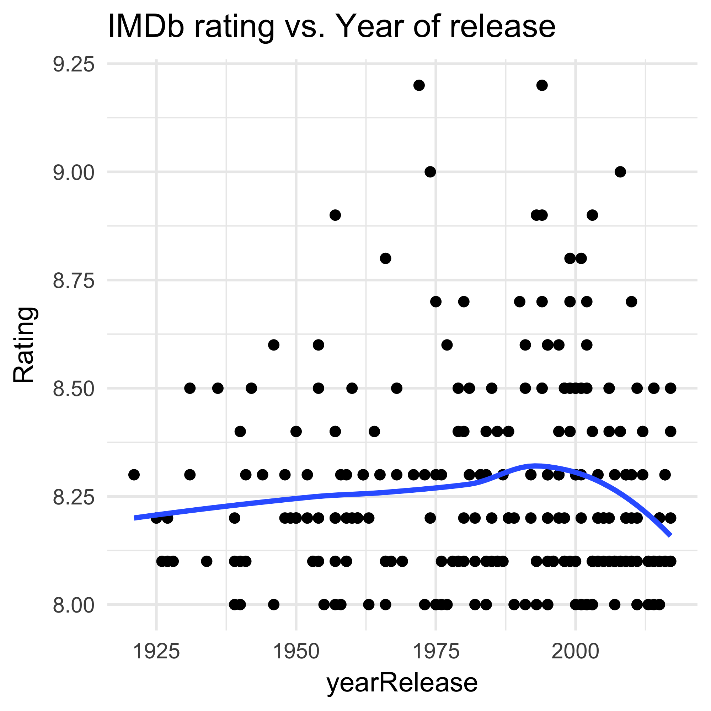

# HW10 Scraping data - IMDb Top 250 Rate Movies
Fariha Khan  
2017-12-07  


```r
## Load packages
suppressPackageStartupMessages(library(tidyverse)) 
suppressPackageStartupMessages(library(knitr))
suppressPackageStartupMessages(library(kableExtra))
suppressPackageStartupMessages(library(stringr))
suppressPackageStartupMessages(library(rvest))
```


#### Get data from web
I wrote my code in an R script to make the markdown cleaner to view.
The rScript for the first part is found [here]()

```r
suppressMessages(source('rScripts/01_scrapeData.r'))
```


#### View data structure

###### View [html_structure](https://github.com/farihakhan/STAT547-hw-khan-fariha/blob/master/hw_10/html_structure.md)


```r
imdb
```

```
## {xml_document}
## <html xmlns:og="http://ogp.me/ns#" xmlns:fb="http://www.facebook.com/2008/fbml">
## [1] <head>\n<meta http-equiv="Content-Type" content="text/html; charset= ...
## [2] <body id="styleguide-v2" class="fixed">\n<script>\n    if (typeof ue ...
```

```r
imdb %>%
      html_nodes(".titleColumn") %>% 
      html_text() %>%
      head()
```

```
## [1] "\n      1.\n      The Shawshank Redemption\n        (1994)\n    "
## [2] "\n      2.\n      The Godfather\n        (1972)\n    "           
## [3] "\n      3.\n      The Godfather: Part II\n        (1974)\n    "  
## [4] "\n      4.\n      The Dark Knight\n        (2008)\n    "         
## [5] "\n      5.\n      12 Angry Men\n        (1957)\n    "            
## [6] "\n      6.\n      Schindler's List\n        (1993)\n    "
```


#### Extract and structure data:

I stored each column variable into character lists. I changed some of the data types of the variables to allow analysis.

The extracted variables are:

 - Title
 
 - Year released
 
 - Rating 
 
 - Number of IMDb user votes
 
 - Brief cast info
 
 - Link associated with each movie


#### Create summary dataframe


```r
imdb_df <- extractFields(imdb)
imdb_df %>% glimpse()
```

```
## Observations: 250
## Variables: 6
## $ Title       <fctr> The Shawshank Redemption, The Godfather, The Godf...
## $ yearRelease <dbl> 1994, 1972, 1974, 2008, 1957, 1993, 1994, 2003, 19...
## $ Rating      <dbl> 9.2, 9.2, 9.0, 9.0, 8.9, 8.9, 8.9, 8.9, 8.8, 8.8, ...
## $ Cast        <fctr> Frank Darabont (dir.), Tim Robbins, Morgan Freema...
## $ Votes       <fctr> 9.2 based on 1,886,752 user ratings, 9.2 based on...
## $ Link        <chr> "http://www.imdb.com/title/tt0111161/?pf_rd_m=A2FG...
```

#### Clean dataset


```r
imdb_kable1
```

<div style="border: 1px solid #ddd;overflow-y: scroll; height:400px; "><table class="table table-striped" style="margin-left: auto; margin-right: auto;">
<caption>imdb Top 250 Rated movies</caption>
 <thead><tr>
<th style="text-align:center;"> Title </th>
   <th style="text-align:center;"> yearRelease </th>
   <th style="text-align:center;"> Rating </th>
   <th style="text-align:center;"> no.Votes </th>
   <th style="text-align:center;"> Director </th>
   <th style="text-align:center;"> Cast1 </th>
   <th style="text-align:center;"> Cast2 </th>
   <th style="text-align:center;"> Link </th>
  </tr></thead>
<tbody>
<tr>
<td style="text-align:center;"> The Shawshank Redemption </td>
   <td style="text-align:center;"> 1994 </td>
   <td style="text-align:center;"> 9.2 </td>
   <td style="text-align:center;"> 1886752 </td>
   <td style="text-align:center;"> Frank Darabont </td>
   <td style="text-align:center;"> Tim Robbins </td>
   <td style="text-align:center;"> Morgan Freeman </td>
   <td style="text-align:center;"> http://www.imdb.com/title/tt0111161/?pf_rd_m=A2FGELUUNOQJNL&amp;pf_rd_p=3376940102&amp;pf_rd_r=0KS7BPVC1GWWQCZA39PV&amp;pf_rd_s=center-1&amp;pf_rd_t=15506&amp;pf_rd_i=top&amp;ref_=chttp_tt_1 </td>
  </tr>
<tr>
<td style="text-align:center;"> The Godfather </td>
   <td style="text-align:center;"> 1972 </td>
   <td style="text-align:center;"> 9.2 </td>
   <td style="text-align:center;"> 1288202 </td>
   <td style="text-align:center;"> Francis Ford Coppola </td>
   <td style="text-align:center;"> Marlon Brando </td>
   <td style="text-align:center;"> Al Pacino </td>
   <td style="text-align:center;"> http://www.imdb.com/title/tt0068646/?pf_rd_m=A2FGELUUNOQJNL&amp;pf_rd_p=3376940102&amp;pf_rd_r=0KS7BPVC1GWWQCZA39PV&amp;pf_rd_s=center-1&amp;pf_rd_t=15506&amp;pf_rd_i=top&amp;ref_=chttp_tt_2 </td>
  </tr>
<tr>
<td style="text-align:center;"> The Godfather: Part II </td>
   <td style="text-align:center;"> 1974 </td>
   <td style="text-align:center;"> 9.0 </td>
   <td style="text-align:center;"> 888683 </td>
   <td style="text-align:center;"> Francis Ford Coppola </td>
   <td style="text-align:center;"> Al Pacino </td>
   <td style="text-align:center;"> Robert De Niro </td>
   <td style="text-align:center;"> http://www.imdb.com/title/tt0071562/?pf_rd_m=A2FGELUUNOQJNL&amp;pf_rd_p=3376940102&amp;pf_rd_r=0KS7BPVC1GWWQCZA39PV&amp;pf_rd_s=center-1&amp;pf_rd_t=15506&amp;pf_rd_i=top&amp;ref_=chttp_tt_3 </td>
  </tr>
<tr>
<td style="text-align:center;"> The Dark Knight </td>
   <td style="text-align:center;"> 2008 </td>
   <td style="text-align:center;"> 9.0 </td>
   <td style="text-align:center;"> 1862539 </td>
   <td style="text-align:center;"> Christopher Nolan </td>
   <td style="text-align:center;"> Christian Bale </td>
   <td style="text-align:center;"> Heath Ledger </td>
   <td style="text-align:center;"> http://www.imdb.com/title/tt0468569/?pf_rd_m=A2FGELUUNOQJNL&amp;pf_rd_p=3376940102&amp;pf_rd_r=0KS7BPVC1GWWQCZA39PV&amp;pf_rd_s=center-1&amp;pf_rd_t=15506&amp;pf_rd_i=top&amp;ref_=chttp_tt_4 </td>
  </tr>
<tr>
<td style="text-align:center;"> 12 Angry Men </td>
   <td style="text-align:center;"> 1957 </td>
   <td style="text-align:center;"> 8.9 </td>
   <td style="text-align:center;"> 517853 </td>
   <td style="text-align:center;"> Sidney Lumet </td>
   <td style="text-align:center;"> Henry Fonda </td>
   <td style="text-align:center;"> Lee J. Cobb </td>
   <td style="text-align:center;"> http://www.imdb.com/title/tt0050083/?pf_rd_m=A2FGELUUNOQJNL&amp;pf_rd_p=3376940102&amp;pf_rd_r=0KS7BPVC1GWWQCZA39PV&amp;pf_rd_s=center-1&amp;pf_rd_t=15506&amp;pf_rd_i=top&amp;ref_=chttp_tt_5 </td>
  </tr>
<tr>
<td style="text-align:center;"> Schindler's List </td>
   <td style="text-align:center;"> 1993 </td>
   <td style="text-align:center;"> 8.9 </td>
   <td style="text-align:center;"> 970125 </td>
   <td style="text-align:center;"> Steven Spielberg </td>
   <td style="text-align:center;"> Liam Neeson </td>
   <td style="text-align:center;"> Ralph Fiennes </td>
   <td style="text-align:center;"> http://www.imdb.com/title/tt0108052/?pf_rd_m=A2FGELUUNOQJNL&amp;pf_rd_p=3376940102&amp;pf_rd_r=0KS7BPVC1GWWQCZA39PV&amp;pf_rd_s=center-1&amp;pf_rd_t=15506&amp;pf_rd_i=top&amp;ref_=chttp_tt_6 </td>
  </tr>
<tr>
<td style="text-align:center;"> Pulp Fiction </td>
   <td style="text-align:center;"> 1994 </td>
   <td style="text-align:center;"> 8.9 </td>
   <td style="text-align:center;"> 1475808 </td>
   <td style="text-align:center;"> Quentin Tarantino </td>
   <td style="text-align:center;"> John Travolta </td>
   <td style="text-align:center;"> Uma Thurman </td>
   <td style="text-align:center;"> http://www.imdb.com/title/tt0110912/?pf_rd_m=A2FGELUUNOQJNL&amp;pf_rd_p=3376940102&amp;pf_rd_r=0KS7BPVC1GWWQCZA39PV&amp;pf_rd_s=center-1&amp;pf_rd_t=15506&amp;pf_rd_i=top&amp;ref_=chttp_tt_7 </td>
  </tr>
<tr>
<td style="text-align:center;"> The Lord of the Rings: The Return of the King </td>
   <td style="text-align:center;"> 2003 </td>
   <td style="text-align:center;"> 8.9 </td>
   <td style="text-align:center;"> 1348158 </td>
   <td style="text-align:center;"> Peter Jackson </td>
   <td style="text-align:center;"> Elijah Wood </td>
   <td style="text-align:center;"> Viggo Mortensen </td>
   <td style="text-align:center;"> http://www.imdb.com/title/tt0167260/?pf_rd_m=A2FGELUUNOQJNL&amp;pf_rd_p=3376940102&amp;pf_rd_r=0KS7BPVC1GWWQCZA39PV&amp;pf_rd_s=center-1&amp;pf_rd_t=15506&amp;pf_rd_i=top&amp;ref_=chttp_tt_8 </td>
  </tr>
<tr>
<td style="text-align:center;"> Il buono, il brutto, il cattivo </td>
   <td style="text-align:center;"> 1966 </td>
   <td style="text-align:center;"> 8.8 </td>
   <td style="text-align:center;"> 558930 </td>
   <td style="text-align:center;"> Sergio Leone </td>
   <td style="text-align:center;"> Clint Eastwood </td>
   <td style="text-align:center;"> Eli Wallach </td>
   <td style="text-align:center;"> http://www.imdb.com/title/tt0060196/?pf_rd_m=A2FGELUUNOQJNL&amp;pf_rd_p=3376940102&amp;pf_rd_r=0KS7BPVC1GWWQCZA39PV&amp;pf_rd_s=center-1&amp;pf_rd_t=15506&amp;pf_rd_i=top&amp;ref_=chttp_tt_9 </td>
  </tr>
<tr>
<td style="text-align:center;"> Fight Club </td>
   <td style="text-align:center;"> 1999 </td>
   <td style="text-align:center;"> 8.8 </td>
   <td style="text-align:center;"> 1512168 </td>
   <td style="text-align:center;"> David Fincher </td>
   <td style="text-align:center;"> Brad Pitt </td>
   <td style="text-align:center;"> Edward Norton </td>
   <td style="text-align:center;"> http://www.imdb.com/title/tt0137523/?pf_rd_m=A2FGELUUNOQJNL&amp;pf_rd_p=3376940102&amp;pf_rd_r=0KS7BPVC1GWWQCZA39PV&amp;pf_rd_s=center-1&amp;pf_rd_t=15506&amp;pf_rd_i=top&amp;ref_=chttp_tt_10 </td>
  </tr>
<tr>
<td style="text-align:center;"> The Lord of the Rings: The Fellowship of the Ring </td>
   <td style="text-align:center;"> 2001 </td>
   <td style="text-align:center;"> 8.8 </td>
   <td style="text-align:center;"> 1368320 </td>
   <td style="text-align:center;"> Peter Jackson </td>
   <td style="text-align:center;"> Elijah Wood </td>
   <td style="text-align:center;"> Ian McKellen </td>
   <td style="text-align:center;"> http://www.imdb.com/title/tt0120737/?pf_rd_m=A2FGELUUNOQJNL&amp;pf_rd_p=3376940102&amp;pf_rd_r=0KS7BPVC1GWWQCZA39PV&amp;pf_rd_s=center-1&amp;pf_rd_t=15506&amp;pf_rd_i=top&amp;ref_=chttp_tt_11 </td>
  </tr>
<tr>
<td style="text-align:center;"> Forrest Gump </td>
   <td style="text-align:center;"> 1994 </td>
   <td style="text-align:center;"> 8.7 </td>
   <td style="text-align:center;"> 1423935 </td>
   <td style="text-align:center;"> Robert Zemeckis </td>
   <td style="text-align:center;"> Tom Hanks </td>
   <td style="text-align:center;"> Robin Wright </td>
   <td style="text-align:center;"> http://www.imdb.com/title/tt0109830/?pf_rd_m=A2FGELUUNOQJNL&amp;pf_rd_p=3376940102&amp;pf_rd_r=0KS7BPVC1GWWQCZA39PV&amp;pf_rd_s=center-1&amp;pf_rd_t=15506&amp;pf_rd_i=top&amp;ref_=chttp_tt_12 </td>
  </tr>
<tr>
<td style="text-align:center;"> Star Wars: Episode V - The Empire Strikes Back </td>
   <td style="text-align:center;"> 1980 </td>
   <td style="text-align:center;"> 8.7 </td>
   <td style="text-align:center;"> 942430 </td>
   <td style="text-align:center;"> Irvin Kershner </td>
   <td style="text-align:center;"> Mark Hamill </td>
   <td style="text-align:center;"> Harrison Ford </td>
   <td style="text-align:center;"> http://www.imdb.com/title/tt0080684/?pf_rd_m=A2FGELUUNOQJNL&amp;pf_rd_p=3376940102&amp;pf_rd_r=0KS7BPVC1GWWQCZA39PV&amp;pf_rd_s=center-1&amp;pf_rd_t=15506&amp;pf_rd_i=top&amp;ref_=chttp_tt_13 </td>
  </tr>
<tr>
<td style="text-align:center;"> Inception </td>
   <td style="text-align:center;"> 2010 </td>
   <td style="text-align:center;"> 8.7 </td>
   <td style="text-align:center;"> 1651386 </td>
   <td style="text-align:center;"> Christopher Nolan </td>
   <td style="text-align:center;"> Leonardo DiCaprio </td>
   <td style="text-align:center;"> Joseph Gordon-Levitt </td>
   <td style="text-align:center;"> http://www.imdb.com/title/tt1375666/?pf_rd_m=A2FGELUUNOQJNL&amp;pf_rd_p=3376940102&amp;pf_rd_r=0KS7BPVC1GWWQCZA39PV&amp;pf_rd_s=center-1&amp;pf_rd_t=15506&amp;pf_rd_i=top&amp;ref_=chttp_tt_14 </td>
  </tr>
<tr>
<td style="text-align:center;"> The Lord of the Rings: The Two Towers </td>
   <td style="text-align:center;"> 2002 </td>
   <td style="text-align:center;"> 8.7 </td>
   <td style="text-align:center;"> 1220246 </td>
   <td style="text-align:center;"> Peter Jackson </td>
   <td style="text-align:center;"> Elijah Wood </td>
   <td style="text-align:center;"> Ian McKellen </td>
   <td style="text-align:center;"> http://www.imdb.com/title/tt0167261/?pf_rd_m=A2FGELUUNOQJNL&amp;pf_rd_p=3376940102&amp;pf_rd_r=0KS7BPVC1GWWQCZA39PV&amp;pf_rd_s=center-1&amp;pf_rd_t=15506&amp;pf_rd_i=top&amp;ref_=chttp_tt_15 </td>
  </tr>
<tr>
<td style="text-align:center;"> One Flew Over the Cuckoo's Nest </td>
   <td style="text-align:center;"> 1975 </td>
   <td style="text-align:center;"> 8.7 </td>
   <td style="text-align:center;"> 753196 </td>
   <td style="text-align:center;"> Milos Forman </td>
   <td style="text-align:center;"> Jack Nicholson </td>
   <td style="text-align:center;"> Louise Fletcher </td>
   <td style="text-align:center;"> http://www.imdb.com/title/tt0073486/?pf_rd_m=A2FGELUUNOQJNL&amp;pf_rd_p=3376940102&amp;pf_rd_r=0KS7BPVC1GWWQCZA39PV&amp;pf_rd_s=center-1&amp;pf_rd_t=15506&amp;pf_rd_i=top&amp;ref_=chttp_tt_16 </td>
  </tr>
<tr>
<td style="text-align:center;"> Goodfellas </td>
   <td style="text-align:center;"> 1990 </td>
   <td style="text-align:center;"> 8.7 </td>
   <td style="text-align:center;"> 812981 </td>
   <td style="text-align:center;"> Martin Scorsese </td>
   <td style="text-align:center;"> Robert De Niro </td>
   <td style="text-align:center;"> Ray Liotta </td>
   <td style="text-align:center;"> http://www.imdb.com/title/tt0099685/?pf_rd_m=A2FGELUUNOQJNL&amp;pf_rd_p=3376940102&amp;pf_rd_r=0KS7BPVC1GWWQCZA39PV&amp;pf_rd_s=center-1&amp;pf_rd_t=15506&amp;pf_rd_i=top&amp;ref_=chttp_tt_17 </td>
  </tr>
<tr>
<td style="text-align:center;"> The Matrix </td>
   <td style="text-align:center;"> 1999 </td>
   <td style="text-align:center;"> 8.7 </td>
   <td style="text-align:center;"> 1357233 </td>
   <td style="text-align:center;"> Lana Wachowski </td>
   <td style="text-align:center;"> Keanu Reeves </td>
   <td style="text-align:center;"> Laurence Fishburne </td>
   <td style="text-align:center;"> http://www.imdb.com/title/tt0133093/?pf_rd_m=A2FGELUUNOQJNL&amp;pf_rd_p=3376940102&amp;pf_rd_r=0KS7BPVC1GWWQCZA39PV&amp;pf_rd_s=center-1&amp;pf_rd_t=15506&amp;pf_rd_i=top&amp;ref_=chttp_tt_18 </td>
  </tr>
<tr>
<td style="text-align:center;"> Shichinin no samurai </td>
   <td style="text-align:center;"> 1954 </td>
   <td style="text-align:center;"> 8.6 </td>
   <td style="text-align:center;"> 254223 </td>
   <td style="text-align:center;"> Akira Kurosawa </td>
   <td style="text-align:center;"> Toshirô Mifune </td>
   <td style="text-align:center;"> Takashi Shimura </td>
   <td style="text-align:center;"> http://www.imdb.com/title/tt0047478/?pf_rd_m=A2FGELUUNOQJNL&amp;pf_rd_p=3376940102&amp;pf_rd_r=0KS7BPVC1GWWQCZA39PV&amp;pf_rd_s=center-1&amp;pf_rd_t=15506&amp;pf_rd_i=top&amp;ref_=chttp_tt_19 </td>
  </tr>
<tr>
<td style="text-align:center;"> Star Wars </td>
   <td style="text-align:center;"> 1977 </td>
   <td style="text-align:center;"> 8.6 </td>
   <td style="text-align:center;"> 1014678 </td>
   <td style="text-align:center;"> George Lucas </td>
   <td style="text-align:center;"> Mark Hamill </td>
   <td style="text-align:center;"> Harrison Ford </td>
   <td style="text-align:center;"> http://www.imdb.com/title/tt0076759/?pf_rd_m=A2FGELUUNOQJNL&amp;pf_rd_p=3376940102&amp;pf_rd_r=0KS7BPVC1GWWQCZA39PV&amp;pf_rd_s=center-1&amp;pf_rd_t=15506&amp;pf_rd_i=top&amp;ref_=chttp_tt_20 </td>
  </tr>
<tr>
<td style="text-align:center;"> Cidade de Deus </td>
   <td style="text-align:center;"> 2002 </td>
   <td style="text-align:center;"> 8.6 </td>
   <td style="text-align:center;"> 587230 </td>
   <td style="text-align:center;"> Fernando Meirelles </td>
   <td style="text-align:center;"> Alexandre Rodrigues </td>
   <td style="text-align:center;"> Leandro Firmino </td>
   <td style="text-align:center;"> http://www.imdb.com/title/tt0317248/?pf_rd_m=A2FGELUUNOQJNL&amp;pf_rd_p=3376940102&amp;pf_rd_r=0KS7BPVC1GWWQCZA39PV&amp;pf_rd_s=center-1&amp;pf_rd_t=15506&amp;pf_rd_i=top&amp;ref_=chttp_tt_21 </td>
  </tr>
<tr>
<td style="text-align:center;"> Se7en </td>
   <td style="text-align:center;"> 1995 </td>
   <td style="text-align:center;"> 8.6 </td>
   <td style="text-align:center;"> 1150599 </td>
   <td style="text-align:center;"> David Fincher </td>
   <td style="text-align:center;"> Morgan Freeman </td>
   <td style="text-align:center;"> Brad Pitt </td>
   <td style="text-align:center;"> http://www.imdb.com/title/tt0114369/?pf_rd_m=A2FGELUUNOQJNL&amp;pf_rd_p=3376940102&amp;pf_rd_r=0KS7BPVC1GWWQCZA39PV&amp;pf_rd_s=center-1&amp;pf_rd_t=15506&amp;pf_rd_i=top&amp;ref_=chttp_tt_22 </td>
  </tr>
<tr>
<td style="text-align:center;"> The Silence of the Lambs </td>
   <td style="text-align:center;"> 1991 </td>
   <td style="text-align:center;"> 8.6 </td>
   <td style="text-align:center;"> 1004754 </td>
   <td style="text-align:center;"> Jonathan Demme </td>
   <td style="text-align:center;"> Jodie Foster </td>
   <td style="text-align:center;"> Anthony Hopkins </td>
   <td style="text-align:center;"> http://www.imdb.com/title/tt0102926/?pf_rd_m=A2FGELUUNOQJNL&amp;pf_rd_p=3376940102&amp;pf_rd_r=0KS7BPVC1GWWQCZA39PV&amp;pf_rd_s=center-1&amp;pf_rd_t=15506&amp;pf_rd_i=top&amp;ref_=chttp_tt_23 </td>
  </tr>
<tr>
<td style="text-align:center;"> It's a Wonderful Life </td>
   <td style="text-align:center;"> 1946 </td>
   <td style="text-align:center;"> 8.6 </td>
   <td style="text-align:center;"> 312275 </td>
   <td style="text-align:center;"> Frank Capra </td>
   <td style="text-align:center;"> James Stewart </td>
   <td style="text-align:center;"> Donna Reed </td>
   <td style="text-align:center;"> http://www.imdb.com/title/tt0038650/?pf_rd_m=A2FGELUUNOQJNL&amp;pf_rd_p=3376940102&amp;pf_rd_r=0KS7BPVC1GWWQCZA39PV&amp;pf_rd_s=center-1&amp;pf_rd_t=15506&amp;pf_rd_i=top&amp;ref_=chttp_tt_24 </td>
  </tr>
<tr>
<td style="text-align:center;"> La vita è bella </td>
   <td style="text-align:center;"> 1997 </td>
   <td style="text-align:center;"> 8.6 </td>
   <td style="text-align:center;"> 484260 </td>
   <td style="text-align:center;"> Roberto Benigni </td>
   <td style="text-align:center;"> Roberto Benigni </td>
   <td style="text-align:center;"> Nicoletta Braschi </td>
   <td style="text-align:center;"> http://www.imdb.com/title/tt0118799/?pf_rd_m=A2FGELUUNOQJNL&amp;pf_rd_p=3376940102&amp;pf_rd_r=0KS7BPVC1GWWQCZA39PV&amp;pf_rd_s=center-1&amp;pf_rd_t=15506&amp;pf_rd_i=top&amp;ref_=chttp_tt_25 </td>
  </tr>
<tr>
<td style="text-align:center;"> The Usual Suspects </td>
   <td style="text-align:center;"> 1995 </td>
   <td style="text-align:center;"> 8.6 </td>
   <td style="text-align:center;"> 824720 </td>
   <td style="text-align:center;"> Bryan Singer </td>
   <td style="text-align:center;"> Kevin Spacey </td>
   <td style="text-align:center;"> Gabriel Byrne </td>
   <td style="text-align:center;"> http://www.imdb.com/title/tt0114814/?pf_rd_m=A2FGELUUNOQJNL&amp;pf_rd_p=3376940102&amp;pf_rd_r=0KS7BPVC1GWWQCZA39PV&amp;pf_rd_s=center-1&amp;pf_rd_t=15506&amp;pf_rd_i=top&amp;ref_=chttp_tt_26 </td>
  </tr>
<tr>
<td style="text-align:center;"> Léon </td>
   <td style="text-align:center;"> 1994 </td>
   <td style="text-align:center;"> 8.5 </td>
   <td style="text-align:center;"> 818933 </td>
   <td style="text-align:center;"> Luc Besson </td>
   <td style="text-align:center;"> Jean Reno </td>
   <td style="text-align:center;"> Gary Oldman </td>
   <td style="text-align:center;"> http://www.imdb.com/title/tt0110413/?pf_rd_m=A2FGELUUNOQJNL&amp;pf_rd_p=3376940102&amp;pf_rd_r=0KS7BPVC1GWWQCZA39PV&amp;pf_rd_s=center-1&amp;pf_rd_t=15506&amp;pf_rd_i=top&amp;ref_=chttp_tt_27 </td>
  </tr>
<tr>
<td style="text-align:center;"> Saving Private Ryan </td>
   <td style="text-align:center;"> 1998 </td>
   <td style="text-align:center;"> 8.5 </td>
   <td style="text-align:center;"> 992805 </td>
   <td style="text-align:center;"> Steven Spielberg </td>
   <td style="text-align:center;"> Tom Hanks </td>
   <td style="text-align:center;"> Matt Damon </td>
   <td style="text-align:center;"> http://www.imdb.com/title/tt0120815/?pf_rd_m=A2FGELUUNOQJNL&amp;pf_rd_p=3376940102&amp;pf_rd_r=0KS7BPVC1GWWQCZA39PV&amp;pf_rd_s=center-1&amp;pf_rd_t=15506&amp;pf_rd_i=top&amp;ref_=chttp_tt_28 </td>
  </tr>
<tr>
<td style="text-align:center;"> Sen to Chihiro no kamikakushi </td>
   <td style="text-align:center;"> 2001 </td>
   <td style="text-align:center;"> 8.5 </td>
   <td style="text-align:center;"> 484937 </td>
   <td style="text-align:center;"> Hayao Miyazaki </td>
   <td style="text-align:center;"> Daveigh Chase </td>
   <td style="text-align:center;"> Suzanne Pleshette </td>
   <td style="text-align:center;"> http://www.imdb.com/title/tt0245429/?pf_rd_m=A2FGELUUNOQJNL&amp;pf_rd_p=3376940102&amp;pf_rd_r=0KS7BPVC1GWWQCZA39PV&amp;pf_rd_s=center-1&amp;pf_rd_t=15506&amp;pf_rd_i=top&amp;ref_=chttp_tt_29 </td>
  </tr>
<tr>
<td style="text-align:center;"> Coco </td>
   <td style="text-align:center;"> 2017 </td>
   <td style="text-align:center;"> 8.5 </td>
   <td style="text-align:center;"> 35310 </td>
   <td style="text-align:center;"> Lee Unkrich </td>
   <td style="text-align:center;"> Anthony Gonzalez </td>
   <td style="text-align:center;"> Gael García Bernal </td>
   <td style="text-align:center;"> http://www.imdb.com/title/tt2380307/?pf_rd_m=A2FGELUUNOQJNL&amp;pf_rd_p=3376940102&amp;pf_rd_r=0KS7BPVC1GWWQCZA39PV&amp;pf_rd_s=center-1&amp;pf_rd_t=15506&amp;pf_rd_i=top&amp;ref_=chttp_tt_30 </td>
  </tr>
<tr>
<td style="text-align:center;"> American History X </td>
   <td style="text-align:center;"> 1998 </td>
   <td style="text-align:center;"> 8.5 </td>
   <td style="text-align:center;"> 868190 </td>
   <td style="text-align:center;"> Tony Kaye </td>
   <td style="text-align:center;"> Edward Norton </td>
   <td style="text-align:center;"> Edward Furlong </td>
   <td style="text-align:center;"> http://www.imdb.com/title/tt0120586/?pf_rd_m=A2FGELUUNOQJNL&amp;pf_rd_p=3376940102&amp;pf_rd_r=0KS7BPVC1GWWQCZA39PV&amp;pf_rd_s=center-1&amp;pf_rd_t=15506&amp;pf_rd_i=top&amp;ref_=chttp_tt_31 </td>
  </tr>
<tr>
<td style="text-align:center;"> Once Upon a Time in the West </td>
   <td style="text-align:center;"> 1968 </td>
   <td style="text-align:center;"> 8.5 </td>
   <td style="text-align:center;"> 242553 </td>
   <td style="text-align:center;"> Sergio Leone </td>
   <td style="text-align:center;"> Henry Fonda </td>
   <td style="text-align:center;"> Charles Bronson </td>
   <td style="text-align:center;"> http://www.imdb.com/title/tt0064116/?pf_rd_m=A2FGELUUNOQJNL&amp;pf_rd_p=3376940102&amp;pf_rd_r=0KS7BPVC1GWWQCZA39PV&amp;pf_rd_s=center-1&amp;pf_rd_t=15506&amp;pf_rd_i=top&amp;ref_=chttp_tt_32 </td>
  </tr>
<tr>
<td style="text-align:center;"> Interstellar </td>
   <td style="text-align:center;"> 2014 </td>
   <td style="text-align:center;"> 8.5 </td>
   <td style="text-align:center;"> 1118093 </td>
   <td style="text-align:center;"> Christopher Nolan </td>
   <td style="text-align:center;"> Matthew McConaughey </td>
   <td style="text-align:center;"> Anne Hathaway </td>
   <td style="text-align:center;"> http://www.imdb.com/title/tt0816692/?pf_rd_m=A2FGELUUNOQJNL&amp;pf_rd_p=3376940102&amp;pf_rd_r=0KS7BPVC1GWWQCZA39PV&amp;pf_rd_s=center-1&amp;pf_rd_t=15506&amp;pf_rd_i=top&amp;ref_=chttp_tt_33 </td>
  </tr>
<tr>
<td style="text-align:center;"> The Green Mile </td>
   <td style="text-align:center;"> 1999 </td>
   <td style="text-align:center;"> 8.5 </td>
   <td style="text-align:center;"> 893685 </td>
   <td style="text-align:center;"> Frank Darabont </td>
   <td style="text-align:center;"> Tom Hanks </td>
   <td style="text-align:center;"> Michael Clarke Duncan </td>
   <td style="text-align:center;"> http://www.imdb.com/title/tt0120689/?pf_rd_m=A2FGELUUNOQJNL&amp;pf_rd_p=3376940102&amp;pf_rd_r=0KS7BPVC1GWWQCZA39PV&amp;pf_rd_s=center-1&amp;pf_rd_t=15506&amp;pf_rd_i=top&amp;ref_=chttp_tt_34 </td>
  </tr>
<tr>
<td style="text-align:center;"> Psycho </td>
   <td style="text-align:center;"> 1960 </td>
   <td style="text-align:center;"> 8.5 </td>
   <td style="text-align:center;"> 476191 </td>
   <td style="text-align:center;"> Alfred Hitchcock </td>
   <td style="text-align:center;"> Anthony Perkins </td>
   <td style="text-align:center;"> Janet Leigh </td>
   <td style="text-align:center;"> http://www.imdb.com/title/tt0054215/?pf_rd_m=A2FGELUUNOQJNL&amp;pf_rd_p=3376940102&amp;pf_rd_r=0KS7BPVC1GWWQCZA39PV&amp;pf_rd_s=center-1&amp;pf_rd_t=15506&amp;pf_rd_i=top&amp;ref_=chttp_tt_35 </td>
  </tr>
<tr>
<td style="text-align:center;"> City Lights </td>
   <td style="text-align:center;"> 1931 </td>
   <td style="text-align:center;"> 8.5 </td>
   <td style="text-align:center;"> 125564 </td>
   <td style="text-align:center;"> Charles Chaplin </td>
   <td style="text-align:center;"> Charles Chaplin </td>
   <td style="text-align:center;"> Virginia Cherrill </td>
   <td style="text-align:center;"> http://www.imdb.com/title/tt0021749/?pf_rd_m=A2FGELUUNOQJNL&amp;pf_rd_p=3376940102&amp;pf_rd_r=0KS7BPVC1GWWQCZA39PV&amp;pf_rd_s=center-1&amp;pf_rd_t=15506&amp;pf_rd_i=top&amp;ref_=chttp_tt_36 </td>
  </tr>
<tr>
<td style="text-align:center;"> Casablanca </td>
   <td style="text-align:center;"> 1942 </td>
   <td style="text-align:center;"> 8.5 </td>
   <td style="text-align:center;"> 429624 </td>
   <td style="text-align:center;"> Michael Curtiz </td>
   <td style="text-align:center;"> Humphrey Bogart </td>
   <td style="text-align:center;"> Ingrid Bergman </td>
   <td style="text-align:center;"> http://www.imdb.com/title/tt0034583/?pf_rd_m=A2FGELUUNOQJNL&amp;pf_rd_p=3376940102&amp;pf_rd_r=0KS7BPVC1GWWQCZA39PV&amp;pf_rd_s=center-1&amp;pf_rd_t=15506&amp;pf_rd_i=top&amp;ref_=chttp_tt_37 </td>
  </tr>
<tr>
<td style="text-align:center;"> The Intouchables </td>
   <td style="text-align:center;"> 2011 </td>
   <td style="text-align:center;"> 8.5 </td>
   <td style="text-align:center;"> 590033 </td>
   <td style="text-align:center;"> Olivier Nakache </td>
   <td style="text-align:center;"> François Cluzet </td>
   <td style="text-align:center;"> Omar Sy </td>
   <td style="text-align:center;"> http://www.imdb.com/title/tt1675434/?pf_rd_m=A2FGELUUNOQJNL&amp;pf_rd_p=3376940102&amp;pf_rd_r=0KS7BPVC1GWWQCZA39PV&amp;pf_rd_s=center-1&amp;pf_rd_t=15506&amp;pf_rd_i=top&amp;ref_=chttp_tt_38 </td>
  </tr>
<tr>
<td style="text-align:center;"> Modern Times </td>
   <td style="text-align:center;"> 1936 </td>
   <td style="text-align:center;"> 8.5 </td>
   <td style="text-align:center;"> 164944 </td>
   <td style="text-align:center;"> Charles Chaplin </td>
   <td style="text-align:center;"> Charles Chaplin </td>
   <td style="text-align:center;"> Paulette Goddard </td>
   <td style="text-align:center;"> http://www.imdb.com/title/tt0027977/?pf_rd_m=A2FGELUUNOQJNL&amp;pf_rd_p=3376940102&amp;pf_rd_r=0KS7BPVC1GWWQCZA39PV&amp;pf_rd_s=center-1&amp;pf_rd_t=15506&amp;pf_rd_i=top&amp;ref_=chttp_tt_39 </td>
  </tr>
<tr>
<td style="text-align:center;"> The Pianist </td>
   <td style="text-align:center;"> 2002 </td>
   <td style="text-align:center;"> 8.5 </td>
   <td style="text-align:center;"> 567077 </td>
   <td style="text-align:center;"> Roman Polanski </td>
   <td style="text-align:center;"> Adrien Brody </td>
   <td style="text-align:center;"> Thomas Kretschmann </td>
   <td style="text-align:center;"> http://www.imdb.com/title/tt0253474/?pf_rd_m=A2FGELUUNOQJNL&amp;pf_rd_p=3376940102&amp;pf_rd_r=0KS7BPVC1GWWQCZA39PV&amp;pf_rd_s=center-1&amp;pf_rd_t=15506&amp;pf_rd_i=top&amp;ref_=chttp_tt_40 </td>
  </tr>
<tr>
<td style="text-align:center;"> Raiders of the Lost Ark </td>
   <td style="text-align:center;"> 1981 </td>
   <td style="text-align:center;"> 8.5 </td>
   <td style="text-align:center;"> 732274 </td>
   <td style="text-align:center;"> Steven Spielberg </td>
   <td style="text-align:center;"> Harrison Ford </td>
   <td style="text-align:center;"> Karen Allen </td>
   <td style="text-align:center;"> http://www.imdb.com/title/tt0082971/?pf_rd_m=A2FGELUUNOQJNL&amp;pf_rd_p=3376940102&amp;pf_rd_r=0KS7BPVC1GWWQCZA39PV&amp;pf_rd_s=center-1&amp;pf_rd_t=15506&amp;pf_rd_i=top&amp;ref_=chttp_tt_41 </td>
  </tr>
<tr>
<td style="text-align:center;"> The Departed </td>
   <td style="text-align:center;"> 2006 </td>
   <td style="text-align:center;"> 8.5 </td>
   <td style="text-align:center;"> 974424 </td>
   <td style="text-align:center;"> Martin Scorsese </td>
   <td style="text-align:center;"> Leonardo DiCaprio </td>
   <td style="text-align:center;"> Matt Damon </td>
   <td style="text-align:center;"> http://www.imdb.com/title/tt0407887/?pf_rd_m=A2FGELUUNOQJNL&amp;pf_rd_p=3376940102&amp;pf_rd_r=0KS7BPVC1GWWQCZA39PV&amp;pf_rd_s=center-1&amp;pf_rd_t=15506&amp;pf_rd_i=top&amp;ref_=chttp_tt_42 </td>
  </tr>
<tr>
<td style="text-align:center;"> Rear Window </td>
   <td style="text-align:center;"> 1954 </td>
   <td style="text-align:center;"> 8.5 </td>
   <td style="text-align:center;"> 355108 </td>
   <td style="text-align:center;"> Alfred Hitchcock </td>
   <td style="text-align:center;"> James Stewart </td>
   <td style="text-align:center;"> Grace Kelly </td>
   <td style="text-align:center;"> http://www.imdb.com/title/tt0047396/?pf_rd_m=A2FGELUUNOQJNL&amp;pf_rd_p=3376940102&amp;pf_rd_r=0KS7BPVC1GWWQCZA39PV&amp;pf_rd_s=center-1&amp;pf_rd_t=15506&amp;pf_rd_i=top&amp;ref_=chttp_tt_43 </td>
  </tr>
<tr>
<td style="text-align:center;"> Terminator 2: Judgment Day </td>
   <td style="text-align:center;"> 1991 </td>
   <td style="text-align:center;"> 8.5 </td>
   <td style="text-align:center;"> 823586 </td>
   <td style="text-align:center;"> James Cameron </td>
   <td style="text-align:center;"> Arnold Schwarzenegger </td>
   <td style="text-align:center;"> Linda Hamilton </td>
   <td style="text-align:center;"> http://www.imdb.com/title/tt0103064/?pf_rd_m=A2FGELUUNOQJNL&amp;pf_rd_p=3376940102&amp;pf_rd_r=0KS7BPVC1GWWQCZA39PV&amp;pf_rd_s=center-1&amp;pf_rd_t=15506&amp;pf_rd_i=top&amp;ref_=chttp_tt_44 </td>
  </tr>
<tr>
<td style="text-align:center;"> Back to the Future </td>
   <td style="text-align:center;"> 1985 </td>
   <td style="text-align:center;"> 8.5 </td>
   <td style="text-align:center;"> 828685 </td>
   <td style="text-align:center;"> Robert Zemeckis </td>
   <td style="text-align:center;"> Michael J. Fox </td>
   <td style="text-align:center;"> Christopher Lloyd </td>
   <td style="text-align:center;"> http://www.imdb.com/title/tt0088763/?pf_rd_m=A2FGELUUNOQJNL&amp;pf_rd_p=3376940102&amp;pf_rd_r=0KS7BPVC1GWWQCZA39PV&amp;pf_rd_s=center-1&amp;pf_rd_t=15506&amp;pf_rd_i=top&amp;ref_=chttp_tt_45 </td>
  </tr>
<tr>
<td style="text-align:center;"> Whiplash </td>
   <td style="text-align:center;"> 2014 </td>
   <td style="text-align:center;"> 8.5 </td>
   <td style="text-align:center;"> 516181 </td>
   <td style="text-align:center;"> Damien Chazelle </td>
   <td style="text-align:center;"> Miles Teller </td>
   <td style="text-align:center;"> J.K. Simmons </td>
   <td style="text-align:center;"> http://www.imdb.com/title/tt2582802/?pf_rd_m=A2FGELUUNOQJNL&amp;pf_rd_p=3376940102&amp;pf_rd_r=0KS7BPVC1GWWQCZA39PV&amp;pf_rd_s=center-1&amp;pf_rd_t=15506&amp;pf_rd_i=top&amp;ref_=chttp_tt_46 </td>
  </tr>
<tr>
<td style="text-align:center;"> Gladiator </td>
   <td style="text-align:center;"> 2000 </td>
   <td style="text-align:center;"> 8.5 </td>
   <td style="text-align:center;"> 1094529 </td>
   <td style="text-align:center;"> Ridley Scott </td>
   <td style="text-align:center;"> Russell Crowe </td>
   <td style="text-align:center;"> Joaquin Phoenix </td>
   <td style="text-align:center;"> http://www.imdb.com/title/tt0172495/?pf_rd_m=A2FGELUUNOQJNL&amp;pf_rd_p=3376940102&amp;pf_rd_r=0KS7BPVC1GWWQCZA39PV&amp;pf_rd_s=center-1&amp;pf_rd_t=15506&amp;pf_rd_i=top&amp;ref_=chttp_tt_47 </td>
  </tr>
<tr>
<td style="text-align:center;"> The Lion King </td>
   <td style="text-align:center;"> 1994 </td>
   <td style="text-align:center;"> 8.5 </td>
   <td style="text-align:center;"> 734651 </td>
   <td style="text-align:center;"> Roger Allers </td>
   <td style="text-align:center;"> Matthew Broderick </td>
   <td style="text-align:center;"> Jeremy Irons </td>
   <td style="text-align:center;"> http://www.imdb.com/title/tt0110357/?pf_rd_m=A2FGELUUNOQJNL&amp;pf_rd_p=3376940102&amp;pf_rd_r=0KS7BPVC1GWWQCZA39PV&amp;pf_rd_s=center-1&amp;pf_rd_t=15506&amp;pf_rd_i=top&amp;ref_=chttp_tt_48 </td>
  </tr>
<tr>
<td style="text-align:center;"> The Prestige </td>
   <td style="text-align:center;"> 2006 </td>
   <td style="text-align:center;"> 8.5 </td>
   <td style="text-align:center;"> 957965 </td>
   <td style="text-align:center;"> Christopher Nolan </td>
   <td style="text-align:center;"> Christian Bale </td>
   <td style="text-align:center;"> Hugh Jackman </td>
   <td style="text-align:center;"> http://www.imdb.com/title/tt0482571/?pf_rd_m=A2FGELUUNOQJNL&amp;pf_rd_p=3376940102&amp;pf_rd_r=0KS7BPVC1GWWQCZA39PV&amp;pf_rd_s=center-1&amp;pf_rd_t=15506&amp;pf_rd_i=top&amp;ref_=chttp_tt_49 </td>
  </tr>
<tr>
<td style="text-align:center;"> Memento </td>
   <td style="text-align:center;"> 2000 </td>
   <td style="text-align:center;"> 8.5 </td>
   <td style="text-align:center;"> 941372 </td>
   <td style="text-align:center;"> Christopher Nolan </td>
   <td style="text-align:center;"> Guy Pearce </td>
   <td style="text-align:center;"> Carrie-Anne Moss </td>
   <td style="text-align:center;"> http://www.imdb.com/title/tt0209144/?pf_rd_m=A2FGELUUNOQJNL&amp;pf_rd_p=3376940102&amp;pf_rd_r=0KS7BPVC1GWWQCZA39PV&amp;pf_rd_s=center-1&amp;pf_rd_t=15506&amp;pf_rd_i=top&amp;ref_=chttp_tt_50 </td>
  </tr>
<tr>
<td style="text-align:center;"> Apocalypse Now </td>
   <td style="text-align:center;"> 1979 </td>
   <td style="text-align:center;"> 8.5 </td>
   <td style="text-align:center;"> 497209 </td>
   <td style="text-align:center;"> Francis Ford Coppola </td>
   <td style="text-align:center;"> Martin Sheen </td>
   <td style="text-align:center;"> Marlon Brando </td>
   <td style="text-align:center;"> http://www.imdb.com/title/tt0078788/?pf_rd_m=A2FGELUUNOQJNL&amp;pf_rd_p=3376940102&amp;pf_rd_r=0KS7BPVC1GWWQCZA39PV&amp;pf_rd_s=center-1&amp;pf_rd_t=15506&amp;pf_rd_i=top&amp;ref_=chttp_tt_51 </td>
  </tr>
<tr>
<td style="text-align:center;"> Alien </td>
   <td style="text-align:center;"> 1979 </td>
   <td style="text-align:center;"> 8.4 </td>
   <td style="text-align:center;"> 642528 </td>
   <td style="text-align:center;"> Ridley Scott </td>
   <td style="text-align:center;"> Sigourney Weaver </td>
   <td style="text-align:center;"> Tom Skerritt </td>
   <td style="text-align:center;"> http://www.imdb.com/title/tt0078748/?pf_rd_m=A2FGELUUNOQJNL&amp;pf_rd_p=3376940102&amp;pf_rd_r=0KS7BPVC1GWWQCZA39PV&amp;pf_rd_s=center-1&amp;pf_rd_t=15506&amp;pf_rd_i=top&amp;ref_=chttp_tt_52 </td>
  </tr>
<tr>
<td style="text-align:center;"> The Great Dictator </td>
   <td style="text-align:center;"> 1940 </td>
   <td style="text-align:center;"> 8.4 </td>
   <td style="text-align:center;"> 157630 </td>
   <td style="text-align:center;"> Charles Chaplin </td>
   <td style="text-align:center;"> Charles Chaplin </td>
   <td style="text-align:center;"> Paulette Goddard </td>
   <td style="text-align:center;"> http://www.imdb.com/title/tt0032553/?pf_rd_m=A2FGELUUNOQJNL&amp;pf_rd_p=3376940102&amp;pf_rd_r=0KS7BPVC1GWWQCZA39PV&amp;pf_rd_s=center-1&amp;pf_rd_t=15506&amp;pf_rd_i=top&amp;ref_=chttp_tt_53 </td>
  </tr>
<tr>
<td style="text-align:center;"> Sunset Blvd. </td>
   <td style="text-align:center;"> 1950 </td>
   <td style="text-align:center;"> 8.4 </td>
   <td style="text-align:center;"> 157317 </td>
   <td style="text-align:center;"> Billy Wilder </td>
   <td style="text-align:center;"> William Holden </td>
   <td style="text-align:center;"> Gloria Swanson </td>
   <td style="text-align:center;"> http://www.imdb.com/title/tt0043014/?pf_rd_m=A2FGELUUNOQJNL&amp;pf_rd_p=3376940102&amp;pf_rd_r=0KS7BPVC1GWWQCZA39PV&amp;pf_rd_s=center-1&amp;pf_rd_t=15506&amp;pf_rd_i=top&amp;ref_=chttp_tt_54 </td>
  </tr>
<tr>
<td style="text-align:center;"> Nuovo Cinema Paradiso </td>
   <td style="text-align:center;"> 1988 </td>
   <td style="text-align:center;"> 8.4 </td>
   <td style="text-align:center;"> 174553 </td>
   <td style="text-align:center;"> Giuseppe Tornatore </td>
   <td style="text-align:center;"> Philippe Noiret </td>
   <td style="text-align:center;"> Enzo Cannavale </td>
   <td style="text-align:center;"> http://www.imdb.com/title/tt0095765/?pf_rd_m=A2FGELUUNOQJNL&amp;pf_rd_p=3376940102&amp;pf_rd_r=0KS7BPVC1GWWQCZA39PV&amp;pf_rd_s=center-1&amp;pf_rd_t=15506&amp;pf_rd_i=top&amp;ref_=chttp_tt_55 </td>
  </tr>
<tr>
<td style="text-align:center;"> Dr. Strangelove or: How I Learned to Stop Worrying and Love the Bomb </td>
   <td style="text-align:center;"> 1964 </td>
   <td style="text-align:center;"> 8.4 </td>
   <td style="text-align:center;"> 378773 </td>
   <td style="text-align:center;"> Stanley Kubrick </td>
   <td style="text-align:center;"> Peter Sellers </td>
   <td style="text-align:center;"> George C. Scott </td>
   <td style="text-align:center;"> http://www.imdb.com/title/tt0057012/?pf_rd_m=A2FGELUUNOQJNL&amp;pf_rd_p=3376940102&amp;pf_rd_r=0KS7BPVC1GWWQCZA39PV&amp;pf_rd_s=center-1&amp;pf_rd_t=15506&amp;pf_rd_i=top&amp;ref_=chttp_tt_56 </td>
  </tr>
<tr>
<td style="text-align:center;"> The Lives of Others </td>
   <td style="text-align:center;"> 2006 </td>
   <td style="text-align:center;"> 8.4 </td>
   <td style="text-align:center;"> 289877 </td>
   <td style="text-align:center;"> Florian Henckel von Donnersmarck </td>
   <td style="text-align:center;"> Ulrich Mühe </td>
   <td style="text-align:center;"> Martina Gedeck </td>
   <td style="text-align:center;"> http://www.imdb.com/title/tt0405094/?pf_rd_m=A2FGELUUNOQJNL&amp;pf_rd_p=3376940102&amp;pf_rd_r=0KS7BPVC1GWWQCZA39PV&amp;pf_rd_s=center-1&amp;pf_rd_t=15506&amp;pf_rd_i=top&amp;ref_=chttp_tt_57 </td>
  </tr>
<tr>
<td style="text-align:center;"> Hotaru no haka </td>
   <td style="text-align:center;"> 1988 </td>
   <td style="text-align:center;"> 8.4 </td>
   <td style="text-align:center;"> 164218 </td>
   <td style="text-align:center;"> Isao Takahata </td>
   <td style="text-align:center;"> Tsutomu Tatsumi </td>
   <td style="text-align:center;"> Ayano Shiraishi </td>
   <td style="text-align:center;"> http://www.imdb.com/title/tt0095327/?pf_rd_m=A2FGELUUNOQJNL&amp;pf_rd_p=3376940102&amp;pf_rd_r=0KS7BPVC1GWWQCZA39PV&amp;pf_rd_s=center-1&amp;pf_rd_t=15506&amp;pf_rd_i=top&amp;ref_=chttp_tt_58 </td>
  </tr>
<tr>
<td style="text-align:center;"> Paths of Glory </td>
   <td style="text-align:center;"> 1957 </td>
   <td style="text-align:center;"> 8.4 </td>
   <td style="text-align:center;"> 136849 </td>
   <td style="text-align:center;"> Stanley Kubrick </td>
   <td style="text-align:center;"> Kirk Douglas </td>
   <td style="text-align:center;"> Ralph Meeker </td>
   <td style="text-align:center;"> http://www.imdb.com/title/tt0050825/?pf_rd_m=A2FGELUUNOQJNL&amp;pf_rd_p=3376940102&amp;pf_rd_r=0KS7BPVC1GWWQCZA39PV&amp;pf_rd_s=center-1&amp;pf_rd_t=15506&amp;pf_rd_i=top&amp;ref_=chttp_tt_59 </td>
  </tr>
<tr>
<td style="text-align:center;"> Django Unchained </td>
   <td style="text-align:center;"> 2012 </td>
   <td style="text-align:center;"> 8.4 </td>
   <td style="text-align:center;"> 1086249 </td>
   <td style="text-align:center;"> Quentin Tarantino </td>
   <td style="text-align:center;"> Jamie Foxx </td>
   <td style="text-align:center;"> Christoph Waltz </td>
   <td style="text-align:center;"> http://www.imdb.com/title/tt1853728/?pf_rd_m=A2FGELUUNOQJNL&amp;pf_rd_p=3376940102&amp;pf_rd_r=0KS7BPVC1GWWQCZA39PV&amp;pf_rd_s=center-1&amp;pf_rd_t=15506&amp;pf_rd_i=top&amp;ref_=chttp_tt_60 </td>
  </tr>
<tr>
<td style="text-align:center;"> The Shining </td>
   <td style="text-align:center;"> 1980 </td>
   <td style="text-align:center;"> 8.4 </td>
   <td style="text-align:center;"> 691335 </td>
   <td style="text-align:center;"> Stanley Kubrick </td>
   <td style="text-align:center;"> Jack Nicholson </td>
   <td style="text-align:center;"> Shelley Duvall </td>
   <td style="text-align:center;"> http://www.imdb.com/title/tt0081505/?pf_rd_m=A2FGELUUNOQJNL&amp;pf_rd_p=3376940102&amp;pf_rd_r=0KS7BPVC1GWWQCZA39PV&amp;pf_rd_s=center-1&amp;pf_rd_t=15506&amp;pf_rd_i=top&amp;ref_=chttp_tt_61 </td>
  </tr>
<tr>
<td style="text-align:center;"> WALL·E </td>
   <td style="text-align:center;"> 2008 </td>
   <td style="text-align:center;"> 8.4 </td>
   <td style="text-align:center;"> 811220 </td>
   <td style="text-align:center;"> Andrew Stanton </td>
   <td style="text-align:center;"> Ben Burtt </td>
   <td style="text-align:center;"> Elissa Knight </td>
   <td style="text-align:center;"> http://www.imdb.com/title/tt0910970/?pf_rd_m=A2FGELUUNOQJNL&amp;pf_rd_p=3376940102&amp;pf_rd_r=0KS7BPVC1GWWQCZA39PV&amp;pf_rd_s=center-1&amp;pf_rd_t=15506&amp;pf_rd_i=top&amp;ref_=chttp_tt_62 </td>
  </tr>
<tr>
<td style="text-align:center;"> American Beauty </td>
   <td style="text-align:center;"> 1999 </td>
   <td style="text-align:center;"> 8.4 </td>
   <td style="text-align:center;"> 910692 </td>
   <td style="text-align:center;"> Sam Mendes </td>
   <td style="text-align:center;"> Kevin Spacey </td>
   <td style="text-align:center;"> Annette Bening </td>
   <td style="text-align:center;"> http://www.imdb.com/title/tt0169547/?pf_rd_m=A2FGELUUNOQJNL&amp;pf_rd_p=3376940102&amp;pf_rd_r=0KS7BPVC1GWWQCZA39PV&amp;pf_rd_s=center-1&amp;pf_rd_t=15506&amp;pf_rd_i=top&amp;ref_=chttp_tt_63 </td>
  </tr>
<tr>
<td style="text-align:center;"> Mononoke-hime </td>
   <td style="text-align:center;"> 1997 </td>
   <td style="text-align:center;"> 8.4 </td>
   <td style="text-align:center;"> 256827 </td>
   <td style="text-align:center;"> Hayao Miyazaki </td>
   <td style="text-align:center;"> Yôji Matsuda </td>
   <td style="text-align:center;"> Yuriko Ishida </td>
   <td style="text-align:center;"> http://www.imdb.com/title/tt0119698/?pf_rd_m=A2FGELUUNOQJNL&amp;pf_rd_p=3376940102&amp;pf_rd_r=0KS7BPVC1GWWQCZA39PV&amp;pf_rd_s=center-1&amp;pf_rd_t=15506&amp;pf_rd_i=top&amp;ref_=chttp_tt_64 </td>
  </tr>
<tr>
<td style="text-align:center;"> The Dark Knight Rises </td>
   <td style="text-align:center;"> 2012 </td>
   <td style="text-align:center;"> 8.4 </td>
   <td style="text-align:center;"> 1268225 </td>
   <td style="text-align:center;"> Christopher Nolan </td>
   <td style="text-align:center;"> Christian Bale </td>
   <td style="text-align:center;"> Tom Hardy </td>
   <td style="text-align:center;"> http://www.imdb.com/title/tt1345836/?pf_rd_m=A2FGELUUNOQJNL&amp;pf_rd_p=3376940102&amp;pf_rd_r=0KS7BPVC1GWWQCZA39PV&amp;pf_rd_s=center-1&amp;pf_rd_t=15506&amp;pf_rd_i=top&amp;ref_=chttp_tt_65 </td>
  </tr>
<tr>
<td style="text-align:center;"> Blade Runner 2049 </td>
   <td style="text-align:center;"> 2017 </td>
   <td style="text-align:center;"> 8.4 </td>
   <td style="text-align:center;"> 158161 </td>
   <td style="text-align:center;"> Denis Villeneuve </td>
   <td style="text-align:center;"> Harrison Ford </td>
   <td style="text-align:center;"> Ryan Gosling </td>
   <td style="text-align:center;"> http://www.imdb.com/title/tt1856101/?pf_rd_m=A2FGELUUNOQJNL&amp;pf_rd_p=3376940102&amp;pf_rd_r=0KS7BPVC1GWWQCZA39PV&amp;pf_rd_s=center-1&amp;pf_rd_t=15506&amp;pf_rd_i=top&amp;ref_=chttp_tt_66 </td>
  </tr>
<tr>
<td style="text-align:center;"> Oldeuboi </td>
   <td style="text-align:center;"> 2003 </td>
   <td style="text-align:center;"> 8.4 </td>
   <td style="text-align:center;"> 406939 </td>
   <td style="text-align:center;"> Chan-wook Park </td>
   <td style="text-align:center;"> Min-sik Choi </td>
   <td style="text-align:center;"> Ji-tae Yu </td>
   <td style="text-align:center;"> http://www.imdb.com/title/tt0364569/?pf_rd_m=A2FGELUUNOQJNL&amp;pf_rd_p=3376940102&amp;pf_rd_r=0KS7BPVC1GWWQCZA39PV&amp;pf_rd_s=center-1&amp;pf_rd_t=15506&amp;pf_rd_i=top&amp;ref_=chttp_tt_67 </td>
  </tr>
<tr>
<td style="text-align:center;"> Witness for the Prosecution </td>
   <td style="text-align:center;"> 1957 </td>
   <td style="text-align:center;"> 8.4 </td>
   <td style="text-align:center;"> 75595 </td>
   <td style="text-align:center;"> Billy Wilder </td>
   <td style="text-align:center;"> Tyrone Power </td>
   <td style="text-align:center;"> Marlene Dietrich </td>
   <td style="text-align:center;"> http://www.imdb.com/title/tt0051201/?pf_rd_m=A2FGELUUNOQJNL&amp;pf_rd_p=3376940102&amp;pf_rd_r=0KS7BPVC1GWWQCZA39PV&amp;pf_rd_s=center-1&amp;pf_rd_t=15506&amp;pf_rd_i=top&amp;ref_=chttp_tt_68 </td>
  </tr>
<tr>
<td style="text-align:center;"> Aliens </td>
   <td style="text-align:center;"> 1986 </td>
   <td style="text-align:center;"> 8.4 </td>
   <td style="text-align:center;"> 546985 </td>
   <td style="text-align:center;"> James Cameron </td>
   <td style="text-align:center;"> Sigourney Weaver </td>
   <td style="text-align:center;"> Michael Biehn </td>
   <td style="text-align:center;"> http://www.imdb.com/title/tt0090605/?pf_rd_m=A2FGELUUNOQJNL&amp;pf_rd_p=3376940102&amp;pf_rd_r=0KS7BPVC1GWWQCZA39PV&amp;pf_rd_s=center-1&amp;pf_rd_t=15506&amp;pf_rd_i=top&amp;ref_=chttp_tt_69 </td>
  </tr>
<tr>
<td style="text-align:center;"> Once Upon a Time in America </td>
   <td style="text-align:center;"> 1984 </td>
   <td style="text-align:center;"> 8.4 </td>
   <td style="text-align:center;"> 247175 </td>
   <td style="text-align:center;"> Sergio Leone </td>
   <td style="text-align:center;"> Robert De Niro </td>
   <td style="text-align:center;"> James Woods </td>
   <td style="text-align:center;"> http://www.imdb.com/title/tt0087843/?pf_rd_m=A2FGELUUNOQJNL&amp;pf_rd_p=3376940102&amp;pf_rd_r=0KS7BPVC1GWWQCZA39PV&amp;pf_rd_s=center-1&amp;pf_rd_t=15506&amp;pf_rd_i=top&amp;ref_=chttp_tt_70 </td>
  </tr>
<tr>
<td style="text-align:center;"> Das Boot </td>
   <td style="text-align:center;"> 1981 </td>
   <td style="text-align:center;"> 8.3 </td>
   <td style="text-align:center;"> 186993 </td>
   <td style="text-align:center;"> Wolfgang Petersen </td>
   <td style="text-align:center;"> Jürgen Prochnow </td>
   <td style="text-align:center;"> Herbert Grönemeyer </td>
   <td style="text-align:center;"> http://www.imdb.com/title/tt0082096/?pf_rd_m=A2FGELUUNOQJNL&amp;pf_rd_p=3376940102&amp;pf_rd_r=0KS7BPVC1GWWQCZA39PV&amp;pf_rd_s=center-1&amp;pf_rd_t=15506&amp;pf_rd_i=top&amp;ref_=chttp_tt_71 </td>
  </tr>
<tr>
<td style="text-align:center;"> Dangal </td>
   <td style="text-align:center;"> 2016 </td>
   <td style="text-align:center;"> 8.3 </td>
   <td style="text-align:center;"> 77485 </td>
   <td style="text-align:center;"> Nitesh Tiwari </td>
   <td style="text-align:center;"> Aamir Khan </td>
   <td style="text-align:center;"> Sakshi Tanwar </td>
   <td style="text-align:center;"> http://www.imdb.com/title/tt5074352/?pf_rd_m=A2FGELUUNOQJNL&amp;pf_rd_p=3376940102&amp;pf_rd_r=0KS7BPVC1GWWQCZA39PV&amp;pf_rd_s=center-1&amp;pf_rd_t=15506&amp;pf_rd_i=top&amp;ref_=chttp_tt_72 </td>
  </tr>
<tr>
<td style="text-align:center;"> Citizen Kane </td>
   <td style="text-align:center;"> 1941 </td>
   <td style="text-align:center;"> 8.3 </td>
   <td style="text-align:center;"> 328955 </td>
   <td style="text-align:center;"> Orson Welles </td>
   <td style="text-align:center;"> Orson Welles </td>
   <td style="text-align:center;"> Joseph Cotten </td>
   <td style="text-align:center;"> http://www.imdb.com/title/tt0033467/?pf_rd_m=A2FGELUUNOQJNL&amp;pf_rd_p=3376940102&amp;pf_rd_r=0KS7BPVC1GWWQCZA39PV&amp;pf_rd_s=center-1&amp;pf_rd_t=15506&amp;pf_rd_i=top&amp;ref_=chttp_tt_73 </td>
  </tr>
<tr>
<td style="text-align:center;"> Vertigo </td>
   <td style="text-align:center;"> 1958 </td>
   <td style="text-align:center;"> 8.3 </td>
   <td style="text-align:center;"> 282552 </td>
   <td style="text-align:center;"> Alfred Hitchcock </td>
   <td style="text-align:center;"> James Stewart </td>
   <td style="text-align:center;"> Kim Novak </td>
   <td style="text-align:center;"> http://www.imdb.com/title/tt0052357/?pf_rd_m=A2FGELUUNOQJNL&amp;pf_rd_p=3376940102&amp;pf_rd_r=0KS7BPVC1GWWQCZA39PV&amp;pf_rd_s=center-1&amp;pf_rd_t=15506&amp;pf_rd_i=top&amp;ref_=chttp_tt_74 </td>
  </tr>
<tr>
<td style="text-align:center;"> North by Northwest </td>
   <td style="text-align:center;"> 1959 </td>
   <td style="text-align:center;"> 8.3 </td>
   <td style="text-align:center;"> 243439 </td>
   <td style="text-align:center;"> Alfred Hitchcock </td>
   <td style="text-align:center;"> Cary Grant </td>
   <td style="text-align:center;"> Eva Marie Saint </td>
   <td style="text-align:center;"> http://www.imdb.com/title/tt0053125/?pf_rd_m=A2FGELUUNOQJNL&amp;pf_rd_p=3376940102&amp;pf_rd_r=0KS7BPVC1GWWQCZA39PV&amp;pf_rd_s=center-1&amp;pf_rd_t=15506&amp;pf_rd_i=top&amp;ref_=chttp_tt_75 </td>
  </tr>
<tr>
<td style="text-align:center;"> Star Wars: Episode VI - Return of the Jedi </td>
   <td style="text-align:center;"> 1983 </td>
   <td style="text-align:center;"> 8.3 </td>
   <td style="text-align:center;"> 773041 </td>
   <td style="text-align:center;"> Richard Marquand </td>
   <td style="text-align:center;"> Mark Hamill </td>
   <td style="text-align:center;"> Harrison Ford </td>
   <td style="text-align:center;"> http://www.imdb.com/title/tt0086190/?pf_rd_m=A2FGELUUNOQJNL&amp;pf_rd_p=3376940102&amp;pf_rd_r=0KS7BPVC1GWWQCZA39PV&amp;pf_rd_s=center-1&amp;pf_rd_t=15506&amp;pf_rd_i=top&amp;ref_=chttp_tt_76 </td>
  </tr>
<tr>
<td style="text-align:center;"> Braveheart </td>
   <td style="text-align:center;"> 1995 </td>
   <td style="text-align:center;"> 8.3 </td>
   <td style="text-align:center;"> 817202 </td>
   <td style="text-align:center;"> Mel Gibson </td>
   <td style="text-align:center;"> Mel Gibson </td>
   <td style="text-align:center;"> Sophie Marceau </td>
   <td style="text-align:center;"> http://www.imdb.com/title/tt0112573/?pf_rd_m=A2FGELUUNOQJNL&amp;pf_rd_p=3376940102&amp;pf_rd_r=0KS7BPVC1GWWQCZA39PV&amp;pf_rd_s=center-1&amp;pf_rd_t=15506&amp;pf_rd_i=top&amp;ref_=chttp_tt_77 </td>
  </tr>
<tr>
<td style="text-align:center;"> Reservoir Dogs </td>
   <td style="text-align:center;"> 1992 </td>
   <td style="text-align:center;"> 8.3 </td>
   <td style="text-align:center;"> 745149 </td>
   <td style="text-align:center;"> Quentin Tarantino </td>
   <td style="text-align:center;"> Harvey Keitel </td>
   <td style="text-align:center;"> Tim Roth </td>
   <td style="text-align:center;"> http://www.imdb.com/title/tt0105236/?pf_rd_m=A2FGELUUNOQJNL&amp;pf_rd_p=3376940102&amp;pf_rd_r=0KS7BPVC1GWWQCZA39PV&amp;pf_rd_s=center-1&amp;pf_rd_t=15506&amp;pf_rd_i=top&amp;ref_=chttp_tt_78 </td>
  </tr>
<tr>
<td style="text-align:center;"> M </td>
   <td style="text-align:center;"> 1931 </td>
   <td style="text-align:center;"> 8.3 </td>
   <td style="text-align:center;"> 111646 </td>
   <td style="text-align:center;"> Fritz Lang </td>
   <td style="text-align:center;"> Peter Lorre </td>
   <td style="text-align:center;"> Ellen Widmann </td>
   <td style="text-align:center;"> http://www.imdb.com/title/tt0022100/?pf_rd_m=A2FGELUUNOQJNL&amp;pf_rd_p=3376940102&amp;pf_rd_r=0KS7BPVC1GWWQCZA39PV&amp;pf_rd_s=center-1&amp;pf_rd_t=15506&amp;pf_rd_i=top&amp;ref_=chttp_tt_79 </td>
  </tr>
<tr>
<td style="text-align:center;"> Requiem for a Dream </td>
   <td style="text-align:center;"> 2000 </td>
   <td style="text-align:center;"> 8.3 </td>
   <td style="text-align:center;"> 638894 </td>
   <td style="text-align:center;"> Darren Aronofsky </td>
   <td style="text-align:center;"> Ellen Burstyn </td>
   <td style="text-align:center;"> Jared Leto </td>
   <td style="text-align:center;"> http://www.imdb.com/title/tt0180093/?pf_rd_m=A2FGELUUNOQJNL&amp;pf_rd_p=3376940102&amp;pf_rd_r=0KS7BPVC1GWWQCZA39PV&amp;pf_rd_s=center-1&amp;pf_rd_t=15506&amp;pf_rd_i=top&amp;ref_=chttp_tt_80 </td>
  </tr>
<tr>
<td style="text-align:center;"> Kimi no na wa. </td>
   <td style="text-align:center;"> 2016 </td>
   <td style="text-align:center;"> 8.3 </td>
   <td style="text-align:center;"> 65530 </td>
   <td style="text-align:center;"> Makoto Shinkai </td>
   <td style="text-align:center;"> Ryûnosuke Kamiki </td>
   <td style="text-align:center;"> Mone Kamishiraishi </td>
   <td style="text-align:center;"> http://www.imdb.com/title/tt5311514/?pf_rd_m=A2FGELUUNOQJNL&amp;pf_rd_p=3376940102&amp;pf_rd_r=0KS7BPVC1GWWQCZA39PV&amp;pf_rd_s=center-1&amp;pf_rd_t=15506&amp;pf_rd_i=top&amp;ref_=chttp_tt_81 </td>
  </tr>
<tr>
<td style="text-align:center;"> Taare Zameen Par </td>
   <td style="text-align:center;"> 2007 </td>
   <td style="text-align:center;"> 8.3 </td>
   <td style="text-align:center;"> 113087 </td>
   <td style="text-align:center;"> Aamir Khan </td>
   <td style="text-align:center;"> Darsheel Safary </td>
   <td style="text-align:center;"> Aamir Khan </td>
   <td style="text-align:center;"> http://www.imdb.com/title/tt0986264/?pf_rd_m=A2FGELUUNOQJNL&amp;pf_rd_p=3376940102&amp;pf_rd_r=0KS7BPVC1GWWQCZA39PV&amp;pf_rd_s=center-1&amp;pf_rd_t=15506&amp;pf_rd_i=top&amp;ref_=chttp_tt_82 </td>
  </tr>
<tr>
<td style="text-align:center;"> Amélie </td>
   <td style="text-align:center;"> 2001 </td>
   <td style="text-align:center;"> 8.3 </td>
   <td style="text-align:center;"> 594437 </td>
   <td style="text-align:center;"> Jean-Pierre Jeunet </td>
   <td style="text-align:center;"> Audrey Tautou </td>
   <td style="text-align:center;"> Mathieu Kassovitz </td>
   <td style="text-align:center;"> http://www.imdb.com/title/tt0211915/?pf_rd_m=A2FGELUUNOQJNL&amp;pf_rd_p=3376940102&amp;pf_rd_r=0KS7BPVC1GWWQCZA39PV&amp;pf_rd_s=center-1&amp;pf_rd_t=15506&amp;pf_rd_i=top&amp;ref_=chttp_tt_83 </td>
  </tr>
<tr>
<td style="text-align:center;"> A Clockwork Orange </td>
   <td style="text-align:center;"> 1971 </td>
   <td style="text-align:center;"> 8.3 </td>
   <td style="text-align:center;"> 623091 </td>
   <td style="text-align:center;"> Stanley Kubrick </td>
   <td style="text-align:center;"> Malcolm McDowell </td>
   <td style="text-align:center;"> Patrick Magee </td>
   <td style="text-align:center;"> http://www.imdb.com/title/tt0066921/?pf_rd_m=A2FGELUUNOQJNL&amp;pf_rd_p=3376940102&amp;pf_rd_r=0KS7BPVC1GWWQCZA39PV&amp;pf_rd_s=center-1&amp;pf_rd_t=15506&amp;pf_rd_i=top&amp;ref_=chttp_tt_84 </td>
  </tr>
<tr>
<td style="text-align:center;"> Lawrence of Arabia </td>
   <td style="text-align:center;"> 1962 </td>
   <td style="text-align:center;"> 8.3 </td>
   <td style="text-align:center;"> 215489 </td>
   <td style="text-align:center;"> David Lean </td>
   <td style="text-align:center;"> Peter O'Toole </td>
   <td style="text-align:center;"> Alec Guinness </td>
   <td style="text-align:center;"> http://www.imdb.com/title/tt0056172/?pf_rd_m=A2FGELUUNOQJNL&amp;pf_rd_p=3376940102&amp;pf_rd_r=0KS7BPVC1GWWQCZA39PV&amp;pf_rd_s=center-1&amp;pf_rd_t=15506&amp;pf_rd_i=top&amp;ref_=chttp_tt_85 </td>
  </tr>
<tr>
<td style="text-align:center;"> Amadeus </td>
   <td style="text-align:center;"> 1984 </td>
   <td style="text-align:center;"> 8.3 </td>
   <td style="text-align:center;"> 302914 </td>
   <td style="text-align:center;"> Milos Forman </td>
   <td style="text-align:center;"> F. Murray Abraham </td>
   <td style="text-align:center;"> Tom Hulce </td>
   <td style="text-align:center;"> http://www.imdb.com/title/tt0086879/?pf_rd_m=A2FGELUUNOQJNL&amp;pf_rd_p=3376940102&amp;pf_rd_r=0KS7BPVC1GWWQCZA39PV&amp;pf_rd_s=center-1&amp;pf_rd_t=15506&amp;pf_rd_i=top&amp;ref_=chttp_tt_86 </td>
  </tr>
<tr>
<td style="text-align:center;"> Double Indemnity </td>
   <td style="text-align:center;"> 1944 </td>
   <td style="text-align:center;"> 8.3 </td>
   <td style="text-align:center;"> 110707 </td>
   <td style="text-align:center;"> Billy Wilder </td>
   <td style="text-align:center;"> Fred MacMurray </td>
   <td style="text-align:center;"> Barbara Stanwyck </td>
   <td style="text-align:center;"> http://www.imdb.com/title/tt0036775/?pf_rd_m=A2FGELUUNOQJNL&amp;pf_rd_p=3376940102&amp;pf_rd_r=0KS7BPVC1GWWQCZA39PV&amp;pf_rd_s=center-1&amp;pf_rd_t=15506&amp;pf_rd_i=top&amp;ref_=chttp_tt_87 </td>
  </tr>
<tr>
<td style="text-align:center;"> Eternal Sunshine of the Spotless Mind </td>
   <td style="text-align:center;"> 2004 </td>
   <td style="text-align:center;"> 8.3 </td>
   <td style="text-align:center;"> 745685 </td>
   <td style="text-align:center;"> Michel Gondry </td>
   <td style="text-align:center;"> Jim Carrey </td>
   <td style="text-align:center;"> Kate Winslet </td>
   <td style="text-align:center;"> http://www.imdb.com/title/tt0338013/?pf_rd_m=A2FGELUUNOQJNL&amp;pf_rd_p=3376940102&amp;pf_rd_r=0KS7BPVC1GWWQCZA39PV&amp;pf_rd_s=center-1&amp;pf_rd_t=15506&amp;pf_rd_i=top&amp;ref_=chttp_tt_88 </td>
  </tr>
<tr>
<td style="text-align:center;"> Taxi Driver </td>
   <td style="text-align:center;"> 1976 </td>
   <td style="text-align:center;"> 8.3 </td>
   <td style="text-align:center;"> 570845 </td>
   <td style="text-align:center;"> Martin Scorsese </td>
   <td style="text-align:center;"> Robert De Niro </td>
   <td style="text-align:center;"> Jodie Foster </td>
   <td style="text-align:center;"> http://www.imdb.com/title/tt0075314/?pf_rd_m=A2FGELUUNOQJNL&amp;pf_rd_p=3376940102&amp;pf_rd_r=0KS7BPVC1GWWQCZA39PV&amp;pf_rd_s=center-1&amp;pf_rd_t=15506&amp;pf_rd_i=top&amp;ref_=chttp_tt_89 </td>
  </tr>
<tr>
<td style="text-align:center;"> To Kill a Mockingbird </td>
   <td style="text-align:center;"> 1962 </td>
   <td style="text-align:center;"> 8.3 </td>
   <td style="text-align:center;"> 242781 </td>
   <td style="text-align:center;"> Robert Mulligan </td>
   <td style="text-align:center;"> Gregory Peck </td>
   <td style="text-align:center;"> John Megna </td>
   <td style="text-align:center;"> http://www.imdb.com/title/tt0056592/?pf_rd_m=A2FGELUUNOQJNL&amp;pf_rd_p=3376940102&amp;pf_rd_r=0KS7BPVC1GWWQCZA39PV&amp;pf_rd_s=center-1&amp;pf_rd_t=15506&amp;pf_rd_i=top&amp;ref_=chttp_tt_90 </td>
  </tr>
<tr>
<td style="text-align:center;"> Full Metal Jacket </td>
   <td style="text-align:center;"> 1987 </td>
   <td style="text-align:center;"> 8.3 </td>
   <td style="text-align:center;"> 545346 </td>
   <td style="text-align:center;"> Stanley Kubrick </td>
   <td style="text-align:center;"> Matthew Modine </td>
   <td style="text-align:center;"> R. Lee Ermey </td>
   <td style="text-align:center;"> http://www.imdb.com/title/tt0093058/?pf_rd_m=A2FGELUUNOQJNL&amp;pf_rd_p=3376940102&amp;pf_rd_r=0KS7BPVC1GWWQCZA39PV&amp;pf_rd_s=center-1&amp;pf_rd_t=15506&amp;pf_rd_i=top&amp;ref_=chttp_tt_91 </td>
  </tr>
<tr>
<td style="text-align:center;"> 2001: A Space Odyssey </td>
   <td style="text-align:center;"> 1968 </td>
   <td style="text-align:center;"> 8.3 </td>
   <td style="text-align:center;"> 481302 </td>
   <td style="text-align:center;"> Stanley Kubrick </td>
   <td style="text-align:center;"> Keir Dullea </td>
   <td style="text-align:center;"> Gary Lockwood </td>
   <td style="text-align:center;"> http://www.imdb.com/title/tt0062622/?pf_rd_m=A2FGELUUNOQJNL&amp;pf_rd_p=3376940102&amp;pf_rd_r=0KS7BPVC1GWWQCZA39PV&amp;pf_rd_s=center-1&amp;pf_rd_t=15506&amp;pf_rd_i=top&amp;ref_=chttp_tt_92 </td>
  </tr>
<tr>
<td style="text-align:center;"> Singin' in the Rain </td>
   <td style="text-align:center;"> 1952 </td>
   <td style="text-align:center;"> 8.3 </td>
   <td style="text-align:center;"> 172640 </td>
   <td style="text-align:center;"> Stanley Donen </td>
   <td style="text-align:center;"> Gene Kelly </td>
   <td style="text-align:center;"> Donald O'Connor </td>
   <td style="text-align:center;"> http://www.imdb.com/title/tt0045152/?pf_rd_m=A2FGELUUNOQJNL&amp;pf_rd_p=3376940102&amp;pf_rd_r=0KS7BPVC1GWWQCZA39PV&amp;pf_rd_s=center-1&amp;pf_rd_t=15506&amp;pf_rd_i=top&amp;ref_=chttp_tt_93 </td>
  </tr>
<tr>
<td style="text-align:center;"> Toy Story </td>
   <td style="text-align:center;"> 1995 </td>
   <td style="text-align:center;"> 8.3 </td>
   <td style="text-align:center;"> 704078 </td>
   <td style="text-align:center;"> John Lasseter </td>
   <td style="text-align:center;"> Tom Hanks </td>
   <td style="text-align:center;"> Tim Allen </td>
   <td style="text-align:center;"> http://www.imdb.com/title/tt0114709/?pf_rd_m=A2FGELUUNOQJNL&amp;pf_rd_p=3376940102&amp;pf_rd_r=0KS7BPVC1GWWQCZA39PV&amp;pf_rd_s=center-1&amp;pf_rd_t=15506&amp;pf_rd_i=top&amp;ref_=chttp_tt_94 </td>
  </tr>
<tr>
<td style="text-align:center;"> 3 Idiots </td>
   <td style="text-align:center;"> 2009 </td>
   <td style="text-align:center;"> 8.3 </td>
   <td style="text-align:center;"> 256279 </td>
   <td style="text-align:center;"> Rajkumar Hirani </td>
   <td style="text-align:center;"> Aamir Khan </td>
   <td style="text-align:center;"> Madhavan </td>
   <td style="text-align:center;"> http://www.imdb.com/title/tt1187043/?pf_rd_m=A2FGELUUNOQJNL&amp;pf_rd_p=3376940102&amp;pf_rd_r=0KS7BPVC1GWWQCZA39PV&amp;pf_rd_s=center-1&amp;pf_rd_t=15506&amp;pf_rd_i=top&amp;ref_=chttp_tt_95 </td>
  </tr>
<tr>
<td style="text-align:center;"> The Sting </td>
   <td style="text-align:center;"> 1973 </td>
   <td style="text-align:center;"> 8.3 </td>
   <td style="text-align:center;"> 196044 </td>
   <td style="text-align:center;"> George Roy Hill </td>
   <td style="text-align:center;"> Paul Newman </td>
   <td style="text-align:center;"> Robert Redford </td>
   <td style="text-align:center;"> http://www.imdb.com/title/tt0070735/?pf_rd_m=A2FGELUUNOQJNL&amp;pf_rd_p=3376940102&amp;pf_rd_r=0KS7BPVC1GWWQCZA39PV&amp;pf_rd_s=center-1&amp;pf_rd_t=15506&amp;pf_rd_i=top&amp;ref_=chttp_tt_96 </td>
  </tr>
<tr>
<td style="text-align:center;"> Toy Story 3 </td>
   <td style="text-align:center;"> 2010 </td>
   <td style="text-align:center;"> 8.3 </td>
   <td style="text-align:center;"> 611432 </td>
   <td style="text-align:center;"> Lee Unkrich </td>
   <td style="text-align:center;"> Tom Hanks </td>
   <td style="text-align:center;"> Tim Allen </td>
   <td style="text-align:center;"> http://www.imdb.com/title/tt0435761/?pf_rd_m=A2FGELUUNOQJNL&amp;pf_rd_p=3376940102&amp;pf_rd_r=0KS7BPVC1GWWQCZA39PV&amp;pf_rd_s=center-1&amp;pf_rd_t=15506&amp;pf_rd_i=top&amp;ref_=chttp_tt_97 </td>
  </tr>
<tr>
<td style="text-align:center;"> Inglourious Basterds </td>
   <td style="text-align:center;"> 2009 </td>
   <td style="text-align:center;"> 8.3 </td>
   <td style="text-align:center;"> 1003134 </td>
   <td style="text-align:center;"> Quentin Tarantino </td>
   <td style="text-align:center;"> Brad Pitt </td>
   <td style="text-align:center;"> Diane Kruger </td>
   <td style="text-align:center;"> http://www.imdb.com/title/tt0361748/?pf_rd_m=A2FGELUUNOQJNL&amp;pf_rd_p=3376940102&amp;pf_rd_r=0KS7BPVC1GWWQCZA39PV&amp;pf_rd_s=center-1&amp;pf_rd_t=15506&amp;pf_rd_i=top&amp;ref_=chttp_tt_98 </td>
  </tr>
<tr>
<td style="text-align:center;"> Ladri di biciclette </td>
   <td style="text-align:center;"> 1948 </td>
   <td style="text-align:center;"> 8.3 </td>
   <td style="text-align:center;"> 108698 </td>
   <td style="text-align:center;"> Vittorio De Sica </td>
   <td style="text-align:center;"> Lamberto Maggiorani </td>
   <td style="text-align:center;"> Enzo Staiola </td>
   <td style="text-align:center;"> http://www.imdb.com/title/tt0040522/?pf_rd_m=A2FGELUUNOQJNL&amp;pf_rd_p=3376940102&amp;pf_rd_r=0KS7BPVC1GWWQCZA39PV&amp;pf_rd_s=center-1&amp;pf_rd_t=15506&amp;pf_rd_i=top&amp;ref_=chttp_tt_99 </td>
  </tr>
<tr>
<td style="text-align:center;"> The Kid </td>
   <td style="text-align:center;"> 1921 </td>
   <td style="text-align:center;"> 8.3 </td>
   <td style="text-align:center;"> 80588 </td>
   <td style="text-align:center;"> Charles Chaplin </td>
   <td style="text-align:center;"> Charles Chaplin </td>
   <td style="text-align:center;"> Edna Purviance </td>
   <td style="text-align:center;"> http://www.imdb.com/title/tt0012349/?pf_rd_m=A2FGELUUNOQJNL&amp;pf_rd_p=3376940102&amp;pf_rd_r=0KS7BPVC1GWWQCZA39PV&amp;pf_rd_s=center-1&amp;pf_rd_t=15506&amp;pf_rd_i=top&amp;ref_=chttp_tt_100 </td>
  </tr>
<tr>
<td style="text-align:center;"> Snatch </td>
   <td style="text-align:center;"> 2000 </td>
   <td style="text-align:center;"> 8.3 </td>
   <td style="text-align:center;"> 662226 </td>
   <td style="text-align:center;"> Guy Ritchie </td>
   <td style="text-align:center;"> Jason Statham </td>
   <td style="text-align:center;"> Brad Pitt </td>
   <td style="text-align:center;"> http://www.imdb.com/title/tt0208092/?pf_rd_m=A2FGELUUNOQJNL&amp;pf_rd_p=3376940102&amp;pf_rd_r=0KS7BPVC1GWWQCZA39PV&amp;pf_rd_s=center-1&amp;pf_rd_t=15506&amp;pf_rd_i=top&amp;ref_=chttp_tt_101 </td>
  </tr>
<tr>
<td style="text-align:center;"> Monty Python and the Holy Grail </td>
   <td style="text-align:center;"> 1975 </td>
   <td style="text-align:center;"> 8.3 </td>
   <td style="text-align:center;"> 419261 </td>
   <td style="text-align:center;"> Terry Gilliam </td>
   <td style="text-align:center;"> Graham Chapman </td>
   <td style="text-align:center;"> John Cleese </td>
   <td style="text-align:center;"> http://www.imdb.com/title/tt0071853/?pf_rd_m=A2FGELUUNOQJNL&amp;pf_rd_p=3376940102&amp;pf_rd_r=0KS7BPVC1GWWQCZA39PV&amp;pf_rd_s=center-1&amp;pf_rd_t=15506&amp;pf_rd_i=top&amp;ref_=chttp_tt_102 </td>
  </tr>
<tr>
<td style="text-align:center;"> Good Will Hunting </td>
   <td style="text-align:center;"> 1997 </td>
   <td style="text-align:center;"> 8.3 </td>
   <td style="text-align:center;"> 686180 </td>
   <td style="text-align:center;"> Gus Van Sant </td>
   <td style="text-align:center;"> Robin Williams </td>
   <td style="text-align:center;"> Matt Damon </td>
   <td style="text-align:center;"> http://www.imdb.com/title/tt0119217/?pf_rd_m=A2FGELUUNOQJNL&amp;pf_rd_p=3376940102&amp;pf_rd_r=0KS7BPVC1GWWQCZA39PV&amp;pf_rd_s=center-1&amp;pf_rd_t=15506&amp;pf_rd_i=top&amp;ref_=chttp_tt_103 </td>
  </tr>
<tr>
<td style="text-align:center;"> Jagten </td>
   <td style="text-align:center;"> 2012 </td>
   <td style="text-align:center;"> 8.3 </td>
   <td style="text-align:center;"> 205762 </td>
   <td style="text-align:center;"> Thomas Vinterberg </td>
   <td style="text-align:center;"> Mads Mikkelsen </td>
   <td style="text-align:center;"> Thomas Bo Larsen </td>
   <td style="text-align:center;"> http://www.imdb.com/title/tt2106476/?pf_rd_m=A2FGELUUNOQJNL&amp;pf_rd_p=3376940102&amp;pf_rd_r=0KS7BPVC1GWWQCZA39PV&amp;pf_rd_s=center-1&amp;pf_rd_t=15506&amp;pf_rd_i=top&amp;ref_=chttp_tt_104 </td>
  </tr>
<tr>
<td style="text-align:center;"> Per qualche dollaro in più </td>
   <td style="text-align:center;"> 1965 </td>
   <td style="text-align:center;"> 8.3 </td>
   <td style="text-align:center;"> 179638 </td>
   <td style="text-align:center;"> Sergio Leone </td>
   <td style="text-align:center;"> Clint Eastwood </td>
   <td style="text-align:center;"> Lee Van Cleef </td>
   <td style="text-align:center;"> http://www.imdb.com/title/tt0059578/?pf_rd_m=A2FGELUUNOQJNL&amp;pf_rd_p=3376940102&amp;pf_rd_r=0KS7BPVC1GWWQCZA39PV&amp;pf_rd_s=center-1&amp;pf_rd_t=15506&amp;pf_rd_i=top&amp;ref_=chttp_tt_105 </td>
  </tr>
<tr>
<td style="text-align:center;"> Scarface </td>
   <td style="text-align:center;"> 1983 </td>
   <td style="text-align:center;"> 8.3 </td>
   <td style="text-align:center;"> 599075 </td>
   <td style="text-align:center;"> Brian De Palma </td>
   <td style="text-align:center;"> Al Pacino </td>
   <td style="text-align:center;"> Michelle Pfeiffer </td>
   <td style="text-align:center;"> http://www.imdb.com/title/tt0086250/?pf_rd_m=A2FGELUUNOQJNL&amp;pf_rd_p=3376940102&amp;pf_rd_r=0KS7BPVC1GWWQCZA39PV&amp;pf_rd_s=center-1&amp;pf_rd_t=15506&amp;pf_rd_i=top&amp;ref_=chttp_tt_106 </td>
  </tr>
<tr>
<td style="text-align:center;"> L.A. Confidential </td>
   <td style="text-align:center;"> 1997 </td>
   <td style="text-align:center;"> 8.3 </td>
   <td style="text-align:center;"> 453665 </td>
   <td style="text-align:center;"> Curtis Hanson </td>
   <td style="text-align:center;"> Kevin Spacey </td>
   <td style="text-align:center;"> Russell Crowe </td>
   <td style="text-align:center;"> http://www.imdb.com/title/tt0119488/?pf_rd_m=A2FGELUUNOQJNL&amp;pf_rd_p=3376940102&amp;pf_rd_r=0KS7BPVC1GWWQCZA39PV&amp;pf_rd_s=center-1&amp;pf_rd_t=15506&amp;pf_rd_i=top&amp;ref_=chttp_tt_107 </td>
  </tr>
<tr>
<td style="text-align:center;"> The Apartment </td>
   <td style="text-align:center;"> 1960 </td>
   <td style="text-align:center;"> 8.2 </td>
   <td style="text-align:center;"> 124419 </td>
   <td style="text-align:center;"> Billy Wilder </td>
   <td style="text-align:center;"> Jack Lemmon </td>
   <td style="text-align:center;"> Shirley MacLaine </td>
   <td style="text-align:center;"> http://www.imdb.com/title/tt0053604/?pf_rd_m=A2FGELUUNOQJNL&amp;pf_rd_p=3376940102&amp;pf_rd_r=0KS7BPVC1GWWQCZA39PV&amp;pf_rd_s=center-1&amp;pf_rd_t=15506&amp;pf_rd_i=top&amp;ref_=chttp_tt_108 </td>
  </tr>
<tr>
<td style="text-align:center;"> Metropolis </td>
   <td style="text-align:center;"> 1927 </td>
   <td style="text-align:center;"> 8.2 </td>
   <td style="text-align:center;"> 126114 </td>
   <td style="text-align:center;"> Fritz Lang </td>
   <td style="text-align:center;"> Brigitte Helm </td>
   <td style="text-align:center;"> Alfred Abel </td>
   <td style="text-align:center;"> http://www.imdb.com/title/tt0017136/?pf_rd_m=A2FGELUUNOQJNL&amp;pf_rd_p=3376940102&amp;pf_rd_r=0KS7BPVC1GWWQCZA39PV&amp;pf_rd_s=center-1&amp;pf_rd_t=15506&amp;pf_rd_i=top&amp;ref_=chttp_tt_109 </td>
  </tr>
<tr>
<td style="text-align:center;"> Jodaeiye Nader az Simin </td>
   <td style="text-align:center;"> 2011 </td>
   <td style="text-align:center;"> 8.2 </td>
   <td style="text-align:center;"> 172936 </td>
   <td style="text-align:center;"> Asghar Farhadi </td>
   <td style="text-align:center;"> Payman Maadi </td>
   <td style="text-align:center;"> Leila Hatami </td>
   <td style="text-align:center;"> http://www.imdb.com/title/tt1832382/?pf_rd_m=A2FGELUUNOQJNL&amp;pf_rd_p=3376940102&amp;pf_rd_r=0KS7BPVC1GWWQCZA39PV&amp;pf_rd_s=center-1&amp;pf_rd_t=15506&amp;pf_rd_i=top&amp;ref_=chttp_tt_110 </td>
  </tr>
<tr>
<td style="text-align:center;"> Rashômon </td>
   <td style="text-align:center;"> 1950 </td>
   <td style="text-align:center;"> 8.2 </td>
   <td style="text-align:center;"> 116461 </td>
   <td style="text-align:center;"> Akira Kurosawa </td>
   <td style="text-align:center;"> Toshirô Mifune </td>
   <td style="text-align:center;"> Machiko Kyô </td>
   <td style="text-align:center;"> http://www.imdb.com/title/tt0042876/?pf_rd_m=A2FGELUUNOQJNL&amp;pf_rd_p=3376940102&amp;pf_rd_r=0KS7BPVC1GWWQCZA39PV&amp;pf_rd_s=center-1&amp;pf_rd_t=15506&amp;pf_rd_i=top&amp;ref_=chttp_tt_111 </td>
  </tr>
<tr>
<td style="text-align:center;"> Indiana Jones and the Last Crusade </td>
   <td style="text-align:center;"> 1989 </td>
   <td style="text-align:center;"> 8.2 </td>
   <td style="text-align:center;"> 573571 </td>
   <td style="text-align:center;"> Steven Spielberg </td>
   <td style="text-align:center;"> Harrison Ford </td>
   <td style="text-align:center;"> Sean Connery </td>
   <td style="text-align:center;"> http://www.imdb.com/title/tt0097576/?pf_rd_m=A2FGELUUNOQJNL&amp;pf_rd_p=3376940102&amp;pf_rd_r=0KS7BPVC1GWWQCZA39PV&amp;pf_rd_s=center-1&amp;pf_rd_t=15506&amp;pf_rd_i=top&amp;ref_=chttp_tt_112 </td>
  </tr>
<tr>
<td style="text-align:center;"> All About Eve </td>
   <td style="text-align:center;"> 1950 </td>
   <td style="text-align:center;"> 8.2 </td>
   <td style="text-align:center;"> 93609 </td>
   <td style="text-align:center;"> Joseph L. Mankiewicz </td>
   <td style="text-align:center;"> Bette Davis </td>
   <td style="text-align:center;"> Anne Baxter </td>
   <td style="text-align:center;"> http://www.imdb.com/title/tt0042192/?pf_rd_m=A2FGELUUNOQJNL&amp;pf_rd_p=3376940102&amp;pf_rd_r=0KS7BPVC1GWWQCZA39PV&amp;pf_rd_s=center-1&amp;pf_rd_t=15506&amp;pf_rd_i=top&amp;ref_=chttp_tt_113 </td>
  </tr>
<tr>
<td style="text-align:center;"> Yôjinbô </td>
   <td style="text-align:center;"> 1961 </td>
   <td style="text-align:center;"> 8.2 </td>
   <td style="text-align:center;"> 83504 </td>
   <td style="text-align:center;"> Akira Kurosawa </td>
   <td style="text-align:center;"> Toshirô Mifune </td>
   <td style="text-align:center;"> Eijirô Tôno </td>
   <td style="text-align:center;"> http://www.imdb.com/title/tt0055630/?pf_rd_m=A2FGELUUNOQJNL&amp;pf_rd_p=3376940102&amp;pf_rd_r=0KS7BPVC1GWWQCZA39PV&amp;pf_rd_s=center-1&amp;pf_rd_t=15506&amp;pf_rd_i=top&amp;ref_=chttp_tt_114 </td>
  </tr>
<tr>
<td style="text-align:center;"> Babam ve Oglum </td>
   <td style="text-align:center;"> 2005 </td>
   <td style="text-align:center;"> 8.2 </td>
   <td style="text-align:center;"> 51661 </td>
   <td style="text-align:center;"> Çagan Irmak </td>
   <td style="text-align:center;"> Resit Kurt </td>
   <td style="text-align:center;"> Fikret Kuskan </td>
   <td style="text-align:center;"> http://www.imdb.com/title/tt0476735/?pf_rd_m=A2FGELUUNOQJNL&amp;pf_rd_p=3376940102&amp;pf_rd_r=0KS7BPVC1GWWQCZA39PV&amp;pf_rd_s=center-1&amp;pf_rd_t=15506&amp;pf_rd_i=top&amp;ref_=chttp_tt_115 </td>
  </tr>
<tr>
<td style="text-align:center;"> Up </td>
   <td style="text-align:center;"> 2009 </td>
   <td style="text-align:center;"> 8.2 </td>
   <td style="text-align:center;"> 753975 </td>
   <td style="text-align:center;"> Pete Docter </td>
   <td style="text-align:center;"> Edward Asner </td>
   <td style="text-align:center;"> Jordan Nagai </td>
   <td style="text-align:center;"> http://www.imdb.com/title/tt1049413/?pf_rd_m=A2FGELUUNOQJNL&amp;pf_rd_p=3376940102&amp;pf_rd_r=0KS7BPVC1GWWQCZA39PV&amp;pf_rd_s=center-1&amp;pf_rd_t=15506&amp;pf_rd_i=top&amp;ref_=chttp_tt_116 </td>
  </tr>
<tr>
<td style="text-align:center;"> Batman Begins </td>
   <td style="text-align:center;"> 2005 </td>
   <td style="text-align:center;"> 8.2 </td>
   <td style="text-align:center;"> 1088840 </td>
   <td style="text-align:center;"> Christopher Nolan </td>
   <td style="text-align:center;"> Christian Bale </td>
   <td style="text-align:center;"> Michael Caine </td>
   <td style="text-align:center;"> http://www.imdb.com/title/tt0372784/?pf_rd_m=A2FGELUUNOQJNL&amp;pf_rd_p=3376940102&amp;pf_rd_r=0KS7BPVC1GWWQCZA39PV&amp;pf_rd_s=center-1&amp;pf_rd_t=15506&amp;pf_rd_i=top&amp;ref_=chttp_tt_117 </td>
  </tr>
<tr>
<td style="text-align:center;"> Some Like It Hot </td>
   <td style="text-align:center;"> 1959 </td>
   <td style="text-align:center;"> 8.2 </td>
   <td style="text-align:center;"> 195886 </td>
   <td style="text-align:center;"> Billy Wilder </td>
   <td style="text-align:center;"> Marilyn Monroe </td>
   <td style="text-align:center;"> Tony Curtis </td>
   <td style="text-align:center;"> http://www.imdb.com/title/tt0053291/?pf_rd_m=A2FGELUUNOQJNL&amp;pf_rd_p=3376940102&amp;pf_rd_r=0KS7BPVC1GWWQCZA39PV&amp;pf_rd_s=center-1&amp;pf_rd_t=15506&amp;pf_rd_i=top&amp;ref_=chttp_tt_118 </td>
  </tr>
<tr>
<td style="text-align:center;"> The Treasure of the Sierra Madre </td>
   <td style="text-align:center;"> 1948 </td>
   <td style="text-align:center;"> 8.2 </td>
   <td style="text-align:center;"> 88728 </td>
   <td style="text-align:center;"> John Huston </td>
   <td style="text-align:center;"> Humphrey Bogart </td>
   <td style="text-align:center;"> Walter Huston </td>
   <td style="text-align:center;"> http://www.imdb.com/title/tt0040897/?pf_rd_m=A2FGELUUNOQJNL&amp;pf_rd_p=3376940102&amp;pf_rd_r=0KS7BPVC1GWWQCZA39PV&amp;pf_rd_s=center-1&amp;pf_rd_t=15506&amp;pf_rd_i=top&amp;ref_=chttp_tt_119 </td>
  </tr>
<tr>
<td style="text-align:center;"> Unforgiven </td>
   <td style="text-align:center;"> 1992 </td>
   <td style="text-align:center;"> 8.2 </td>
   <td style="text-align:center;"> 308213 </td>
   <td style="text-align:center;"> Clint Eastwood </td>
   <td style="text-align:center;"> Clint Eastwood </td>
   <td style="text-align:center;"> Gene Hackman </td>
   <td style="text-align:center;"> http://www.imdb.com/title/tt0105695/?pf_rd_m=A2FGELUUNOQJNL&amp;pf_rd_p=3376940102&amp;pf_rd_r=0KS7BPVC1GWWQCZA39PV&amp;pf_rd_s=center-1&amp;pf_rd_t=15506&amp;pf_rd_i=top&amp;ref_=chttp_tt_120 </td>
  </tr>
<tr>
<td style="text-align:center;"> Der Untergang </td>
   <td style="text-align:center;"> 2004 </td>
   <td style="text-align:center;"> 8.2 </td>
   <td style="text-align:center;"> 275883 </td>
   <td style="text-align:center;"> Oliver Hirschbiegel </td>
   <td style="text-align:center;"> Bruno Ganz </td>
   <td style="text-align:center;"> Alexandra Maria Lara </td>
   <td style="text-align:center;"> http://www.imdb.com/title/tt0363163/?pf_rd_m=A2FGELUUNOQJNL&amp;pf_rd_p=3376940102&amp;pf_rd_r=0KS7BPVC1GWWQCZA39PV&amp;pf_rd_s=center-1&amp;pf_rd_t=15506&amp;pf_rd_i=top&amp;ref_=chttp_tt_121 </td>
  </tr>
<tr>
<td style="text-align:center;"> Die Hard </td>
   <td style="text-align:center;"> 1988 </td>
   <td style="text-align:center;"> 8.2 </td>
   <td style="text-align:center;"> 654806 </td>
   <td style="text-align:center;"> John McTiernan </td>
   <td style="text-align:center;"> Bruce Willis </td>
   <td style="text-align:center;"> Alan Rickman </td>
   <td style="text-align:center;"> http://www.imdb.com/title/tt0095016/?pf_rd_m=A2FGELUUNOQJNL&amp;pf_rd_p=3376940102&amp;pf_rd_r=0KS7BPVC1GWWQCZA39PV&amp;pf_rd_s=center-1&amp;pf_rd_t=15506&amp;pf_rd_i=top&amp;ref_=chttp_tt_122 </td>
  </tr>
<tr>
<td style="text-align:center;"> Raging Bull </td>
   <td style="text-align:center;"> 1980 </td>
   <td style="text-align:center;"> 8.2 </td>
   <td style="text-align:center;"> 259886 </td>
   <td style="text-align:center;"> Martin Scorsese </td>
   <td style="text-align:center;"> Robert De Niro </td>
   <td style="text-align:center;"> Cathy Moriarty </td>
   <td style="text-align:center;"> http://www.imdb.com/title/tt0081398/?pf_rd_m=A2FGELUUNOQJNL&amp;pf_rd_p=3376940102&amp;pf_rd_r=0KS7BPVC1GWWQCZA39PV&amp;pf_rd_s=center-1&amp;pf_rd_t=15506&amp;pf_rd_i=top&amp;ref_=chttp_tt_123 </td>
  </tr>
<tr>
<td style="text-align:center;"> Heat </td>
   <td style="text-align:center;"> 1995 </td>
   <td style="text-align:center;"> 8.2 </td>
   <td style="text-align:center;"> 475915 </td>
   <td style="text-align:center;"> Michael Mann </td>
   <td style="text-align:center;"> Al Pacino </td>
   <td style="text-align:center;"> Robert De Niro </td>
   <td style="text-align:center;"> http://www.imdb.com/title/tt0113277/?pf_rd_m=A2FGELUUNOQJNL&amp;pf_rd_p=3376940102&amp;pf_rd_r=0KS7BPVC1GWWQCZA39PV&amp;pf_rd_s=center-1&amp;pf_rd_t=15506&amp;pf_rd_i=top&amp;ref_=chttp_tt_124 </td>
  </tr>
<tr>
<td style="text-align:center;"> The Third Man </td>
   <td style="text-align:center;"> 1949 </td>
   <td style="text-align:center;"> 8.2 </td>
   <td style="text-align:center;"> 127338 </td>
   <td style="text-align:center;"> Carol Reed </td>
   <td style="text-align:center;"> Orson Welles </td>
   <td style="text-align:center;"> Joseph Cotten </td>
   <td style="text-align:center;"> http://www.imdb.com/title/tt0041959/?pf_rd_m=A2FGELUUNOQJNL&amp;pf_rd_p=3376940102&amp;pf_rd_r=0KS7BPVC1GWWQCZA39PV&amp;pf_rd_s=center-1&amp;pf_rd_t=15506&amp;pf_rd_i=top&amp;ref_=chttp_tt_125 </td>
  </tr>
<tr>
<td style="text-align:center;"> Bacheha-Ye aseman </td>
   <td style="text-align:center;"> 1997 </td>
   <td style="text-align:center;"> 8.2 </td>
   <td style="text-align:center;"> 38894 </td>
   <td style="text-align:center;"> Majid Majidi </td>
   <td style="text-align:center;"> Mohammad Amir Naji </td>
   <td style="text-align:center;"> Amir Farrokh Hashemian </td>
   <td style="text-align:center;"> http://www.imdb.com/title/tt0118849/?pf_rd_m=A2FGELUUNOQJNL&amp;pf_rd_p=3376940102&amp;pf_rd_r=0KS7BPVC1GWWQCZA39PV&amp;pf_rd_s=center-1&amp;pf_rd_t=15506&amp;pf_rd_i=top&amp;ref_=chttp_tt_126 </td>
  </tr>
<tr>
<td style="text-align:center;"> The Great Escape </td>
   <td style="text-align:center;"> 1963 </td>
   <td style="text-align:center;"> 8.2 </td>
   <td style="text-align:center;"> 184020 </td>
   <td style="text-align:center;"> John Sturges </td>
   <td style="text-align:center;"> Steve McQueen </td>
   <td style="text-align:center;"> James Garner </td>
   <td style="text-align:center;"> http://www.imdb.com/title/tt0057115/?pf_rd_m=A2FGELUUNOQJNL&amp;pf_rd_p=3376940102&amp;pf_rd_r=0KS7BPVC1GWWQCZA39PV&amp;pf_rd_s=center-1&amp;pf_rd_t=15506&amp;pf_rd_i=top&amp;ref_=chttp_tt_127 </td>
  </tr>
<tr>
<td style="text-align:center;"> Ikiru </td>
   <td style="text-align:center;"> 1952 </td>
   <td style="text-align:center;"> 8.2 </td>
   <td style="text-align:center;"> 48491 </td>
   <td style="text-align:center;"> Akira Kurosawa </td>
   <td style="text-align:center;"> Takashi Shimura </td>
   <td style="text-align:center;"> Nobuo Kaneko </td>
   <td style="text-align:center;"> http://www.imdb.com/title/tt0044741/?pf_rd_m=A2FGELUUNOQJNL&amp;pf_rd_p=3376940102&amp;pf_rd_r=0KS7BPVC1GWWQCZA39PV&amp;pf_rd_s=center-1&amp;pf_rd_t=15506&amp;pf_rd_i=top&amp;ref_=chttp_tt_128 </td>
  </tr>
<tr>
<td style="text-align:center;"> Chinatown </td>
   <td style="text-align:center;"> 1974 </td>
   <td style="text-align:center;"> 8.2 </td>
   <td style="text-align:center;"> 240336 </td>
   <td style="text-align:center;"> Roman Polanski </td>
   <td style="text-align:center;"> Jack Nicholson </td>
   <td style="text-align:center;"> Faye Dunaway </td>
   <td style="text-align:center;"> http://www.imdb.com/title/tt0071315/?pf_rd_m=A2FGELUUNOQJNL&amp;pf_rd_p=3376940102&amp;pf_rd_r=0KS7BPVC1GWWQCZA39PV&amp;pf_rd_s=center-1&amp;pf_rd_t=15506&amp;pf_rd_i=top&amp;ref_=chttp_tt_129 </td>
  </tr>
<tr>
<td style="text-align:center;"> Pan's Labyrinth </td>
   <td style="text-align:center;"> 2006 </td>
   <td style="text-align:center;"> 8.2 </td>
   <td style="text-align:center;"> 518658 </td>
   <td style="text-align:center;"> Guillermo del Toro </td>
   <td style="text-align:center;"> Ivana Baquero </td>
   <td style="text-align:center;"> Ariadna Gil </td>
   <td style="text-align:center;"> http://www.imdb.com/title/tt0457430/?pf_rd_m=A2FGELUUNOQJNL&amp;pf_rd_p=3376940102&amp;pf_rd_r=0KS7BPVC1GWWQCZA39PV&amp;pf_rd_s=center-1&amp;pf_rd_t=15506&amp;pf_rd_i=top&amp;ref_=chttp_tt_130 </td>
  </tr>
<tr>
<td style="text-align:center;"> Tonari no Totoro </td>
   <td style="text-align:center;"> 1988 </td>
   <td style="text-align:center;"> 8.2 </td>
   <td style="text-align:center;"> 203913 </td>
   <td style="text-align:center;"> Hayao Miyazaki </td>
   <td style="text-align:center;"> Hitoshi Takagi </td>
   <td style="text-align:center;"> Noriko Hidaka </td>
   <td style="text-align:center;"> http://www.imdb.com/title/tt0096283/?pf_rd_m=A2FGELUUNOQJNL&amp;pf_rd_p=3376940102&amp;pf_rd_r=0KS7BPVC1GWWQCZA39PV&amp;pf_rd_s=center-1&amp;pf_rd_t=15506&amp;pf_rd_i=top&amp;ref_=chttp_tt_131 </td>
  </tr>
<tr>
<td style="text-align:center;"> Incendies </td>
   <td style="text-align:center;"> 2010 </td>
   <td style="text-align:center;"> 8.2 </td>
   <td style="text-align:center;"> 101157 </td>
   <td style="text-align:center;"> Denis Villeneuve </td>
   <td style="text-align:center;"> Lubna Azabal </td>
   <td style="text-align:center;"> Mélissa Désormeaux-Poulin </td>
   <td style="text-align:center;"> http://www.imdb.com/title/tt1255953/?pf_rd_m=A2FGELUUNOQJNL&amp;pf_rd_p=3376940102&amp;pf_rd_r=0KS7BPVC1GWWQCZA39PV&amp;pf_rd_s=center-1&amp;pf_rd_t=15506&amp;pf_rd_i=top&amp;ref_=chttp_tt_132 </td>
  </tr>
<tr>
<td style="text-align:center;"> Ran </td>
   <td style="text-align:center;"> 1985 </td>
   <td style="text-align:center;"> 8.2 </td>
   <td style="text-align:center;"> 86843 </td>
   <td style="text-align:center;"> Akira Kurosawa </td>
   <td style="text-align:center;"> Tatsuya Nakadai </td>
   <td style="text-align:center;"> Akira Terao </td>
   <td style="text-align:center;"> http://www.imdb.com/title/tt0089881/?pf_rd_m=A2FGELUUNOQJNL&amp;pf_rd_p=3376940102&amp;pf_rd_r=0KS7BPVC1GWWQCZA39PV&amp;pf_rd_s=center-1&amp;pf_rd_t=15506&amp;pf_rd_i=top&amp;ref_=chttp_tt_133 </td>
  </tr>
<tr>
<td style="text-align:center;"> Dunkirk </td>
   <td style="text-align:center;"> 2017 </td>
   <td style="text-align:center;"> 8.2 </td>
   <td style="text-align:center;"> 265533 </td>
   <td style="text-align:center;"> Christopher Nolan </td>
   <td style="text-align:center;"> Fionn Whitehead </td>
   <td style="text-align:center;"> Barry Keoghan </td>
   <td style="text-align:center;"> http://www.imdb.com/title/tt5013056/?pf_rd_m=A2FGELUUNOQJNL&amp;pf_rd_p=3376940102&amp;pf_rd_r=0KS7BPVC1GWWQCZA39PV&amp;pf_rd_s=center-1&amp;pf_rd_t=15506&amp;pf_rd_i=top&amp;ref_=chttp_tt_134 </td>
  </tr>
<tr>
<td style="text-align:center;"> Judgment at Nuremberg </td>
   <td style="text-align:center;"> 1961 </td>
   <td style="text-align:center;"> 8.2 </td>
   <td style="text-align:center;"> 51665 </td>
   <td style="text-align:center;"> Stanley Kramer </td>
   <td style="text-align:center;"> Spencer Tracy </td>
   <td style="text-align:center;"> Burt Lancaster </td>
   <td style="text-align:center;"> http://www.imdb.com/title/tt0055031/?pf_rd_m=A2FGELUUNOQJNL&amp;pf_rd_p=3376940102&amp;pf_rd_r=0KS7BPVC1GWWQCZA39PV&amp;pf_rd_s=center-1&amp;pf_rd_t=15506&amp;pf_rd_i=top&amp;ref_=chttp_tt_135 </td>
  </tr>
<tr>
<td style="text-align:center;"> The Gold Rush </td>
   <td style="text-align:center;"> 1925 </td>
   <td style="text-align:center;"> 8.2 </td>
   <td style="text-align:center;"> 77234 </td>
   <td style="text-align:center;"> Charles Chaplin </td>
   <td style="text-align:center;"> Charles Chaplin </td>
   <td style="text-align:center;"> Mack Swain </td>
   <td style="text-align:center;"> http://www.imdb.com/title/tt0015864/?pf_rd_m=A2FGELUUNOQJNL&amp;pf_rd_p=3376940102&amp;pf_rd_r=0KS7BPVC1GWWQCZA39PV&amp;pf_rd_s=center-1&amp;pf_rd_t=15506&amp;pf_rd_i=top&amp;ref_=chttp_tt_136 </td>
  </tr>
<tr>
<td style="text-align:center;"> El secreto de sus ojos </td>
   <td style="text-align:center;"> 2009 </td>
   <td style="text-align:center;"> 8.2 </td>
   <td style="text-align:center;"> 152203 </td>
   <td style="text-align:center;"> Juan José Campanella </td>
   <td style="text-align:center;"> Ricardo Darín </td>
   <td style="text-align:center;"> Soledad Villamil </td>
   <td style="text-align:center;"> http://www.imdb.com/title/tt1305806/?pf_rd_m=A2FGELUUNOQJNL&amp;pf_rd_p=3376940102&amp;pf_rd_r=0KS7BPVC1GWWQCZA39PV&amp;pf_rd_s=center-1&amp;pf_rd_t=15506&amp;pf_rd_i=top&amp;ref_=chttp_tt_137 </td>
  </tr>
<tr>
<td style="text-align:center;"> Hauru no ugoku shiro </td>
   <td style="text-align:center;"> 2004 </td>
   <td style="text-align:center;"> 8.2 </td>
   <td style="text-align:center;"> 246830 </td>
   <td style="text-align:center;"> Hayao Miyazaki </td>
   <td style="text-align:center;"> Chieko Baishô </td>
   <td style="text-align:center;"> Takuya Kimura </td>
   <td style="text-align:center;"> http://www.imdb.com/title/tt0347149/?pf_rd_m=A2FGELUUNOQJNL&amp;pf_rd_p=3376940102&amp;pf_rd_r=0KS7BPVC1GWWQCZA39PV&amp;pf_rd_s=center-1&amp;pf_rd_t=15506&amp;pf_rd_i=top&amp;ref_=chttp_tt_138 </td>
  </tr>
<tr>
<td style="text-align:center;"> Inside Out </td>
   <td style="text-align:center;"> 2015 </td>
   <td style="text-align:center;"> 8.2 </td>
   <td style="text-align:center;"> 450462 </td>
   <td style="text-align:center;"> Pete Docter </td>
   <td style="text-align:center;"> Amy Poehler </td>
   <td style="text-align:center;"> Bill Hader </td>
   <td style="text-align:center;"> http://www.imdb.com/title/tt2096673/?pf_rd_m=A2FGELUUNOQJNL&amp;pf_rd_p=3376940102&amp;pf_rd_r=0KS7BPVC1GWWQCZA39PV&amp;pf_rd_s=center-1&amp;pf_rd_t=15506&amp;pf_rd_i=top&amp;ref_=chttp_tt_139 </td>
  </tr>
<tr>
<td style="text-align:center;"> On the Waterfront </td>
   <td style="text-align:center;"> 1954 </td>
   <td style="text-align:center;"> 8.2 </td>
   <td style="text-align:center;"> 113282 </td>
   <td style="text-align:center;"> Elia Kazan </td>
   <td style="text-align:center;"> Marlon Brando </td>
   <td style="text-align:center;"> Karl Malden </td>
   <td style="text-align:center;"> http://www.imdb.com/title/tt0047296/?pf_rd_m=A2FGELUUNOQJNL&amp;pf_rd_p=3376940102&amp;pf_rd_r=0KS7BPVC1GWWQCZA39PV&amp;pf_rd_s=center-1&amp;pf_rd_t=15506&amp;pf_rd_i=top&amp;ref_=chttp_tt_140 </td>
  </tr>
<tr>
<td style="text-align:center;"> The Bridge on the River Kwai </td>
   <td style="text-align:center;"> 1957 </td>
   <td style="text-align:center;"> 8.2 </td>
   <td style="text-align:center;"> 166437 </td>
   <td style="text-align:center;"> David Lean </td>
   <td style="text-align:center;"> William Holden </td>
   <td style="text-align:center;"> Alec Guinness </td>
   <td style="text-align:center;"> http://www.imdb.com/title/tt0050212/?pf_rd_m=A2FGELUUNOQJNL&amp;pf_rd_p=3376940102&amp;pf_rd_r=0KS7BPVC1GWWQCZA39PV&amp;pf_rd_s=center-1&amp;pf_rd_t=15506&amp;pf_rd_i=top&amp;ref_=chttp_tt_141 </td>
  </tr>
<tr>
<td style="text-align:center;"> Det sjunde inseglet </td>
   <td style="text-align:center;"> 1957 </td>
   <td style="text-align:center;"> 8.2 </td>
   <td style="text-align:center;"> 125686 </td>
   <td style="text-align:center;"> Ingmar Bergman </td>
   <td style="text-align:center;"> Max von Sydow </td>
   <td style="text-align:center;"> Gunnar Björnstrand </td>
   <td style="text-align:center;"> http://www.imdb.com/title/tt0050976/?pf_rd_m=A2FGELUUNOQJNL&amp;pf_rd_p=3376940102&amp;pf_rd_r=0KS7BPVC1GWWQCZA39PV&amp;pf_rd_s=center-1&amp;pf_rd_t=15506&amp;pf_rd_i=top&amp;ref_=chttp_tt_142 </td>
  </tr>
<tr>
<td style="text-align:center;"> Room </td>
   <td style="text-align:center;"> 2015 </td>
   <td style="text-align:center;"> 8.2 </td>
   <td style="text-align:center;"> 250429 </td>
   <td style="text-align:center;"> Lenny Abrahamson </td>
   <td style="text-align:center;"> Brie Larson </td>
   <td style="text-align:center;"> Jacob Tremblay </td>
   <td style="text-align:center;"> http://www.imdb.com/title/tt3170832/?pf_rd_m=A2FGELUUNOQJNL&amp;pf_rd_p=3376940102&amp;pf_rd_r=0KS7BPVC1GWWQCZA39PV&amp;pf_rd_s=center-1&amp;pf_rd_t=15506&amp;pf_rd_i=top&amp;ref_=chttp_tt_143 </td>
  </tr>
<tr>
<td style="text-align:center;"> Lock, Stock and Two Smoking Barrels </td>
   <td style="text-align:center;"> 1998 </td>
   <td style="text-align:center;"> 8.2 </td>
   <td style="text-align:center;"> 455243 </td>
   <td style="text-align:center;"> Guy Ritchie </td>
   <td style="text-align:center;"> Jason Flemyng </td>
   <td style="text-align:center;"> Dexter Fletcher </td>
   <td style="text-align:center;"> http://www.imdb.com/title/tt0120735/?pf_rd_m=A2FGELUUNOQJNL&amp;pf_rd_p=3376940102&amp;pf_rd_r=0KS7BPVC1GWWQCZA39PV&amp;pf_rd_s=center-1&amp;pf_rd_t=15506&amp;pf_rd_i=top&amp;ref_=chttp_tt_144 </td>
  </tr>
<tr>
<td style="text-align:center;"> Mr. Smith Goes to Washington </td>
   <td style="text-align:center;"> 1939 </td>
   <td style="text-align:center;"> 8.2 </td>
   <td style="text-align:center;"> 85824 </td>
   <td style="text-align:center;"> Frank Capra </td>
   <td style="text-align:center;"> James Stewart </td>
   <td style="text-align:center;"> Jean Arthur </td>
   <td style="text-align:center;"> http://www.imdb.com/title/tt0031679/?pf_rd_m=A2FGELUUNOQJNL&amp;pf_rd_p=3376940102&amp;pf_rd_r=0KS7BPVC1GWWQCZA39PV&amp;pf_rd_s=center-1&amp;pf_rd_t=15506&amp;pf_rd_i=top&amp;ref_=chttp_tt_145 </td>
  </tr>
<tr>
<td style="text-align:center;"> A Beautiful Mind </td>
   <td style="text-align:center;"> 2001 </td>
   <td style="text-align:center;"> 8.2 </td>
   <td style="text-align:center;"> 691679 </td>
   <td style="text-align:center;"> Ron Howard </td>
   <td style="text-align:center;"> Russell Crowe </td>
   <td style="text-align:center;"> Ed Harris </td>
   <td style="text-align:center;"> http://www.imdb.com/title/tt0268978/?pf_rd_m=A2FGELUUNOQJNL&amp;pf_rd_p=3376940102&amp;pf_rd_r=0KS7BPVC1GWWQCZA39PV&amp;pf_rd_s=center-1&amp;pf_rd_t=15506&amp;pf_rd_i=top&amp;ref_=chttp_tt_146 </td>
  </tr>
<tr>
<td style="text-align:center;"> Casino </td>
   <td style="text-align:center;"> 1995 </td>
   <td style="text-align:center;"> 8.2 </td>
   <td style="text-align:center;"> 372587 </td>
   <td style="text-align:center;"> Martin Scorsese </td>
   <td style="text-align:center;"> Robert De Niro </td>
   <td style="text-align:center;"> Sharon Stone </td>
   <td style="text-align:center;"> http://www.imdb.com/title/tt0112641/?pf_rd_m=A2FGELUUNOQJNL&amp;pf_rd_p=3376940102&amp;pf_rd_r=0KS7BPVC1GWWQCZA39PV&amp;pf_rd_s=center-1&amp;pf_rd_t=15506&amp;pf_rd_i=top&amp;ref_=chttp_tt_147 </td>
  </tr>
<tr>
<td style="text-align:center;"> Blade Runner </td>
   <td style="text-align:center;"> 1982 </td>
   <td style="text-align:center;"> 8.2 </td>
   <td style="text-align:center;"> 548402 </td>
   <td style="text-align:center;"> Ridley Scott </td>
   <td style="text-align:center;"> Harrison Ford </td>
   <td style="text-align:center;"> Rutger Hauer </td>
   <td style="text-align:center;"> http://www.imdb.com/title/tt0083658/?pf_rd_m=A2FGELUUNOQJNL&amp;pf_rd_p=3376940102&amp;pf_rd_r=0KS7BPVC1GWWQCZA39PV&amp;pf_rd_s=center-1&amp;pf_rd_t=15506&amp;pf_rd_i=top&amp;ref_=chttp_tt_148 </td>
  </tr>
<tr>
<td style="text-align:center;"> The Elephant Man </td>
   <td style="text-align:center;"> 1980 </td>
   <td style="text-align:center;"> 8.1 </td>
   <td style="text-align:center;"> 180611 </td>
   <td style="text-align:center;"> David Lynch </td>
   <td style="text-align:center;"> Anthony Hopkins </td>
   <td style="text-align:center;"> John Hurt </td>
   <td style="text-align:center;"> http://www.imdb.com/title/tt0080678/?pf_rd_m=A2FGELUUNOQJNL&amp;pf_rd_p=3376940102&amp;pf_rd_r=0KS7BPVC1GWWQCZA39PV&amp;pf_rd_s=center-1&amp;pf_rd_t=15506&amp;pf_rd_i=top&amp;ref_=chttp_tt_149 </td>
  </tr>
<tr>
<td style="text-align:center;"> V for Vendetta </td>
   <td style="text-align:center;"> 2005 </td>
   <td style="text-align:center;"> 8.1 </td>
   <td style="text-align:center;"> 877310 </td>
   <td style="text-align:center;"> James McTeigue </td>
   <td style="text-align:center;"> Hugo Weaving </td>
   <td style="text-align:center;"> Natalie Portman </td>
   <td style="text-align:center;"> http://www.imdb.com/title/tt0434409/?pf_rd_m=A2FGELUUNOQJNL&amp;pf_rd_p=3376940102&amp;pf_rd_r=0KS7BPVC1GWWQCZA39PV&amp;pf_rd_s=center-1&amp;pf_rd_t=15506&amp;pf_rd_i=top&amp;ref_=chttp_tt_150 </td>
  </tr>
<tr>
<td style="text-align:center;"> The Wolf of Wall Street </td>
   <td style="text-align:center;"> 2013 </td>
   <td style="text-align:center;"> 8.1 </td>
   <td style="text-align:center;"> 910804 </td>
   <td style="text-align:center;"> Martin Scorsese </td>
   <td style="text-align:center;"> Leonardo DiCaprio </td>
   <td style="text-align:center;"> Jonah Hill </td>
   <td style="text-align:center;"> http://www.imdb.com/title/tt0993846/?pf_rd_m=A2FGELUUNOQJNL&amp;pf_rd_p=3376940102&amp;pf_rd_r=0KS7BPVC1GWWQCZA39PV&amp;pf_rd_s=center-1&amp;pf_rd_t=15506&amp;pf_rd_i=top&amp;ref_=chttp_tt_151 </td>
  </tr>
<tr>
<td style="text-align:center;"> Smultronstället </td>
   <td style="text-align:center;"> 1957 </td>
   <td style="text-align:center;"> 8.1 </td>
   <td style="text-align:center;"> 71386 </td>
   <td style="text-align:center;"> Ingmar Bergman </td>
   <td style="text-align:center;"> Victor Sjöström </td>
   <td style="text-align:center;"> Bibi Andersson </td>
   <td style="text-align:center;"> http://www.imdb.com/title/tt0050986/?pf_rd_m=A2FGELUUNOQJNL&amp;pf_rd_p=3376940102&amp;pf_rd_r=0KS7BPVC1GWWQCZA39PV&amp;pf_rd_s=center-1&amp;pf_rd_t=15506&amp;pf_rd_i=top&amp;ref_=chttp_tt_152 </td>
  </tr>
<tr>
<td style="text-align:center;"> The General </td>
   <td style="text-align:center;"> 1926 </td>
   <td style="text-align:center;"> 8.1 </td>
   <td style="text-align:center;"> 60756 </td>
   <td style="text-align:center;"> Clyde Bruckman </td>
   <td style="text-align:center;"> Buster Keaton </td>
   <td style="text-align:center;"> Marion Mack </td>
   <td style="text-align:center;"> http://www.imdb.com/title/tt0017925/?pf_rd_m=A2FGELUUNOQJNL&amp;pf_rd_p=3376940102&amp;pf_rd_r=0KS7BPVC1GWWQCZA39PV&amp;pf_rd_s=center-1&amp;pf_rd_t=15506&amp;pf_rd_i=top&amp;ref_=chttp_tt_153 </td>
  </tr>
<tr>
<td style="text-align:center;"> Warrior </td>
   <td style="text-align:center;"> 2011 </td>
   <td style="text-align:center;"> 8.1 </td>
   <td style="text-align:center;"> 369490 </td>
   <td style="text-align:center;"> Gavin O'Connor </td>
   <td style="text-align:center;"> Tom Hardy </td>
   <td style="text-align:center;"> Nick Nolte </td>
   <td style="text-align:center;"> http://www.imdb.com/title/tt1291584/?pf_rd_m=A2FGELUUNOQJNL&amp;pf_rd_p=3376940102&amp;pf_rd_r=0KS7BPVC1GWWQCZA39PV&amp;pf_rd_s=center-1&amp;pf_rd_t=15506&amp;pf_rd_i=top&amp;ref_=chttp_tt_154 </td>
  </tr>
<tr>
<td style="text-align:center;"> Dial M for Murder </td>
   <td style="text-align:center;"> 1954 </td>
   <td style="text-align:center;"> 8.1 </td>
   <td style="text-align:center;"> 122086 </td>
   <td style="text-align:center;"> Alfred Hitchcock </td>
   <td style="text-align:center;"> Ray Milland </td>
   <td style="text-align:center;"> Grace Kelly </td>
   <td style="text-align:center;"> http://www.imdb.com/title/tt0046912/?pf_rd_m=A2FGELUUNOQJNL&amp;pf_rd_p=3376940102&amp;pf_rd_r=0KS7BPVC1GWWQCZA39PV&amp;pf_rd_s=center-1&amp;pf_rd_t=15506&amp;pf_rd_i=top&amp;ref_=chttp_tt_155 </td>
  </tr>
<tr>
<td style="text-align:center;"> Trainspotting </td>
   <td style="text-align:center;"> 1996 </td>
   <td style="text-align:center;"> 8.1 </td>
   <td style="text-align:center;"> 537775 </td>
   <td style="text-align:center;"> Danny Boyle </td>
   <td style="text-align:center;"> Ewan McGregor </td>
   <td style="text-align:center;"> Ewen Bremner </td>
   <td style="text-align:center;"> http://www.imdb.com/title/tt0117951/?pf_rd_m=A2FGELUUNOQJNL&amp;pf_rd_p=3376940102&amp;pf_rd_r=0KS7BPVC1GWWQCZA39PV&amp;pf_rd_s=center-1&amp;pf_rd_t=15506&amp;pf_rd_i=top&amp;ref_=chttp_tt_156 </td>
  </tr>
<tr>
<td style="text-align:center;"> Gran Torino </td>
   <td style="text-align:center;"> 2008 </td>
   <td style="text-align:center;"> 8.1 </td>
   <td style="text-align:center;"> 616855 </td>
   <td style="text-align:center;"> Clint Eastwood </td>
   <td style="text-align:center;"> Clint Eastwood </td>
   <td style="text-align:center;"> Bee Vang </td>
   <td style="text-align:center;"> http://www.imdb.com/title/tt1205489/?pf_rd_m=A2FGELUUNOQJNL&amp;pf_rd_p=3376940102&amp;pf_rd_r=0KS7BPVC1GWWQCZA39PV&amp;pf_rd_s=center-1&amp;pf_rd_t=15506&amp;pf_rd_i=top&amp;ref_=chttp_tt_157 </td>
  </tr>
<tr>
<td style="text-align:center;"> Gone with the Wind </td>
   <td style="text-align:center;"> 1939 </td>
   <td style="text-align:center;"> 8.1 </td>
   <td style="text-align:center;"> 238381 </td>
   <td style="text-align:center;"> Victor Fleming </td>
   <td style="text-align:center;"> Clark Gable </td>
   <td style="text-align:center;"> Vivien Leigh </td>
   <td style="text-align:center;"> http://www.imdb.com/title/tt0031381/?pf_rd_m=A2FGELUUNOQJNL&amp;pf_rd_p=3376940102&amp;pf_rd_r=0KS7BPVC1GWWQCZA39PV&amp;pf_rd_s=center-1&amp;pf_rd_t=15506&amp;pf_rd_i=top&amp;ref_=chttp_tt_158 </td>
  </tr>
<tr>
<td style="text-align:center;"> The Deer Hunter </td>
   <td style="text-align:center;"> 1978 </td>
   <td style="text-align:center;"> 8.1 </td>
   <td style="text-align:center;"> 257653 </td>
   <td style="text-align:center;"> Michael Cimino </td>
   <td style="text-align:center;"> Robert De Niro </td>
   <td style="text-align:center;"> Christopher Walken </td>
   <td style="text-align:center;"> http://www.imdb.com/title/tt0077416/?pf_rd_m=A2FGELUUNOQJNL&amp;pf_rd_p=3376940102&amp;pf_rd_r=0KS7BPVC1GWWQCZA39PV&amp;pf_rd_s=center-1&amp;pf_rd_t=15506&amp;pf_rd_i=top&amp;ref_=chttp_tt_159 </td>
  </tr>
<tr>
<td style="text-align:center;"> Sunrise: A Song of Two Humans </td>
   <td style="text-align:center;"> 1927 </td>
   <td style="text-align:center;"> 8.1 </td>
   <td style="text-align:center;"> 34527 </td>
   <td style="text-align:center;"> F.W. Murnau </td>
   <td style="text-align:center;"> George O'Brien </td>
   <td style="text-align:center;"> Janet Gaynor </td>
   <td style="text-align:center;"> http://www.imdb.com/title/tt0018455/?pf_rd_m=A2FGELUUNOQJNL&amp;pf_rd_p=3376940102&amp;pf_rd_r=0KS7BPVC1GWWQCZA39PV&amp;pf_rd_s=center-1&amp;pf_rd_t=15506&amp;pf_rd_i=top&amp;ref_=chttp_tt_160 </td>
  </tr>
<tr>
<td style="text-align:center;"> The Sixth Sense </td>
   <td style="text-align:center;"> 1999 </td>
   <td style="text-align:center;"> 8.1 </td>
   <td style="text-align:center;"> 775471 </td>
   <td style="text-align:center;"> M. Night Shyamalan </td>
   <td style="text-align:center;"> Bruce Willis </td>
   <td style="text-align:center;"> Haley Joel Osment </td>
   <td style="text-align:center;"> http://www.imdb.com/title/tt0167404/?pf_rd_m=A2FGELUUNOQJNL&amp;pf_rd_p=3376940102&amp;pf_rd_r=0KS7BPVC1GWWQCZA39PV&amp;pf_rd_s=center-1&amp;pf_rd_t=15506&amp;pf_rd_i=top&amp;ref_=chttp_tt_161 </td>
  </tr>
<tr>
<td style="text-align:center;"> Fargo </td>
   <td style="text-align:center;"> 1996 </td>
   <td style="text-align:center;"> 8.1 </td>
   <td style="text-align:center;"> 507347 </td>
   <td style="text-align:center;"> Joel Coen </td>
   <td style="text-align:center;"> William H. Macy </td>
   <td style="text-align:center;"> Frances McDormand </td>
   <td style="text-align:center;"> http://www.imdb.com/title/tt0116282/?pf_rd_m=A2FGELUUNOQJNL&amp;pf_rd_p=3376940102&amp;pf_rd_r=0KS7BPVC1GWWQCZA39PV&amp;pf_rd_s=center-1&amp;pf_rd_t=15506&amp;pf_rd_i=top&amp;ref_=chttp_tt_162 </td>
  </tr>
<tr>
<td style="text-align:center;"> No Country for Old Men </td>
   <td style="text-align:center;"> 2007 </td>
   <td style="text-align:center;"> 8.1 </td>
   <td style="text-align:center;"> 688912 </td>
   <td style="text-align:center;"> Ethan Coen </td>
   <td style="text-align:center;"> Tommy Lee Jones </td>
   <td style="text-align:center;"> Javier Bardem </td>
   <td style="text-align:center;"> http://www.imdb.com/title/tt0477348/?pf_rd_m=A2FGELUUNOQJNL&amp;pf_rd_p=3376940102&amp;pf_rd_r=0KS7BPVC1GWWQCZA39PV&amp;pf_rd_s=center-1&amp;pf_rd_t=15506&amp;pf_rd_i=top&amp;ref_=chttp_tt_163 </td>
  </tr>
<tr>
<td style="text-align:center;"> The Thing </td>
   <td style="text-align:center;"> 1982 </td>
   <td style="text-align:center;"> 8.1 </td>
   <td style="text-align:center;"> 293112 </td>
   <td style="text-align:center;"> John Carpenter </td>
   <td style="text-align:center;"> Kurt Russell </td>
   <td style="text-align:center;"> Wilford Brimley </td>
   <td style="text-align:center;"> http://www.imdb.com/title/tt0084787/?pf_rd_m=A2FGELUUNOQJNL&amp;pf_rd_p=3376940102&amp;pf_rd_r=0KS7BPVC1GWWQCZA39PV&amp;pf_rd_s=center-1&amp;pf_rd_t=15506&amp;pf_rd_i=top&amp;ref_=chttp_tt_164 </td>
  </tr>
<tr>
<td style="text-align:center;"> Andrei Rublev </td>
   <td style="text-align:center;"> 1966 </td>
   <td style="text-align:center;"> 8.1 </td>
   <td style="text-align:center;"> 28992 </td>
   <td style="text-align:center;"> Andrei Tarkovsky </td>
   <td style="text-align:center;"> Anatoliy Solonitsyn </td>
   <td style="text-align:center;"> Ivan Lapikov </td>
   <td style="text-align:center;"> http://www.imdb.com/title/tt0060107/?pf_rd_m=A2FGELUUNOQJNL&amp;pf_rd_p=3376940102&amp;pf_rd_r=0KS7BPVC1GWWQCZA39PV&amp;pf_rd_s=center-1&amp;pf_rd_t=15506&amp;pf_rd_i=top&amp;ref_=chttp_tt_165 </td>
  </tr>
<tr>
<td style="text-align:center;"> The Big Lebowski </td>
   <td style="text-align:center;"> 1998 </td>
   <td style="text-align:center;"> 8.1 </td>
   <td style="text-align:center;"> 600508 </td>
   <td style="text-align:center;"> Joel Coen </td>
   <td style="text-align:center;"> Jeff Bridges </td>
   <td style="text-align:center;"> John Goodman </td>
   <td style="text-align:center;"> http://www.imdb.com/title/tt0118715/?pf_rd_m=A2FGELUUNOQJNL&amp;pf_rd_p=3376940102&amp;pf_rd_r=0KS7BPVC1GWWQCZA39PV&amp;pf_rd_s=center-1&amp;pf_rd_t=15506&amp;pf_rd_i=top&amp;ref_=chttp_tt_166 </td>
  </tr>
<tr>
<td style="text-align:center;"> Finding Nemo </td>
   <td style="text-align:center;"> 2003 </td>
   <td style="text-align:center;"> 8.1 </td>
   <td style="text-align:center;"> 782089 </td>
   <td style="text-align:center;"> Andrew Stanton </td>
   <td style="text-align:center;"> Albert Brooks </td>
   <td style="text-align:center;"> Ellen DeGeneres </td>
   <td style="text-align:center;"> http://www.imdb.com/title/tt0266543/?pf_rd_m=A2FGELUUNOQJNL&amp;pf_rd_p=3376940102&amp;pf_rd_r=0KS7BPVC1GWWQCZA39PV&amp;pf_rd_s=center-1&amp;pf_rd_t=15506&amp;pf_rd_i=top&amp;ref_=chttp_tt_167 </td>
  </tr>
<tr>
<td style="text-align:center;"> Tôkyô monogatari </td>
   <td style="text-align:center;"> 1953 </td>
   <td style="text-align:center;"> 8.1 </td>
   <td style="text-align:center;"> 33452 </td>
   <td style="text-align:center;"> Yasujirô Ozu </td>
   <td style="text-align:center;"> Chishû Ryû </td>
   <td style="text-align:center;"> Chieko Higashiyama </td>
   <td style="text-align:center;"> http://www.imdb.com/title/tt0046438/?pf_rd_m=A2FGELUUNOQJNL&amp;pf_rd_p=3376940102&amp;pf_rd_r=0KS7BPVC1GWWQCZA39PV&amp;pf_rd_s=center-1&amp;pf_rd_t=15506&amp;pf_rd_i=top&amp;ref_=chttp_tt_168 </td>
  </tr>
<tr>
<td style="text-align:center;"> Eskiya </td>
   <td style="text-align:center;"> 1996 </td>
   <td style="text-align:center;"> 8.1 </td>
   <td style="text-align:center;"> 44677 </td>
   <td style="text-align:center;"> Yavuz Turgul </td>
   <td style="text-align:center;"> Sener Sen </td>
   <td style="text-align:center;"> Ugur Yücel </td>
   <td style="text-align:center;"> http://www.imdb.com/title/tt0116231/?pf_rd_m=A2FGELUUNOQJNL&amp;pf_rd_p=3376940102&amp;pf_rd_r=0KS7BPVC1GWWQCZA39PV&amp;pf_rd_s=center-1&amp;pf_rd_t=15506&amp;pf_rd_i=top&amp;ref_=chttp_tt_169 </td>
  </tr>
<tr>
<td style="text-align:center;"> There Will Be Blood </td>
   <td style="text-align:center;"> 2007 </td>
   <td style="text-align:center;"> 8.1 </td>
   <td style="text-align:center;"> 418258 </td>
   <td style="text-align:center;"> Paul Thomas Anderson </td>
   <td style="text-align:center;"> Daniel Day-Lewis </td>
   <td style="text-align:center;"> Paul Dano </td>
   <td style="text-align:center;"> http://www.imdb.com/title/tt0469494/?pf_rd_m=A2FGELUUNOQJNL&amp;pf_rd_p=3376940102&amp;pf_rd_r=0KS7BPVC1GWWQCZA39PV&amp;pf_rd_s=center-1&amp;pf_rd_t=15506&amp;pf_rd_i=top&amp;ref_=chttp_tt_170 </td>
  </tr>
<tr>
<td style="text-align:center;"> Cool Hand Luke </td>
   <td style="text-align:center;"> 1967 </td>
   <td style="text-align:center;"> 8.1 </td>
   <td style="text-align:center;"> 132232 </td>
   <td style="text-align:center;"> Stuart Rosenberg </td>
   <td style="text-align:center;"> Paul Newman </td>
   <td style="text-align:center;"> George Kennedy </td>
   <td style="text-align:center;"> http://www.imdb.com/title/tt0061512/?pf_rd_m=A2FGELUUNOQJNL&amp;pf_rd_p=3376940102&amp;pf_rd_r=0KS7BPVC1GWWQCZA39PV&amp;pf_rd_s=center-1&amp;pf_rd_t=15506&amp;pf_rd_i=top&amp;ref_=chttp_tt_171 </td>
  </tr>
<tr>
<td style="text-align:center;"> Idi i smotri </td>
   <td style="text-align:center;"> 1985 </td>
   <td style="text-align:center;"> 8.1 </td>
   <td style="text-align:center;"> 33017 </td>
   <td style="text-align:center;"> Elem Klimov </td>
   <td style="text-align:center;"> Aleksey Kravchenko </td>
   <td style="text-align:center;"> Olga Mironova </td>
   <td style="text-align:center;"> http://www.imdb.com/title/tt0091251/?pf_rd_m=A2FGELUUNOQJNL&amp;pf_rd_p=3376940102&amp;pf_rd_r=0KS7BPVC1GWWQCZA39PV&amp;pf_rd_s=center-1&amp;pf_rd_t=15506&amp;pf_rd_i=top&amp;ref_=chttp_tt_172 </td>
  </tr>
<tr>
<td style="text-align:center;"> Rebecca </td>
   <td style="text-align:center;"> 1940 </td>
   <td style="text-align:center;"> 8.1 </td>
   <td style="text-align:center;"> 97794 </td>
   <td style="text-align:center;"> Alfred Hitchcock </td>
   <td style="text-align:center;"> Laurence Olivier </td>
   <td style="text-align:center;"> Joan Fontaine </td>
   <td style="text-align:center;"> http://www.imdb.com/title/tt0032976/?pf_rd_m=A2FGELUUNOQJNL&amp;pf_rd_p=3376940102&amp;pf_rd_r=0KS7BPVC1GWWQCZA39PV&amp;pf_rd_s=center-1&amp;pf_rd_t=15506&amp;pf_rd_i=top&amp;ref_=chttp_tt_173 </td>
  </tr>
<tr>
<td style="text-align:center;"> Hacksaw Ridge </td>
   <td style="text-align:center;"> 2016 </td>
   <td style="text-align:center;"> 8.1 </td>
   <td style="text-align:center;"> 281532 </td>
   <td style="text-align:center;"> Mel Gibson </td>
   <td style="text-align:center;"> Andrew Garfield </td>
   <td style="text-align:center;"> Sam Worthington </td>
   <td style="text-align:center;"> http://www.imdb.com/title/tt2119532/?pf_rd_m=A2FGELUUNOQJNL&amp;pf_rd_p=3376940102&amp;pf_rd_r=0KS7BPVC1GWWQCZA39PV&amp;pf_rd_s=center-1&amp;pf_rd_t=15506&amp;pf_rd_i=top&amp;ref_=chttp_tt_174 </td>
  </tr>
<tr>
<td style="text-align:center;"> Kill Bill: Vol. 1 </td>
   <td style="text-align:center;"> 2003 </td>
   <td style="text-align:center;"> 8.1 </td>
   <td style="text-align:center;"> 817916 </td>
   <td style="text-align:center;"> Quentin Tarantino </td>
   <td style="text-align:center;"> Uma Thurman </td>
   <td style="text-align:center;"> David Carradine </td>
   <td style="text-align:center;"> http://www.imdb.com/title/tt0266697/?pf_rd_m=A2FGELUUNOQJNL&amp;pf_rd_p=3376940102&amp;pf_rd_r=0KS7BPVC1GWWQCZA39PV&amp;pf_rd_s=center-1&amp;pf_rd_t=15506&amp;pf_rd_i=top&amp;ref_=chttp_tt_175 </td>
  </tr>
<tr>
<td style="text-align:center;"> How to Train Your Dragon </td>
   <td style="text-align:center;"> 2010 </td>
   <td style="text-align:center;"> 8.1 </td>
   <td style="text-align:center;"> 545667 </td>
   <td style="text-align:center;"> Dean DeBlois </td>
   <td style="text-align:center;"> Jay Baruchel </td>
   <td style="text-align:center;"> Gerard Butler </td>
   <td style="text-align:center;"> http://www.imdb.com/title/tt0892769/?pf_rd_m=A2FGELUUNOQJNL&amp;pf_rd_p=3376940102&amp;pf_rd_r=0KS7BPVC1GWWQCZA39PV&amp;pf_rd_s=center-1&amp;pf_rd_t=15506&amp;pf_rd_i=top&amp;ref_=chttp_tt_176 </td>
  </tr>
<tr>
<td style="text-align:center;"> Rang De Basanti </td>
   <td style="text-align:center;"> 2006 </td>
   <td style="text-align:center;"> 8.1 </td>
   <td style="text-align:center;"> 85883 </td>
   <td style="text-align:center;"> Rakeysh Omprakash Mehra </td>
   <td style="text-align:center;"> Aamir Khan </td>
   <td style="text-align:center;"> Soha Ali Khan </td>
   <td style="text-align:center;"> http://www.imdb.com/title/tt0405508/?pf_rd_m=A2FGELUUNOQJNL&amp;pf_rd_p=3376940102&amp;pf_rd_r=0KS7BPVC1GWWQCZA39PV&amp;pf_rd_s=center-1&amp;pf_rd_t=15506&amp;pf_rd_i=top&amp;ref_=chttp_tt_177 </td>
  </tr>
<tr>
<td style="text-align:center;"> Mary and Max </td>
   <td style="text-align:center;"> 2009 </td>
   <td style="text-align:center;"> 8.1 </td>
   <td style="text-align:center;"> 134786 </td>
   <td style="text-align:center;"> Adam Elliot </td>
   <td style="text-align:center;"> Toni Collette </td>
   <td style="text-align:center;"> Philip Seymour Hoffman </td>
   <td style="text-align:center;"> http://www.imdb.com/title/tt0978762/?pf_rd_m=A2FGELUUNOQJNL&amp;pf_rd_p=3376940102&amp;pf_rd_r=0KS7BPVC1GWWQCZA39PV&amp;pf_rd_s=center-1&amp;pf_rd_t=15506&amp;pf_rd_i=top&amp;ref_=chttp_tt_178 </td>
  </tr>
<tr>
<td style="text-align:center;"> Gone Girl </td>
   <td style="text-align:center;"> 2014 </td>
   <td style="text-align:center;"> 8.1 </td>
   <td style="text-align:center;"> 672279 </td>
   <td style="text-align:center;"> David Fincher </td>
   <td style="text-align:center;"> Ben Affleck </td>
   <td style="text-align:center;"> Rosamund Pike </td>
   <td style="text-align:center;"> http://www.imdb.com/title/tt2267998/?pf_rd_m=A2FGELUUNOQJNL&amp;pf_rd_p=3376940102&amp;pf_rd_r=0KS7BPVC1GWWQCZA39PV&amp;pf_rd_s=center-1&amp;pf_rd_t=15506&amp;pf_rd_i=top&amp;ref_=chttp_tt_179 </td>
  </tr>
<tr>
<td style="text-align:center;"> La passion de Jeanne d'Arc </td>
   <td style="text-align:center;"> 1928 </td>
   <td style="text-align:center;"> 8.1 </td>
   <td style="text-align:center;"> 31254 </td>
   <td style="text-align:center;"> Carl Theodor Dreyer </td>
   <td style="text-align:center;"> Maria Falconetti </td>
   <td style="text-align:center;"> Eugene Silvain </td>
   <td style="text-align:center;"> http://www.imdb.com/title/tt0019254/?pf_rd_m=A2FGELUUNOQJNL&amp;pf_rd_p=3376940102&amp;pf_rd_r=0KS7BPVC1GWWQCZA39PV&amp;pf_rd_s=center-1&amp;pf_rd_t=15506&amp;pf_rd_i=top&amp;ref_=chttp_tt_180 </td>
  </tr>
<tr>
<td style="text-align:center;"> Shutter Island </td>
   <td style="text-align:center;"> 2010 </td>
   <td style="text-align:center;"> 8.1 </td>
   <td style="text-align:center;"> 897498 </td>
   <td style="text-align:center;"> Martin Scorsese </td>
   <td style="text-align:center;"> Leonardo DiCaprio </td>
   <td style="text-align:center;"> Emily Mortimer </td>
   <td style="text-align:center;"> http://www.imdb.com/title/tt1130884/?pf_rd_m=A2FGELUUNOQJNL&amp;pf_rd_p=3376940102&amp;pf_rd_r=0KS7BPVC1GWWQCZA39PV&amp;pf_rd_s=center-1&amp;pf_rd_t=15506&amp;pf_rd_i=top&amp;ref_=chttp_tt_181 </td>
  </tr>
<tr>
<td style="text-align:center;"> Into the Wild </td>
   <td style="text-align:center;"> 2007 </td>
   <td style="text-align:center;"> 8.1 </td>
   <td style="text-align:center;"> 478408 </td>
   <td style="text-align:center;"> Sean Penn </td>
   <td style="text-align:center;"> Emile Hirsch </td>
   <td style="text-align:center;"> Vince Vaughn </td>
   <td style="text-align:center;"> http://www.imdb.com/title/tt0758758/?pf_rd_m=A2FGELUUNOQJNL&amp;pf_rd_p=3376940102&amp;pf_rd_r=0KS7BPVC1GWWQCZA39PV&amp;pf_rd_s=center-1&amp;pf_rd_t=15506&amp;pf_rd_i=top&amp;ref_=chttp_tt_182 </td>
  </tr>
<tr>
<td style="text-align:center;"> La La Land </td>
   <td style="text-align:center;"> 2016 </td>
   <td style="text-align:center;"> 8.1 </td>
   <td style="text-align:center;"> 328883 </td>
   <td style="text-align:center;"> Damien Chazelle </td>
   <td style="text-align:center;"> Ryan Gosling </td>
   <td style="text-align:center;"> Emma Stone </td>
   <td style="text-align:center;"> http://www.imdb.com/title/tt3783958/?pf_rd_m=A2FGELUUNOQJNL&amp;pf_rd_p=3376940102&amp;pf_rd_r=0KS7BPVC1GWWQCZA39PV&amp;pf_rd_s=center-1&amp;pf_rd_t=15506&amp;pf_rd_i=top&amp;ref_=chttp_tt_183 </td>
  </tr>
<tr>
<td style="text-align:center;"> Life of Brian </td>
   <td style="text-align:center;"> 1979 </td>
   <td style="text-align:center;"> 8.1 </td>
   <td style="text-align:center;"> 300046 </td>
   <td style="text-align:center;"> Terry Jones </td>
   <td style="text-align:center;"> Graham Chapman </td>
   <td style="text-align:center;"> John Cleese </td>
   <td style="text-align:center;"> http://www.imdb.com/title/tt0079470/?pf_rd_m=A2FGELUUNOQJNL&amp;pf_rd_p=3376940102&amp;pf_rd_r=0KS7BPVC1GWWQCZA39PV&amp;pf_rd_s=center-1&amp;pf_rd_t=15506&amp;pf_rd_i=top&amp;ref_=chttp_tt_184 </td>
  </tr>
<tr>
<td style="text-align:center;"> It Happened One Night </td>
   <td style="text-align:center;"> 1934 </td>
   <td style="text-align:center;"> 8.1 </td>
   <td style="text-align:center;"> 73416 </td>
   <td style="text-align:center;"> Frank Capra </td>
   <td style="text-align:center;"> Clark Gable </td>
   <td style="text-align:center;"> Claudette Colbert </td>
   <td style="text-align:center;"> http://www.imdb.com/title/tt0025316/?pf_rd_m=A2FGELUUNOQJNL&amp;pf_rd_p=3376940102&amp;pf_rd_r=0KS7BPVC1GWWQCZA39PV&amp;pf_rd_s=center-1&amp;pf_rd_t=15506&amp;pf_rd_i=top&amp;ref_=chttp_tt_185 </td>
  </tr>
<tr>
<td style="text-align:center;"> Relatos salvajes </td>
   <td style="text-align:center;"> 2014 </td>
   <td style="text-align:center;"> 8.1 </td>
   <td style="text-align:center;"> 122295 </td>
   <td style="text-align:center;"> Damián Szifron </td>
   <td style="text-align:center;"> Darío Grandinetti </td>
   <td style="text-align:center;"> María Marull </td>
   <td style="text-align:center;"> http://www.imdb.com/title/tt3011894/?pf_rd_m=A2FGELUUNOQJNL&amp;pf_rd_p=3376940102&amp;pf_rd_r=0KS7BPVC1GWWQCZA39PV&amp;pf_rd_s=center-1&amp;pf_rd_t=15506&amp;pf_rd_i=top&amp;ref_=chttp_tt_186 </td>
  </tr>
<tr>
<td style="text-align:center;"> Logan </td>
   <td style="text-align:center;"> 2017 </td>
   <td style="text-align:center;"> 8.1 </td>
   <td style="text-align:center;"> 415632 </td>
   <td style="text-align:center;"> James Mangold </td>
   <td style="text-align:center;"> Hugh Jackman </td>
   <td style="text-align:center;"> Patrick Stewart </td>
   <td style="text-align:center;"> http://www.imdb.com/title/tt3315342/?pf_rd_m=A2FGELUUNOQJNL&amp;pf_rd_p=3376940102&amp;pf_rd_r=0KS7BPVC1GWWQCZA39PV&amp;pf_rd_s=center-1&amp;pf_rd_t=15506&amp;pf_rd_i=top&amp;ref_=chttp_tt_187 </td>
  </tr>
<tr>
<td style="text-align:center;"> Platoon </td>
   <td style="text-align:center;"> 1986 </td>
   <td style="text-align:center;"> 8.1 </td>
   <td style="text-align:center;"> 321138 </td>
   <td style="text-align:center;"> Oliver Stone </td>
   <td style="text-align:center;"> Charlie Sheen </td>
   <td style="text-align:center;"> Tom Berenger </td>
   <td style="text-align:center;"> http://www.imdb.com/title/tt0091763/?pf_rd_m=A2FGELUUNOQJNL&amp;pf_rd_p=3376940102&amp;pf_rd_r=0KS7BPVC1GWWQCZA39PV&amp;pf_rd_s=center-1&amp;pf_rd_t=15506&amp;pf_rd_i=top&amp;ref_=chttp_tt_188 </td>
  </tr>
<tr>
<td style="text-align:center;"> Hotel Rwanda </td>
   <td style="text-align:center;"> 2004 </td>
   <td style="text-align:center;"> 8.1 </td>
   <td style="text-align:center;"> 289527 </td>
   <td style="text-align:center;"> Terry George </td>
   <td style="text-align:center;"> Don Cheadle </td>
   <td style="text-align:center;"> Sophie Okonedo </td>
   <td style="text-align:center;"> http://www.imdb.com/title/tt0395169/?pf_rd_m=A2FGELUUNOQJNL&amp;pf_rd_p=3376940102&amp;pf_rd_r=0KS7BPVC1GWWQCZA39PV&amp;pf_rd_s=center-1&amp;pf_rd_t=15506&amp;pf_rd_i=top&amp;ref_=chttp_tt_189 </td>
  </tr>
<tr>
<td style="text-align:center;"> Le salaire de la peur </td>
   <td style="text-align:center;"> 1953 </td>
   <td style="text-align:center;"> 8.1 </td>
   <td style="text-align:center;"> 40298 </td>
   <td style="text-align:center;"> Henri-Georges Clouzot </td>
   <td style="text-align:center;"> Yves Montand </td>
   <td style="text-align:center;"> Charles Vanel </td>
   <td style="text-align:center;"> http://www.imdb.com/title/tt0046268/?pf_rd_m=A2FGELUUNOQJNL&amp;pf_rd_p=3376940102&amp;pf_rd_r=0KS7BPVC1GWWQCZA39PV&amp;pf_rd_s=center-1&amp;pf_rd_t=15506&amp;pf_rd_i=top&amp;ref_=chttp_tt_190 </td>
  </tr>
<tr>
<td style="text-align:center;"> Network </td>
   <td style="text-align:center;"> 1976 </td>
   <td style="text-align:center;"> 8.1 </td>
   <td style="text-align:center;"> 116164 </td>
   <td style="text-align:center;"> Sidney Lumet </td>
   <td style="text-align:center;"> Faye Dunaway </td>
   <td style="text-align:center;"> William Holden </td>
   <td style="text-align:center;"> http://www.imdb.com/title/tt0074958/?pf_rd_m=A2FGELUUNOQJNL&amp;pf_rd_p=3376940102&amp;pf_rd_r=0KS7BPVC1GWWQCZA39PV&amp;pf_rd_s=center-1&amp;pf_rd_t=15506&amp;pf_rd_i=top&amp;ref_=chttp_tt_191 </td>
  </tr>
<tr>
<td style="text-align:center;"> In the Name of the Father </td>
   <td style="text-align:center;"> 1993 </td>
   <td style="text-align:center;"> 8.1 </td>
   <td style="text-align:center;"> 124923 </td>
   <td style="text-align:center;"> Jim Sheridan </td>
   <td style="text-align:center;"> Daniel Day-Lewis </td>
   <td style="text-align:center;"> Pete Postlethwaite </td>
   <td style="text-align:center;"> http://www.imdb.com/title/tt0107207/?pf_rd_m=A2FGELUUNOQJNL&amp;pf_rd_p=3376940102&amp;pf_rd_r=0KS7BPVC1GWWQCZA39PV&amp;pf_rd_s=center-1&amp;pf_rd_t=15506&amp;pf_rd_i=top&amp;ref_=chttp_tt_192 </td>
  </tr>
<tr>
<td style="text-align:center;"> Stand by Me </td>
   <td style="text-align:center;"> 1986 </td>
   <td style="text-align:center;"> 8.1 </td>
   <td style="text-align:center;"> 303251 </td>
   <td style="text-align:center;"> Rob Reiner </td>
   <td style="text-align:center;"> Wil Wheaton </td>
   <td style="text-align:center;"> River Phoenix </td>
   <td style="text-align:center;"> http://www.imdb.com/title/tt0092005/?pf_rd_m=A2FGELUUNOQJNL&amp;pf_rd_p=3376940102&amp;pf_rd_r=0KS7BPVC1GWWQCZA39PV&amp;pf_rd_s=center-1&amp;pf_rd_t=15506&amp;pf_rd_i=top&amp;ref_=chttp_tt_193 </td>
  </tr>
<tr>
<td style="text-align:center;"> Rush </td>
   <td style="text-align:center;"> 2013 </td>
   <td style="text-align:center;"> 8.1 </td>
   <td style="text-align:center;"> 355152 </td>
   <td style="text-align:center;"> Ron Howard </td>
   <td style="text-align:center;"> Daniel Brühl </td>
   <td style="text-align:center;"> Chris Hemsworth </td>
   <td style="text-align:center;"> http://www.imdb.com/title/tt1979320/?pf_rd_m=A2FGELUUNOQJNL&amp;pf_rd_p=3376940102&amp;pf_rd_r=0KS7BPVC1GWWQCZA39PV&amp;pf_rd_s=center-1&amp;pf_rd_t=15506&amp;pf_rd_i=top&amp;ref_=chttp_tt_194 </td>
  </tr>
<tr>
<td style="text-align:center;"> A Wednesday </td>
   <td style="text-align:center;"> 2008 </td>
   <td style="text-align:center;"> 8.1 </td>
   <td style="text-align:center;"> 56112 </td>
   <td style="text-align:center;"> Neeraj Pandey </td>
   <td style="text-align:center;"> Anupam Kher </td>
   <td style="text-align:center;"> Naseeruddin Shah </td>
   <td style="text-align:center;"> http://www.imdb.com/title/tt1280558/?pf_rd_m=A2FGELUUNOQJNL&amp;pf_rd_p=3376940102&amp;pf_rd_r=0KS7BPVC1GWWQCZA39PV&amp;pf_rd_s=center-1&amp;pf_rd_t=15506&amp;pf_rd_i=top&amp;ref_=chttp_tt_195 </td>
  </tr>
<tr>
<td style="text-align:center;"> Ben-Hur </td>
   <td style="text-align:center;"> 1959 </td>
   <td style="text-align:center;"> 8.1 </td>
   <td style="text-align:center;"> 180615 </td>
   <td style="text-align:center;"> William Wyler </td>
   <td style="text-align:center;"> Charlton Heston </td>
   <td style="text-align:center;"> Jack Hawkins </td>
   <td style="text-align:center;"> http://www.imdb.com/title/tt0052618/?pf_rd_m=A2FGELUUNOQJNL&amp;pf_rd_p=3376940102&amp;pf_rd_r=0KS7BPVC1GWWQCZA39PV&amp;pf_rd_s=center-1&amp;pf_rd_t=15506&amp;pf_rd_i=top&amp;ref_=chttp_tt_196 </td>
  </tr>
<tr>
<td style="text-align:center;"> The Grand Budapest Hotel </td>
   <td style="text-align:center;"> 2014 </td>
   <td style="text-align:center;"> 8.1 </td>
   <td style="text-align:center;"> 560420 </td>
   <td style="text-align:center;"> Wes Anderson </td>
   <td style="text-align:center;"> Ralph Fiennes </td>
   <td style="text-align:center;"> F. Murray Abraham </td>
   <td style="text-align:center;"> http://www.imdb.com/title/tt2278388/?pf_rd_m=A2FGELUUNOQJNL&amp;pf_rd_p=3376940102&amp;pf_rd_r=0KS7BPVC1GWWQCZA39PV&amp;pf_rd_s=center-1&amp;pf_rd_t=15506&amp;pf_rd_i=top&amp;ref_=chttp_tt_197 </td>
  </tr>
<tr>
<td style="text-align:center;"> Persona </td>
   <td style="text-align:center;"> 1966 </td>
   <td style="text-align:center;"> 8.1 </td>
   <td style="text-align:center;"> 72222 </td>
   <td style="text-align:center;"> Ingmar Bergman </td>
   <td style="text-align:center;"> Bibi Andersson </td>
   <td style="text-align:center;"> Liv Ullmann </td>
   <td style="text-align:center;"> http://www.imdb.com/title/tt0060827/?pf_rd_m=A2FGELUUNOQJNL&amp;pf_rd_p=3376940102&amp;pf_rd_r=0KS7BPVC1GWWQCZA39PV&amp;pf_rd_s=center-1&amp;pf_rd_t=15506&amp;pf_rd_i=top&amp;ref_=chttp_tt_198 </td>
  </tr>
<tr>
<td style="text-align:center;"> Les quatre cents coups </td>
   <td style="text-align:center;"> 1959 </td>
   <td style="text-align:center;"> 8.1 </td>
   <td style="text-align:center;"> 79662 </td>
   <td style="text-align:center;"> François Truffaut </td>
   <td style="text-align:center;"> Jean-Pierre Léaud </td>
   <td style="text-align:center;"> Albert Rémy </td>
   <td style="text-align:center;"> http://www.imdb.com/title/tt0053198/?pf_rd_m=A2FGELUUNOQJNL&amp;pf_rd_p=3376940102&amp;pf_rd_r=0KS7BPVC1GWWQCZA39PV&amp;pf_rd_s=center-1&amp;pf_rd_t=15506&amp;pf_rd_i=top&amp;ref_=chttp_tt_199 </td>
  </tr>
<tr>
<td style="text-align:center;"> Jurassic Park </td>
   <td style="text-align:center;"> 1993 </td>
   <td style="text-align:center;"> 8.1 </td>
   <td style="text-align:center;"> 695238 </td>
   <td style="text-align:center;"> Steven Spielberg </td>
   <td style="text-align:center;"> Sam Neill </td>
   <td style="text-align:center;"> Laura Dern </td>
   <td style="text-align:center;"> http://www.imdb.com/title/tt0107290/?pf_rd_m=A2FGELUUNOQJNL&amp;pf_rd_p=3376940102&amp;pf_rd_r=0KS7BPVC1GWWQCZA39PV&amp;pf_rd_s=center-1&amp;pf_rd_t=15506&amp;pf_rd_i=top&amp;ref_=chttp_tt_200 </td>
  </tr>
<tr>
<td style="text-align:center;"> Salinui chueok </td>
   <td style="text-align:center;"> 2003 </td>
   <td style="text-align:center;"> 8.1 </td>
   <td style="text-align:center;"> 82295 </td>
   <td style="text-align:center;"> Joon-ho Bong </td>
   <td style="text-align:center;"> Kang-ho Song </td>
   <td style="text-align:center;"> Sang-kyung Kim </td>
   <td style="text-align:center;"> http://www.imdb.com/title/tt0353969/?pf_rd_m=A2FGELUUNOQJNL&amp;pf_rd_p=3376940102&amp;pf_rd_r=0KS7BPVC1GWWQCZA39PV&amp;pf_rd_s=center-1&amp;pf_rd_t=15506&amp;pf_rd_i=top&amp;ref_=chttp_tt_201 </td>
  </tr>
<tr>
<td style="text-align:center;"> 12 Years a Slave </td>
   <td style="text-align:center;"> 2013 </td>
   <td style="text-align:center;"> 8.1 </td>
   <td style="text-align:center;"> 512417 </td>
   <td style="text-align:center;"> Steve McQueen </td>
   <td style="text-align:center;"> Chiwetel Ejiofor </td>
   <td style="text-align:center;"> Michael Kenneth Williams </td>
   <td style="text-align:center;"> http://www.imdb.com/title/tt2024544/?pf_rd_m=A2FGELUUNOQJNL&amp;pf_rd_p=3376940102&amp;pf_rd_r=0KS7BPVC1GWWQCZA39PV&amp;pf_rd_s=center-1&amp;pf_rd_t=15506&amp;pf_rd_i=top&amp;ref_=chttp_tt_202 </td>
  </tr>
<tr>
<td style="text-align:center;"> Mad Max: Fury Road </td>
   <td style="text-align:center;"> 2015 </td>
   <td style="text-align:center;"> 8.1 </td>
   <td style="text-align:center;"> 675878 </td>
   <td style="text-align:center;"> George Miller </td>
   <td style="text-align:center;"> Tom Hardy </td>
   <td style="text-align:center;"> Charlize Theron </td>
   <td style="text-align:center;"> http://www.imdb.com/title/tt1392190/?pf_rd_m=A2FGELUUNOQJNL&amp;pf_rd_p=3376940102&amp;pf_rd_r=0KS7BPVC1GWWQCZA39PV&amp;pf_rd_s=center-1&amp;pf_rd_t=15506&amp;pf_rd_i=top&amp;ref_=chttp_tt_203 </td>
  </tr>
<tr>
<td style="text-align:center;"> Million Dollar Baby </td>
   <td style="text-align:center;"> 2004 </td>
   <td style="text-align:center;"> 8.1 </td>
   <td style="text-align:center;"> 535293 </td>
   <td style="text-align:center;"> Clint Eastwood </td>
   <td style="text-align:center;"> Hilary Swank </td>
   <td style="text-align:center;"> Clint Eastwood </td>
   <td style="text-align:center;"> http://www.imdb.com/title/tt0405159/?pf_rd_m=A2FGELUUNOQJNL&amp;pf_rd_p=3376940102&amp;pf_rd_r=0KS7BPVC1GWWQCZA39PV&amp;pf_rd_s=center-1&amp;pf_rd_t=15506&amp;pf_rd_i=top&amp;ref_=chttp_tt_204 </td>
  </tr>
<tr>
<td style="text-align:center;"> Thor: Ragnarok </td>
   <td style="text-align:center;"> 2017 </td>
   <td style="text-align:center;"> 8.1 </td>
   <td style="text-align:center;"> 166360 </td>
   <td style="text-align:center;"> Taika Waititi </td>
   <td style="text-align:center;"> Chris Hemsworth </td>
   <td style="text-align:center;"> Tom Hiddleston </td>
   <td style="text-align:center;"> http://www.imdb.com/title/tt3501632/?pf_rd_m=A2FGELUUNOQJNL&amp;pf_rd_p=3376940102&amp;pf_rd_r=0KS7BPVC1GWWQCZA39PV&amp;pf_rd_s=center-1&amp;pf_rd_t=15506&amp;pf_rd_i=top&amp;ref_=chttp_tt_205 </td>
  </tr>
<tr>
<td style="text-align:center;"> Spotlight </td>
   <td style="text-align:center;"> 2015 </td>
   <td style="text-align:center;"> 8.1 </td>
   <td style="text-align:center;"> 296752 </td>
   <td style="text-align:center;"> Tom McCarthy </td>
   <td style="text-align:center;"> Mark Ruffalo </td>
   <td style="text-align:center;"> Michael Keaton </td>
   <td style="text-align:center;"> http://www.imdb.com/title/tt1895587/?pf_rd_m=A2FGELUUNOQJNL&amp;pf_rd_p=3376940102&amp;pf_rd_r=0KS7BPVC1GWWQCZA39PV&amp;pf_rd_s=center-1&amp;pf_rd_t=15506&amp;pf_rd_i=top&amp;ref_=chttp_tt_206 </td>
  </tr>
<tr>
<td style="text-align:center;"> Stalker </td>
   <td style="text-align:center;"> 1979 </td>
   <td style="text-align:center;"> 8.1 </td>
   <td style="text-align:center;"> 80913 </td>
   <td style="text-align:center;"> Andrei Tarkovsky </td>
   <td style="text-align:center;"> Alisa Freyndlikh </td>
   <td style="text-align:center;"> Aleksandr Kaydanovskiy </td>
   <td style="text-align:center;"> http://www.imdb.com/title/tt0079944/?pf_rd_m=A2FGELUUNOQJNL&amp;pf_rd_p=3376940102&amp;pf_rd_r=0KS7BPVC1GWWQCZA39PV&amp;pf_rd_s=center-1&amp;pf_rd_t=15506&amp;pf_rd_i=top&amp;ref_=chttp_tt_207 </td>
  </tr>
<tr>
<td style="text-align:center;"> The Truman Show </td>
   <td style="text-align:center;"> 1998 </td>
   <td style="text-align:center;"> 8.1 </td>
   <td style="text-align:center;"> 751708 </td>
   <td style="text-align:center;"> Peter Weir </td>
   <td style="text-align:center;"> Jim Carrey </td>
   <td style="text-align:center;"> Ed Harris </td>
   <td style="text-align:center;"> http://www.imdb.com/title/tt0120382/?pf_rd_m=A2FGELUUNOQJNL&amp;pf_rd_p=3376940102&amp;pf_rd_r=0KS7BPVC1GWWQCZA39PV&amp;pf_rd_s=center-1&amp;pf_rd_t=15506&amp;pf_rd_i=top&amp;ref_=chttp_tt_208 </td>
  </tr>
<tr>
<td style="text-align:center;"> Amores perros </td>
   <td style="text-align:center;"> 2000 </td>
   <td style="text-align:center;"> 8.1 </td>
   <td style="text-align:center;"> 189942 </td>
   <td style="text-align:center;"> Alejandro G. Iñárritu </td>
   <td style="text-align:center;"> Emilio Echevarría </td>
   <td style="text-align:center;"> Gael García Bernal </td>
   <td style="text-align:center;"> http://www.imdb.com/title/tt0245712/?pf_rd_m=A2FGELUUNOQJNL&amp;pf_rd_p=3376940102&amp;pf_rd_r=0KS7BPVC1GWWQCZA39PV&amp;pf_rd_s=center-1&amp;pf_rd_t=15506&amp;pf_rd_i=top&amp;ref_=chttp_tt_209 </td>
  </tr>
<tr>
<td style="text-align:center;"> Butch Cassidy and the Sundance Kid </td>
   <td style="text-align:center;"> 1969 </td>
   <td style="text-align:center;"> 8.1 </td>
   <td style="text-align:center;"> 168664 </td>
   <td style="text-align:center;"> George Roy Hill </td>
   <td style="text-align:center;"> Paul Newman </td>
   <td style="text-align:center;"> Robert Redford </td>
   <td style="text-align:center;"> http://www.imdb.com/title/tt0064115/?pf_rd_m=A2FGELUUNOQJNL&amp;pf_rd_p=3376940102&amp;pf_rd_r=0KS7BPVC1GWWQCZA39PV&amp;pf_rd_s=center-1&amp;pf_rd_t=15506&amp;pf_rd_i=top&amp;ref_=chttp_tt_210 </td>
  </tr>
<tr>
<td style="text-align:center;"> Hachi: A Dog's Tale </td>
   <td style="text-align:center;"> 2009 </td>
   <td style="text-align:center;"> 8.1 </td>
   <td style="text-align:center;"> 190522 </td>
   <td style="text-align:center;"> Lasse Hallström </td>
   <td style="text-align:center;"> Richard Gere </td>
   <td style="text-align:center;"> Joan Allen </td>
   <td style="text-align:center;"> http://www.imdb.com/title/tt1028532/?pf_rd_m=A2FGELUUNOQJNL&amp;pf_rd_p=3376940102&amp;pf_rd_r=0KS7BPVC1GWWQCZA39PV&amp;pf_rd_s=center-1&amp;pf_rd_t=15506&amp;pf_rd_i=top&amp;ref_=chttp_tt_211 </td>
  </tr>
<tr>
<td style="text-align:center;"> Kaze no tani no Naushika </td>
   <td style="text-align:center;"> 1984 </td>
   <td style="text-align:center;"> 8.1 </td>
   <td style="text-align:center;"> 110969 </td>
   <td style="text-align:center;"> Hayao Miyazaki </td>
   <td style="text-align:center;"> Sumi Shimamoto </td>
   <td style="text-align:center;"> Mahito Tsujimura </td>
   <td style="text-align:center;"> http://www.imdb.com/title/tt0087544/?pf_rd_m=A2FGELUUNOQJNL&amp;pf_rd_p=3376940102&amp;pf_rd_r=0KS7BPVC1GWWQCZA39PV&amp;pf_rd_s=center-1&amp;pf_rd_t=15506&amp;pf_rd_i=top&amp;ref_=chttp_tt_212 </td>
  </tr>
<tr>
<td style="text-align:center;"> Before Sunrise </td>
   <td style="text-align:center;"> 1995 </td>
   <td style="text-align:center;"> 8.1 </td>
   <td style="text-align:center;"> 210515 </td>
   <td style="text-align:center;"> Richard Linklater </td>
   <td style="text-align:center;"> Ethan Hawke </td>
   <td style="text-align:center;"> Julie Delpy </td>
   <td style="text-align:center;"> http://www.imdb.com/title/tt0112471/?pf_rd_m=A2FGELUUNOQJNL&amp;pf_rd_p=3376940102&amp;pf_rd_r=0KS7BPVC1GWWQCZA39PV&amp;pf_rd_s=center-1&amp;pf_rd_t=15506&amp;pf_rd_i=top&amp;ref_=chttp_tt_213 </td>
  </tr>
<tr>
<td style="text-align:center;"> The Princess Bride </td>
   <td style="text-align:center;"> 1987 </td>
   <td style="text-align:center;"> 8.1 </td>
   <td style="text-align:center;"> 325192 </td>
   <td style="text-align:center;"> Rob Reiner </td>
   <td style="text-align:center;"> Cary Elwes </td>
   <td style="text-align:center;"> Mandy Patinkin </td>
   <td style="text-align:center;"> http://www.imdb.com/title/tt0093779/?pf_rd_m=A2FGELUUNOQJNL&amp;pf_rd_p=3376940102&amp;pf_rd_r=0KS7BPVC1GWWQCZA39PV&amp;pf_rd_s=center-1&amp;pf_rd_t=15506&amp;pf_rd_i=top&amp;ref_=chttp_tt_214 </td>
  </tr>
<tr>
<td style="text-align:center;"> The Maltese Falcon </td>
   <td style="text-align:center;"> 1941 </td>
   <td style="text-align:center;"> 8.1 </td>
   <td style="text-align:center;"> 125646 </td>
   <td style="text-align:center;"> John Huston </td>
   <td style="text-align:center;"> Humphrey Bogart </td>
   <td style="text-align:center;"> Mary Astor </td>
   <td style="text-align:center;"> http://www.imdb.com/title/tt0033870/?pf_rd_m=A2FGELUUNOQJNL&amp;pf_rd_p=3376940102&amp;pf_rd_r=0KS7BPVC1GWWQCZA39PV&amp;pf_rd_s=center-1&amp;pf_rd_t=15506&amp;pf_rd_i=top&amp;ref_=chttp_tt_215 </td>
  </tr>
<tr>
<td style="text-align:center;"> Prisoners </td>
   <td style="text-align:center;"> 2013 </td>
   <td style="text-align:center;"> 8.0 </td>
   <td style="text-align:center;"> 459937 </td>
   <td style="text-align:center;"> Denis Villeneuve </td>
   <td style="text-align:center;"> Hugh Jackman </td>
   <td style="text-align:center;"> Jake Gyllenhaal </td>
   <td style="text-align:center;"> http://www.imdb.com/title/tt1392214/?pf_rd_m=A2FGELUUNOQJNL&amp;pf_rd_p=3376940102&amp;pf_rd_r=0KS7BPVC1GWWQCZA39PV&amp;pf_rd_s=center-1&amp;pf_rd_t=15506&amp;pf_rd_i=top&amp;ref_=chttp_tt_216 </td>
  </tr>
<tr>
<td style="text-align:center;"> Paper Moon </td>
   <td style="text-align:center;"> 1973 </td>
   <td style="text-align:center;"> 8.0 </td>
   <td style="text-align:center;"> 27723 </td>
   <td style="text-align:center;"> Peter Bogdanovich </td>
   <td style="text-align:center;"> Ryan O'Neal </td>
   <td style="text-align:center;"> Tatum O'Neal </td>
   <td style="text-align:center;"> http://www.imdb.com/title/tt0070510/?pf_rd_m=A2FGELUUNOQJNL&amp;pf_rd_p=3376940102&amp;pf_rd_r=0KS7BPVC1GWWQCZA39PV&amp;pf_rd_s=center-1&amp;pf_rd_t=15506&amp;pf_rd_i=top&amp;ref_=chttp_tt_217 </td>
  </tr>
<tr>
<td style="text-align:center;"> Le notti di Cabiria </td>
   <td style="text-align:center;"> 1957 </td>
   <td style="text-align:center;"> 8.0 </td>
   <td style="text-align:center;"> 30846 </td>
   <td style="text-align:center;"> Federico Fellini </td>
   <td style="text-align:center;"> Giulietta Masina </td>
   <td style="text-align:center;"> François Périer </td>
   <td style="text-align:center;"> http://www.imdb.com/title/tt0050783/?pf_rd_m=A2FGELUUNOQJNL&amp;pf_rd_p=3376940102&amp;pf_rd_r=0KS7BPVC1GWWQCZA39PV&amp;pf_rd_s=center-1&amp;pf_rd_t=15506&amp;pf_rd_i=top&amp;ref_=chttp_tt_218 </td>
  </tr>
<tr>
<td style="text-align:center;"> Harry Potter and the Deathly Hallows: Part 2 </td>
   <td style="text-align:center;"> 2011 </td>
   <td style="text-align:center;"> 8.0 </td>
   <td style="text-align:center;"> 617897 </td>
   <td style="text-align:center;"> David Yates </td>
   <td style="text-align:center;"> Daniel Radcliffe </td>
   <td style="text-align:center;"> Emma Watson </td>
   <td style="text-align:center;"> http://www.imdb.com/title/tt1201607/?pf_rd_m=A2FGELUUNOQJNL&amp;pf_rd_p=3376940102&amp;pf_rd_r=0KS7BPVC1GWWQCZA39PV&amp;pf_rd_s=center-1&amp;pf_rd_t=15506&amp;pf_rd_i=top&amp;ref_=chttp_tt_219 </td>
  </tr>
<tr>
<td style="text-align:center;"> Catch Me If You Can </td>
   <td style="text-align:center;"> 2002 </td>
   <td style="text-align:center;"> 8.0 </td>
   <td style="text-align:center;"> 623593 </td>
   <td style="text-align:center;"> Steven Spielberg </td>
   <td style="text-align:center;"> Leonardo DiCaprio </td>
   <td style="text-align:center;"> Tom Hanks </td>
   <td style="text-align:center;"> http://www.imdb.com/title/tt0264464/?pf_rd_m=A2FGELUUNOQJNL&amp;pf_rd_p=3376940102&amp;pf_rd_r=0KS7BPVC1GWWQCZA39PV&amp;pf_rd_s=center-1&amp;pf_rd_t=15506&amp;pf_rd_i=top&amp;ref_=chttp_tt_220 </td>
  </tr>
<tr>
<td style="text-align:center;"> Rocky </td>
   <td style="text-align:center;"> 1976 </td>
   <td style="text-align:center;"> 8.0 </td>
   <td style="text-align:center;"> 423896 </td>
   <td style="text-align:center;"> John G. Avildsen </td>
   <td style="text-align:center;"> Sylvester Stallone </td>
   <td style="text-align:center;"> Talia Shire </td>
   <td style="text-align:center;"> http://www.imdb.com/title/tt0075148/?pf_rd_m=A2FGELUUNOQJNL&amp;pf_rd_p=3376940102&amp;pf_rd_r=0KS7BPVC1GWWQCZA39PV&amp;pf_rd_s=center-1&amp;pf_rd_t=15506&amp;pf_rd_i=top&amp;ref_=chttp_tt_221 </td>
  </tr>
<tr>
<td style="text-align:center;"> The Grapes of Wrath </td>
   <td style="text-align:center;"> 1940 </td>
   <td style="text-align:center;"> 8.0 </td>
   <td style="text-align:center;"> 70583 </td>
   <td style="text-align:center;"> John Ford </td>
   <td style="text-align:center;"> Henry Fonda </td>
   <td style="text-align:center;"> Jane Darwell </td>
   <td style="text-align:center;"> http://www.imdb.com/title/tt0032551/?pf_rd_m=A2FGELUUNOQJNL&amp;pf_rd_p=3376940102&amp;pf_rd_r=0KS7BPVC1GWWQCZA39PV&amp;pf_rd_s=center-1&amp;pf_rd_t=15506&amp;pf_rd_i=top&amp;ref_=chttp_tt_222 </td>
  </tr>
<tr>
<td style="text-align:center;"> Les diaboliques </td>
   <td style="text-align:center;"> 1955 </td>
   <td style="text-align:center;"> 8.0 </td>
   <td style="text-align:center;"> 47860 </td>
   <td style="text-align:center;"> Henri-Georges Clouzot </td>
   <td style="text-align:center;"> Simone Signoret </td>
   <td style="text-align:center;"> Véra Clouzot </td>
   <td style="text-align:center;"> http://www.imdb.com/title/tt0046911/?pf_rd_m=A2FGELUUNOQJNL&amp;pf_rd_p=3376940102&amp;pf_rd_r=0KS7BPVC1GWWQCZA39PV&amp;pf_rd_s=center-1&amp;pf_rd_t=15506&amp;pf_rd_i=top&amp;ref_=chttp_tt_223 </td>
  </tr>
<tr>
<td style="text-align:center;"> Touch of Evil </td>
   <td style="text-align:center;"> 1958 </td>
   <td style="text-align:center;"> 8.0 </td>
   <td style="text-align:center;"> 80741 </td>
   <td style="text-align:center;"> Orson Welles </td>
   <td style="text-align:center;"> Charlton Heston </td>
   <td style="text-align:center;"> Orson Welles </td>
   <td style="text-align:center;"> http://www.imdb.com/title/tt0052311/?pf_rd_m=A2FGELUUNOQJNL&amp;pf_rd_p=3376940102&amp;pf_rd_r=0KS7BPVC1GWWQCZA39PV&amp;pf_rd_s=center-1&amp;pf_rd_t=15506&amp;pf_rd_i=top&amp;ref_=chttp_tt_224 </td>
  </tr>
<tr>
<td style="text-align:center;"> Monsters, Inc. </td>
   <td style="text-align:center;"> 2001 </td>
   <td style="text-align:center;"> 8.0 </td>
   <td style="text-align:center;"> 661155 </td>
   <td style="text-align:center;"> Pete Docter </td>
   <td style="text-align:center;"> Billy Crystal </td>
   <td style="text-align:center;"> John Goodman </td>
   <td style="text-align:center;"> http://www.imdb.com/title/tt0198781/?pf_rd_m=A2FGELUUNOQJNL&amp;pf_rd_p=3376940102&amp;pf_rd_r=0KS7BPVC1GWWQCZA39PV&amp;pf_rd_s=center-1&amp;pf_rd_t=15506&amp;pf_rd_i=top&amp;ref_=chttp_tt_225 </td>
  </tr>
<tr>
<td style="text-align:center;"> Gandhi </td>
   <td style="text-align:center;"> 1982 </td>
   <td style="text-align:center;"> 8.0 </td>
   <td style="text-align:center;"> 189478 </td>
   <td style="text-align:center;"> Richard Attenborough </td>
   <td style="text-align:center;"> Ben Kingsley </td>
   <td style="text-align:center;"> John Gielgud </td>
   <td style="text-align:center;"> http://www.imdb.com/title/tt0083987/?pf_rd_m=A2FGELUUNOQJNL&amp;pf_rd_p=3376940102&amp;pf_rd_r=0KS7BPVC1GWWQCZA39PV&amp;pf_rd_s=center-1&amp;pf_rd_t=15506&amp;pf_rd_i=top&amp;ref_=chttp_tt_226 </td>
  </tr>
<tr>
<td style="text-align:center;"> Donnie Darko </td>
   <td style="text-align:center;"> 2001 </td>
   <td style="text-align:center;"> 8.0 </td>
   <td style="text-align:center;"> 643554 </td>
   <td style="text-align:center;"> Richard Kelly </td>
   <td style="text-align:center;"> Jake Gyllenhaal </td>
   <td style="text-align:center;"> Jena Malone </td>
   <td style="text-align:center;"> http://www.imdb.com/title/tt0246578/?pf_rd_m=A2FGELUUNOQJNL&amp;pf_rd_p=3376940102&amp;pf_rd_r=0KS7BPVC1GWWQCZA39PV&amp;pf_rd_s=center-1&amp;pf_rd_t=15506&amp;pf_rd_i=top&amp;ref_=chttp_tt_227 </td>
  </tr>
<tr>
<td style="text-align:center;"> Barry Lyndon </td>
   <td style="text-align:center;"> 1975 </td>
   <td style="text-align:center;"> 8.0 </td>
   <td style="text-align:center;"> 114575 </td>
   <td style="text-align:center;"> Stanley Kubrick </td>
   <td style="text-align:center;"> Ryan O'Neal </td>
   <td style="text-align:center;"> Marisa Berenson </td>
   <td style="text-align:center;"> http://www.imdb.com/title/tt0072684/?pf_rd_m=A2FGELUUNOQJNL&amp;pf_rd_p=3376940102&amp;pf_rd_r=0KS7BPVC1GWWQCZA39PV&amp;pf_rd_s=center-1&amp;pf_rd_t=15506&amp;pf_rd_i=top&amp;ref_=chttp_tt_228 </td>
  </tr>
<tr>
<td style="text-align:center;"> Annie Hall </td>
   <td style="text-align:center;"> 1977 </td>
   <td style="text-align:center;"> 8.0 </td>
   <td style="text-align:center;"> 217016 </td>
   <td style="text-align:center;"> Woody Allen </td>
   <td style="text-align:center;"> Woody Allen </td>
   <td style="text-align:center;"> Diane Keaton </td>
   <td style="text-align:center;"> http://www.imdb.com/title/tt0075686/?pf_rd_m=A2FGELUUNOQJNL&amp;pf_rd_p=3376940102&amp;pf_rd_r=0KS7BPVC1GWWQCZA39PV&amp;pf_rd_s=center-1&amp;pf_rd_t=15506&amp;pf_rd_i=top&amp;ref_=chttp_tt_229 </td>
  </tr>
<tr>
<td style="text-align:center;"> The Terminator </td>
   <td style="text-align:center;"> 1984 </td>
   <td style="text-align:center;"> 8.0 </td>
   <td style="text-align:center;"> 665142 </td>
   <td style="text-align:center;"> James Cameron </td>
   <td style="text-align:center;"> Arnold Schwarzenegger </td>
   <td style="text-align:center;"> Linda Hamilton </td>
   <td style="text-align:center;"> http://www.imdb.com/title/tt0088247/?pf_rd_m=A2FGELUUNOQJNL&amp;pf_rd_p=3376940102&amp;pf_rd_r=0KS7BPVC1GWWQCZA39PV&amp;pf_rd_s=center-1&amp;pf_rd_t=15506&amp;pf_rd_i=top&amp;ref_=chttp_tt_230 </td>
  </tr>
<tr>
<td style="text-align:center;"> The Bourne Ultimatum </td>
   <td style="text-align:center;"> 2007 </td>
   <td style="text-align:center;"> 8.0 </td>
   <td style="text-align:center;"> 542952 </td>
   <td style="text-align:center;"> Paul Greengrass </td>
   <td style="text-align:center;"> Matt Damon </td>
   <td style="text-align:center;"> Edgar Ramírez </td>
   <td style="text-align:center;"> http://www.imdb.com/title/tt0440963/?pf_rd_m=A2FGELUUNOQJNL&amp;pf_rd_p=3376940102&amp;pf_rd_r=0KS7BPVC1GWWQCZA39PV&amp;pf_rd_s=center-1&amp;pf_rd_t=15506&amp;pf_rd_i=top&amp;ref_=chttp_tt_231 </td>
  </tr>
<tr>
<td style="text-align:center;"> Groundhog Day </td>
   <td style="text-align:center;"> 1993 </td>
   <td style="text-align:center;"> 8.0 </td>
   <td style="text-align:center;"> 490261 </td>
   <td style="text-align:center;"> Harold Ramis </td>
   <td style="text-align:center;"> Bill Murray </td>
   <td style="text-align:center;"> Andie MacDowell </td>
   <td style="text-align:center;"> http://www.imdb.com/title/tt0107048/?pf_rd_m=A2FGELUUNOQJNL&amp;pf_rd_p=3376940102&amp;pf_rd_r=0KS7BPVC1GWWQCZA39PV&amp;pf_rd_s=center-1&amp;pf_rd_t=15506&amp;pf_rd_i=top&amp;ref_=chttp_tt_232 </td>
  </tr>
<tr>
<td style="text-align:center;"> The Wizard of Oz </td>
   <td style="text-align:center;"> 1939 </td>
   <td style="text-align:center;"> 8.0 </td>
   <td style="text-align:center;"> 320827 </td>
   <td style="text-align:center;"> Victor Fleming </td>
   <td style="text-align:center;"> Judy Garland </td>
   <td style="text-align:center;"> Frank Morgan </td>
   <td style="text-align:center;"> http://www.imdb.com/title/tt0032138/?pf_rd_m=A2FGELUUNOQJNL&amp;pf_rd_p=3376940102&amp;pf_rd_r=0KS7BPVC1GWWQCZA39PV&amp;pf_rd_s=center-1&amp;pf_rd_t=15506&amp;pf_rd_i=top&amp;ref_=chttp_tt_233 </td>
  </tr>
<tr>
<td style="text-align:center;"> La haine </td>
   <td style="text-align:center;"> 1995 </td>
   <td style="text-align:center;"> 8.0 </td>
   <td style="text-align:center;"> 117200 </td>
   <td style="text-align:center;"> Mathieu Kassovitz </td>
   <td style="text-align:center;"> Vincent Cassel </td>
   <td style="text-align:center;"> Hubert Koundé </td>
   <td style="text-align:center;"> http://www.imdb.com/title/tt0113247/?pf_rd_m=A2FGELUUNOQJNL&amp;pf_rd_p=3376940102&amp;pf_rd_r=0KS7BPVC1GWWQCZA39PV&amp;pf_rd_s=center-1&amp;pf_rd_t=15506&amp;pf_rd_i=top&amp;ref_=chttp_tt_234 </td>
  </tr>
<tr>
<td style="text-align:center;"> 8½ </td>
   <td style="text-align:center;"> 1963 </td>
   <td style="text-align:center;"> 8.0 </td>
   <td style="text-align:center;"> 87988 </td>
   <td style="text-align:center;"> Federico Fellini </td>
   <td style="text-align:center;"> Marcello Mastroianni </td>
   <td style="text-align:center;"> Anouk Aimée </td>
   <td style="text-align:center;"> http://www.imdb.com/title/tt0056801/?pf_rd_m=A2FGELUUNOQJNL&amp;pf_rd_p=3376940102&amp;pf_rd_r=0KS7BPVC1GWWQCZA39PV&amp;pf_rd_s=center-1&amp;pf_rd_t=15506&amp;pf_rd_i=top&amp;ref_=chttp_tt_235 </td>
  </tr>
<tr>
<td style="text-align:center;"> Munna Bhai M.B.B.S. </td>
   <td style="text-align:center;"> 2003 </td>
   <td style="text-align:center;"> 8.0 </td>
   <td style="text-align:center;"> 56210 </td>
   <td style="text-align:center;"> Rajkumar Hirani </td>
   <td style="text-align:center;"> Sunil Dutt </td>
   <td style="text-align:center;"> Sanjay Dutt </td>
   <td style="text-align:center;"> http://www.imdb.com/title/tt0374887/?pf_rd_m=A2FGELUUNOQJNL&amp;pf_rd_p=3376940102&amp;pf_rd_r=0KS7BPVC1GWWQCZA39PV&amp;pf_rd_s=center-1&amp;pf_rd_t=15506&amp;pf_rd_i=top&amp;ref_=chttp_tt_236 </td>
  </tr>
<tr>
<td style="text-align:center;"> Star Wars: Episode VII - The Force Awakens </td>
   <td style="text-align:center;"> 2015 </td>
   <td style="text-align:center;"> 8.0 </td>
   <td style="text-align:center;"> 702803 </td>
   <td style="text-align:center;"> J.J. Abrams </td>
   <td style="text-align:center;"> Daisy Ridley </td>
   <td style="text-align:center;"> John Boyega </td>
   <td style="text-align:center;"> http://www.imdb.com/title/tt2488496/?pf_rd_m=A2FGELUUNOQJNL&amp;pf_rd_p=3376940102&amp;pf_rd_r=0KS7BPVC1GWWQCZA39PV&amp;pf_rd_s=center-1&amp;pf_rd_t=15506&amp;pf_rd_i=top&amp;ref_=chttp_tt_237 </td>
  </tr>
<tr>
<td style="text-align:center;"> Jaws </td>
   <td style="text-align:center;"> 1975 </td>
   <td style="text-align:center;"> 8.0 </td>
   <td style="text-align:center;"> 461132 </td>
   <td style="text-align:center;"> Steven Spielberg </td>
   <td style="text-align:center;"> Roy Scheider </td>
   <td style="text-align:center;"> Robert Shaw </td>
   <td style="text-align:center;"> http://www.imdb.com/title/tt0073195/?pf_rd_m=A2FGELUUNOQJNL&amp;pf_rd_p=3376940102&amp;pf_rd_r=0KS7BPVC1GWWQCZA39PV&amp;pf_rd_s=center-1&amp;pf_rd_t=15506&amp;pf_rd_i=top&amp;ref_=chttp_tt_238 </td>
  </tr>
<tr>
<td style="text-align:center;"> The Best Years of Our Lives </td>
   <td style="text-align:center;"> 1946 </td>
   <td style="text-align:center;"> 8.0 </td>
   <td style="text-align:center;"> 45160 </td>
   <td style="text-align:center;"> William Wyler </td>
   <td style="text-align:center;"> Myrna Loy </td>
   <td style="text-align:center;"> Dana Andrews </td>
   <td style="text-align:center;"> http://www.imdb.com/title/tt0036868/?pf_rd_m=A2FGELUUNOQJNL&amp;pf_rd_p=3376940102&amp;pf_rd_r=0KS7BPVC1GWWQCZA39PV&amp;pf_rd_s=center-1&amp;pf_rd_t=15506&amp;pf_rd_i=top&amp;ref_=chttp_tt_239 </td>
  </tr>
<tr>
<td style="text-align:center;"> Twelve Monkeys </td>
   <td style="text-align:center;"> 1995 </td>
   <td style="text-align:center;"> 8.0 </td>
   <td style="text-align:center;"> 505682 </td>
   <td style="text-align:center;"> Terry Gilliam </td>
   <td style="text-align:center;"> Bruce Willis </td>
   <td style="text-align:center;"> Madeleine Stowe </td>
   <td style="text-align:center;"> http://www.imdb.com/title/tt0114746/?pf_rd_m=A2FGELUUNOQJNL&amp;pf_rd_p=3376940102&amp;pf_rd_r=0KS7BPVC1GWWQCZA39PV&amp;pf_rd_s=center-1&amp;pf_rd_t=15506&amp;pf_rd_i=top&amp;ref_=chttp_tt_240 </td>
  </tr>
<tr>
<td style="text-align:center;"> Mou gaan dou </td>
   <td style="text-align:center;"> 2002 </td>
   <td style="text-align:center;"> 8.0 </td>
   <td style="text-align:center;"> 101598 </td>
   <td style="text-align:center;"> Wai-Keung Lau </td>
   <td style="text-align:center;"> Andy Lau </td>
   <td style="text-align:center;"> Tony Chiu-Wai Leung </td>
   <td style="text-align:center;"> http://www.imdb.com/title/tt0338564/?pf_rd_m=A2FGELUUNOQJNL&amp;pf_rd_p=3376940102&amp;pf_rd_r=0KS7BPVC1GWWQCZA39PV&amp;pf_rd_s=center-1&amp;pf_rd_t=15506&amp;pf_rd_i=top&amp;ref_=chttp_tt_241 </td>
  </tr>
<tr>
<td style="text-align:center;"> Faa yeung nin wa </td>
   <td style="text-align:center;"> 2000 </td>
   <td style="text-align:center;"> 8.0 </td>
   <td style="text-align:center;"> 88842 </td>
   <td style="text-align:center;"> Kar-Wai Wong </td>
   <td style="text-align:center;"> Tony Chiu-Wai Leung </td>
   <td style="text-align:center;"> Maggie Cheung </td>
   <td style="text-align:center;"> http://www.imdb.com/title/tt0118694/?pf_rd_m=A2FGELUUNOQJNL&amp;pf_rd_p=3376940102&amp;pf_rd_r=0KS7BPVC1GWWQCZA39PV&amp;pf_rd_s=center-1&amp;pf_rd_t=15506&amp;pf_rd_i=top&amp;ref_=chttp_tt_242 </td>
  </tr>
<tr>
<td style="text-align:center;"> Paris, Texas </td>
   <td style="text-align:center;"> 1984 </td>
   <td style="text-align:center;"> 8.0 </td>
   <td style="text-align:center;"> 59457 </td>
   <td style="text-align:center;"> Wim Wenders </td>
   <td style="text-align:center;"> Harry Dean Stanton </td>
   <td style="text-align:center;"> Nastassja Kinski </td>
   <td style="text-align:center;"> http://www.imdb.com/title/tt0087884/?pf_rd_m=A2FGELUUNOQJNL&amp;pf_rd_p=3376940102&amp;pf_rd_r=0KS7BPVC1GWWQCZA39PV&amp;pf_rd_s=center-1&amp;pf_rd_t=15506&amp;pf_rd_i=top&amp;ref_=chttp_tt_243 </td>
  </tr>
<tr>
<td style="text-align:center;"> The Help </td>
   <td style="text-align:center;"> 2011 </td>
   <td style="text-align:center;"> 8.0 </td>
   <td style="text-align:center;"> 355544 </td>
   <td style="text-align:center;"> Tate Taylor </td>
   <td style="text-align:center;"> Emma Stone </td>
   <td style="text-align:center;"> Viola Davis </td>
   <td style="text-align:center;"> http://www.imdb.com/title/tt1454029/?pf_rd_m=A2FGELUUNOQJNL&amp;pf_rd_p=3376940102&amp;pf_rd_r=0KS7BPVC1GWWQCZA39PV&amp;pf_rd_s=center-1&amp;pf_rd_t=15506&amp;pf_rd_i=top&amp;ref_=chttp_tt_244 </td>
  </tr>
<tr>
<td style="text-align:center;"> Dead Poets Society </td>
   <td style="text-align:center;"> 1989 </td>
   <td style="text-align:center;"> 8.0 </td>
   <td style="text-align:center;"> 310297 </td>
   <td style="text-align:center;"> Peter Weir </td>
   <td style="text-align:center;"> Robin Williams </td>
   <td style="text-align:center;"> Robert Sean Leonard </td>
   <td style="text-align:center;"> http://www.imdb.com/title/tt0097165/?pf_rd_m=A2FGELUUNOQJNL&amp;pf_rd_p=3376940102&amp;pf_rd_r=0KS7BPVC1GWWQCZA39PV&amp;pf_rd_s=center-1&amp;pf_rd_t=15506&amp;pf_rd_i=top&amp;ref_=chttp_tt_245 </td>
  </tr>
<tr>
<td style="text-align:center;"> Beauty and the Beast </td>
   <td style="text-align:center;"> 1991 </td>
   <td style="text-align:center;"> 8.0 </td>
   <td style="text-align:center;"> 350451 </td>
   <td style="text-align:center;"> Gary Trousdale </td>
   <td style="text-align:center;"> Paige O'Hara </td>
   <td style="text-align:center;"> Robby Benson </td>
   <td style="text-align:center;"> http://www.imdb.com/title/tt0101414/?pf_rd_m=A2FGELUUNOQJNL&amp;pf_rd_p=3376940102&amp;pf_rd_r=0KS7BPVC1GWWQCZA39PV&amp;pf_rd_s=center-1&amp;pf_rd_t=15506&amp;pf_rd_i=top&amp;ref_=chttp_tt_246 </td>
  </tr>
<tr>
<td style="text-align:center;"> PK </td>
   <td style="text-align:center;"> 2014 </td>
   <td style="text-align:center;"> 8.0 </td>
   <td style="text-align:center;"> 114497 </td>
   <td style="text-align:center;"> Rajkumar Hirani </td>
   <td style="text-align:center;"> Aamir Khan </td>
   <td style="text-align:center;"> Anushka Sharma Kohli </td>
   <td style="text-align:center;"> http://www.imdb.com/title/tt2338151/?pf_rd_m=A2FGELUUNOQJNL&amp;pf_rd_p=3376940102&amp;pf_rd_r=0KS7BPVC1GWWQCZA39PV&amp;pf_rd_s=center-1&amp;pf_rd_t=15506&amp;pf_rd_i=top&amp;ref_=chttp_tt_247 </td>
  </tr>
<tr>
<td style="text-align:center;"> La battaglia di Algeri </td>
   <td style="text-align:center;"> 1966 </td>
   <td style="text-align:center;"> 8.0 </td>
   <td style="text-align:center;"> 42918 </td>
   <td style="text-align:center;"> Gillo Pontecorvo </td>
   <td style="text-align:center;"> Brahim Hadjadj </td>
   <td style="text-align:center;"> Jean Martin </td>
   <td style="text-align:center;"> http://www.imdb.com/title/tt0058946/?pf_rd_m=A2FGELUUNOQJNL&amp;pf_rd_p=3376940102&amp;pf_rd_r=0KS7BPVC1GWWQCZA39PV&amp;pf_rd_s=center-1&amp;pf_rd_t=15506&amp;pf_rd_i=top&amp;ref_=chttp_tt_248 </td>
  </tr>
<tr>
<td style="text-align:center;"> Pirates of the Caribbean: The Curse of the Black Pearl </td>
   <td style="text-align:center;"> 2003 </td>
   <td style="text-align:center;"> 8.0 </td>
   <td style="text-align:center;"> 896333 </td>
   <td style="text-align:center;"> Gore Verbinski </td>
   <td style="text-align:center;"> Johnny Depp </td>
   <td style="text-align:center;"> Geoffrey Rush </td>
   <td style="text-align:center;"> http://www.imdb.com/title/tt0325980/?pf_rd_m=A2FGELUUNOQJNL&amp;pf_rd_p=3376940102&amp;pf_rd_r=0KS7BPVC1GWWQCZA39PV&amp;pf_rd_s=center-1&amp;pf_rd_t=15506&amp;pf_rd_i=top&amp;ref_=chttp_tt_249 </td>
  </tr>
<tr>
<td style="text-align:center;"> Ah-ga-ssi </td>
   <td style="text-align:center;"> 2016 </td>
   <td style="text-align:center;"> 8.0 </td>
   <td style="text-align:center;"> 49012 </td>
   <td style="text-align:center;"> Chan-wook Park </td>
   <td style="text-align:center;"> Min-hee Kim </td>
   <td style="text-align:center;"> Jung-woo Ha </td>
   <td style="text-align:center;"> http://www.imdb.com/title/tt4016934/?pf_rd_m=A2FGELUUNOQJNL&amp;pf_rd_p=3376940102&amp;pf_rd_r=0KS7BPVC1GWWQCZA39PV&amp;pf_rd_s=center-1&amp;pf_rd_t=15506&amp;pf_rd_i=top&amp;ref_=chttp_tt_250 </td>
  </tr>
</tbody>
</table></div>

<div>
    <div>imdb_kable1
    </div>
</div>

Parse out names of the cast memebers for analysis

```r
imdb_df2 %>% 
      select(Title:Rating, no.Votes:Cast2) %>% 
      kable(knitr.table.format="html", align = "c", padding = 1,
            caption = "IMDb Top 250 Rated") %>% 
      kableExtra::scroll_box(height = "400px")
```


<div style="border: 1px solid #ddd; padding: 5px; overflow-y: scroll; height:400px; ">Table: IMDb Top 250 Rated</div>
<div style="border: 1px solid #ddd; padding: 5px; overflow-y: scroll; height:400px; "></div>
<div style="border: 1px solid #ddd; padding: 5px; overflow-y: scroll; height:400px; ">                                Title                                    yearRelease    Rating    no.Votes                Director                        Cast1                      Cast2           </div>
<div style="border: 1px solid #ddd; padding: 5px; overflow-y: scroll; height:400px; ">----------------------------------------------------------------------  -------------  --------  ----------  ----------------------------------  -----------------------  ---------------------------</div>
<div style="border: 1px solid #ddd; padding: 5px; overflow-y: scroll; height:400px; ">                       The Shawshank Redemption                             1994         9.2      1886752              Frank Darabont                  Tim Robbins              Morgan Freeman       </div>
<div style="border: 1px solid #ddd; padding: 5px; overflow-y: scroll; height:400px; ">                            The Godfather                                   1972         9.2      1288202           Francis Ford Coppola              Marlon Brando                Al Pacino         </div>
<div style="border: 1px solid #ddd; padding: 5px; overflow-y: scroll; height:400px; ">                        The Godfather: Part II                              1974         9.0       888683           Francis Ford Coppola                Al Pacino               Robert De Niro       </div>
<div style="border: 1px solid #ddd; padding: 5px; overflow-y: scroll; height:400px; ">                           The Dark Knight                                  2008         9.0      1862539            Christopher Nolan               Christian Bale              Heath Ledger        </div>
<div style="border: 1px solid #ddd; padding: 5px; overflow-y: scroll; height:400px; ">                             12 Angry Men                                   1957         8.9       517853               Sidney Lumet                   Henry Fonda                Lee J. Cobb        </div>
<div style="border: 1px solid #ddd; padding: 5px; overflow-y: scroll; height:400px; ">                           Schindler's List                                 1993         8.9       970125             Steven Spielberg                 Liam Neeson               Ralph Fiennes       </div>
<div style="border: 1px solid #ddd; padding: 5px; overflow-y: scroll; height:400px; ">                             Pulp Fiction                                   1994         8.9      1475808            Quentin Tarantino                John Travolta               Uma Thurman        </div>
<div style="border: 1px solid #ddd; padding: 5px; overflow-y: scroll; height:400px; ">            The Lord of the Rings: The Return of the King                   2003         8.9      1348158              Peter Jackson                   Elijah Wood              Viggo Mortensen      </div>
<div style="border: 1px solid #ddd; padding: 5px; overflow-y: scroll; height:400px; ">                   Il buono, il brutto, il cattivo                          1966         8.8       558930               Sergio Leone                 Clint Eastwood               Eli Wallach        </div>
<div style="border: 1px solid #ddd; padding: 5px; overflow-y: scroll; height:400px; ">                              Fight Club                                    1999         8.8      1512168              David Fincher                    Brad Pitt                Edward Norton       </div>
<div style="border: 1px solid #ddd; padding: 5px; overflow-y: scroll; height:400px; ">          The Lord of the Rings: The Fellowship of the Ring                 2001         8.8      1368320              Peter Jackson                   Elijah Wood               Ian McKellen        </div>
<div style="border: 1px solid #ddd; padding: 5px; overflow-y: scroll; height:400px; ">                             Forrest Gump                                   1994         8.7      1423935             Robert Zemeckis                   Tom Hanks                Robin Wright        </div>
<div style="border: 1px solid #ddd; padding: 5px; overflow-y: scroll; height:400px; ">            Star Wars: Episode V - The Empire Strikes Back                  1980         8.7       942430              Irvin Kershner                  Mark Hamill               Harrison Ford       </div>
<div style="border: 1px solid #ddd; padding: 5px; overflow-y: scroll; height:400px; ">                              Inception                                     2010         8.7      1651386            Christopher Nolan              Leonardo DiCaprio        Joseph Gordon-Levitt    </div>
<div style="border: 1px solid #ddd; padding: 5px; overflow-y: scroll; height:400px; ">                The Lord of the Rings: The Two Towers                       2002         8.7      1220246              Peter Jackson                   Elijah Wood               Ian McKellen        </div>
<div style="border: 1px solid #ddd; padding: 5px; overflow-y: scroll; height:400px; ">                   One Flew Over the Cuckoo's Nest                          1975         8.7       753196               Milos Forman                 Jack Nicholson             Louise Fletcher      </div>
<div style="border: 1px solid #ddd; padding: 5px; overflow-y: scroll; height:400px; ">                              Goodfellas                                    1990         8.7       812981             Martin Scorsese                Robert De Niro               Ray Liotta         </div>
<div style="border: 1px solid #ddd; padding: 5px; overflow-y: scroll; height:400px; ">                              The Matrix                                    1999         8.7      1357233              Lana Wachowski                 Keanu Reeves            Laurence Fishburne     </div>
<div style="border: 1px solid #ddd; padding: 5px; overflow-y: scroll; height:400px; ">                         Shichinin no samurai                               1954         8.6       254223              Akira Kurosawa                Toshirô Mifune             Takashi Shimura      </div>
<div style="border: 1px solid #ddd; padding: 5px; overflow-y: scroll; height:400px; ">                              Star Wars                                     1977         8.6      1014678               George Lucas                   Mark Hamill               Harrison Ford       </div>
<div style="border: 1px solid #ddd; padding: 5px; overflow-y: scroll; height:400px; ">                            Cidade de Deus                                  2002         8.6       587230            Fernando Meirelles            Alexandre Rodrigues          Leandro Firmino      </div>
<div style="border: 1px solid #ddd; padding: 5px; overflow-y: scroll; height:400px; ">                                Se7en                                       1995         8.6      1150599              David Fincher                 Morgan Freeman                Brad Pitt         </div>
<div style="border: 1px solid #ddd; padding: 5px; overflow-y: scroll; height:400px; ">                       The Silence of the Lambs                             1991         8.6      1004754              Jonathan Demme                 Jodie Foster              Anthony Hopkins      </div>
<div style="border: 1px solid #ddd; padding: 5px; overflow-y: scroll; height:400px; ">                        It's a Wonderful Life                               1946         8.6       312275               Frank Capra                   James Stewart               Donna Reed         </div>
<div style="border: 1px solid #ddd; padding: 5px; overflow-y: scroll; height:400px; ">                           La vita è bella                                  1997         8.6       484260             Roberto Benigni                Roberto Benigni           Nicoletta Braschi     </div>
<div style="border: 1px solid #ddd; padding: 5px; overflow-y: scroll; height:400px; ">                          The Usual Suspects                                1995         8.6       824720               Bryan Singer                  Kevin Spacey               Gabriel Byrne       </div>
<div style="border: 1px solid #ddd; padding: 5px; overflow-y: scroll; height:400px; ">                                 Léon                                       1994         8.5       818933                Luc Besson                     Jean Reno                 Gary Oldman        </div>
<div style="border: 1px solid #ddd; padding: 5px; overflow-y: scroll; height:400px; ">                         Saving Private Ryan                                1998         8.5       992805             Steven Spielberg                  Tom Hanks                 Matt Damon         </div>
<div style="border: 1px solid #ddd; padding: 5px; overflow-y: scroll; height:400px; ">                    Sen to Chihiro no kamikakushi                           2001         8.5       484937              Hayao Miyazaki                 Daveigh Chase            Suzanne Pleshette     </div>
<div style="border: 1px solid #ddd; padding: 5px; overflow-y: scroll; height:400px; ">                                 Coco                                       2017         8.5       35310                Lee Unkrich                 Anthony Gonzalez          Gael García Bernal     </div>
<div style="border: 1px solid #ddd; padding: 5px; overflow-y: scroll; height:400px; ">                          American History X                                1998         8.5       868190                Tony Kaye                    Edward Norton             Edward Furlong       </div>
<div style="border: 1px solid #ddd; padding: 5px; overflow-y: scroll; height:400px; ">                     Once Upon a Time in the West                           1968         8.5       242553               Sergio Leone                   Henry Fonda              Charles Bronson      </div>
<div style="border: 1px solid #ddd; padding: 5px; overflow-y: scroll; height:400px; ">                             Interstellar                                   2014         8.5      1118093            Christopher Nolan             Matthew McConaughey           Anne Hathaway       </div>
<div style="border: 1px solid #ddd; padding: 5px; overflow-y: scroll; height:400px; ">                            The Green Mile                                  1999         8.5       893685              Frank Darabont                   Tom Hanks            Michael Clarke Duncan   </div>
<div style="border: 1px solid #ddd; padding: 5px; overflow-y: scroll; height:400px; ">                                Psycho                                      1960         8.5       476191             Alfred Hitchcock               Anthony Perkins              Janet Leigh        </div>
<div style="border: 1px solid #ddd; padding: 5px; overflow-y: scroll; height:400px; ">                             City Lights                                    1931         8.5       125564             Charles Chaplin                Charles Chaplin           Virginia Cherrill     </div>
<div style="border: 1px solid #ddd; padding: 5px; overflow-y: scroll; height:400px; ">                              Casablanca                                    1942         8.5       429624              Michael Curtiz                Humphrey Bogart            Ingrid Bergman       </div>
<div style="border: 1px solid #ddd; padding: 5px; overflow-y: scroll; height:400px; ">                           The Intouchables                                 2011         8.5       590033             Olivier Nakache                François Cluzet                Omar Sy          </div>
<div style="border: 1px solid #ddd; padding: 5px; overflow-y: scroll; height:400px; ">                             Modern Times                                   1936         8.5       164944             Charles Chaplin                Charles Chaplin           Paulette Goddard      </div>
<div style="border: 1px solid #ddd; padding: 5px; overflow-y: scroll; height:400px; ">                             The Pianist                                    2002         8.5       567077              Roman Polanski                 Adrien Brody            Thomas Kretschmann     </div>
<div style="border: 1px solid #ddd; padding: 5px; overflow-y: scroll; height:400px; ">                       Raiders of the Lost Ark                              1981         8.5       732274             Steven Spielberg                Harrison Ford               Karen Allen        </div>
<div style="border: 1px solid #ddd; padding: 5px; overflow-y: scroll; height:400px; ">                             The Departed                                   2006         8.5       974424             Martin Scorsese               Leonardo DiCaprio             Matt Damon         </div>
<div style="border: 1px solid #ddd; padding: 5px; overflow-y: scroll; height:400px; ">                             Rear Window                                    1954         8.5       355108             Alfred Hitchcock                James Stewart               Grace Kelly        </div>
<div style="border: 1px solid #ddd; padding: 5px; overflow-y: scroll; height:400px; ">                      Terminator 2: Judgment Day                            1991         8.5       823586              James Cameron              Arnold Schwarzenegger         Linda Hamilton       </div>
<div style="border: 1px solid #ddd; padding: 5px; overflow-y: scroll; height:400px; ">                          Back to the Future                                1985         8.5       828685             Robert Zemeckis                Michael J. Fox            Christopher Lloyd     </div>
<div style="border: 1px solid #ddd; padding: 5px; overflow-y: scroll; height:400px; ">                               Whiplash                                     2014         8.5       516181             Damien Chazelle                 Miles Teller               J.K. Simmons        </div>
<div style="border: 1px solid #ddd; padding: 5px; overflow-y: scroll; height:400px; ">                              Gladiator                                     2000         8.5      1094529               Ridley Scott                  Russell Crowe             Joaquin Phoenix      </div>
<div style="border: 1px solid #ddd; padding: 5px; overflow-y: scroll; height:400px; ">                            The Lion King                                   1994         8.5       734651               Roger Allers                Matthew Broderick            Jeremy Irons        </div>
<div style="border: 1px solid #ddd; padding: 5px; overflow-y: scroll; height:400px; ">                             The Prestige                                   2006         8.5       957965            Christopher Nolan               Christian Bale              Hugh Jackman        </div>
<div style="border: 1px solid #ddd; padding: 5px; overflow-y: scroll; height:400px; ">                               Memento                                      2000         8.5       941372            Christopher Nolan                 Guy Pearce              Carrie-Anne Moss      </div>
<div style="border: 1px solid #ddd; padding: 5px; overflow-y: scroll; height:400px; ">                            Apocalypse Now                                  1979         8.5       497209           Francis Ford Coppola              Martin Sheen               Marlon Brando       </div>
<div style="border: 1px solid #ddd; padding: 5px; overflow-y: scroll; height:400px; ">                                Alien                                       1979         8.4       642528               Ridley Scott                Sigourney Weaver             Tom Skerritt        </div>
<div style="border: 1px solid #ddd; padding: 5px; overflow-y: scroll; height:400px; ">                          The Great Dictator                                1940         8.4       157630             Charles Chaplin                Charles Chaplin           Paulette Goddard      </div>
<div style="border: 1px solid #ddd; padding: 5px; overflow-y: scroll; height:400px; ">                             Sunset Blvd.                                   1950         8.4       157317               Billy Wilder                 William Holden             Gloria Swanson       </div>
<div style="border: 1px solid #ddd; padding: 5px; overflow-y: scroll; height:400px; ">                        Nuovo Cinema Paradiso                               1988         8.4       174553            Giuseppe Tornatore              Philippe Noiret            Enzo Cannavale       </div>
<div style="border: 1px solid #ddd; padding: 5px; overflow-y: scroll; height:400px; "> Dr. Strangelove or: How I Learned to Stop Worrying and Love the Bomb       1964         8.4       378773             Stanley Kubrick                 Peter Sellers             George C. Scott      </div>
<div style="border: 1px solid #ddd; padding: 5px; overflow-y: scroll; height:400px; ">                         The Lives of Others                                2006         8.4       289877     Florian Henckel von Donnersmarck         Ulrich Mühe              Martina Gedeck       </div>
<div style="border: 1px solid #ddd; padding: 5px; overflow-y: scroll; height:400px; ">                            Hotaru no haka                                  1988         8.4       164218              Isao Takahata                 Tsutomu Tatsumi            Ayano Shiraishi      </div>
<div style="border: 1px solid #ddd; padding: 5px; overflow-y: scroll; height:400px; ">                            Paths of Glory                                  1957         8.4       136849             Stanley Kubrick                 Kirk Douglas               Ralph Meeker        </div>
<div style="border: 1px solid #ddd; padding: 5px; overflow-y: scroll; height:400px; ">                           Django Unchained                                 2012         8.4      1086249            Quentin Tarantino                 Jamie Foxx               Christoph Waltz      </div>
<div style="border: 1px solid #ddd; padding: 5px; overflow-y: scroll; height:400px; ">                             The Shining                                    1980         8.4       691335             Stanley Kubrick                Jack Nicholson             Shelley Duvall       </div>
<div style="border: 1px solid #ddd; padding: 5px; overflow-y: scroll; height:400px; ">                                WALL·E                                      2008         8.4       811220              Andrew Stanton                   Ben Burtt                Elissa Knight       </div>
<div style="border: 1px solid #ddd; padding: 5px; overflow-y: scroll; height:400px; ">                           American Beauty                                  1999         8.4       910692                Sam Mendes                   Kevin Spacey              Annette Bening       </div>
<div style="border: 1px solid #ddd; padding: 5px; overflow-y: scroll; height:400px; ">                            Mononoke-hime                                   1997         8.4       256827              Hayao Miyazaki                 Yôji Matsuda               Yuriko Ishida       </div>
<div style="border: 1px solid #ddd; padding: 5px; overflow-y: scroll; height:400px; ">                        The Dark Knight Rises                               2012         8.4      1268225            Christopher Nolan               Christian Bale                Tom Hardy         </div>
<div style="border: 1px solid #ddd; padding: 5px; overflow-y: scroll; height:400px; ">                          Blade Runner 2049                                 2017         8.4       158161             Denis Villeneuve                Harrison Ford              Ryan Gosling        </div>
<div style="border: 1px solid #ddd; padding: 5px; overflow-y: scroll; height:400px; ">                               Oldeuboi                                     2003         8.4       406939              Chan-wook Park                 Min-sik Choi                 Ji-tae Yu         </div>
<div style="border: 1px solid #ddd; padding: 5px; overflow-y: scroll; height:400px; ">                     Witness for the Prosecution                            1957         8.4       75595                Billy Wilder                  Tyrone Power             Marlene Dietrich      </div>
<div style="border: 1px solid #ddd; padding: 5px; overflow-y: scroll; height:400px; ">                                Aliens                                      1986         8.4       546985              James Cameron                Sigourney Weaver             Michael Biehn       </div>
<div style="border: 1px solid #ddd; padding: 5px; overflow-y: scroll; height:400px; ">                     Once Upon a Time in America                            1984         8.4       247175               Sergio Leone                 Robert De Niro               James Woods        </div>
<div style="border: 1px solid #ddd; padding: 5px; overflow-y: scroll; height:400px; ">                               Das Boot                                     1981         8.3       186993            Wolfgang Petersen               Jürgen Prochnow          Herbert Grönemeyer     </div>
<div style="border: 1px solid #ddd; padding: 5px; overflow-y: scroll; height:400px; ">                                Dangal                                      2016         8.3       77485               Nitesh Tiwari                   Aamir Khan                Sakshi Tanwar       </div>
<div style="border: 1px solid #ddd; padding: 5px; overflow-y: scroll; height:400px; ">                             Citizen Kane                                   1941         8.3       328955               Orson Welles                  Orson Welles               Joseph Cotten       </div>
<div style="border: 1px solid #ddd; padding: 5px; overflow-y: scroll; height:400px; ">                               Vertigo                                      1958         8.3       282552             Alfred Hitchcock                James Stewart                Kim Novak         </div>
<div style="border: 1px solid #ddd; padding: 5px; overflow-y: scroll; height:400px; ">                          North by Northwest                                1959         8.3       243439             Alfred Hitchcock                 Cary Grant               Eva Marie Saint      </div>
<div style="border: 1px solid #ddd; padding: 5px; overflow-y: scroll; height:400px; ">              Star Wars: Episode VI - Return of the Jedi                    1983         8.3       773041             Richard Marquand                 Mark Hamill               Harrison Ford       </div>
<div style="border: 1px solid #ddd; padding: 5px; overflow-y: scroll; height:400px; ">                              Braveheart                                    1995         8.3       817202                Mel Gibson                    Mel Gibson               Sophie Marceau       </div>
<div style="border: 1px solid #ddd; padding: 5px; overflow-y: scroll; height:400px; ">                            Reservoir Dogs                                  1992         8.3       745149            Quentin Tarantino                Harvey Keitel                Tim Roth          </div>
<div style="border: 1px solid #ddd; padding: 5px; overflow-y: scroll; height:400px; ">                                  M                                         1931         8.3       111646                Fritz Lang                    Peter Lorre               Ellen Widmann       </div>
<div style="border: 1px solid #ddd; padding: 5px; overflow-y: scroll; height:400px; ">                         Requiem for a Dream                                2000         8.3       638894             Darren Aronofsky                Ellen Burstyn               Jared Leto         </div>
<div style="border: 1px solid #ddd; padding: 5px; overflow-y: scroll; height:400px; ">                            Kimi no na wa.                                  2016         8.3       65530               Makoto Shinkai               Ryûnosuke Kamiki          Mone Kamishiraishi     </div>
<div style="border: 1px solid #ddd; padding: 5px; overflow-y: scroll; height:400px; ">                           Taare Zameen Par                                 2007         8.3       113087                Aamir Khan                  Darsheel Safary              Aamir Khan         </div>
<div style="border: 1px solid #ddd; padding: 5px; overflow-y: scroll; height:400px; ">                                Amélie                                      2001         8.3       594437            Jean-Pierre Jeunet               Audrey Tautou            Mathieu Kassovitz     </div>
<div style="border: 1px solid #ddd; padding: 5px; overflow-y: scroll; height:400px; ">                          A Clockwork Orange                                1971         8.3       623091             Stanley Kubrick               Malcolm McDowell             Patrick Magee       </div>
<div style="border: 1px solid #ddd; padding: 5px; overflow-y: scroll; height:400px; ">                          Lawrence of Arabia                                1962         8.3       215489                David Lean                   Peter O'Toole              Alec Guinness       </div>
<div style="border: 1px solid #ddd; padding: 5px; overflow-y: scroll; height:400px; ">                               Amadeus                                      1984         8.3       302914               Milos Forman                F. Murray Abraham              Tom Hulce         </div>
<div style="border: 1px solid #ddd; padding: 5px; overflow-y: scroll; height:400px; ">                           Double Indemnity                                 1944         8.3       110707               Billy Wilder                 Fred MacMurray            Barbara Stanwyck      </div>
<div style="border: 1px solid #ddd; padding: 5px; overflow-y: scroll; height:400px; ">                Eternal Sunshine of the Spotless Mind                       2004         8.3       745685              Michel Gondry                   Jim Carrey                Kate Winslet        </div>
<div style="border: 1px solid #ddd; padding: 5px; overflow-y: scroll; height:400px; ">                             Taxi Driver                                    1976         8.3       570845             Martin Scorsese                Robert De Niro              Jodie Foster        </div>
<div style="border: 1px solid #ddd; padding: 5px; overflow-y: scroll; height:400px; ">                        To Kill a Mockingbird                               1962         8.3       242781             Robert Mulligan                 Gregory Peck                John Megna         </div>
<div style="border: 1px solid #ddd; padding: 5px; overflow-y: scroll; height:400px; ">                          Full Metal Jacket                                 1987         8.3       545346             Stanley Kubrick                Matthew Modine              R. Lee Ermey        </div>
<div style="border: 1px solid #ddd; padding: 5px; overflow-y: scroll; height:400px; ">                        2001: A Space Odyssey                               1968         8.3       481302             Stanley Kubrick                  Keir Dullea               Gary Lockwood       </div>
<div style="border: 1px solid #ddd; padding: 5px; overflow-y: scroll; height:400px; ">                         Singin' in the Rain                                1952         8.3       172640              Stanley Donen                   Gene Kelly               Donald O'Connor      </div>
<div style="border: 1px solid #ddd; padding: 5px; overflow-y: scroll; height:400px; ">                              Toy Story                                     1995         8.3       704078              John Lasseter                    Tom Hanks                  Tim Allen         </div>
<div style="border: 1px solid #ddd; padding: 5px; overflow-y: scroll; height:400px; ">                               3 Idiots                                     2009         8.3       256279             Rajkumar Hirani                  Aamir Khan                  Madhavan          </div>
<div style="border: 1px solid #ddd; padding: 5px; overflow-y: scroll; height:400px; ">                              The Sting                                     1973         8.3       196044             George Roy Hill                  Paul Newman              Robert Redford       </div>
<div style="border: 1px solid #ddd; padding: 5px; overflow-y: scroll; height:400px; ">                             Toy Story 3                                    2010         8.3       611432               Lee Unkrich                     Tom Hanks                  Tim Allen         </div>
<div style="border: 1px solid #ddd; padding: 5px; overflow-y: scroll; height:400px; ">                         Inglourious Basterds                               2009         8.3      1003134            Quentin Tarantino                  Brad Pitt                Diane Kruger        </div>
<div style="border: 1px solid #ddd; padding: 5px; overflow-y: scroll; height:400px; ">                         Ladri di biciclette                                1948         8.3       108698             Vittorio De Sica             Lamberto Maggiorani           Enzo Staiola        </div>
<div style="border: 1px solid #ddd; padding: 5px; overflow-y: scroll; height:400px; ">                               The Kid                                      1921         8.3       80588              Charles Chaplin                Charles Chaplin            Edna Purviance       </div>
<div style="border: 1px solid #ddd; padding: 5px; overflow-y: scroll; height:400px; ">                                Snatch                                      2000         8.3       662226               Guy Ritchie                   Jason Statham                Brad Pitt         </div>
<div style="border: 1px solid #ddd; padding: 5px; overflow-y: scroll; height:400px; ">                   Monty Python and the Holy Grail                          1975         8.3       419261              Terry Gilliam                 Graham Chapman               John Cleese        </div>
<div style="border: 1px solid #ddd; padding: 5px; overflow-y: scroll; height:400px; ">                          Good Will Hunting                                 1997         8.3       686180               Gus Van Sant                 Robin Williams               Matt Damon         </div>
<div style="border: 1px solid #ddd; padding: 5px; overflow-y: scroll; height:400px; ">                                Jagten                                      2012         8.3       205762            Thomas Vinterberg               Mads Mikkelsen            Thomas Bo Larsen      </div>
<div style="border: 1px solid #ddd; padding: 5px; overflow-y: scroll; height:400px; ">                      Per qualche dollaro in più                            1965         8.3       179638               Sergio Leone                 Clint Eastwood              Lee Van Cleef       </div>
<div style="border: 1px solid #ddd; padding: 5px; overflow-y: scroll; height:400px; ">                               Scarface                                     1983         8.3       599075              Brian De Palma                   Al Pacino              Michelle Pfeiffer     </div>
<div style="border: 1px solid #ddd; padding: 5px; overflow-y: scroll; height:400px; ">                          L.A. Confidential                                 1997         8.3       453665              Curtis Hanson                  Kevin Spacey               Russell Crowe       </div>
<div style="border: 1px solid #ddd; padding: 5px; overflow-y: scroll; height:400px; ">                            The Apartment                                   1960         8.2       124419               Billy Wilder                   Jack Lemmon             Shirley MacLaine      </div>
<div style="border: 1px solid #ddd; padding: 5px; overflow-y: scroll; height:400px; ">                              Metropolis                                    1927         8.2       126114                Fritz Lang                   Brigitte Helm               Alfred Abel        </div>
<div style="border: 1px solid #ddd; padding: 5px; overflow-y: scroll; height:400px; ">                       Jodaeiye Nader az Simin                              2011         8.2       172936              Asghar Farhadi                 Payman Maadi               Leila Hatami        </div>
<div style="border: 1px solid #ddd; padding: 5px; overflow-y: scroll; height:400px; ">                               Rashômon                                     1950         8.2       116461              Akira Kurosawa                Toshirô Mifune               Machiko Kyô        </div>
<div style="border: 1px solid #ddd; padding: 5px; overflow-y: scroll; height:400px; ">                  Indiana Jones and the Last Crusade                        1989         8.2       573571             Steven Spielberg                Harrison Ford              Sean Connery        </div>
<div style="border: 1px solid #ddd; padding: 5px; overflow-y: scroll; height:400px; ">                            All About Eve                                   1950         8.2       93609            Joseph L. Mankiewicz               Bette Davis                Anne Baxter        </div>
<div style="border: 1px solid #ddd; padding: 5px; overflow-y: scroll; height:400px; ">                               Yôjinbô                                      1961         8.2       83504               Akira Kurosawa                Toshirô Mifune               Eijirô Tôno        </div>
<div style="border: 1px solid #ddd; padding: 5px; overflow-y: scroll; height:400px; ">                            Babam ve Oglum                                  2005         8.2       51661                Çagan Irmak                    Resit Kurt                Fikret Kuskan       </div>
<div style="border: 1px solid #ddd; padding: 5px; overflow-y: scroll; height:400px; ">                                  Up                                        2009         8.2       753975               Pete Docter                   Edward Asner               Jordan Nagai        </div>
<div style="border: 1px solid #ddd; padding: 5px; overflow-y: scroll; height:400px; ">                            Batman Begins                                   2005         8.2      1088840            Christopher Nolan               Christian Bale              Michael Caine       </div>
<div style="border: 1px solid #ddd; padding: 5px; overflow-y: scroll; height:400px; ">                           Some Like It Hot                                 1959         8.2       195886               Billy Wilder                 Marilyn Monroe               Tony Curtis        </div>
<div style="border: 1px solid #ddd; padding: 5px; overflow-y: scroll; height:400px; ">                   The Treasure of the Sierra Madre                         1948         8.2       88728                John Huston                  Humphrey Bogart             Walter Huston       </div>
<div style="border: 1px solid #ddd; padding: 5px; overflow-y: scroll; height:400px; ">                              Unforgiven                                    1992         8.2       308213              Clint Eastwood                Clint Eastwood              Gene Hackman        </div>
<div style="border: 1px solid #ddd; padding: 5px; overflow-y: scroll; height:400px; ">                            Der Untergang                                   2004         8.2       275883           Oliver Hirschbiegel                Bruno Ganz            Alexandra Maria Lara    </div>
<div style="border: 1px solid #ddd; padding: 5px; overflow-y: scroll; height:400px; ">                               Die Hard                                     1988         8.2       654806              John McTiernan                 Bruce Willis               Alan Rickman        </div>
<div style="border: 1px solid #ddd; padding: 5px; overflow-y: scroll; height:400px; ">                             Raging Bull                                    1980         8.2       259886             Martin Scorsese                Robert De Niro             Cathy Moriarty       </div>
<div style="border: 1px solid #ddd; padding: 5px; overflow-y: scroll; height:400px; ">                                 Heat                                       1995         8.2       475915               Michael Mann                    Al Pacino               Robert De Niro       </div>
<div style="border: 1px solid #ddd; padding: 5px; overflow-y: scroll; height:400px; ">                            The Third Man                                   1949         8.2       127338                Carol Reed                   Orson Welles               Joseph Cotten       </div>
<div style="border: 1px solid #ddd; padding: 5px; overflow-y: scroll; height:400px; ">                          Bacheha-Ye aseman                                 1997         8.2       38894                Majid Majidi               Mohammad Amir Naji       Amir Farrokh Hashemian   </div>
<div style="border: 1px solid #ddd; padding: 5px; overflow-y: scroll; height:400px; ">                           The Great Escape                                 1963         8.2       184020               John Sturges                  Steve McQueen              James Garner        </div>
<div style="border: 1px solid #ddd; padding: 5px; overflow-y: scroll; height:400px; ">                                Ikiru                                       1952         8.2       48491               Akira Kurosawa                Takashi Shimura             Nobuo Kaneko        </div>
<div style="border: 1px solid #ddd; padding: 5px; overflow-y: scroll; height:400px; ">                              Chinatown                                     1974         8.2       240336              Roman Polanski                Jack Nicholson              Faye Dunaway        </div>
<div style="border: 1px solid #ddd; padding: 5px; overflow-y: scroll; height:400px; ">                           Pan's Labyrinth                                  2006         8.2       518658            Guillermo del Toro               Ivana Baquero               Ariadna Gil        </div>
<div style="border: 1px solid #ddd; padding: 5px; overflow-y: scroll; height:400px; ">                           Tonari no Totoro                                 1988         8.2       203913              Hayao Miyazaki                Hitoshi Takagi              Noriko Hidaka       </div>
<div style="border: 1px solid #ddd; padding: 5px; overflow-y: scroll; height:400px; ">                              Incendies                                     2010         8.2       101157             Denis Villeneuve                Lubna Azabal         Mélissa Désormeaux-Poulin </div>
<div style="border: 1px solid #ddd; padding: 5px; overflow-y: scroll; height:400px; ">                                 Ran                                        1985         8.2       86843               Akira Kurosawa                Tatsuya Nakadai              Akira Terao        </div>
<div style="border: 1px solid #ddd; padding: 5px; overflow-y: scroll; height:400px; ">                               Dunkirk                                      2017         8.2       265533            Christopher Nolan               Fionn Whitehead             Barry Keoghan       </div>
<div style="border: 1px solid #ddd; padding: 5px; overflow-y: scroll; height:400px; ">                        Judgment at Nuremberg                               1961         8.2       51665               Stanley Kramer                 Spencer Tracy             Burt Lancaster       </div>
<div style="border: 1px solid #ddd; padding: 5px; overflow-y: scroll; height:400px; ">                            The Gold Rush                                   1925         8.2       77234              Charles Chaplin                Charles Chaplin              Mack Swain         </div>
<div style="border: 1px solid #ddd; padding: 5px; overflow-y: scroll; height:400px; ">                        El secreto de sus ojos                              2009         8.2       152203           Juan José Campanella              Ricardo Darín            Soledad Villamil      </div>
<div style="border: 1px solid #ddd; padding: 5px; overflow-y: scroll; height:400px; ">                         Hauru no ugoku shiro                               2004         8.2       246830              Hayao Miyazaki                 Chieko Baishô              Takuya Kimura       </div>
<div style="border: 1px solid #ddd; padding: 5px; overflow-y: scroll; height:400px; ">                              Inside Out                                    2015         8.2       450462               Pete Docter                    Amy Poehler                Bill Hader         </div>
<div style="border: 1px solid #ddd; padding: 5px; overflow-y: scroll; height:400px; ">                          On the Waterfront                                 1954         8.2       113282                Elia Kazan                   Marlon Brando               Karl Malden        </div>
<div style="border: 1px solid #ddd; padding: 5px; overflow-y: scroll; height:400px; ">                     The Bridge on the River Kwai                           1957         8.2       166437                David Lean                  William Holden              Alec Guinness       </div>
<div style="border: 1px solid #ddd; padding: 5px; overflow-y: scroll; height:400px; ">                         Det sjunde inseglet                                1957         8.2       125686              Ingmar Bergman                 Max von Sydow           Gunnar Björnstrand     </div>
<div style="border: 1px solid #ddd; padding: 5px; overflow-y: scroll; height:400px; ">                                 Room                                       2015         8.2       250429             Lenny Abrahamson                 Brie Larson              Jacob Tremblay       </div>
<div style="border: 1px solid #ddd; padding: 5px; overflow-y: scroll; height:400px; ">                 Lock, Stock and Two Smoking Barrels                        1998         8.2       455243               Guy Ritchie                   Jason Flemyng             Dexter Fletcher      </div>
<div style="border: 1px solid #ddd; padding: 5px; overflow-y: scroll; height:400px; ">                     Mr. Smith Goes to Washington                           1939         8.2       85824                Frank Capra                   James Stewart               Jean Arthur        </div>
<div style="border: 1px solid #ddd; padding: 5px; overflow-y: scroll; height:400px; ">                           A Beautiful Mind                                 2001         8.2       691679                Ron Howard                   Russell Crowe                Ed Harris         </div>
<div style="border: 1px solid #ddd; padding: 5px; overflow-y: scroll; height:400px; ">                                Casino                                      1995         8.2       372587             Martin Scorsese                Robert De Niro              Sharon Stone        </div>
<div style="border: 1px solid #ddd; padding: 5px; overflow-y: scroll; height:400px; ">                             Blade Runner                                   1982         8.2       548402               Ridley Scott                  Harrison Ford              Rutger Hauer        </div>
<div style="border: 1px solid #ddd; padding: 5px; overflow-y: scroll; height:400px; ">                           The Elephant Man                                 1980         8.1       180611               David Lynch                  Anthony Hopkins               John Hurt         </div>
<div style="border: 1px solid #ddd; padding: 5px; overflow-y: scroll; height:400px; ">                            V for Vendetta                                  2005         8.1       877310              James McTeigue                 Hugo Weaving              Natalie Portman      </div>
<div style="border: 1px solid #ddd; padding: 5px; overflow-y: scroll; height:400px; ">                       The Wolf of Wall Street                              2013         8.1       910804             Martin Scorsese               Leonardo DiCaprio             Jonah Hill         </div>
<div style="border: 1px solid #ddd; padding: 5px; overflow-y: scroll; height:400px; ">                           Smultronstället                                  1957         8.1       71386               Ingmar Bergman                Victor Sjöström            Bibi Andersson       </div>
<div style="border: 1px solid #ddd; padding: 5px; overflow-y: scroll; height:400px; ">                             The General                                    1926         8.1       60756               Clyde Bruckman                 Buster Keaton               Marion Mack        </div>
<div style="border: 1px solid #ddd; padding: 5px; overflow-y: scroll; height:400px; ">                               Warrior                                      2011         8.1       369490              Gavin O'Connor                   Tom Hardy                 Nick Nolte         </div>
<div style="border: 1px solid #ddd; padding: 5px; overflow-y: scroll; height:400px; ">                          Dial M for Murder                                 1954         8.1       122086             Alfred Hitchcock                 Ray Milland                Grace Kelly        </div>
<div style="border: 1px solid #ddd; padding: 5px; overflow-y: scroll; height:400px; ">                            Trainspotting                                   1996         8.1       537775               Danny Boyle                   Ewan McGregor              Ewen Bremner        </div>
<div style="border: 1px solid #ddd; padding: 5px; overflow-y: scroll; height:400px; ">                             Gran Torino                                    2008         8.1       616855              Clint Eastwood                Clint Eastwood                Bee Vang          </div>
<div style="border: 1px solid #ddd; padding: 5px; overflow-y: scroll; height:400px; ">                          Gone with the Wind                                1939         8.1       238381              Victor Fleming                  Clark Gable               Vivien Leigh        </div>
<div style="border: 1px solid #ddd; padding: 5px; overflow-y: scroll; height:400px; ">                           The Deer Hunter                                  1978         8.1       257653              Michael Cimino                Robert De Niro           Christopher Walken     </div>
<div style="border: 1px solid #ddd; padding: 5px; overflow-y: scroll; height:400px; ">                    Sunrise: A Song of Two Humans                           1927         8.1       34527                F.W. Murnau                  George O'Brien              Janet Gaynor        </div>
<div style="border: 1px solid #ddd; padding: 5px; overflow-y: scroll; height:400px; ">                           The Sixth Sense                                  1999         8.1       775471            M. Night Shyamalan               Bruce Willis             Haley Joel Osment     </div>
<div style="border: 1px solid #ddd; padding: 5px; overflow-y: scroll; height:400px; ">                                Fargo                                       1996         8.1       507347                Joel Coen                   William H. Macy           Frances McDormand     </div>
<div style="border: 1px solid #ddd; padding: 5px; overflow-y: scroll; height:400px; ">                        No Country for Old Men                              2007         8.1       688912                Ethan Coen                  Tommy Lee Jones             Javier Bardem       </div>
<div style="border: 1px solid #ddd; padding: 5px; overflow-y: scroll; height:400px; ">                              The Thing                                     1982         8.1       293112              John Carpenter                 Kurt Russell              Wilford Brimley      </div>
<div style="border: 1px solid #ddd; padding: 5px; overflow-y: scroll; height:400px; ">                            Andrei Rublev                                   1966         8.1       28992              Andrei Tarkovsky             Anatoliy Solonitsyn           Ivan Lapikov        </div>
<div style="border: 1px solid #ddd; padding: 5px; overflow-y: scroll; height:400px; ">                           The Big Lebowski                                 1998         8.1       600508                Joel Coen                    Jeff Bridges               John Goodman        </div>
<div style="border: 1px solid #ddd; padding: 5px; overflow-y: scroll; height:400px; ">                             Finding Nemo                                   2003         8.1       782089              Andrew Stanton                 Albert Brooks             Ellen DeGeneres      </div>
<div style="border: 1px solid #ddd; padding: 5px; overflow-y: scroll; height:400px; ">                           Tôkyô monogatari                                 1953         8.1       33452                Yasujirô Ozu                   Chishû Ryû             Chieko Higashiyama     </div>
<div style="border: 1px solid #ddd; padding: 5px; overflow-y: scroll; height:400px; ">                                Eskiya                                      1996         8.1       44677                Yavuz Turgul                    Sener Sen                 Ugur Yücel         </div>
<div style="border: 1px solid #ddd; padding: 5px; overflow-y: scroll; height:400px; ">                         There Will Be Blood                                2007         8.1       418258           Paul Thomas Anderson            Daniel Day-Lewis               Paul Dano         </div>
<div style="border: 1px solid #ddd; padding: 5px; overflow-y: scroll; height:400px; ">                            Cool Hand Luke                                  1967         8.1       132232             Stuart Rosenberg                 Paul Newman              George Kennedy       </div>
<div style="border: 1px solid #ddd; padding: 5px; overflow-y: scroll; height:400px; ">                             Idi i smotri                                   1985         8.1       33017                Elem Klimov                Aleksey Kravchenko            Olga Mironova       </div>
<div style="border: 1px solid #ddd; padding: 5px; overflow-y: scroll; height:400px; ">                               Rebecca                                      1940         8.1       97794              Alfred Hitchcock              Laurence Olivier             Joan Fontaine       </div>
<div style="border: 1px solid #ddd; padding: 5px; overflow-y: scroll; height:400px; ">                            Hacksaw Ridge                                   2016         8.1       281532                Mel Gibson                  Andrew Garfield            Sam Worthington      </div>
<div style="border: 1px solid #ddd; padding: 5px; overflow-y: scroll; height:400px; ">                          Kill Bill: Vol. 1                                 2003         8.1       817916            Quentin Tarantino                 Uma Thurman              David Carradine      </div>
<div style="border: 1px solid #ddd; padding: 5px; overflow-y: scroll; height:400px; ">                       How to Train Your Dragon                             2010         8.1       545667               Dean DeBlois                  Jay Baruchel               Gerard Butler       </div>
<div style="border: 1px solid #ddd; padding: 5px; overflow-y: scroll; height:400px; ">                           Rang De Basanti                                  2006         8.1       85883          Rakeysh Omprakash Mehra              Aamir Khan                Soha Ali Khan       </div>
<div style="border: 1px solid #ddd; padding: 5px; overflow-y: scroll; height:400px; ">                             Mary and Max                                   2009         8.1       134786               Adam Elliot                   Toni Collette         Philip Seymour Hoffman   </div>
<div style="border: 1px solid #ddd; padding: 5px; overflow-y: scroll; height:400px; ">                              Gone Girl                                     2014         8.1       672279              David Fincher                   Ben Affleck               Rosamund Pike       </div>
<div style="border: 1px solid #ddd; padding: 5px; overflow-y: scroll; height:400px; ">                      La passion de Jeanne d'Arc                            1928         8.1       31254            Carl Theodor Dreyer             Maria Falconetti            Eugene Silvain       </div>
<div style="border: 1px solid #ddd; padding: 5px; overflow-y: scroll; height:400px; ">                            Shutter Island                                  2010         8.1       897498             Martin Scorsese               Leonardo DiCaprio           Emily Mortimer       </div>
<div style="border: 1px solid #ddd; padding: 5px; overflow-y: scroll; height:400px; ">                            Into the Wild                                   2007         8.1       478408                Sean Penn                    Emile Hirsch               Vince Vaughn        </div>
<div style="border: 1px solid #ddd; padding: 5px; overflow-y: scroll; height:400px; ">                              La La Land                                    2016         8.1       328883             Damien Chazelle                 Ryan Gosling                Emma Stone         </div>
<div style="border: 1px solid #ddd; padding: 5px; overflow-y: scroll; height:400px; ">                            Life of Brian                                   1979         8.1       300046               Terry Jones                  Graham Chapman               John Cleese        </div>
<div style="border: 1px solid #ddd; padding: 5px; overflow-y: scroll; height:400px; ">                        It Happened One Night                               1934         8.1       73416                Frank Capra                    Clark Gable             Claudette Colbert     </div>
<div style="border: 1px solid #ddd; padding: 5px; overflow-y: scroll; height:400px; ">                           Relatos salvajes                                 2014         8.1       122295              Damián Szifron               Darío Grandinetti            María Marull        </div>
<div style="border: 1px solid #ddd; padding: 5px; overflow-y: scroll; height:400px; ">                                Logan                                       2017         8.1       415632              James Mangold                  Hugh Jackman              Patrick Stewart      </div>
<div style="border: 1px solid #ddd; padding: 5px; overflow-y: scroll; height:400px; ">                               Platoon                                      1986         8.1       321138               Oliver Stone                  Charlie Sheen              Tom Berenger        </div>
<div style="border: 1px solid #ddd; padding: 5px; overflow-y: scroll; height:400px; ">                             Hotel Rwanda                                   2004         8.1       289527               Terry George                   Don Cheadle              Sophie Okonedo       </div>
<div style="border: 1px solid #ddd; padding: 5px; overflow-y: scroll; height:400px; ">                        Le salaire de la peur                               1953         8.1       40298           Henri-Georges Clouzot              Yves Montand               Charles Vanel       </div>
<div style="border: 1px solid #ddd; padding: 5px; overflow-y: scroll; height:400px; ">                               Network                                      1976         8.1       116164               Sidney Lumet                  Faye Dunaway              William Holden       </div>
<div style="border: 1px solid #ddd; padding: 5px; overflow-y: scroll; height:400px; ">                      In the Name of the Father                             1993         8.1       124923               Jim Sheridan                Daniel Day-Lewis          Pete Postlethwaite     </div>
<div style="border: 1px solid #ddd; padding: 5px; overflow-y: scroll; height:400px; ">                             Stand by Me                                    1986         8.1       303251                Rob Reiner                    Wil Wheaton               River Phoenix       </div>
<div style="border: 1px solid #ddd; padding: 5px; overflow-y: scroll; height:400px; ">                                 Rush                                       2013         8.1       355152                Ron Howard                   Daniel Brühl              Chris Hemsworth      </div>
<div style="border: 1px solid #ddd; padding: 5px; overflow-y: scroll; height:400px; ">                             A Wednesday                                    2008         8.1       56112               Neeraj Pandey                   Anupam Kher             Naseeruddin Shah      </div>
<div style="border: 1px solid #ddd; padding: 5px; overflow-y: scroll; height:400px; ">                               Ben-Hur                                      1959         8.1       180615              William Wyler                 Charlton Heston             Jack Hawkins        </div>
<div style="border: 1px solid #ddd; padding: 5px; overflow-y: scroll; height:400px; ">                       The Grand Budapest Hotel                             2014         8.1       560420               Wes Anderson                  Ralph Fiennes            F. Murray Abraham     </div>
<div style="border: 1px solid #ddd; padding: 5px; overflow-y: scroll; height:400px; ">                               Persona                                      1966         8.1       72222               Ingmar Bergman                Bibi Andersson               Liv Ullmann        </div>
<div style="border: 1px solid #ddd; padding: 5px; overflow-y: scroll; height:400px; ">                        Les quatre cents coups                              1959         8.1       79662             François Truffaut              Jean-Pierre Léaud             Albert Rémy        </div>
<div style="border: 1px solid #ddd; padding: 5px; overflow-y: scroll; height:400px; ">                            Jurassic Park                                   1993         8.1       695238             Steven Spielberg                  Sam Neill                 Laura Dern         </div>
<div style="border: 1px solid #ddd; padding: 5px; overflow-y: scroll; height:400px; ">                            Salinui chueok                                  2003         8.1       82295                Joon-ho Bong                  Kang-ho Song              Sang-kyung Kim       </div>
<div style="border: 1px solid #ddd; padding: 5px; overflow-y: scroll; height:400px; ">                           12 Years a Slave                                 2013         8.1       512417              Steve McQueen                Chiwetel Ejiofor       Michael Kenneth Williams  </div>
<div style="border: 1px solid #ddd; padding: 5px; overflow-y: scroll; height:400px; ">                          Mad Max: Fury Road                                2015         8.1       675878              George Miller                    Tom Hardy               Charlize Theron      </div>
<div style="border: 1px solid #ddd; padding: 5px; overflow-y: scroll; height:400px; ">                         Million Dollar Baby                                2004         8.1       535293              Clint Eastwood                 Hilary Swank              Clint Eastwood       </div>
<div style="border: 1px solid #ddd; padding: 5px; overflow-y: scroll; height:400px; ">                            Thor: Ragnarok                                  2017         8.1       166360              Taika Waititi                 Chris Hemsworth            Tom Hiddleston       </div>
<div style="border: 1px solid #ddd; padding: 5px; overflow-y: scroll; height:400px; ">                              Spotlight                                     2015         8.1       296752               Tom McCarthy                  Mark Ruffalo              Michael Keaton       </div>
<div style="border: 1px solid #ddd; padding: 5px; overflow-y: scroll; height:400px; ">                               Stalker                                      1979         8.1       80913              Andrei Tarkovsky              Alisa Freyndlikh        Aleksandr Kaydanovskiy   </div>
<div style="border: 1px solid #ddd; padding: 5px; overflow-y: scroll; height:400px; ">                           The Truman Show                                  1998         8.1       751708                Peter Weir                    Jim Carrey                  Ed Harris         </div>
<div style="border: 1px solid #ddd; padding: 5px; overflow-y: scroll; height:400px; ">                            Amores perros                                   2000         8.1       189942          Alejandro G. Iñárritu            Emilio Echevarría         Gael García Bernal     </div>
<div style="border: 1px solid #ddd; padding: 5px; overflow-y: scroll; height:400px; ">                  Butch Cassidy and the Sundance Kid                        1969         8.1       168664             George Roy Hill                  Paul Newman              Robert Redford       </div>
<div style="border: 1px solid #ddd; padding: 5px; overflow-y: scroll; height:400px; ">                         Hachi: A Dog's Tale                                2009         8.1       190522             Lasse Hallström                 Richard Gere                Joan Allen         </div>
<div style="border: 1px solid #ddd; padding: 5px; overflow-y: scroll; height:400px; ">                       Kaze no tani no Naushika                             1984         8.1       110969              Hayao Miyazaki                Sumi Shimamoto            Mahito Tsujimura      </div>
<div style="border: 1px solid #ddd; padding: 5px; overflow-y: scroll; height:400px; ">                            Before Sunrise                                  1995         8.1       210515            Richard Linklater                 Ethan Hawke                Julie Delpy        </div>
<div style="border: 1px solid #ddd; padding: 5px; overflow-y: scroll; height:400px; ">                          The Princess Bride                                1987         8.1       325192                Rob Reiner                    Cary Elwes               Mandy Patinkin       </div>
<div style="border: 1px solid #ddd; padding: 5px; overflow-y: scroll; height:400px; ">                          The Maltese Falcon                                1941         8.1       125646               John Huston                  Humphrey Bogart              Mary Astor         </div>
<div style="border: 1px solid #ddd; padding: 5px; overflow-y: scroll; height:400px; ">                              Prisoners                                     2013         8.0       459937             Denis Villeneuve                Hugh Jackman              Jake Gyllenhaal      </div>
<div style="border: 1px solid #ddd; padding: 5px; overflow-y: scroll; height:400px; ">                              Paper Moon                                    1973         8.0       27723             Peter Bogdanovich                 Ryan O'Neal               Tatum O'Neal        </div>
<div style="border: 1px solid #ddd; padding: 5px; overflow-y: scroll; height:400px; ">                         Le notti di Cabiria                                1957         8.0       30846              Federico Fellini              Giulietta Masina            François Périer      </div>
<div style="border: 1px solid #ddd; padding: 5px; overflow-y: scroll; height:400px; ">             Harry Potter and the Deathly Hallows: Part 2                   2011         8.0       617897               David Yates                 Daniel Radcliffe              Emma Watson        </div>
<div style="border: 1px solid #ddd; padding: 5px; overflow-y: scroll; height:400px; ">                         Catch Me If You Can                                2002         8.0       623593             Steven Spielberg              Leonardo DiCaprio              Tom Hanks         </div>
<div style="border: 1px solid #ddd; padding: 5px; overflow-y: scroll; height:400px; ">                                Rocky                                       1976         8.0       423896             John G. Avildsen             Sylvester Stallone             Talia Shire        </div>
<div style="border: 1px solid #ddd; padding: 5px; overflow-y: scroll; height:400px; ">                         The Grapes of Wrath                                1940         8.0       70583                 John Ford                     Henry Fonda               Jane Darwell        </div>
<div style="border: 1px solid #ddd; padding: 5px; overflow-y: scroll; height:400px; ">                           Les diaboliques                                  1955         8.0       47860           Henri-Georges Clouzot             Simone Signoret             Véra Clouzot        </div>
<div style="border: 1px solid #ddd; padding: 5px; overflow-y: scroll; height:400px; ">                            Touch of Evil                                   1958         8.0       80741                Orson Welles                 Charlton Heston             Orson Welles        </div>
<div style="border: 1px solid #ddd; padding: 5px; overflow-y: scroll; height:400px; ">                            Monsters, Inc.                                  2001         8.0       661155               Pete Docter                   Billy Crystal              John Goodman        </div>
<div style="border: 1px solid #ddd; padding: 5px; overflow-y: scroll; height:400px; ">                                Gandhi                                      1982         8.0       189478           Richard Attenborough              Ben Kingsley               John Gielgud        </div>
<div style="border: 1px solid #ddd; padding: 5px; overflow-y: scroll; height:400px; ">                             Donnie Darko                                   2001         8.0       643554              Richard Kelly                 Jake Gyllenhaal              Jena Malone        </div>
<div style="border: 1px solid #ddd; padding: 5px; overflow-y: scroll; height:400px; ">                             Barry Lyndon                                   1975         8.0       114575             Stanley Kubrick                  Ryan O'Neal              Marisa Berenson      </div>
<div style="border: 1px solid #ddd; padding: 5px; overflow-y: scroll; height:400px; ">                              Annie Hall                                    1977         8.0       217016               Woody Allen                    Woody Allen               Diane Keaton        </div>
<div style="border: 1px solid #ddd; padding: 5px; overflow-y: scroll; height:400px; ">                            The Terminator                                  1984         8.0       665142              James Cameron              Arnold Schwarzenegger         Linda Hamilton       </div>
<div style="border: 1px solid #ddd; padding: 5px; overflow-y: scroll; height:400px; ">                         The Bourne Ultimatum                               2007         8.0       542952             Paul Greengrass                  Matt Damon                Edgar Ramírez       </div>
<div style="border: 1px solid #ddd; padding: 5px; overflow-y: scroll; height:400px; ">                            Groundhog Day                                   1993         8.0       490261               Harold Ramis                   Bill Murray              Andie MacDowell      </div>
<div style="border: 1px solid #ddd; padding: 5px; overflow-y: scroll; height:400px; ">                           The Wizard of Oz                                 1939         8.0       320827              Victor Fleming                 Judy Garland               Frank Morgan        </div>
<div style="border: 1px solid #ddd; padding: 5px; overflow-y: scroll; height:400px; ">                               La haine                                     1995         8.0       117200            Mathieu Kassovitz               Vincent Cassel              Hubert Koundé       </div>
<div style="border: 1px solid #ddd; padding: 5px; overflow-y: scroll; height:400px; ">                                  8½                                        1963         8.0       87988              Federico Fellini            Marcello Mastroianni            Anouk Aimée        </div>
<div style="border: 1px solid #ddd; padding: 5px; overflow-y: scroll; height:400px; ">                         Munna Bhai M.B.B.S.                                2003         8.0       56210              Rajkumar Hirani                  Sunil Dutt                 Sanjay Dutt        </div>
<div style="border: 1px solid #ddd; padding: 5px; overflow-y: scroll; height:400px; ">              Star Wars: Episode VII - The Force Awakens                    2015         8.0       702803               J.J. Abrams                   Daisy Ridley                John Boyega        </div>
<div style="border: 1px solid #ddd; padding: 5px; overflow-y: scroll; height:400px; ">                                 Jaws                                       1975         8.0       461132             Steven Spielberg                Roy Scheider                Robert Shaw        </div>
<div style="border: 1px solid #ddd; padding: 5px; overflow-y: scroll; height:400px; ">                     The Best Years of Our Lives                            1946         8.0       45160               William Wyler                    Myrna Loy                Dana Andrews        </div>
<div style="border: 1px solid #ddd; padding: 5px; overflow-y: scroll; height:400px; ">                            Twelve Monkeys                                  1995         8.0       505682              Terry Gilliam                  Bruce Willis              Madeleine Stowe      </div>
<div style="border: 1px solid #ddd; padding: 5px; overflow-y: scroll; height:400px; ">                             Mou gaan dou                                   2002         8.0       101598              Wai-Keung Lau                    Andy Lau              Tony Chiu-Wai Leung    </div>
<div style="border: 1px solid #ddd; padding: 5px; overflow-y: scroll; height:400px; ">                           Faa yeung nin wa                                 2000         8.0       88842                Kar-Wai Wong               Tony Chiu-Wai Leung           Maggie Cheung       </div>
<div style="border: 1px solid #ddd; padding: 5px; overflow-y: scroll; height:400px; ">                             Paris, Texas                                   1984         8.0       59457                Wim Wenders                Harry Dean Stanton          Nastassja Kinski      </div>
<div style="border: 1px solid #ddd; padding: 5px; overflow-y: scroll; height:400px; ">                               The Help                                     2011         8.0       355544               Tate Taylor                    Emma Stone                 Viola Davis        </div>
<div style="border: 1px solid #ddd; padding: 5px; overflow-y: scroll; height:400px; ">                          Dead Poets Society                                1989         8.0       310297                Peter Weir                  Robin Williams           Robert Sean Leonard    </div>
<div style="border: 1px solid #ddd; padding: 5px; overflow-y: scroll; height:400px; ">                         Beauty and the Beast                               1991         8.0       350451              Gary Trousdale                 Paige O'Hara               Robby Benson        </div>
<div style="border: 1px solid #ddd; padding: 5px; overflow-y: scroll; height:400px; ">                                  PK                                        2014         8.0       114497             Rajkumar Hirani                  Aamir Khan            Anushka Sharma Kohli    </div>
<div style="border: 1px solid #ddd; padding: 5px; overflow-y: scroll; height:400px; ">                        La battaglia di Algeri                              1966         8.0       42918              Gillo Pontecorvo               Brahim Hadjadj               Jean Martin        </div>
<div style="border: 1px solid #ddd; padding: 5px; overflow-y: scroll; height:400px; ">        Pirates of the Caribbean: The Curse of the Black Pearl              2003         8.0       896333              Gore Verbinski                  Johnny Depp               Geoffrey Rush       </div>
<div style="border: 1px solid #ddd; padding: 5px; overflow-y: scroll; height:400px; ">                              Ah-ga-ssi                                     2016         8.0       49012               Chan-wook Park                  Min-hee Kim                Jung-woo Ha        </div>

```r
## Save data
## write.table(imdb_df2, "./data/imdb_top250movies_summary.tsv",
##             quote = FALSE, sep = "\t", row.names = FALSE)
```

#### Analyze datase

*Quick look at the correlation between release year and rating.*


<p float = "middle">


</p>


####

#### Get data from links

Creating more detailed dataset, which include:

 - Duration
 
 - Genre
 
 - Plot summary

Due to issues with memory, the top 25 movies are subsetted. This work is done in the following rScript - to avoid long lagging time when rendering the rmarkdown.


