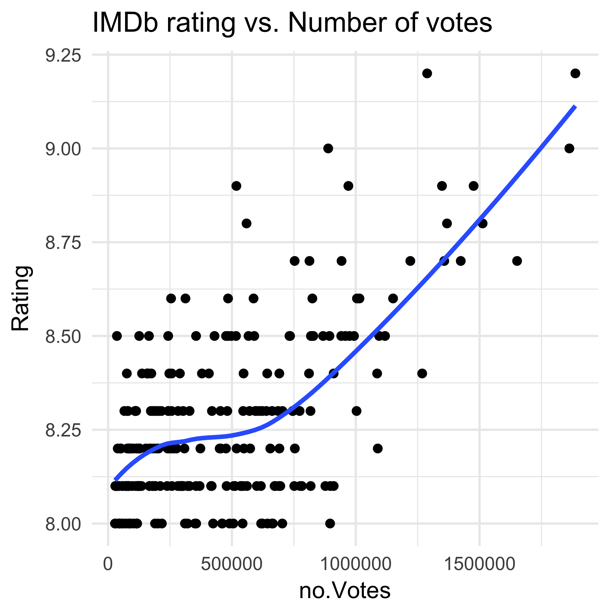

```{r setup, include=FALSE}
knitr::opts_chunk$set(echo = TRUE)
```


```{r}
## Load packages
suppressPackageStartupMessages(library(tidyverse)) 
suppressPackageStartupMessages(library(knitr))
suppressPackageStartupMessages(library(kableExtra))
suppressPackageStartupMessages(library(stringr))
suppressPackageStartupMessages(library(rvest))
```


### Get data from web
I wrote my code in an R script to make the markdown cleaner to view.
The rScript for the first part is found [here]()
```{r url}
suppressMessages(source('rScripts/01_scrapeData.r'))
```


### View data structure

##### View [html_structure](https://github.com/farihakhan/STAT547-hw-khan-fariha/blob/master/hw_10/html_structure.md)

```{r strucure}
imdb

imdb %>%
      html_nodes(".titleColumn") %>% 
      html_text() %>%
      head()
```


### Extract and structure data:

I stored each column variable into character lists. I changed some of the data types of the variables to allow analysis.

The extracted variables are:

 - Title
 
 - Year released
 
 - Rating 
 
 - Number of IMDb user votes
 
 - Brief cast info
 
 - Link associated with each movie
 
<style>
pre code, pre, code {
  white-space: pre !important;
  overflow-x: scroll !important;
  word-break: keep-all !important;
  word-wrap: initial !important;
}
</style>
```{r get movie info, eval=FALSE, include=TRUE}
Title <- imdb %>% 
      html_nodes(".titleColumn") %>% 
      html_nodes("a, #text") %>% 
      html_text()

yearRelease <- imdb %>% 
      html_nodes(".secondaryInfo") %>% 
      html_text() %>% 
      str_replace_all(c("[(|)]" = "")) %>% 
      as.numeric()

Rating <- imdb %>% 
      html_nodes(".ratingColumn.imdbRating") %>% 
      html_nodes("strong") %>% 
      html_text() %>% 
      as.numeric()

Votes <- imdb %>% 
      html_nodes(".ratingColumn.imdbRating") %>% 
      html_nodes("strong") %>% 
      html_attrs() %>% 
      map("title") %>% 
      unlist()

Cast <- imdb %>% 
      html_nodes(".titleColumn") %>% 
      html_nodes("a, #text") %>% 
      html_attrs() %>% 
      map("title") %>% 
      unlist()

Link <- imdb %>% 
      html_nodes(".titleColumn") %>% 
      html_nodes("a, #text") %>% 
      html_attrs() %>% 
      map("href") %>% 
      unlist()
```


### Create summary dataframe

```{r top dataset}

imdb_df <- extractFields(imdb)
imdb_df %>% glimpse()

```

### Clean dataset

Parse out names of the cast memebers for analysis
```{r}

imdb_kable1

## Save data
# write.table(imdb_df2, "./data/imdb_top250movies_summary.tsv",
#             quote = FALSE, sep = "\t", row.names = FALSE)

```

### Analyze datase

*Quick look at the correlation between release year and rating.*


<p>


</p>


### Get data from links
Creating dataframe 2 to look at:

 - Duration
 
 - Genre
 
 - Plot summary
 
 - Credit summary??

```{r}
suppressMessages(source('rScripts/02_scrapeData.r'))
```

